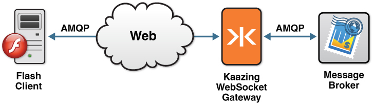

Build Flash AMQP Clients  
===========================================

This checklist provides the steps necessary to build Flash AMQP clients to communicate with KAAZING Gateway:

| \# | Step                                                                                                                                | Topic or Reference                                                                                                          |
|:---|:------------------------------------------------------------------------------------------------------------------------------------|:----------------------------------------------------------------------------------------------------------------------------|
| 1  | Learn about the KAAZING Gateway AMQP client.                                                                                        | [Overview of the KAAZING Gateway Flash AMQP Client Libraries](#overview-of-the-kaazing-gateway-flash-amqp-client-libraries) |
| 2  | Learn how to use the Gateway AMQP Client Library and the supported APIs.                                                            | [Use the KAAZING Gateway Flash AMQP Client Library](#use-the-kaazing-gateway-flash-amqp-client-library)                     |
| 3  | Learn how to authenticate your client by implementing a challenge handler to respond to authentication challenges from the Gateway. | [Secure Your Flash AMQP Client](#secure-your-flash-client)                                                                  |

Overview of AMQP 0-9-1
----------------------

Advanced Message Queuing Protocol (AMQP) is an open standard for messaging middleware that was originally designed by the financial services industry to provide an interoperable protocol for managing the flow of enterprise messages. To guarantee messaging interoperability, AMQP 0-9-1 defines both a wire-level protocol and a model—the AMQP Model—of messaging capabilities.

The AMQP Model defines three main components:

1.  *Exchange*: clients publish messages to an exchange
2.  *Queue*: clients read messages from a queue
3.  *Binding*: a mapping from an exchange to a queue

An AMQP client connects to an AMQP broker and opens a *channel*. Once the channel is established, the client can send messages to an exchange and receive messages from a queue. To learn more about AMQP functionality, take a look at the [Real-Time Interactive Guide to AMQP](../guide-amqp.md), an interactive guide that takes you step-by-step through the main features of AMQP version 0-9-1.

For more information about AMQP, visit [http://www.amqp.org](http://www.amqp.org).

Overview of Adobe Flex
----------------------

Adobe Flex SDK is a software development kit from Adobe Systems. You use Flex to create Web applications that use the Adobe Flash browser plugin. Flex applications can be created in Adobe Flex Builder or with Adobe's open source Flex SDK.

For more information about the Adobe open source Flex SDK, visit [http://opensource.adobe.com/wiki/display/flexsdk/Flex+SDK](http://opensource.adobe.com/wiki/display/flexsdk/Flex+SDK).

WebSocket and AMQP
------------------

WebSocket enables direct communication from the browser to an AMQP broker. KAAZING Gateway radically simplifies Web application design by providing the AMQP client libraries for the Java, JavaScript, Microsoft Silverlight, and Flex client technologies. Web developers can code directly against the back-end AMQP broker without the need for custom Servlets or server-side programming.

Using the AMQP client libraries, you can take advantage of the AMQP features, making the browser a first-class citizen in AMQP systems (similar to C, Java, Python, and other clients). This means that you can now run AMQP clients directly in a browser.

The AMQP libraries use KAAZING Gateway ByteSocket client library, because AMQP messages use a binary format. Since the implementation is layered on top of ByteSocket, which uses WebSocket--and thus the entire stack of Kaazing HTML5 Communications client libraries--applications developed using the AmqpClient libraries are provided with guaranteed persistence, reliability, and message-receipt acknowledgment all the way to the browser.

Overview of the KAAZING Gateway Flash AMQP Client Libraries
-----------------------------------------------------------

KAAZING Gateway - Community Edition includes AMQP client libraries, that allow clients to subscribe from and publish messages to a message broker using AMQP. With the AMQP client libraries, you can leverage WebSocket in your application by building a Flash client. This WebSocket client then enables communication between your application and the message broker, as shown in the following figure:



**Figure: KAAZING Gateway Flash AMQP Client Connection**

Starting an AMQP Broker
-----------------------

There are a wide variety of AMQP brokers available that implement different AMQP versions. For example, RabbitMQ, Apache Qpid, OpenAMQ, Red Hat Enterprise MRG, ØMQ, and Zyre. If you do not have an AMQP broker installed yet, you can use the Apache Qpid AMQP broker included in the Gateway download package, that supports AMQP version 0-9-1.

To set up and start the Apache Qpid broker on your system, perform the steps described in [Setting Up KAAZING Gateway](https://github.com/kaazing/gateway/blob/develop/doc/about/setup-guide.md).

**Note**: The AMQP client libraries are compatible with AMQP version 0-9-1. Refer your AMQP broker documentation for information about certified AMQP versions.

For information on integrating with RabbitMQ, see [Integrate RabbitMQ Messaging](../integration-amqp/p_amqp_integrate_rabbitmq.md).

Taking a Look at the AMQP Demo
------------------------------

Once the AMQP broker is running, take a look at a demonstration that was built with the Flex version of the AMQP client library. To see this demo in action, perform the following steps:

1.  Start the KAAZING Gateway as described in [Setting Up KAAZING Gateway](https://github.com/kaazing/gateway/blob/develop/doc/about/setup-guide.md).
2.  In a browser, navigate to [`http://localhost:8001/demo/amqp/flash/?d=amqp-flash`](http://localhost:8001/demo/amqp/flash/?d=amqp-flash).
     From this page, you can navigate to additional AMQP demos for different client technologies (JavaScript, Silverlight, .NET Framework, and Java).

Use the KAAZING Gateway Flash AMQP Client Library
=================================================

In this procedure, you will learn how to use the KAAZING Gateway Flash AMQP Client Library and the supported APIs.

Before You Begin
----------------

This procedure is part of [Build Flash AMQP Clients](o_dev_flash_amqp.md):

1.  [Overview of the KAAZING Gateway AMQP Client Library](o_dev_flash_amqp.md#overview-of-the-kaazing-gateway-flash-amqp-client-libraries)
2.  **Use the KAAZING Gateway Flash AMQP Client Library**
3.  [Secure Your Flash AMQP Client](p_dev_flash_secure.md)

To Use the KAAZING Gateway Flash AMQP Client Library
----------------------------------------------------

1.  Set up your Flex development environment.

   1.  To develop a Flex application, you must download the Adobe Flex 3 SDK. The Adobe Flex 3 SDK can be used to compile ActionScript source files into a SWF file, which is the target application. You can download the Adobe Flex 3 SDK from the Adobe download site and install it into your local drive.
   2.  To use the KAAZING Gateway AMQP client libraries for Flex, you must add a reference to the libraries located in the `com.kaazing.net.ws.amqp.client.swc` and `com.kaazing.gateway.client.swc` to your Flash application. The files are in the directory `GATEWAY_HOME/lib/client/flash`.
   3.  Configure KAAZING Gateway to connect to an AMQP broker.

       **Note:** If you have KAAZING Gateway running on `localhost` and if you have an AMQP broker running on `localhost` at the default AMQP port `5672`, you do not have to configure anything to see the AMQP demos and the interactive AMQP guide.

       The following is an example of the default configuration element for the AMQP service in the KAAZING Gateway bundle, as specified in the configuration file `GATEWAY_HOME/conf/gateway-config.xml`:

       ``` xml
         <service>
           <accept>ws://localhost:8001/amqp</accept>
           <accept>wss://localhost:9000/amqp</accept>
           <connect>tcp://localhost:5672</connect>
           <type>amqp.proxy</type>
           <cross-site-constraint>
             <allow-origin>http://localhost:8001</allow-origin>
           </cross-site-constraint>
           <cross-site-constraint>
             <allow-origin>https://localhost:9000</allow-origin>
           </cross-site-constraint>
       </service>
       ```

       In this case, the service is configured to accept WebSocket AMQP requests from the browser at `ws://localhost:8001/amqp` and securely at `wss://localhost:9000/amqp` and proxy those requests to a locally installed AMQP broker (`localhost`) at port `5672`.

       To configure the Gateway to accept WebSocket requests at another URL or to connect to a different AMQP broker, you can edit `GATEWAY_HOME/conf/gateway-config.xml`, update the values for the `accept` elements, change the `connect` property, and restart the Gateway. For example, the following configuration configures the Gateway to accept WebSocket AMQP requests at `ws://www.example.com:80/amqp` and proxy those requests to an AMQP broker (`amqp.example.com`) on port `5672`.

       ``` xml
       <service>
       <accept>ws://www.example.com:80/amqp</accept>
       <connect>tcp://amqp.example.com:5672</connect>

       <type>amqp.proxy</type>
       </service>
       ```

2.  Review the common Flash AMQP programming steps.

   Now that you have set up your environment to develop Flash applications using the Gateway's AMQP client library, you can start creating your application. You can either build a single application that both publishes and consumes messages, or create two different applications to handle each action. The demo located at <http://localhost:8001/demo/amqp/flash/?d=amqp-flash> shows a single application that handles both actions. You can view the source code for this demo in `GATEWAY_HOME/demo/flash/src/amqp/amqpbasic.mxml`. Refer to the [AMQP Client ActionScript API](http://developer.kaazing.com/documentation/5.0/apidoc/client/flash/amqp/index.html) documentation for the complete list of all the AMQP command and callback functions.

3.  Create the AmqpClient object.

     First, let's create an AmqpClient client object. Before you create the client object, add the following import statements in your application's `.MXML` file:

     ```
     import com.kaazing.gateway.client.Charset;
     import com.kaazing.gateway.client.ByteBuffer;
     import com.kaazing.gateway.amqp.client.flash.AmqpArguments;
     import com.kaazing.gateway.amqp.client.flash.AmqpEvent;
     import com.kaazing.gateway.amqp.client.flash.AmqpChannel;
     import com.kaazing.gateway.amqp.client.flash.AmqpClient;
     ```

     Next, declare a variable and create an instance of the `AmqpClient` object as shown in the following example.

     ```
     private var client:AmqpClient = new AmqpClient();
     ```

     Now that you have created an instance of the AmqpClient object, you can use the AMQP protocol commands. To handle open and close events, add two event handlers: one for the `OPEN` event and one for the `CLOSE` event, as shown in the following example.

     ```
     client.addEventListener(AmqpEvent.OPEN, openHandler);
     client.addEventListener(AmqpEvent.CLOSE, closeHandler);
     ```

     Refer to the [AMQP Client ActionScript API](http://developer.kaazing.com/documentation/5.0/apidoc/client/flash/amqp/index.html) documentation for the complete list of all the AMQP command and callback functions.

4.  Connect to an AMQP broker.

     Next, you must connect and log in to an AMQP broker. The client generally manages all of its communication on a single connection to an AMQP broker. You establish a connection to an AMQP broker by passing in the broker address, a user name and password, the AMQP version you want to use, and, optionally, a virtual host name (the name of a collection of exchanges and queues hosted on independent server domains). These parameters are passed in when you call the `connect` method as shown in the following example.

     ```
      client.connect(location, virtualHost, {username:user, password:pwd});
     ```

     **Note**: The Gateway supports AMQP version 0-9-1.

5.  Create Channels.

     Once a connection to an AMQP broker has been established, the client must create a channel to communicate to the broker. A channel is a bi-directional connection between an AMQP client and an AMQP broker. AMQP is multi-channeled, which means that channels are multiplexed over a single network socket connection. Channels are light-weight and consume little resources, and therefore used in AMQP's exception handling mechanism—channels are closed when an exception occurs.

     First, declare variables for two channels (one for publishing to an exchange and one for consuming from a queue) as shown in the following example.

     ```
     private var publishChannel:AmqpChannel;
     private var consumeChannel:AmqpChannel;
     ```

     Then, create the channels as shown in the following example.

     ```
     private function openHandler(e:AmqpEvent):void {
     publishChannel = client.openChannel();
     consumeChannel = client.openChannel();
     }
     ```

     Once you have created the channels, you can add event handlers for various channel events as shown in the following example.

     ```
     publishChannel.addEventListener(AmqpEvent.DECLAREEXCHANGE,
         function(e:AmqpEvent):void {log("Exchange declared ");});
     publishChannel.addEventListener(AmqpEvent.BINDQUEUE,
         function(e:AmqpEvent):void {log("Bound queue and exchange");});
     publishChannel.addEventListener(AmqpEvent.CLOSE, closePublishChannelHandler);


     consumeChannel.addEventListener(AmqpEvent.DECLAREQUEUE,
         function(e:AmqpEvent):void {log("Queue declared ");});
     consumeChannel.addEventListener(AmqpEvent.SUBSCRIBE,
         function(e:AmqpEvent):void {log("Subscribed to the queue ");});
     consumeChannel.addEventListener(AmqpEvent.CLOSE,
         function(e:AmqpEvent):void {log("Channel closed ");});
     consumeChannel.addEventListener(AmqpEvent.FLOW,
         function(e:AmqpEvent):void {log("Flow event");});
     consumeChannel.addEventListener(AmqpEvent.MESSAGE, messageHandler);
     ```

     In this example, each of the event handlers has an associated function (either anonymous or named) that processes the AMQP event. Refer to the [AmqpEvent ActionScript API documentation](http://developer.kaazing.com/documentation/5.0/apidoc/client/flash/amqp/index.html) for more information about channel events.

6.  Declare an Exchange

     AMQP messages are published to exchanges. Messages contain a *routing key* that contains the information about the message's destination. The exchange accepts messages and their routing keys and delivers them to a message queue. You can think of an exchange as an electronic mailman that delivers the messages to a mailbox (the queue) based on the address on the message's envelope (the routing key). Exchanges do not store messages.

     AMQP defines different exchange types. Some of these exchange types (Direct, Fanout, and Topic) must be supported by all AMQP brokers while others (Headers and System) are optional. AMQP brokers can also support custom exchange types. The following are the different types of exchanges:

     -   **Direct**: Messages are sent only to a queue that is bound with a binding key that matches the message's routing key.
     -   **Fanout**: Messages are sent to every queue that is bound to the exchange.
     -   **Topic**: Messages are sent to a queue based on categorical binding keys and wildcards.
     -   **Headers**: Messages are sent to a queue based on their header property values.
     -   **System**: Messages are sent to system services.

     Exchanges can be *durable*, meaning that the exchange survives broker shutdown and must be deleted manually or *non-durable* (temporary) meaning that the exchange lasts only until the broker is shut down. Finally, to check if an exchange exists on the AMQP broker (without actually creating it), you can create a *passive* exchange. The following example shows how you can create a direct exchange on the publish channel:

     ```
     publishChannel.declareExchange(exchangeName, "direct", passive, durable, noWait, null);
     ```

     **Note**: In this example, the arguments `passive`, `durable`, and `noWait` represent boolean values. Also note that no custom parameters are passed in.

     After the exchange is created successfully, a `declareexchange` event is raised, which calls the previously registered event handler.

7.  Declare a queue.

     AMQP messages are consumed from queues. You can think of a queue as a mailbox; messages addressed to a particular address (the routing key) are placed in the mailbox for the consumer to pick up. If multiple consumers are bound to a single queue, only one of the consumers receives the message (the one that picked up the mail).

     To check if a queue exists on the AMQP broker (without creating it), you can create a *passive* queue. Additionally, queues can be marked *exclusive*, meaning that they are tied to a specific connection. If a queue is marked exclusive, it is deleted when the connection on which it was created is closed.

     Queues can be *durable*, meaning that the queue survives broker shutdown and must be deleted manually or *non-durable* (temporary) meaning that the queue lasts only until the broker is shut down. Queues can also be marked *auto delete*, meaning that the queue is deleted automatically when it is no longer in use. The following example shows how you can create a queue on the consume channel:

     ```
     consumeChannel.declareQueue(queueName, passive, durable, exclusive, autoDelete, noWait, null);
     ```

     **Note**: In this example, the arguments `passive`, `durable`, `exclusive`, `autoDelete`, and `noWait` represent boolean values. Also note that no custom parameters are passed in.

     After the queue is created successfully, a `declarequeue` event is raised, which calls the event handler registered previously.

8.  Bind an exchange to a queue.

     Once you have created an exchange and a queue in AMQP, you must bind—or map—one to the other so that messages published to a specific exchange are delivered to a particular queue. You bind a queue to an exchange with a routing key as shown in the following example.

     ```
     publishChannel.bindQueue(queueName, exchangeName, routingKey, noWait, null);
     ```

     After the exchange is bound to the queue successfully, a `binddqueue` event is raised, which calls the event handler registered previously.

9.  Publish messages.

     Messages are published to exchanges. The established binding rules (routing keys) then determine to which queue a message is delivered. Messages have content that consists of two parts:

     1.  **Content Header**—A set of properties that describes the message
     2.  **Content Body**—A blob of binary data

     Additionally, messages can be marked *mandatory* to send a notification to the publisher in case a message cannot be delivered to a queue. You can also mark a message *immediate* so that it is returned to the sender if the message cannot be routed to a queue consumer immediately. The following example shows how the content body of a message is added to a buffer (AMQP uses a binary message format) and published to an exchange using the publish channel:

     ```
     public function publishSendHandler(e:Event):void {
       if (message.text == null || message.text.length == 0)
       {
           Alert.show("Enter valid text for a message", "AMQP message invalid", Alert.OK);
           return;
       }

       var body:ByteBuffer = new ByteBuffer();
       body.putString(message.text, Charset.UTF8);
       body.flip();

       var amqpProperties:AmqpProperties = new AmqpProperties();
       amqpProperties.contentType = AmqpProperties.TEXT_PLAIN;
       amqpProperties.priority = 6;
       amqpProperties.deliveryMode = 1;
       amqpProperties.timestamp = new Date();
       amqpProperties.contentEncoding = "utf-8";
       amqpProperties.messageId = "abcdxyz1234pqr";
       amqpProperties.correlationId = "23456";
       amqpProperties.userId = username.text;
       var customHeaders:AmqpArguments = new AmqpArguments();
       customHeaders.addInteger("KZNG_AMQP_KEY1", 100);
       customHeaders.addLongString("KZNG_AMQP_KEY2", "Custom Header Value");
       amqpProperties.headers = customHeaders;
       exchangeName = consumeExchange.text;
       publishChannel.publishBasic(body, amqpProperties, exchangeName, "broadcastkey", false, false);
       log(amqpProperties.toString());
       log("Published Message Properties:");
       log("MESSAGE PUBLISHED: " + message.text);
     }
     ```

     A custom parameter is passed in for the message. The message text entered by the user is stored in a variable and converted to binary (`body.putString(message.text, Charset.UTF8);`), and then sent to the exchange specified by the user (`exchangeName`). Also note that the last two arguments use boolean values for `mandatory` and `immediate`.

     The `AmqpProperties` class defines pre-defined properties as per AMQP 0-9-1 spec and provides type-safe getters and setters for those pre-defined properties. The value of AMQP 0-9-1's standard "headers" property is of type [AmqpArguments](http://developer.kaazing.com/documentation/5.0/apidoc/client/flash/amqp/index.html). The KAAZING Gateway AMQP implementation uses AmqpArguments to encode the table. Similarly, the KAAZING Gateway AMQP implementation decodes the table and constructs an instance of AmqpArguments.

     **Notes:**

     -   The arguments `mandatory` and `immediate` use boolean values. Also note that no custom parameters are passed in.
     -   The timestamp property (not shown in this example), will only handle 6-bytes (or 48-bit) timestamp values.
     -   The username set with the `userId` method must match the user that is currently authenticated with the AMQP broker. If they do not match you will see the following error:
         `PRECONDITION_FAILED - user_id property set to '<name>' but authenticated user was '<name>'`

10. Consume messages.

     Once messages are published, they can be consumed from a queue. A variety of options can be applied to messages in a queue. For example, publishers can choose to require acknowledgement (*ack*) of messages so that messages can be redelivered in the case of a delivery failure. If the queue is set to *exclusive*, it is scoped to just the current connection and deleted when the connection on which it was established is closed. Additionally, you can use the *no local* setting to notify the broker *not* to send messages to the connection on which the messages were published. The following example shows how you can consume messages from a queue on the consume channel:

     ```
     consumeChannel.declareQueue(queueName, false, false, false, false, false)
         .bindQueue(queueName, exchangeName, routingKey, false)
         .consumeBasic(queueName, myConsumerTag, false, false, false, false);
     ```

     **Note**: In this example, the arguments `noLocal`, `noAck`, `noWait`, and `exclusive` represent boolean values.

     After the `consumeBasic` method is successful, a `subscribe` event is raised, which calls the previously registered event handler. The AMQP broker can then start delivering messages to the client and these messages raise the `message` event, which calls the corresponding event handler. The following example shows how the `messageHandler` function retrieves information from the `AmqpEvent` object:

     ```
     private function messageHandler(e:AmqpEvent):void {
       var body:String = e.body.getString(Charset.UTF8);
       if (e.amqpProperties != null) {
               log("Consumed Message Properties:");
               log(e.amqpProperties.toString());
       }
       log("MESSAGE CONSUMED: " + body);

       // Acknowledge the message as we passed in a 'false' for
       // noAck in AmqpChannel.consumeBasic() call. If the
       // message is not acknowledged, the broker will keep
       // holding the message. And, as more and more messages
       // are held by the broker, it will eventually result in
       // an OutOfMemoryError.                
       var channel:AmqpChannel = e.target as AmqpChannel;
       var dt:Number = Number(e.args.deliveryTag);
       setTimeout(function():void {
               channel.ackBasic(dt, true);
       }, 0);
     }
     ```

     Here you can see how the properties are retrieved using AmqpProperties methods.

     ##### Message Acknowledgement

     The Boolean parameter `noAck` is optional with the default value of `true`. If `noAck` is `true`, the AMQP broker will not expect any acknowledgement from the client before discarding the message. If `noAck` is `false`, then the AMQP broker will expect an acknowledgement before discarding the message. If `noAck` is specified to be `false`, then you must explicitly acknowledge the received message using `AmqpChannel` `ackBasic()`.

     In the AMQP demo code in this procedure, message acknowledgement is being performed because `false` was passed in for `noAck` in `consumeBasic()`. If the client acknowledges a message **and** `noAck` is `true` (the default setting), then the AMQP message broker will close the channel.

11. Use transactions.

     AMQP supports transactional messaging, through *server local transactions*. In a transaction, the server only publishes a set of messages as one unit when the client commits the transaction. Transactions only apply to message publishing and not to the consumption of the messages.

     **Note**: Once you commit or roll back a transaction on a channel, a new transaction is started automatically. For this reason you must commit all future messages you want to publish on that channel or create a new, non-transactional channel to publish messages on.

     The following transaction-related methods can be used to work select (start), commit, and rollback a transaction:

     ```
     txnPublishChannel.selectTx();
     txnPublishChannel.commitTx();
     txnPublishChannel.rollbackTx();
     ```

     After the transaction is selected successfully, committed, or rolled back, the corresponding events (`selecttransaction`, `committransaction`, `rollbacktransaction`) are raised. These events call previously registered event handlers:

     ```
     private function txnPublishChannelOpenHandler(e:AmqpEvent):void {
       txnPublishChannel.declareExchange(txnExchangeName, "fanout", false, false, false);
       txnPublishChannel.addEventListener(AmqpEvent.SELECTTRANSACTION,
         function(e:AmqpEvent):void {
           log("TXN SELECTED/STARTED"); updateTransactionButtons(true, true);});
       txnPublishChannel.addEventListener(AmqpEvent.COMMITTRANSACTION,
         function(e:AmqpEvent):void {
           log("TXN COMMITTED"); updateTransactionButtons(false, true);});
       txnPublishChannel.addEventListener(AmqpEvent.ROLLBACKTRANSACTION,
           function(e:AmqpEvent):void {
           log("TXN ROLLEDBACK"); updateTransactionButtons(false, true);});
     }
     ```

     To see an example of transactions in an application, see the sample demo code in `GATEWAY_HOME/demo/flash/src/amqp/amqpbasic.mxml`.

12. Control message flow.

     You can use flow control in AMQP to temporarily—or permanently—halt the flow of messages on a channel from a queue to a consumer. If you turn the message flow off, no messages are sent to the consumer. The following example shows how you can turn the flow of messages on a channel off and back on:

     ```
     consumeChannel.flowChannel(false);
     consumeChannel.flowChannel(true);
     ```

     After the flow on a channel is halted or resumed successfully, a `flow` event is raised, which calls the event handler registered previously.

13. Handle exceptions.

     Channels do not consume large resources, and therefore used in AMQP's exception handling mechanism—channels are closed when an exception occurs. In this example, the previously registered event handler for the `CLOSE` event calls the `closePublishChannelHandler` function when the channel closes and the function receives an `AmqpEvent` object, which contains detailed information about the exception. The following shows an example of how this information can be used.

     ```
     private function closePublishChannelHandler(e:AmqpEvent):void {
         var body:String = e.frame.body.getString(Charset.UTF8);
         log("Channel Closed: " + body);
     }
     ```

14. Compile and run the Flex application.

     Once you are finished coding the client (typically, an `.MXML` file), you must use the Adobe Flex 3 SDK from Adobe to compile your Flex client. Ensure that your library path points to the KAAZING Gateway Flex library `.SWC` file `kaazing-websocket-gateway-client-release-version.swc`. This `.SWC` file can be found in the KAAZING Gateway bundle in the directory `GATEWAY_HOME/lib/client/flex`. Once you have compiled a SWF file, you can execute this SWF file from the flash player or use a Web page to invoke it. For example, you can host it in the web directory `GATEWAY_HOME/web`.

Other Coding Styles
-------------------

In this topic, you have used an *event* programming style. You can also use a *continuation-passing* programming style. The following example shows how you can declare an exchange using the continuation-passing programming style:

```
publishChannel.declareExchange(txtExchange, "direct", passive, durable,
   noWait, null, declareExchangeHandlerContinuation, errorHandlerContinuation);
```

You can also combine the two programming styles.


Secure Your Flash Client
========================

Before you add security to your clients, follow the steps in [Configure Authentication and Authorization](https://github.com/kaazing/gateway/blob/develop/doc/security/o_auth_configure.md) to set up security on KAAZING Gateway for your client. The authentication and authorization methods configured on the Gateway influence your client's security implementation. For information on secure network connections between clients and the Gateway, see [Secure Network Traffic with the Gateway](../security/o_tls.md).


To Secure Your Flash Client
---------------------------

This section contains the following topics:

-   [Creating a Basic Challenge Handler](#creating-a-basic-challenge-handler)
-   [Using Wildcards to Match Sub-domains and Paths](#using-wildcards-to-match-sub-domains-and-paths)
-   [Creating a Basic Login Handler](#creating-a-basic-login-handler)
-   [Creating a More Complex Login Handler](#creating-a-more-complex-login-handler)
-   [Managing Log In Attempts](#managing-log-in-attempts)
-   [Creating Kerberos Challenge Handlers](#creating-kerberos-challenge-handlers)
-   [Directly Establish a Global Kerberos Challenge Handler](#directly-establish-a-global-kerberos-challenge-handler)
-   [Directly Establish a Global Kerberos Challenge Handler for a Specific Location](#directly-establish-a-global-kerberos-challenge-handler-for-a-specific-location)
-   [Implementing a Global Negotiate HTTP Authentication Strategy](#creating-a-global-negotiate-http-authentication-strategy)
-   [Implementing a Negotiate HTTP Authentication Strategy for a Specific Location](#creating-a-negotiate-http-authentication-strategy-for-a-specific-location)

Authenticating your client involves implementing a challenge handler to respond to authentication challenges from the Gateway. If your challenge handler is responsible for obtaining user credentials, then you will also need to implement a login handler.

**Note**: To use the KAAZING Gateway Flash client security library, ensure you add the following argument to the Flash compiler:

`-include-libraries GATEWAY_HOME/lib/client/flash/com.kaazing.gateway.client.swc`

If you built your application using Flash Builder, you can do this by choosing **Project** \> **Properties**. In the dialog, choose **Flex Compiler**, then add the argument to the **Additional compiler arguments** text box. Otherwise, add the argument to the Flash compiler manually.</span>

### Creating a Basic Challenge Handler

A challenge handler is a constructor used in an application to respond to authentication challenges from the Gateway when the application attempts to access a protected resource. Each of the resources protected by the Gateway is configured with a different authentication scheme (for example, Basic, Application Basic, or Application Token), and your application requires a challenge handler for each of the schemes that it will encounter or a single challenge handler that will respond to all challenges. Also, you can add a dispatch challenge handler to route challenges to specific challenge handlers according to the URI of the requested resource.

For information about each authentication scheme type, see [Configure the HTTP Challenge Scheme](https://github.com/kaazing/gateway/blob/develop/doc/security/p_authentication_config_http_challenge_scheme.md).

Clients with a single challenge handling strategy for all 401 challenges can simply set a specific challenge handler as the default using `ChallengeHandlers.setDefault()`. The following is an example of how to implement the authentication challenge in your client taken from the out of the box Flash & Flex demo at `http://localhost:8001/demo/`:

```

 // Configure a Basic Challenge Handler
 var basicHandler:BasicChallengeHandler = new DefaultBasicChallengeHandler();
 basicHandler.setLoginHandler(new DemoLoginHandler(this));
 ChallengeHandlers.setDefault(basicHandler);
```

For a complete example of a Flash client using security, see the out of the box demos located in `GATEWAY_HOME/demo/flash`.

**Note:** When using a `BasicChallengeHandler`, you must load the `DefaultBasicChallengeHandler`. To do so, either explicitly set this in your code (as shown in the previous code example), or add the necessary compiler argument to Flash Builder by going to Project Properties \> Build path \> Flex compiler and typing following into the Additional Compiler Arguments text box:

 `-includes com.kaazing.gateway.client.security.impl.DefaultBasicChallengeHandler`

Here is an example of how to set a global challenge handler declaratively:

```
var loginHandler:LoginHandler = new SampleLoginHandler1();

ChallengeHandlers.setDefault(
 (ChallengeHandlers.load(BasicChallengeHandler) as BasicChallengeHandler)
 .setLoginHandler(loginHandler)
```

The following example demonstrates how to register a location-specific challenge handler:

```
var dispatchChallengeHandler:DispatchChallengeHandler =
 ChallengeHandlers.load(DispatchChallengeHandler);

var basicChallengeHandler:BasicChallengeHandler = ChallengeHandlers.load(BasicChallengeHandler);

basicChallengeHandler.loginHandler =  new SampleLoginHandler1();

dispatchChallengeHandler.register("ws://my.server.com", basicChallengeHandler);

ChallengeHandlers.setDefault(dispatchChallengeHandler);
```

Here is how to register a location-specific challenge handler declaratively:

```
ChallengeHandlers.setDefault(ChallengeHandlers.load(DispatchChallengeHandler)
 .register("ws://my.server.com",
  (ChallengeHandlers.load(BasicChallengeHandler) as BasicChallengeHandler)
  .setLoginHandler(new SampleLoginHandler1()))
 );
```

To following example demonstrates how to register multiple location-specific challenge handlers declaratively:

```
var myServerLoginHandler:LoginHandler = new SampleLoginHandler1();

var anotherServerLoginHandler:LoginHandler = new SampleLoginHandler2();

ChallengeHandlers.setDefaultImplementation(ChallengeHandler, SampleChallengeHandler);

ChallengeHandlers.setDefault(ChallengeHandlers.load(DispatchChallengeHandler)
    .register("ws://my.server.com",
        (ChallengeHandlers.load(BasicChallengeHandler) as BasicChallengeHandler)
            .setLoginHandler(myServerLoginHandler))
    .register("ws://another.server.com",
        (ChallengeHandlers.load(ChallengeHandler) as SampleChallengeHandler)
            .setLoginHandler(anotherServerLoginHandler))
);
```

### Using Wildcards to Match Sub-domains and Paths

You can use wildcards (“\*”) when registering locations using `DispatchChallengeHandler`. Some examples of `locationDescription` values with wildcards are:

-   `*/` matches all requests to any host on port 80 (default port), with no user information or path specified.
-   `*.hostname.com:8000` matches all requests to port 8000 on any sub-domain of hostname.com, but not hostname.com itself.
-   `server.hostname.com:*/*` matches all requests to a particular server on any port on any path but not the empty path.

### <a name="basicloginhandler"></a>Creating a Basic Login Handler

The following example demonstrates how to implement a login handler in your client:

```

// Implement a login handler class
public class SampleLoginHandler extends LoginHandler {
    public function SampleLoginHandler() {
        super(this);
    }
    override public function getCredentials(continuation:Function):void {
        continuation("joe", "welcome");
    }
}
```

### Creating a More Complex Login Handler

The following example implements a more complex login handler to restrict login attempts to 3:

```
package org.kaazing.gateway.client.security.demo {
    import org.kaazing.gateway.client.security.LoginHandler;
    import flash.display.DisplayObject;
    import flash.utils.ByteArray;
    import mx.managers.PopUpManager;

    public class LimitedRetriesDemoLoginHandler extends LoginHandler {
        private var displayObject: DisplayObject;
         private const LIMIT: int = 3;
         private var attempts: int = 0;
         public function LimitedRetriesDemoLoginHandler(displayObject: DisplayObject) {
             super(this);
             this.displayObject = displayObject;
         }

        override public function getCredentials(continuation:Function):void {
             attempts++;

             if ( attempts > LIMIT ) {
                 // send an event perhaps to notify the wider application of attempt violation
                 attempts = 0;
                 continuation(null, null);
             } else {
                 var loginWindow:LoginForm=LoginForm(PopUpManager.createPopUp(displayObject,
                        LoginForm, false));
                 PopUpManager.centerPopUp(loginWindow);
                 loginWindow.continuation = continuation;
             }
        }
    }
}
```

#### Managing Log In Attempts

As displayed above, when it is not possible for the KAAZING Gateway client to create a challenge response, the client must return `null` to the Gateway to stop the Gateway from continuing to issue authentication challenges.

The following sample taken from [Creating a More Complex Login Handler](#creating-a-more-complex-login-handler) demonstrates how to stop the Gateway from issuing further challenges.

```
if ( attempts > LIMIT ) {
    // send an event perhaps to notify the wider application of attempt violation
    attempts = 0;
    continuation(null, null);
} else {
    var loginWindow:LoginForm=LoginForm(PopUpManager.createPopUp(displayObject,
           LoginForm, false));
    PopUpManager.centerPopUp(loginWindow);
    loginWindow.continuation = continuation;
}
```

### Creating Kerberos Challenge Handlers

The following examples demonstrate different implementations of Kerberos challenge handlers. When registered with the `DispatchChallengeHandler`, a `KerberosChallengeHandler` directly responds to Negotiate challenges where Kerberos-generated authentication credentials are required. In addition, a `KerberosChallengeHandler` can be used indirectly in conjunction with a `NegotiateChallengeHandler` to assist in the construction of a challenge response using object identifiers. For more information, see the [*ActionScript Client API*](http://developer.kaazing.com/documentation/5.0/apidoc/client/flash/gateway/index.html).

### Directly Establish a Global Kerberos Challenge Handler

The following example uses `KerberosChallengeHandler` to create a global Kerberos challenge handler:

```
var loginHandler:LoginHandler = new SampleLoginHandler1();
ChallengeHandlers.setDefault(
    (ChallengeHandlers.load(KerberosChallengeHandler) as KerberosChallengeHandler)
        .setLoginHandler(loginHandler));
```

### Directly Establish a Global Kerberos Challenge Handler for a Specific Location

The following example uses the `register()` method to establish a challenge handler for a specific location:

```
var loginHandler:LoginHandler = new SampleLoginHandler1();

ChallengeHandlers.setDefault(
    (ChallengeHandlers.load(DispatchChallengeHandler) as DispatchChallengeHandler)
        .register("ws://some.server.com:8010/kerberos5",
            (ChallengeHandlers.load(KerberosChallengeHandler) as KerberosChallengeHandler)
                .setDefaultLocation("ws://kb.hostname.com/kerberos5")
                .setRealmLocation("ATHENA.MIT.EDU", "ws://athena.hostname.com/kerberos5")
                .setServiceName("HTTP/servergw.hostname.com")
                .setLoginHandler(loginHandler))
);
```

### Creating a Global Negotiate HTTP Authentication Strategy

The following example establishes a single HTTP authentication strategy for all challenges.

```
var loginHandler:LoginHandler = new SampleLoginHandler1();

ChallengeHandlers.setDefault(
    (ChallengeHandlers.load(NegotiateChallengeHandler) as NegotiateChallengeHandler)
        .register((ChallengeHandlers.load(KerberosChallengeHandler) as KerberosChallengeHandler)
            .setLoginHandler(loginHandler))
        // register additional alternatives to negotiate here.
);
```

### Creating a Negotiate HTTP Authentication Strategy for a Specific Location

The following example uses the `register()` method to establish a location-specific negotiate HTTP authentication strategy:

```
var loginHandler:LoginHandler = new SampleLoginHandler1();
ChallengeHandlers.setDefault(
    (ChallengeHandlers.load(DispatchChallengeHandler) as DispatchChallengeHandler)
        .register("ws://some.server.com",
            (ChallengeHandlers.load(NegotiateChallengeHandler) as NegotiateChallengeHandler)
                .register((ChallengeHandlers.load(KerberosChallengeHandler) as
                    KerberosChallengeHandler)
                        .setDefaultLocation("ws://kb.hostname.com/kerberos5")
                        .setRealmLocation("ATHENA.MIT.EDU", "ws://athena.hostname.com/kerberos5")
                        .setServiceName("HTTP/servergw.hostname.com")
                        .setLoginHandler(loginHandler))
        // register additional alternatives to negotiate here.
        )
);
```
