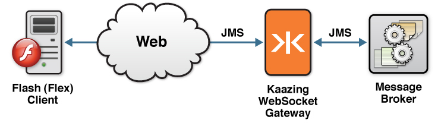

This checklist provides the steps necessary to use the Flash JMS client libraries available in KAAZING Gateway - Enterprise Edition to enable your Flash application to communicate with any JMS-compliant message broker, such as JMS-compliant message broker, directly from Flash. This checklist contains information for a Flash JMS developer who needs to integrate a JMS-compliant message broker with a Flash application.

| \# | Step                                                                                                                 | Topic or Reference                                                                                    |
|:---|:---------------------------------------------------------------------------------------------------------------------|:------------------------------------------------------------------------------------------------------|
| 1  | Learn about supported browsers, operating systems, and platform versions.                                            | [Release Notes](../release-notes.html)                                                                |
| 2  | Learn how to use the KAAZING Gateway Flash JMS client library and the supported methods to build a Flash JMS client. | [Use the KAAZING Gateway Flash JMS Client Library](#use-the-kaazing-gateway-flash-jms-client-library) |
| 3  | Learn how to program your client to respond to authentication challenges from the Gateway.                           | [Secure Your Flash Client](#secure-your-flash-client)                                                 |
| 4  | Troubleshoot the most common issues that occur when using Flash clients.                                             | [Troubleshoot Flash JMS Clients](#troubleshoot-flash-jms-clients)                                     |
| 5  | Learn how to gather data on KAAZING Gateway Flash JMS client.                                                        | [Display Logs for the Flash JMS Client](#display-logs-for-the-flash-jms-client)                       |

### Overview of the KAAZING Gateway JMS Client Libraries

The Gateway includes JMS client libraries, which allow clients to subscribe from and publish messages to a JMS-compliant message broker, such as TIBCO Enterprise Message Service (EMS), Informatica UM, Apache ActiveMQ, and JBoss. With the JMS client libraries, you can leverage WebSocket in your application by building a client. This WebSocket client then enables communication between your application and the JMS-compliant message broker, as shown in the following figure:



**Figure: Enable communication between your application and the JMS-compliant message broker**

Refer to [About KAAZING Gateway - Enterprise Edition](../about/about.md) for more information about KAAZING Gateway.

### About the KAAZING Gateway Flash JMS Client Library

The KAAZING Gateway JMS client libraries include a Flash JMS client library that enables you to use ActionScript to create JMS-based clients specifically for your Flash applications. As a Flash application developer, you can use this API to publish and subscribe to JMS-based messages between your application and your message broker.

The Flash JMS client library exposes capabilities similar to the Java Message Service (JMS) API in ActionScript, including the JMS concepts of connection, session, destination, message consumer, and message producer. This library is useful to developers familiar with Java JMS and want a similar programming experience in Flash. Refer to the [JMS API documentation](http://www.oracle.com/technetwork/java/docs-136352.html) for specific information about how to use each of the interfaces.

For a description of the methods currently supported by the KAAZING Gateway Flash JMS client library, see [KAAZING Gateway JMS Client Libraries: Supported APIs](../about/kaazing-jms-api.md).

### About Adobe Flash and Flex

Adobe Flex is an SDK that is used for the development and deployment of Flash applications (applications that rely on the Flash Player or Flash plugin for display in the browser). Typically, Flash applications are used to create rich presentation layers. The Adobe Flex SDK includes a set of user interface components that you can use to build a rich Internet application (RIA), such as buttons, data grids, text controls, and trees. The Adobe Flex platform consists of the following components:

-   The MXML declarative user interface language
-   The ActionScript scripting language
-   The Adobe Flex compiler
-   Runtime services

Flash is a compiled language. The Adobe Flex compiler is used to generate Shockwave Flash (SWF) files and Shockwave Component (SWC) files from source ActionScript and MXML files. In this how-to, you will create MXML and ActionScript files in Adobe Flash Builder.

### Overview of Apache ActiveMQ

Apache ActiveMQ is an open source message broker and JMS provider developed, distributed, and licensed by the Apache Foundation. Apache ActiveMQ provides a publish-subscribe model based on the Java Message Service (JMS) specification. It is a highly viable, light-weight solution for both queue-based peer-to-peer messaging and topic-based publish-subscribe communication. Refer to [http://activemq.apache.org/](http://activemq.apache.org/) for more information about Apache ActiveMQ.

**Note**: For this procedure, you can use any JMS-compliant message broker. By default, the Gateway is configured to connect to the server on port 61616. You can configure the connect URL in the file `GATEWAY_HOME/conf/gateway-config.xml`.  Refer to [About Integrating Kaazing WebSocket Gateway and JMS-Compliant Message Brokers](https://github.com/kaazing/enterprise.gateway/blob/develop/doc/integration-jms/o_jms_integrate.md) for more information about configuring JMS brokers with the Gateway.


Use the Flash WebSocket API
===========================

This procedure describes how you can use the `WebSocket` API, provided by the Kaazing Flash client library, in ActionScript. This API allows you to take advantage of the WebSocket standard as described in the [HTML5 specification](http://dev.w3.org/html5/spec/Overview.html#network). You can create a Flash application that uses the Kaazing Flash client library to interact directly with a back-end server. The support for WebSocket is provided by the `WebSocket` class and its supporting classes.

The following steps show you how to use the `WebSocket` API in an existing Flash application. This example highlights some of the most commonly used `WebSocket` methods and is not meant to be an end-to-end tutorial. Refer to the [ActionScript WebSocket API](http://developer.kaazing.com/documentation/5.0/apidoc/client/flash/gateway/com/kaazing/gateway/client/html5/WebSocket.html) documentation for a complete description of all the available methods.

To Use the WebSocket API
------------------------

1.  Add the necessary import statements:

    ``` as
    import org.kaazing.gateway.client.md5.MessageEvent
    import org.kaazing.gateway.client.md5.WebSocket
    ```

2.  Create a new WebSocket object:

    ``` as
    var webSocket:WebSocket = new WebSocket(url)
    ```

3.  Add event-handlers to the `WebSocket` object to listen for `WebSocket` events, as shown in the following example. The `WebSocket` object has three methods: the `onopen` method is called when a WebSocket connection is established, the `onmessage` method is called when messages are received, and the `onclose` method is called when the WebSocket connection is closed.

    ``` as
    webSocket.onopen = openHandler
    webSocket.onmessage = readHandler
    webSocket.onclose = closeHandler   
    ```

4.  Define the three functions on the WebSocket object:

    ``` as
    private function openHandler(ev:Event):void {    
        trace("CONNECTED\n");
    }

    private function readHandler(ev:Event):void {
        var msg:String = ev.data
        trace("MESSAGE: "+msg+"\n");
    }

    private function closeHandler(ev:Event):void {
        trace("CLOSED\n");
    }

    ```

    After the eventHandlers are set, the WebSocket constructor causes the WebSocket to connect to the back-end server.

5.  While the WebSocket connection is open (that is, *after* the `onopen` event-handler is called and *before* the `onclose` event-handler is called), you can use the `send` method to send text-only messages, as shown in the following example.

    `webSocket.send("Hello World!")`

Notes
-----

-   To view sample source code using the WebSocket API, see the `ws.mxml` file located in `GATEWAY_HOME/demo/flash/src/gateway`.

Secure Your Flash Client
========================

Before you add security to your clients, follow the steps in [Configure Authentication and Authorization](https://github.com/kaazing/gateway/blob/develop/doc/security/o_auth_configure.md) to set up security on KAAZING Gateway for your client. The authentication and authorization methods configured on the Gateway influence your client's security implementation. For information on secure network connections between clients and the Gateway, see [Secure Network Traffic with the Gateway](../security/o_tls.md).


To Secure Your Flash Client
---------------------------

This section contains the following topics:

-   [Creating a Basic Challenge Handler](#creating-a-basic-challenge-handler)
-   [Using Wildcards to Match Sub-domains and Paths](#using-wildcards-to-match-sub-domains-and-paths)
-   [Creating a Basic Login Handler](#creating-a-basic-login-handler)
-   [Creating a More Complex Login Handler](#creating-a-more-complex-login-handler)
-   [Managing Log In Attempts](#managing-log-in-attempts)
-   [Creating Kerberos Challenge Handlers](#creating-kerberos-challenge-handlers)
-   [Directly Establish a Global Kerberos Challenge Handler](#directly-establish-a-global-kerberos-challenge-handler)
-   [Directly Establish a Global Kerberos Challenge Handler for a Specific Location](#directly-establish-a-global-kerberos-challenge-handler-for-a-specific-location)
-   [Implementing a Global Negotiate HTTP Authentication Strategy](#creating-a-global-negotiate-http-authentication-strategy)
-   [Implementing a Negotiate HTTP Authentication Strategy for a Specific Location](#creating-a-negotiate-http-authentication-strategy-for-a-specific-location)

Authenticating your client involves implementing a challenge handler to respond to authentication challenges from the Gateway. If your challenge handler is responsible for obtaining user credentials, then you will also need to implement a login handler.

**Note**: To use the KAAZING Gateway Flash client security library, ensure you add the following argument to the Flash compiler:

`-include-libraries GATEWAY_HOME/lib/client/flash/com.kaazing.gateway.client.swc`

If you built your application using Flash Builder, you can do this by choosing **Project** \> **Properties**. In the dialog, choose **Flex Compiler**, then add the argument to the **Additional compiler arguments** text box. Otherwise, add the argument to the Flash compiler manually.</span>

### Creating a Basic Challenge Handler

A challenge handler is a constructor used in an application to respond to authentication challenges from the Gateway when the application attempts to access a protected resource. Each of the resources protected by the Gateway is configured with a different authentication scheme (for example, Basic, Application Basic, or Application Token), and your application requires a challenge handler for each of the schemes that it will encounter or a single challenge handler that will respond to all challenges. Also, you can add a dispatch challenge handler to route challenges to specific challenge handlers according to the URI of the requested resource.

For information about each authentication scheme type, see [Configure the HTTP Challenge Scheme](https://github.com/kaazing/gateway/blob/develop/doc/security/p_authentication_config_http_challenge_scheme.md).

Clients with a single challenge handling strategy for all 401 challenges can simply set a specific challenge handler as the default using `ChallengeHandlers.setDefault()`. The following is an example of how to implement the authentication challenge in your client taken from the out of the box Flash & Flex demo at `http://localhost:8001/demo/`:

```

 // Configure a Basic Challenge Handler
 var basicHandler:BasicChallengeHandler = new DefaultBasicChallengeHandler();
 basicHandler.setLoginHandler(new DemoLoginHandler(this));
 ChallengeHandlers.setDefault(basicHandler);
```

For a complete example of a Flash client using security, see the out of the box demos located in `GATEWAY_HOME/demo/flash`.

**Note:** When using a `BasicChallengeHandler`, you must load the `DefaultBasicChallengeHandler`. To do so, either explicitly set this in your code (as shown in the previous code example), or add the necessary compiler argument to Flash Builder by going to Project Properties \> Build path \> Flex compiler and typing following into the Additional Compiler Arguments text box:

 `-includes com.kaazing.gateway.client.security.impl.DefaultBasicChallengeHandler`

Here is an example of how to set a global challenge handler declaratively:

```
var loginHandler:LoginHandler = new SampleLoginHandler1();

ChallengeHandlers.setDefault(
 (ChallengeHandlers.load(BasicChallengeHandler) as BasicChallengeHandler)
 .setLoginHandler(loginHandler)
```

The following example demonstrates how to register a location-specific challenge handler:

```
var dispatchChallengeHandler:DispatchChallengeHandler =
 ChallengeHandlers.load(DispatchChallengeHandler);

var basicChallengeHandler:BasicChallengeHandler = ChallengeHandlers.load(BasicChallengeHandler);

basicChallengeHandler.loginHandler =  new SampleLoginHandler1();

dispatchChallengeHandler.register("ws://my.server.com", basicChallengeHandler);

ChallengeHandlers.setDefault(dispatchChallengeHandler);
```

Here is how to register a location-specific challenge handler declaratively:

```
ChallengeHandlers.setDefault(ChallengeHandlers.load(DispatchChallengeHandler)
 .register("ws://my.server.com",
  (ChallengeHandlers.load(BasicChallengeHandler) as BasicChallengeHandler)
  .setLoginHandler(new SampleLoginHandler1()))
 );
```

To following example demonstrates how to register multiple location-specific challenge handlers declaratively:

```
var myServerLoginHandler:LoginHandler = new SampleLoginHandler1();

var anotherServerLoginHandler:LoginHandler = new SampleLoginHandler2();

ChallengeHandlers.setDefaultImplementation(ChallengeHandler, SampleChallengeHandler);

ChallengeHandlers.setDefault(ChallengeHandlers.load(DispatchChallengeHandler)
    .register("ws://my.server.com",
        (ChallengeHandlers.load(BasicChallengeHandler) as BasicChallengeHandler)
            .setLoginHandler(myServerLoginHandler))
    .register("ws://another.server.com",
        (ChallengeHandlers.load(ChallengeHandler) as SampleChallengeHandler)
            .setLoginHandler(anotherServerLoginHandler))
);
```

### Using Wildcards to Match Sub-domains and Paths

You can use wildcards (“\*”) when registering locations using `DispatchChallengeHandler`. Some examples of `locationDescription` values with wildcards are:

-   `*/` matches all requests to any host on port 80 (default port), with no user information or path specified.
-   `*.hostname.com:8000` matches all requests to port 8000 on any sub-domain of hostname.com, but not hostname.com itself.
-   `server.hostname.com:*/*` matches all requests to a particular server on any port on any path but not the empty path.

### <a name="basicloginhandler"></a>Creating a Basic Login Handler

The following example demonstrates how to implement a login handler in your client:

```

// Implement a login handler class
public class SampleLoginHandler extends LoginHandler {
    public function SampleLoginHandler() {
        super(this);
    }
    override public function getCredentials(continuation:Function):void {
        continuation("joe", "welcome");
    }
}
```

### Creating a More Complex Login Handler

The following example implements a more complex login handler to restrict login attempts to 3:

```
package org.kaazing.gateway.client.security.demo {
    import org.kaazing.gateway.client.security.LoginHandler;
    import flash.display.DisplayObject;
    import flash.utils.ByteArray;
    import mx.managers.PopUpManager;

    public class LimitedRetriesDemoLoginHandler extends LoginHandler {
        private var displayObject: DisplayObject;
         private const LIMIT: int = 3;
         private var attempts: int = 0;
         public function LimitedRetriesDemoLoginHandler(displayObject: DisplayObject) {
             super(this);
             this.displayObject = displayObject;
         }

        override public function getCredentials(continuation:Function):void {
             attempts++;

             if ( attempts > LIMIT ) {
                 // send an event perhaps to notify the wider application of attempt violation
                 attempts = 0;
                 continuation(null, null);
             } else {
                 var loginWindow:LoginForm=LoginForm(PopUpManager.createPopUp(displayObject,
                        LoginForm, false));
                 PopUpManager.centerPopUp(loginWindow);
                 loginWindow.continuation = continuation;
             }
        }
    }
}
```

#### Managing Log In Attempts

As displayed above, when it is not possible for the KAAZING Gateway client to create a challenge response, the client must return `null` to the Gateway to stop the Gateway from continuing to issue authentication challenges.

The following sample taken from [Creating a More Complex Login Handler](#creating-a-more-complex-login-handler) demonstrates how to stop the Gateway from issuing further challenges.

```
if ( attempts > LIMIT ) {
    // send an event perhaps to notify the wider application of attempt violation
    attempts = 0;
    continuation(null, null);
} else {
    var loginWindow:LoginForm=LoginForm(PopUpManager.createPopUp(displayObject,
           LoginForm, false));
    PopUpManager.centerPopUp(loginWindow);
    loginWindow.continuation = continuation;
}
```

### Creating Kerberos Challenge Handlers

The following examples demonstrate different implementations of Kerberos challenge handlers. When registered with the `DispatchChallengeHandler`, a `KerberosChallengeHandler` directly responds to Negotiate challenges where Kerberos-generated authentication credentials are required. In addition, a `KerberosChallengeHandler` can be used indirectly in conjunction with a `NegotiateChallengeHandler` to assist in the construction of a challenge response using object identifiers. For more information, see the [*ActionScript Client API*](http://developer.kaazing.com/documentation/5.0/apidoc/client/flash/gateway/index.html).

### Directly Establish a Global Kerberos Challenge Handler

The following example uses `KerberosChallengeHandler` to create a global Kerberos challenge handler:

```
var loginHandler:LoginHandler = new SampleLoginHandler1();
ChallengeHandlers.setDefault(
    (ChallengeHandlers.load(KerberosChallengeHandler) as KerberosChallengeHandler)
        .setLoginHandler(loginHandler));
```

### Directly Establish a Global Kerberos Challenge Handler for a Specific Location

The following example uses the `register()` method to establish a challenge handler for a specific location:

```
var loginHandler:LoginHandler = new SampleLoginHandler1();

ChallengeHandlers.setDefault(
    (ChallengeHandlers.load(DispatchChallengeHandler) as DispatchChallengeHandler)
        .register("ws://some.server.com:8010/kerberos5",
            (ChallengeHandlers.load(KerberosChallengeHandler) as KerberosChallengeHandler)
                .setDefaultLocation("ws://kb.hostname.com/kerberos5")
                .setRealmLocation("ATHENA.MIT.EDU", "ws://athena.hostname.com/kerberos5")
                .setServiceName("HTTP/servergw.hostname.com")
                .setLoginHandler(loginHandler))
);
```

### Creating a Global Negotiate HTTP Authentication Strategy

The following example establishes a single HTTP authentication strategy for all challenges.

```
var loginHandler:LoginHandler = new SampleLoginHandler1();

ChallengeHandlers.setDefault(
    (ChallengeHandlers.load(NegotiateChallengeHandler) as NegotiateChallengeHandler)
        .register((ChallengeHandlers.load(KerberosChallengeHandler) as KerberosChallengeHandler)
            .setLoginHandler(loginHandler))
        // register additional alternatives to negotiate here.
);
```

### Creating a Negotiate HTTP Authentication Strategy for a Specific Location

The following example uses the `register()` method to establish a location-specific negotiate HTTP authentication strategy:

```
var loginHandler:LoginHandler = new SampleLoginHandler1();
ChallengeHandlers.setDefault(
    (ChallengeHandlers.load(DispatchChallengeHandler) as DispatchChallengeHandler)
        .register("ws://some.server.com",
            (ChallengeHandlers.load(NegotiateChallengeHandler) as NegotiateChallengeHandler)
                .register((ChallengeHandlers.load(KerberosChallengeHandler) as
                    KerberosChallengeHandler)
                        .setDefaultLocation("ws://kb.hostname.com/kerberos5")
                        .setRealmLocation("ATHENA.MIT.EDU", "ws://athena.hostname.com/kerberos5")
                        .setServiceName("HTTP/servergw.hostname.com")
                        .setLoginHandler(loginHandler))
        // register additional alternatives to negotiate here.
        )
);
```

Troubleshoot Flash JMS Clients
==============================

This topic contains descriptions of common errors that can occur when using the Flash client and provides steps on how to prevent these errors.

**Note:** Learn about supported browsers, operating systems, and platform versions in the [Release Notes](../release-notes.html).

What Problem Are You Having?
----------------------------

-   [Error: com.kaazing.gateway.client.security.impl.*class\_name* cannot be found](#error-comkaazinggatewayclientsecurityimplclass_name-cannot-be-found)
-   [Kerberos challenge handler not working](#kerberos-challenge-handler-not-working)
-   [Expected messages are not being received for a queue or durable subscriber](#expected-messages-are-not-being-received-for-a-queue-or-durable-subscriber)

Error: com.kaazing.gateway.client.security.impl.*class\_name* cannot be found
-----------------------------------------------------------------------------

**Cause:** When compiling your Flash client code, you see something similar to the following, where *class\_name* is something like `DefaultBasicChallengeHandler`:

`"ERROR: A class with the name 'com.kaazing.gateway.client.security.impl.*class\_name* could not be found..."`

This warning occurs when you have not included the KAAZING Gateway Flash client security library in your Flash compiler.

**Solution:** To prevent this error, add the following argument to the Flash compiler: <span class="code_inline" style="white-space:nowrap;">-library-path+=*GATEWAY\_HOME*/lib/client/flash</span>. If you built your application using Flash Builder, you can do this by choosing **Project \> Properties**. In the dialog, choose **Flex Compiler**, then add the argument to the **Additional compiler arguments** text box. Otherwise, add the argument to the Flash compiler manually.

Kerberos challenge handler not working
--------------------------------------

**Cause:** [Kerberos challenge handlers](https://github.com/kaazing/enterprise.flash.client/blob/develop/migrated/gateway.client.flash/doc/p_dev_flash_secure.md#creating-kerberos-challenge-handlers) might not work for one or more of the following reasons:

-   The client cannot connect to the Kerberos Domain Controller (KDC).

    **Solution:** Ping the KDC from the computer running the client and the server hosting the Gateway. Also, ensure that you can Telnet to Kerberos port number 88 from both computers (`telnet> open KDC-server-name 88`).

-   The client cannot obtain a Kerberos ticket.

    **Solution:** Test ticket acquisition by executing the following commands to ensure that the KDC is accessible and able to issue service tickets:

    **For Linux:**

    `$ kinit -t /etc/keytab-name.keytab -S service-instance-name username@KDC-server-name`

    **For Windows:**

    `$ kinit username@KDC-server-name`

    The output will be:

    `Please enter the password for username@KDC-server-name:`

    Enter the password, and then enter:

    `$ klist`

    The ticket cache is displayed along with each ticket's expiration date.

-   Service name is in the incorrect format in the Kerberos challenge handler code.

    **Solution:** The service name should be in the format: `HTTP/servergw.hostname.com`. See [Creating Kerberos Challenge Handlers](https://github.com/kaazing/enterprise.flash.client/blob/develop/migrated/gateway.client.flash/doc/p_dev_flash_secure.md#creating-kerberos-challenge-handlers) for examples.

-   The pop-up dialog in the client used to obtain user credentials does not ensure that the username format is correct.

    **Solution:** Ensure that the result of the pop-up dialog used to obtain user credentials is formatted as
    `username@KDC-server-name`.

Expected messages are not being received for a queue or durable subscriber
--------------------------------------------------------------------------

**Cause:** If expected messages are not being received for a queue or durable subscriber, then it could be because the application has received messages without acknowledging them. The Gateway will send a maximum of [maximum.pending.acknowledgments](../admin-reference/r_conf_jms.md) messages until the client acknowledges. The [maximum.pending.acknowledgments](../admin-reference/r_conf_jms.md) property is set to 1 for JMS providers that do not support individual message acknowledgement.

**Solution:** If you are using a JMS provider other than Apache ActiveMQ or TIBCO Enterprise Message Service (TIBCO EMS), you must ensure your client applications acknowledge each message received from a queue or durable subscriber.

Display Logs for the Flash JMS Client
=====================================

In this procedure, you will learn how to gather data on KAAZING Gateway Flash JMS client.

**Note:** Learn about supported browsers, operating systems, and platform versions in the [Release Notes](../release-notes.html).

To Display Logs for the Flash JMS Client
----------------------------------------

The KAAZING Gateway ActionScript and Flash/Flex code uses [Flex Logging](http://livedocs.adobe.com/flex/3/html/help.md?content=logging_09.html#178687) to log messages.

1.  Build your Flash JMS client, as described in [Use the KAAZING Gateway Flash JMS Client Library](p_dev_flash_client_jms.md).
2.  Download and install the [debug version of the Flash Player plug-in](http://www.adobe.com/support/flashplayer/downloads.html).

    For more information on using this, see Adobe's [online help](http://livedocs.adobe.com/flex/3/html/logging_03.md#178599http://livedocs.adobe.com/flex/3/html/logging_03.html#178599) on using the debugger version of Flash Player.

3.  Locate or create the `mm.cfg` file for the Flash Player. For information on doing this, see Adobe's [online help](http://livedocs.adobe.com/flex/3/html/help.md?content=logging_04.html#179436) on creating the `mm.cfg` file.
4.  In the `mm.cfg` file, add the following lines to enable tracing:

    ``` as
     ErrorReportingEnable=1
     MaxWarnings=0
     TraceOutputFileEnable=1
    ```

5.  Configure the log level for the various KAAZING Gateway classes in the client code. For example, the out of the box Flash & Flex JMS demo, (which you can view by following the steps in [Setting Up KAAZING Gateway](https://github.com/kaazing/gateway/blob/develop/doc/about/setup-guide.md)) includes an example of this configuration, as shown here:

    ``` as
    private function initLogging():void {
      // Create a target.
      var logTarget:TraceTarget = new TraceTarget();
      // Log only messages for the classes in KAAZING Gateway packages
      logTarget.filters=["com.kaazing.gateway.client.*"];
      // Log all log levels.
      logTarget.level = LogEventLevel.ALL;
      // Add date, time, category, and log level to the output.
      logTarget.includeDate = true;
      logTarget.includeTime = true;
      logTarget.includeCategory = true;
      logTarget.includeLevel = true;
      // Begin logging.
      Log.addTarget(logTarget);
    }
    ```

6.  Save your changes then start (or restart) your browser.
7.  Visit the page containing the Flash applet. Log messages should display in the log file. For information on locating your local log file, visit Adobe's [online help](http://livedocs.adobe.com/flex/3/html/help.md?content=logging_04.html#179436) on the log file location.

Notes
-----

If you run the Flash client in Google Chrome using its integrated Flash plugin, no logging will occur, even if you have installed the debug version of the Adobe Flash player. To fix this configuration in Chrome, open the Chrome plugin settings (chrome://plugins/), disable the Chrome Flash Player, and then enable the Adobe Flash Player.

See Also
--------

To learn how to build clients using the other client libraries, see the client developer documentation in the [For Developers](https://github.com/kaazing/gateway/blob/develop/doc/index.md#for-developers) section of the [documentation](https://github.com/kaazing/gateway/blob/develop/doc/index.md) page.
