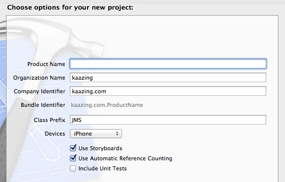
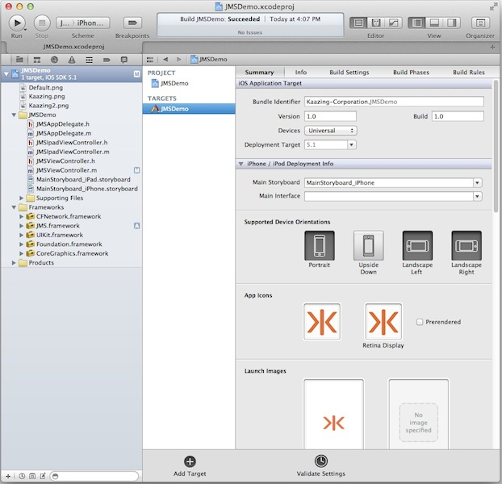
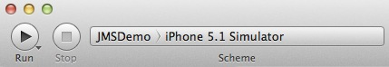
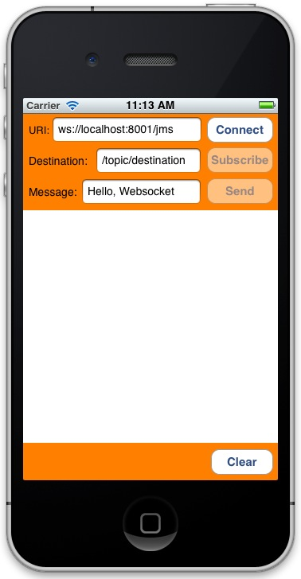

Checklist: Build Objective-C (iOS) JMS Clients Using KAAZING Gateway  
===========================================================================================

This checklist provides the steps necessary to create an iOS JMS client using the KAAZING Gateway Objective-C JMS client library:

| \# | Step                                                                                                                                | Topic or Reference                                                                                        |
|:---|:------------------------------------------------------------------------------------------------------------------------------------|:----------------------------------------------------------------------------------------------------------|
| 1  | Learn how to use the Objective-C JMS Client API and the supported APIs.                                                             | [Use the KAAZING Gateway Objective-C JMS Client API](#use-the-kaazing-gateway-objective-c-jms-client-api) |
| 2  | Learn how to authenticate your client by implementing a challenge handler to respond to authentication challenges from the Gateway. | [Secure Your Objective-C Client](#secure-your-objective-c-client)                                         |
| 3  | Troubleshoot the most common issues that occur when using Objective-C clients.                                                      | [Troubleshoot Your Objective-C JMS Client](#troubleshoot-your-objective-c-jms-client)                     |
| 4  | Learn how to gather data on KAAZING Gateway Objective-C client.                                                                     | [Display Logs for the Objective-C JMS Client](#display-logs-for-the-objective-c-jms-client)               |
| 5  | Migrate your Kaazing Gateway 3.3-3.5 iOS clients to Gateway 5.x and use its new library.                                            | [Migrate iOS Applications to KAAZING Gateway 5.x](#migrate-ios-applications-to-kaazing-gateway-5x)        |


Introduction
------------

In this how-to, you will learn how to use the KAAZING Gateway Objective-C client libraries available in KAAZING Gateway - Enterprise Edition to enable your iOS client to communicate with Apache ActiveMQ (or any JMS-compliant message broker) using Objective-C.

This document contains information for an Objective-C developer who wants to add Objective-C to an iOS client to enable communication with Apache ActiveMQ (or any JMS-compliant message broker) through the Gateway.

For more information, see [Objective-C JMS Client API](http://developer.kaazing.com/documentation/jms/4.0/apidoc/client/ios/jms/KMStompJMS/index.html).

Overview of the KAAZING Gateway JMS Client Libraries
----------------------------------------------------

KAAZING Gateway includes JMS client libraries, which allow clients to subscribe from and publish messages to Apache ActiveMQ (or any JMS-compliant message broker). With the KAAZING Gateway JMS client libraries, you can leverage WebSocket in your client by building a client. This WebSocket client then enables communication between your client and the Apache ActiveMQ, as shown in the following figure:


**Figure: Enable Communication Between Your Client and Apache ActiveMQ**

About the KAAZING Gateway Objective-C JMS Client API
---------------------------------------------------------

KAAZING Gateway includes an Objective-C JMS Client API that enables you to use Objective-C to create JMS-based clients specifically for your iOS clients. As an Objective-C developer, you can use this API to publish and subscribe to JMS-based messages between your client and Apache ActiveMQ.

The Objective-C JMS Client API exposes capabilities similar to the Java Message Service (JMS) API in Java, including the JMS concepts of connection, session, destination, message consumer, and message producer. Refer to the JMS API documentation, located at <http://www.oracle.com/technetwork/java/docs-136352.html>, for specific information about how to use each of the interfaces.


Use the KAAZING Gateway Objective-C JMS Client API
=======================================================

In this procedure, you will learn how to create an iOS JMS client using the KAAZING Gateway Objective-C JMS client library. You will learn how to create an Xcode project and add the necessary frameworks in order to use the Objective-C JMS client library. You will learn how to implement the Objective-C JMS client library methods to enable your client to send and receive messages to your Apache ActiveMQ through the Gateway.

For information about deploying your Objective-C (iOS) client on devices with the arm64 architecture, see [Convert Your Objective-C (iOS) Client to a 64-Bit Runtime Environment](#convert-your-objective-c-ios-client-to-a-64-bit-runtime-environment).

**Note**: For this how-to, you can use any JMS-compliant message broker. By default, the Gateway is configured to connect to the server on tcp://localhost:61613. You can configure the connect URL in the file `GATEWAY_HOME/conf/gateway-config.xml`. See [About Integrating KAAZING Gateway and JMS-Compliant Message Brokers](https://github.com/kaazing/enterprise.gateway/blob/develop/doc/integration-jms/o_jms_integrate.md) for more information.

In this procedure you will do the following:

1.  Set up your development environment using the Gateway and Xcode 4.4 or later.
2.  Review the components that will be used to create the Objective-C client.
3.  Create a new Xcode project.
4.  Add the **KAAZING Gateway Objective-C framework**.
5.  Add **CFNetwork.framework** to the project.
6.  Add the `-ObjC` value to the **Other Linker Flags** build setting.
7.  Build the interface for the client using **MainStoryboard.storyboard**.
8.  Add the actions for the buttons to the view controller header file.
9.  Add the **StompConnectionListener** to the **JMSViewController.m** implementation file.
10. Add the **MessageListener** to the **JMSViewController.m** implementation file.
11. Add the **ExceptionListener** to the **JMSViewController.m** implementation file.
12. Update the **JMSViewController** class in **JMSViewController.m** to use the **StompConnectionListener**, **MessageListener**, and **ExceptionListener** code.
13. Start Apache ActiveMQ and KAAZING Gateway.
14. Build and run the client in the iPhone Simulator.

For information about the KAAZING Gateway Objective-C JMS client library, see [Objective-C JMS Client API](http://developer.kaazing.com/documentation/jms/4.0/apidoc/client/ios/jms/KMStompJMS/index.html).

**Notes:**
-   For information about durable subscribers, see [Durable Subscribers](#durable-subscribers).
-   This procedure assumes that you are familiar with Objective-C programming and are an advanced user of the [Xcode](https://developer.apple.com/xcode/) IDE for creating native iOS clients. If you are new to Objective-C and Xcode, see [A Beginner’s Guide to Storyboard](http://klanguedoc.hubpages.com/hub/IOS-5-A-Beginners-Guide-to-Storyboard-Connection), [Programming with Objective-C](https://developer.apple.com/library/ios/documentation/Cocoa/Conceptual/ProgrammingWithObjectiveC/Introduction/Introduction.html#//apple_ref/doc/uid/TP40011210) and the tutorial [Start Developing iOS Apps Today](https://developer.apple.com/library/ios/referencelibrary/GettingStarted/RoadMapiOS/FirstTutorial.html#//apple_ref/doc/uid/TP40011343-CH3-SW1). An excellent video tutorial is [Objective-C](http://thenewboston.org/list.php?cat=33) by [thenewboston.org](http://www.thenewboston.org). A very quick overview of Objective-C is [Learn Objective-C](http://cocoadevcentral.com/d/learn_objectivec/) from [Learn Cocoa](http://cocoadevcentral.com/).
-   This procedure assumes that you have the required iOS Developer Program credentials.
-   The Xcode project created in this procedure uses features available in Xcode 4.1 or later and iOS SDK 5.0 and later.

**Note:** Learn about supported browsers, operating systems, and platform versions in the [Release Notes](../release-notes.html).

To Use the KAAZING Gateway Objective-C JMS Client API
----------------------------------------------------------

1.  Set up your development environment using the following:
    -   Download and install KAAZING Gateway, as described in [Setting Up KAAZING Gateway](https://github.com/kaazing/gateway/blob/develop/doc/about/setup-guide.md).
    -   Download and install Apple [Xcode 4.4](https://developer.apple.com/xcode/) or later (requires Mac OS X 10.7.4 or later). The Xcode bundle includes the iOS SDK.

2.  Review the components that will be used to create the Objective-C client. A quick review of these components will give you an overview of how the client is constructed.

    | Component                     | Description                                                                                                                                                                                                                                                                                                                                                                                                                                                                                                                                                          |
    |-------------------------------|----------------------------------------------------------------------------------------------------------------------------------------------------------------------------------------------------------------------------------------------------------------------------------------------------------------------------------------------------------------------------------------------------------------------------------------------------------------------------------------------------------------------------------------------------------------------|
    | KGWebSocket.framework         | KAAZING Gateway Objective-C WebSocket framework.                                                                                                                                                                                                                                                                                                                                                                                                                                                                                                                |
    | KMStompJMS.framework          | KAAZING Gateway Objective-C JMS framework.                                                                                                                                                                                                                                                                                                                                                                                                                                                                                                                      |
    | CFNetwork.framework           | Core Foundation framework that provides a library of abstractions for network protocols. For more information on CFNetwork, see [Introduction to CFNetwork Programming Guide](https://developer.apple.com/library/mac/#documentation/Networking/Conceptual/CFNetwork/Introduction/Introduction.html).                                                                                                                                                                                                                                                                |
    | MainStoryboard.storyboard     | The storyboard for the user interface look and feel and the interactive controls.                                                                                                                                                                                                                                                                                                                                                                                                                                                                                    |
    | JMSViewController.h           | The header file that contains the target-action mechanism: how the user interface elements send an action message to an object that knows how to perform the corresponding action method (defined in JMSViewController.m). In this file, user interface objects and outlet connections (connections between user interface objects and custom controller objects) are defined for the user interface controls. For more information, see [Outlets](http://developer.apple.com/library/mac/#documentation/General/Conceptual/CocoaEncyclopedia/Outlets/Outlets.html). |
    | JMSViewController.m           | The implementation file (sometimes called a source file) where the architecture of the client is defined, including how the client responds to different events.                                                                                                                                                                                                                                                                                                                                                                                                     |
    | StompConnectionListener class | The JMS listener interface for connection events, including the instance method implementations.                                                                                                                                                                                                                                                                                                                                                                                                                                                                     |
    | MessageListener class         | The JMS message listener interface, including the `onMessage:()` method.                                                                                                                                                                                                                                                                                                                                                                                                                                                                                             |
    | ExceptionListener class       | The JMS exception listener interface, including the `onException:()` method.                                                                                                                                                                                                                                                                                                                                                                                                                                                                                         |
    | JMSViewController class       | The fundamental view-management model for the client. This class defines how the client’s data and its visual appearance are linked. For more information, see [UIViewController Class](http://developer.apple.com/library/ios/#documentation/uikit/reference/UIViewController_Class/Reference/Reference.html).                                                                                                                                                                                                                                                      |

3.  Launch Xcode.
4.  Create a new Xcode project.

    1.  Click **File**, then **New**, and then **Project**.
    2.  Under **iOS**, click **Application**, and click **Single View Application**. Click **Next**. The project options page appears.

        

        **Figure: Options for the Single View Application project**

    3.  Enter a name for your product in **Product Name**, such as `JMSDemo`, and a class prefix such as `JMS` in **Class Prefix**. Xcode uses the product name you entered to name your project and the client, and the class prefix to name the classes and files it generates for you.
    4.  In **Company Identifier**, enter the name of your company.
    5.  In **Devices**, make sure that **iPhone** is selected.
    6.  Make sure that the **Use Storyboards** and **Use Automatic Reference Counting** options are selected and that the **Include Unit Tests** option is unselected.
    7.  Click **Next**.
    8.  Specify a location for your project (leave the **Source Control** option unselected) and then click **Create**.

        The new project is created along with the default files.

        

        **Figure: New Xcode Project**

5.  Next, add the KAAZING Gateway Objective-C framework to the project.

    1.  Navigate to the location of the KAAZING Gateway Objective-C frameworks:

        `GATEWAY_HOME/lib/client/ios/`

    2.  Double-click the **KMStompJMS.dmg** and **KGWebSocket.dmg** images to mount them.
    3.  Drag the **KGWebSocket.framework** folder from the mounted volume into the **Frameworks** folder in the Xcode project navigator.
    4.  In the **Choose options for adding these files** dialog that appears, enable the **Copy items into destination group’s folder** checkbox, select your project in **Add to targets**, and click **Finish**.

    5.  Repeat steps c and d for the **KMStompJMS.framework**.

6.  Add CFNetwork.framework to the project. CFNetwork is a framework in the iOS Core Services framework that provides a library of abstractions for network protocols.

    1.  In the project navigator, select the target to which you want to add a library or framework. In this example, `JMSDemo`.
    2.  Click **Build Phases** at the top of the project editor.
    3.  Open the **Link Binary With Libraries** section.
    4.  Click the **Add (+)** button to add a library or framework.
    5.  Enter `CFNetwork.framework` in the search field, select **CFNetwork.framework** in the results, and click **Add**.

        The CFNetwork.framework is now listed in the **Frameworks** folder in the project navigator.

7.  Add the `-ObjC` value to the **Other Linker Flags** build setting because the KAAZING Gateway Objective-C API code you add links against an Objective-C static library that contains categories. You must add this value to prevent a runtime exception of "selector not recognized". For more information, see [Building Objective-C static libraries with categories](http://developer.apple.com/library/mac/#qa/qa1490/_index.html).

    1.  In the project navigator, select the target to which you want to add a library or framework. In this example, `JMSDemo`.
    2.  Click the **Build Settings** tab and scroll down to the **Linking** section.
    3.  In **Other Linker Flags**, add the value `-ObjC`.

8.  Apply the **-fobjc-arc-exceptions** flag. By default in Objective-C, ARC is not exception-safe for normal releases. If the **-fobjc-arc-exceptions** flag is not specified, then the lifetime of `__strong` variables are not ended when their scopes are abnormally terminated by an exception. To enable exceptions, on the **Build Settings** tab, under **Apple LLVM compiler 4.2 Language**, expand **Other C Flags**, click the + button next to **Release** and add the flag **-fobjc-arc-exceptions**.

    For more information, see [http://clang.llvm.org/docs/AutomaticReferenceCounting.html#exceptions](http://clang.llvm.org/docs/AutomaticReferenceCounting.html#exceptions).

9.  Build the interface for the client using **MainStoryboard.storyboard** and the View Controller.

    1.  Click **MainStoryboard.storyboard** in the project navigator. A blank scene appears.
    2.  Expand **View Controller** in the editor area and click **View**.
    3.  Click the **Utility** view to display the [Utility area](http://developer.apple.com/library/ios/#recipes/xcode_help-general/AbouttheUtilityArea/AbouttheUtilityArea.html).
    4.  Show the Object Library, and choose **Controls** from the pop-up menu.
    5.  Drag the following controls into the scene, and give them the values listed in the following table. You might want to add a background color to the scene in order to display controls clearly.

        | Control    | Purpose                                                                                                           | Value                     |
        |------------|-------------------------------------------------------------------------------------------------------------------|---------------------------|
        | Label      | URI text label                                                                                                    | `URI:`                    |
        | Text Field | Field where users enter a WebSocket address                                                                       | `ws://localhost:8001/jms` |
        | Label      | Destination label                                                                                                 | `Destination:`            |
        | Button     | Connect button                                                                                                    | `Connect`                 |
        | Button     | Subscribe button                                                                                                  | `Subscribe`               |
        | Button     | Send button                                                                                                       | `Send `                   |
        | Text Field | Field where users enter the JMS destination                                                                       | `/topic/destination`      |
        | Label      | Message label                                                                                                     | `Message:`                |
        | Text Field | Field where users enter a message                                                                                 | `Hello, WebSocket`        |
        | Text View  | Area where the connection and subscription state is displayed, and where sent and received messages are displayed | No value                  |
        | Button     | Clear button that clears previous connection and message info                                                     | `Clear`                   |

        When you are finished, the scene should look like the following:

        

        **Figure: Completed View Controller Scene**

10. Add the actions for the buttons to the view controller header file. In our example, the file is named `JMSViewController.h`.

    1.  Modify the `JMSViewController` class as follows:

        ```
        #import <UIKit/UIKit.h>

        // Declare the JMSViewController class and add the log and updateUI methods
        @interface JMSViewController : UIViewController<UITextFieldDelegate>
        - (void) log:(NSString *)str;
        - (void) updateUI:(BOOL)connectStatus;
        - (void) cleanup;
        ```

    2.  Control-drag the UI controls into the `JMSViewController` class extension in JMSViewController.h to create actions and outlet connections (an outlet describes a connection between two objects). Configure the actions and outlet connections so that JMSViewController.h appears as follows:

        ```
        /* Add the action method declarations. Corresponding stub methods
        are added to JMSViewController.m automatically */
        - (IBAction)connectOrDisconnect:(id)sender;
        - (IBAction)subscribe:(id)sender;
        - (IBAction)send:(id)sender;
        - (IBAction)clear:(id)sender;

        /* Add the outlet connections. Corresponding statements are added to the
        viewDidLoad method in JMSViewController.m
        automatically */
        @property (weak, nonatomic) IBOutlet UIButton *connectDisconnectButton;
        @property (weak, nonatomic) IBOutlet UIButton *sendButton;
        @property (weak, nonatomic) IBOutlet UIButton *subscribeButton;
        @property (weak, nonatomic) IBOutlet UIButton *clearButton;

        @property (weak, nonatomic) IBOutlet UITextField *locationField;
        @property (weak, nonatomic) IBOutlet UITextField *destinationField;
        @property (weak, nonatomic) IBOutlet UITextField *messageField;
        @property (weak, nonatomic) IBOutlet UITextView *logView;

        @end
        ```

        When you Control-drag the UI controls in the `JMSViewController`, the popover control appears:

        

        **Figure: The Xcode popover control**

        For action method declarations (`IBAction`), choose **Action** in the the **Connection** drop-down. For outlet connections (`IBOutlet`), choose **Outlet** in the **Connection** drop-down. This is a common Xcode procedure. If you are unfamiliar with this procedure, see [A Beginner’s Guide to Storyboard](http://klanguedoc.hubpages.com/hub/IOS-5-A-Beginners-Guide-to-Storyboard-Connection).

        **Notes:**

        -   For all of the buttons, ensure that **Touch Up Inside** is selected in the **Sent Events** section of the **Connections Inspector**. Xcode will likely configure this automatically.
        -   While you can paste the above code into your header file, if you control-drag (press and hold the Control key while you drag the button to the implementation file in the assistant editor pane) the UI elements into the code from the scene and use the popover control to specify the outlet connections you can ensure that you have all the settings correct. This is a common Xcode procedure. If you are unfamiliar with this procedure, see [A Beginner’s Guide to Storyboard](http://klanguedoc.hubpages.com/hub/IOS-5-A-Beginners-Guide-to-Storyboard-Connection).
        -   When you add the action methods, corresponding stub methods are added to the JMSViewController.m implementation file automatically. You will update these methods in JMSViewController.m with the KAAZING Gateway Objective-C API in later steps.
        -   Some iOS clients define the interface in the implementation file instead of the header file. The client in this procedure defines the interface in the header file and the implementation methods in the implementation file.

    3.  Set the delegate for the text fields. In the view, Control-drag each text field to the yellow sphere in the scene dock (the view controller object). Select `delegate` in the **Outlets** section of the panel that appears. For more information, see [A Beginner’s Guide to Storyboard](http://klanguedoc.hubpages.com/hub/IOS-5-A-Beginners-Guide-to-Storyboard-Connection).

12. In Xcode, click **JMSViewController.m**. You are going to modify this file to manage JMS communication to the Apache ActiveMQ via the Gateway.

13. Replace the code in **JMSViewController.m** with the following code sample. The new code includes the following changes:

    1.  Add the import directive and class declaration below the import statement for JMSViewController.h (`#import "JMSViewController.h"`) (starts at line 1).
    2.  Declare the `StompConnectionListener` class (starts at line 72).
    3.  Declare the `MessageListener` class after the `StompConnectionListener` class (starts at line 111).
    4.  Declare the `ExceptionListener` class after the `MessageListener` class (starts at line 174).
    5.  Replace the `JMSViewController` class in **JMSViewController.m** with the `JMSViewController` class in the code sample to use the `StompConectionListener`, `MessageListener`, and `ExceptionListener` code (starts at line 201).

14. Start Apache ActiveMQ. For steps on starting Apache ActiveMQ, see the setup information for Apache ActiveMQ.
15. Confirm that the KAAZING Gateway has the default `jms` service in `GATEWAY_HOME/conf/gateway-config.xml`, and then start the Gateway.

    ```
    <service>
        <accept>ws://${gateway.hostname}:${gateway.extras.port}/jms</accept>
        <type>jms</type>
        <properties>
            <connection.factory.name>ConnectionFactory</connection.factory.name>
            <context.lookup.topic.format>dynamicTopics/%s</context.lookup.topic.format>
            <context.lookup.queue.format>dynamicQueues/%s</context.lookup.queue.format>
            <env.java.naming.factory.initial>
            org.apache.activemq.jndi.ActiveMQInitialContextFactory
            </env.java.naming.factory.initial>
            <env.java.naming.provider.url>
            tcp://localhost:61616
            </env.java.naming.provider.url>
        </properties>

        <realm-name>demo</realm-name>
        <!--
        <authorization-constraint>
         <require-role>AUTHORIZED</require-role>
        </authorization-constraint>
        -->
        <cross-site-constraint>
             <allow-origin>http://${gateway.hostname}:${gateway.extras.port}</allow-origin>
        </cross-site-constraint>
    </service>
    ```

16. Build and run the client in the iPhone Simulator.

    1.  In the **Scheme** menu, select **iPhone 5.1 Simulator** (you might have a more recent version such as iPhone 6.1).

        

        **Figure: Scheme using iPhone 5.1 Simulator**

    2.  Click **Run**.

        The iPhone Simulator displays the client.

        

        **Figure: Your JMS Demo client on the iPhone Simulator**

    3.  Click **Connect**. The client connects to the JMS service via a publicly available instance of the Gateway.
    4.  Click **Subscribe**. You are now subscribed to the topic.
    5.  Click **Send**. The message is sent and the received instantly because you are a subscriber.
    6.  Click **Disconnect** to end the connection.

Migrate iOS Applications to KAAZING Gateway 5.x
-----------------------------------------------

If you wish to migrate your KAAZING Gateway 3.3-3.5 iOS clients to KAAZING Gateway 5.x and use its new library, do the following:

1.  Add the new KGWebSocket.framework in Gateway 5.x to your client, as described in the above procedure.
2.  Add the new KMStompJMS.framework in Gateway 5.x to your client, as described in the above procedure. This has replaced the KMStompJMS.framework from 3.3-3.5.
3.  Change any KMStompJMS references to both KGWebSocket and KMStompJMS, such as in the import statements in **JMSViewController.m** above (`#import <KGWebSocket/WebSocket.h>, #import <KMStompJMS/KMStompJMS.h>`). You do not need to change any instances of `KMStompConnectionFactory`.
4.  Modify challenge handlers. In KAAZING Gateway 5.x, the `KGChallengeHandlers` class from 3.3-3.5 was replaced with by the `KGChallengeHandler` modifier of the `WebSocketFactory` class. The `KGChallengeHandler` modifier is used during authentication for connections and subsequent revalidation that occurs at regular intervals.

    KAAZING Gateway 3.3-3.5:

    ```
    // Set up ChallengeHandlers to handle authentication challenge.
    KGLoginHandler          *loginHandler = [[DemoLoginHandler alloc] init];
    KGBasicChallengeHandler *challengeHandler = [KGChallengeHandlers load:@"KGBasicChallengeHandler"];

    [challengeHandler setLoginHandler:loginHandler];
    [KGChallengeHandlers setDefault:challengeHandler];
    ```

    KAAZING Gateway 5.x:

    ```
    - (KGChallengeHandler *) createBasicChallengeHandler {
        // Set up ChallengeHandlers to handle authentication challenge.
        KGLoginHandler          *loginHandler = [[DemoLoginHandler alloc] init];
        KGBasicChallengeHandler *challengeHandler = [KGBasicChallengeHandler create];

        [challengeHandler setLoginHandler:loginHandler];
        return challengeHandler;
    }
    ```

5.  Review the [Objective-C JMS Client API](http://developer.kaazing.com/documentation/jms/4.0/apidoc/client/ios/jms/KMStompJMS/index.html).

Durable Subscribers
-------------------

 **Note:** Currently, the Gateway does not support durable subscribers with Apache ActiveMQ. You may use durable subscribers with [TIBCO EMS](https://github.com/kaazing/enterprise.gateway/blob/develop/doc/integration-jms/p_jms_integrate_tibco.md) or [Informatica UM](https://github.com/kaazing/enterprise.gateway/blob/develop/doc/integration-jms/p_jms_integrate_informatica.md). For more information, see [Durable Subscribers](https://github.com/kaazing/enterprise.gateway/blob/develop/doc/admin-reference/r_conf_jms.md#durable-subscribers).
If your JMS client needs to receive all of the messages published on a topic, including the ones published while the subscriber is inactive because it is not being used or has lost connections (which is common when using mobile devices), create a durable `KMTopicSubscriber` using the `createDurableSubscriber` method on the `KMSession` object.

To unsubscribe from a durable topic, use the `- unsubscribe` method of the `KMSession` object.

The JMS provider retains a separate record of each durable subscription and ensures that all messages from the topic's publishers are retained until they are acknowledged by each durable subscriber or they have expired. Whether messages have been acknowledged is tracked separately for each durable subscriber, and each durable subscriber is identified by the combination of its name and the clientID (if any) set on the Connection. Ensure your application confirms that the clientID (if used) is unique to the user or device, or, if it does not use clientID's, ensure that the durable name is unique to the user or device.

**Note:** The following code example is not intended to be integrated into the iOS JMS client created earlier in this topic. The following example is a separate iOS JMS client that demonstrates durable subscribers.

### Example

The following code shows the interface and implementation of the JMSDurableSubscriberMessageListener API.

```
@interface JMSDurableSubscriberMessageListener : NSObject<KMMessageListener>
@end

@implementation JMSDurableSubscriberMessageListener {
    NSString *_expectedValue;
}

- (void) onMessage:(KMMessage *)message {
    KMTextMessage *textMsg = (KMTextMessage *)message;
    NSString      *text = [textMsg text];
    NSLog(@"RECEIVED MESSAGE: %@", text);
}
@end
```

The following snippet, which is not part of the preceding class, creates the connection and the durable subscription. It provides examples of creating a durable subscription with and without a message selector.

```
.
.
.
- (void) receiveMessageUsingDurableSubscriber:(BOOL)withMessageSelector {
    // Create a KMConnectionListener.
    id<KMStompConnectionListener> listener = [
        [JMSDurableSubscriptionConnectionListener alloc] init];

    KMConnection *conn = [super createConnectionWithListener:listener];
    [conn start];

    KMSession *session = [conn createSession:KMSessionAutoAcknowledge
        transacted:NO];
    KMTopic *topic = [session createTopic:@"/topic/destination"];

    // Create a durable subscriber.
    KMMessageConsumer *consumer = nil;
    NSString *expectedValue = nil;

    // Without Message Selector
    if (!withMessageSelector) {
        consumer = [session createDurableSubscriber:topic name:@"durable1"];
        expectedValue = @"Hello, Durable Subscriber!";
    }

    // With Message Selector
    else {
        consumer = [session createDurableSubscriber:topic
        name:@"durable1"
        messageSelector:@"symbol='KZNG'"
        noLocal:NO];
        expectedValue = @"Hello, Durable Subscriber with MessageSelector!";
    }

    [consumer setMessageListener:[[JMSDurableSubscriberMessageListener alloc]
        initWithTestcase:self expectedValue:expectedValue]];

    [consumer close];

    // Unsubscribe durable subscriber
    [session unsubscribe:@"durable1"];

    sleep(3);

    [session close];
    [conn close];
}
```

When using message selectors, the same string value is used by methods sending or receiving messages with a message selector. You can see that the `receiveMessageUsingDurableSubscriber` method above uses a message selector string (line 26). A send method should have a condition such as:

```
if (withMessageSelector) {
    [textMsg setStringProperty:@"symbol" value:@"KZNG"];
}
```

Durable subscriptions do not require message selectors. Nor are message selectors limited to durable subscriptions. The preceding example simply shows a common combination of durable subscriptions and message selectors.

Convert Your Objective-C (iOS) Client to a 64-Bit Runtime Environment
---------------------------------------------------------------------

iPhone 5s, iPad Air and iPad mini (2nd generation) both run on a completely new processor architecture: arm64. arm64 is the standard, 64-Bit architecture in Xcode 5.0.1. You can use Xcode 5.0.1 to update your Objective-C (iOS) client to support arm64. For more information, see [Converting Your App to a 64-Bit Binary](https://developer.apple.com/library/ios/documentation/General/Conceptual/CocoaTouch64BitGuide/ConvertingYourAppto64-Bit/ConvertingYourAppto64-Bit.html).

To update your Objective-C (iOS) client to support arm64:

1.  Install Xcode 5.0.1 or later from the [Mac App Store](https://itunes.apple.com/us/app/xcode/id497799835?mt=12).
2.  Open your Objective-C (iOS) client project. Xcode prompts you to modernize your project. Modernizing the project adds new warnings and errors that are important when compiling your app for 64-bit.
3.  Update your project settings to support iOS 5.1.1 or later. You cannot build a 64-bit project if it targets an iOS version earlier than iOS 5.1. Change the **Architectures** build setting in your project to **Standard Architectures (including 64-bit)**. Set the **Deployment Target** to **7.1**. For more information, see [Converting Your App to a 64-Bit Binary](https://developer.apple.com/library/ios/documentation/General/Conceptual/CocoaTouch64BitGuide/ConvertingYourAppto64-Bit/ConvertingYourAppto64-Bit.html).

Notes
-----

-   Clients built using KAAZING Gateway 3.x libraries will work against KAAZING Gateway 5.x. If you wish to upgrade your 3.x client to the 5.x libraries, please note that the 3.x clients used a single Stomp JMS library and 5.x clients include and use separate WebSocket and Stomp JMS libraries. Update your client library file and code references to include both the WebSocket and Stomp JMS libraries, as described in the 5.x documentation.
-   For information about the `dispatch_get_global_queue` and `dispatch_get_main_queue` functions used in the JMSViewController implementation, see [Dispatch Queues](http://developer.apple.com/library/ios/#documentation/General/Conceptual/ConcurrencyProgrammingGuide/OperationQueues/OperationQueues.html) in the [Concurrency Programming Guide of the iOS Developer Library](http://developer.apple.com/library/ios/#documentation/General/Conceptual/ConcurrencyProgrammingGuide/Introduction/Introduction.html).
-   [iOS Development: Troubleshooting](http://developer.apple.com/library/ios/#documentation/Xcode/Conceptual/ios_development_workflow/40-iOS_Development_Troubleshooting_Guide/ios_development_troubleshooting.html)
-   `TemporaryTopic` and `TemporaryQueue` objects are destroyed when the client loses its connection to the Gateway, or when the JMS-compliant message broker loses its connection to the Gateway. To address this, monitor the client's exception listener to handle recovery for your application. Once the connection is re-established, recreate `TemporaryTopic` and `TemporaryQueue`. `ConnectionDroppedException` and `ConnectionInterruptedException` are delivered to the connection's exception listener via `onException`, indicating that messages in flight might be lost, depending on message delivery options. `ConnectionRestoredException` is delivered to indicate that the connection through to the JMS-compliant message broker has been re-established. `TemporaryTopic` and `TemporaryQueue` should be recreated at that time to resume operations.

Secure Your Objective-C Client
==============================

**Note:** To use the Gateway, a KAAZING client library, or a KAAZING demo, fork the repository from [kaazing.org](http://kaazing.org).

In this procedure, you will learn how to program your Objective-C client built using the KAAZING Gateway Objective-C libraries to authenticate with the KAAZING Gateway. Authenticating your client involves implementing a challenge handler to respond to authentication challenges from the Gateway. If your challenge handler is responsible for obtaining user credentials, then you will also need to implement a login handler.

For information about the KAAZING Gateway Objective-C Client API, see [Objective-C Client API](http://developer.kaazing.com/documentation/5.0/apidoc/client/ios/gateway/index.html).

**Notes:**

-   Before you add security to your clients, follow the steps in [Configure Authentication and Authorization](../security/o_auth_configure.md) to set up security on KAAZING Gateway for your client. The authentication and authorization methods configured on the Gateway influence your client security implementation. The examples is this topic provide the most common client implementations.
-   For information on secure network connections between clients and the Gateway, see [Secure Network Traffic with the Gateway](../security/o_tls.md).

Creating a Basic Challenge Handler
----------------------------------

A challenge handler is a constructor used in a client to respond to authentication challenges from the Gateway when the client attempts to access a protected resource. Each of the resources protected by the Gateway can be configured with a different authentication scheme (for example, Basic, Application Basic, Negotiate, or Application Token), and your client requires a challenge handler for each of the schemes that it will encounter or a single challenge handler that will respond to all challenges.

For information about each authentication scheme type, see [Configure the HTTP Challenge Scheme](https://github.com/kaazing/gateway/blob/develop/doc/security/p_authentication_config_http_challenge_scheme.md).

Clients with a single challenge handling strategy for all 401 challenges can simply set a specific challenge handler as the default using `KGBasicChallengeHandler`. The following is an example of how to implement a single challenge handler for all challenges:

`KGBasicChallengeHandler* challengeHandler = [KGBasicChallengeHandler create];`

The preceding example uses static credentials, but you will want to create a login handler to obtain individual user credentials. Here is an example using a login popup that responds when users click a **Connect** button, obtains user credentials, and then responds to the challenge from the Gateway:

```
#import "KGViewController.h"
#import <KGWebSocket/WebSocket.h>

//LoginHandler API
@interface KGDemoLoginHandler : KGLoginHandler
@end

@implementation KGDemoLoginHandler {
    UITextField *usernameTextField;
    UITextField *passwordTextField;
    NSString    *username;
    NSString    *password;
    int         _buttonIndex;
    dispatch_semaphore_t loginSemaphore;
}

-(void)dealloc {
    usernameTextField = nil;
    passwordTextField = nil;
    username = nil;
    password = nil;
}

- (id)init {
    self = [super init];
    return self;
}


-(NSURLCredential*) credentials {
    _buttonIndex = -1;
    loginSemaphore = dispatch_semaphore_create(0);

    dispatch_async(dispatch_get_main_queue(), ^{
        [self popupLogin];
    });

    /*
    dispatch_semaphore_wait call will decrement the resource count.
    Since the resulting value is less than zero, this call waits in
    for a signal to occur before returning.
    dispatch_semaphore_signal is called when OK or Cancel button
    is clicked
    */
    dispatch_semaphore_wait(loginSemaphore, DISPATCH_TIME_FOREVER);

    // Release the reference of semaphore to free up the memory
    dispatch_release(loginSemaphore);
    // Clicked the Submit button
    if (_buttonIndex != 0)
    {
        return [[NSURLCredential alloc] initWithUser:username password:password
                persistence:NSURLCredentialPersistenceNone];
    } else {
        return nil;
    }
}

- (void)alertView:(UIAlertView *)alertView clickedButtonAtIndex:(NSInteger)buttonIndex
{
    username = usernameTextField.text;
    password = passwordTextField.text;
    _buttonIndex = buttonIndex;
    dispatch_semaphore_signal(loginSemaphore);
}

- (void) popupLogin {
    _buttonIndex = -1;
    UIAlertView *alertview = [[UIAlertView alloc] initWithTitle:@"Please Login:"
        message:@"\n \n \n" delegate:self cancelButtonTitle:@"Cancel"
        otherButtonTitles:@"OK", nil];

    // Adds a username Field
    usernameTextField = [[UITextField alloc]
        initWithFrame:CGRectMake(12.0, 45.0, 260.0, 25.0)];
        usernameTextField.placeholder = @"Username";
    [usernameTextField becomeFirstResponder];
    [usernameTextField setBackgroundColor:[UIColor whiteColor]];
    [usernameTextField setAutocapitalizationType:UITextAutocapitalizationTypeNone];
    [usernameTextField setText:@"joe"];
    [alertview addSubview:usernameTextField];

    // Adds a password Field
    passwordTextField = [[UITextField alloc]
        initWithFrame:CGRectMake(12.0, 80.0, 260.0, 25.0)];
        passwordTextField.placeholder = @"Password";
    [passwordTextField setSecureTextEntry:YES];
    [passwordTextField setAutocapitalizationType:UITextAutocapitalizationTypeNone];
    [passwordTextField setBackgroundColor:[UIColor whiteColor]];
    [passwordTextField setText:@"welcome"];
    [alertview addSubview:passwordTextField];

    // Show alert on screen.
    [alertview show];
}
@end

@implementation KGViewController {

    KGWebSocket           *_websocket;
    KGWebSocketFactory    *_factory;
    BOOL                  _reconnect;

}
.
.
.
#pragma mark<Private Methods>

- (KGChallengeHandler *) createBasicChallengeHandler {
    KGLoginHandler* loginHandler = [[KGDemoLoginHandler alloc] init];
    KGBasicChallengeHandler* challengeHandler = [KGBasicChallengeHandler create];
    [challengeHandler setLoginHandler:loginHandler];
    return challengeHandler;
}
```

### Managing Log In Attempts

When it is not possible for the KAAZING Gateway client to create a challenge response, the client must return `nil` to the Gateway to stop the Gateway from continuing to issue authentication challenges.

The following example demonstrates how to stop the Gateway from issuing further challenges (look for instances of `retry` and `nil`).

```
//LoginHandler API:
@interface KGDemoLoginHandler : KGLoginHandler
- (int)retry;    // wrong username/password counter
- (void)setRetry:(int)newValue;

@end

@implementation KGDemoLoginHandler {
  UITextField *usernameTextField;
  UITextField *passwordTextField;
  NSString    *username;
  NSString    *password;
  int         _buttonIndex;
  dispatch_semaphore_t loginSemaphore;
  int        _retry;
}

-(void)dealloc {
  usernameTextField = nil;
  passwordTextField = nil;
  username = nil;
  password = nil;
}

- (id)init {
  self = [super init];
  [self setRetry: 0];
  return self;
}

-(NSURLCredential*) credentials {
  if (_retry++ >= 2) {
    return nil;      // abort authentication process if reaches max retries (set to 2 in this sample)
  }
  _buttonIndex = -1;
  loginSemaphore = dispatch_semaphore_create(0);

  dispatch_async(dispatch_get_main_queue(), ^{
    if (floor(NSFoundationVersionNumber) > NSFoundationVersionNumber_iOS_6_1) {
      [self popupLogin_70]; // new UIAlertView code in iOS7
    } else {
      [self popupLogin];
    }
  });

  // dispatch_semaphore_wait call will decrement the resource count.
  // Since the resulting value is less than zero, this call waits in
  // for a signal to occur before returning.
  // dispatch_semaphore_signal is called when OK or Cancel button
  // is clicked
  dispatch_semaphore_wait(loginSemaphore, DISPATCH_TIME_FOREVER);

  // Release the reference of semaphore to free up the memory
  dispatch_release(loginSemaphore);
  // Clicked the Submit button
  if (_buttonIndex != 0)
  {
    return [[NSURLCredential alloc]
      initWithUser:username password:password persistence:NSURLCredentialPersistenceNone];
  } else {
    return nil;    // user click cancel button to abort authentication process
  }
}

- (void)alertView:(UIAlertView *)alertView clickedButtonAtIndex:(NSInteger)buttonIndex
{
  username = usernameTextField.text;
  password = passwordTextField.text;
  _buttonIndex = buttonIndex;
  dispatch_semaphore_signal(loginSemaphore);
}

- (void) popupLogin {
  _buttonIndex = -1;
  UIAlertView *alertview = [[UIAlertView alloc] initWithTitle:@"Please Login:" message:@"\n \n \n" delegate:self cancelButtonTitle:@"Cancel" otherButtonTitles:@"OK", nil];
  // Adds a username Field
  usernameTextField = [[UITextField alloc] initWithFrame:CGRectMake(12.0, 45.0, 260.0, 25.0)]; usernameTextField.placeholder = @"Username";
  [usernameTextField becomeFirstResponder];
  [usernameTextField setBackgroundColor:[UIColor whiteColor]];
  [usernameTextField setAutocapitalizationType:UITextAutocapitalizationTypeNone];
  [usernameTextField setText:@"joe"];
  [alertview addSubview:usernameTextField];
  // Adds a password Field
  passwordTextField = [[UITextField alloc]
    initWithFrame:CGRectMake(12.0, 80.0, 260.0, 25.0)]; passwordTextField.placeholder = @"Password";
  [passwordTextField setSecureTextEntry:YES];
  [passwordTextField setAutocapitalizationType:UITextAutocapitalizationTypeNone];
  [passwordTextField setBackgroundColor:[UIColor whiteColor]];
  [passwordTextField setText:@"welcome"];
  [alertview addSubview:passwordTextField];

  // Show alert on screen.

  [alertview show];
}

- (void) popupLogin_70 {
  _buttonIndex = -1;
  UIAlertView *alertview = [[UIAlertView alloc] initWithTitle:@"Please Login:" message:@"\n \n \n"
    delegate:self cancelButtonTitle:@"Cancel" otherButtonTitles:@"OK", nil];
  alertview.alertViewStyle = UIAlertViewStyleLoginAndPasswordInput;
  usernameTextField = [alertview textFieldAtIndex:0];
  passwordTextField = [alertview textFieldAtIndex:1];
  [alertview show];
}
- (int)retry {
  return _retry;
}

- (void)setRetry:(int)newValue {
  _retry = newValue;
}

@end

@interface KGViewController ()

@end

@implementation KGViewController {

  KGWebSocket           *_websocket;
  KGWebSocketFactory    *_factory;
  BOOL                  _reconnect;
  KGDemoLoginHandler    *_loginHandler;
}
...
#pragma mark<Private Methods>
- (KGChallengeHandler *) createBasicChallengeHandler {
  _loginHandler = [[KGDemoLoginHandler alloc] init];
  KGBasicChallengeHandler* challengeHandler = [KGBasicChallengeHandler create];
  [challengeHandler setLoginHandler:_loginHandler];
  return challengeHandler;
}
...
// Attach a block to execute when WebSocket connection is established.
// This indicates that the connection is ready to send and receive data.
id loginHandler = _loginHandler;    // use a local variable to avoid strong reference
_websocket.didOpen = ^(KGWebSocket* webSocket) {
  dispatch_async(dispatch_get_main_queue(), ^{
    [ref log:@"CONNECTED"];
    [loginHandler setRetry:0];  // reset retry counter
    [ref updateUIcomponents:YES];
  });
};
...
// The block to execute when the connection is closed
_websocket.didClose = ^(KGWebSocket* websocket, NSInteger code, NSString* reason, BOOL wasClean) {
  dispatch_async(dispatch_get_main_queue(), ^{
    [ref log:[@"CLOSED" stringByAppendingFormat:@"(%i): Reason: %@", code, reason]];
    [loginHandler setRetry:0];  // reset retry counter
    [ref updateUIcomponents:NO];
  });
};
...
@end
```

**Note:** This example is taken from the out of the box Objective-C demo that is included in the bundle with the Gateway. The demo is located in `GATEWAY_HOME/demo/ios`.

Troubleshoot Your Objective-C JMS Client
========================================

This topic contains descriptions of common errors that might occur when using the Objective-C client library and provides steps on how to prevent these errors.

**Note:** Learn about supported browsers, operating systems, and platform versions in the [Release Notes](../release-notes.html).

What Problem Are You Having?
----------------------------

-   [Lexical or Preprocessor Issue: KMStompJMS not found](#lexical-or-preprocessor-issue-kmstompjms-not-found)
-   [Apple Mach-O Linker (Id) Error](#apple-mach-o-linker-id-error)
-   [Error: Selector Not Recognized or NSInvalidArgumentException](#error-selector-not-recognized-or-nsinvalidargumentexception)
-   [Expected Messages Are Not Being Received for a Queue or Durable Subscriber](#expected-messages-are-not-being-received-for-a-queue-or-durable-subscriber)

Lexical or Preprocessor Issue: KMStompJMS not found
---------------------------------------------------

**Cause:** This error occurs because Xcode cannot locate the KMStompJMS.framework file that is referenced by a header file. If Xcode cannot locate the KGWebSocket.framework file, the following error is reported:
`Lexical or Preprocessor Issue: KGWebSocket not found`

**Solution:** To resolve this error, correct the **Framework Search Paths** setting to include both the KMStompJMS.framework and KGWebSocket.framework files by performing the following steps:

1.  Navigate to the location of the KAAZING Gateway Objective-C frameworks:

    `GATEWAY_HOME/lib/client/ios/`

2.  Double-click the **KMStompJMS.dmg** and **KGWebSocket.dmg** images to mount them.
3.  Drag the **KGWebSocket.framework** file from the mounted volume into the **Frameworks** folder in the Xcode project navigator.
4.  In the **Choose options for adding these files** dialog that appears, enable the **Copy items into destination group’s folder** checkbox, select your project in **Add to targets**, and click **Finish**.

5.  Repeat steps 3 and 4 for the **KMStompJMS.framework**.

Apple Mach-O Linker (Id) Error
------------------------------

**Cause:** This error will refer to "undefined symbols" beginning with `_CFHTTP`, for example `_CFHTTPMessageAddAuthentication`. The error occurs because the Xcode project is missing the CFNetwork.framework file. Clients built using the KAAZING Gateway Objective-C library also require the CFNetwork.framework.

**Solution:** To resolve this error, add CFNetwork.framework by performing the following steps:

1.  Click **Build Phases** at the top of the project editor.
2.  Open the **Link Binary With Libraries** section.
3.  Click the **Add (+)** button to add a library or framework.
4.  Enter `CFNetwork.framework` in the search field. **CFNetwork.framework** is displayed automatically.

    If you do not see **CFNetwork.framework**, then you might not have iOS SDK 5.1 or later installed. You can install the SDK as part of the Xcode bundle.

5.  Select **CFNetwork.framework** and click **Add**. CFNetwork.framework is added to the Xcode project and appears in the Xcode project navigator. You can drag CFNetwork.framework into the **Frameworks** folder.

Error: Selector Not Recognized or NSInvalidArgumentException
------------------------------------------------------------

**Cause:** These errors occur because the Xcode project is linking against an Objective-C static library that contains categories and the `-ObjC` value for the **Other Linker Flags** build setting is not configured. Basically, the error occurs when a library extends one of the built-in classes using a category. An example of the Selector Not Recognized error:

`[NSCFConstantString indexOf:]: unrecognized selector sent to instance 0x...`

Objective-C does not define linker symbols for each function (or method, in Objective-C). Linker symbols are only generated for each class. If you extend a pre-existing class with categories, the linker does not know to associate the object code of the core class implementation and the category implementation. This prevents objects created in the resulting application from responding to a selector that is defined in the category. The `-ObjC` flag causes the linker to load every object file in the library that defines an Objective-C class or category.

For more information, see [Building Objective-C static libraries with categories](http://developer.apple.com/library/mac/#qa/qa1490/_index.html).

**Solution:** To resolve this error, add the `-ObjC` value for the **Other Linker Flags** build setting by performing the following steps:

1.  In the project navigator, select the target to which you want to add a library or framework.
2.  Click the **Build Settings** tab and scroll down to the **Linking** section.
3.  In **Other Linker Flags**, add the value `-ObjC`.

 **Note:** `NSInvalidArgumentException` is a constant in the Foundation framework (defined by NSException) and is thrown whenever you pass an invalid argument to a method. Consequently, it might be thrown for reasons other than the missing `-ObjC` flag.

Expected Messages Are Not Being Received for a Queue or Durable Subscriber
--------------------------------------------------------------------------

**Cause:** If expected messages are not being received for a queue or durable subscriber, then it could be because the application has received messages without acknowledging them. The Gateway will send a maximum of [maximum.pending.acknowledgments](../admin-reference/r_conf_jms.md#maximumpendingacknowledgments) messages until the client acknowledges. The [maximum.pending.acknowledgments](../admin-reference/r_conf_jms.md#maximumpendingacknowledgments) property is set to 1 for JMS providers that do not support individual message acknowledgement.

**Solution:** If you are using a JMS provider other than Apache ActiveMQ or TIBCO Enterprise Message Service (TIBCO EMS), you must ensure your client applications acknowledge each message received from a queue or durable subscriber.

See Also
--------

-   [Mac Developer Library Technical Q&As](http://developer.apple.com/library/mac/navigation/#section=Resource%20Types&topic=Technical%20Q%26amp%3BAs)
-   [Instruments User Guide](http://developer.apple.com/library/ios/#documentation/DeveloperTools/Conceptual/InstrumentsUserGuide/Introduction/Introduction.html)
-   [How to inspect iOS's HTTP traffic without spending a dime](http://www.tuaw.com/2011/02/21/how-to-inspect-ioss-http-traffic-without-spending-a-dime/)


Display Logs for the Objective-C JMS Client
===========================================

In this procedure, you will learn how to gather data on your KAAZING Gateway Objective-C JMS client.

**Note:** Learn about supported browsers, operating systems, and platform versions in the [Release Notes](../release-notes.html).

To Display Logs for the Objective-C JMS Client
----------------------------------------------

1.  Build your Objective-C JMS client, as described in [Checklist: Build Objective-C (iOS) JMS Clients Using KAAZING Gateway](o_dev_objc_jms.md).
2.  Add the following line into one of the existing functions, such as `viewDidLoad()`:

    `KMTracerDebug = YES;`

    For example:

    ``` objectivec
    - (void)viewDidLoad {
      subscribeButton.enabled = NO;
      subscribeButton.alpha = 0.5f;
      sendButton.enabled = NO;
      sendButton.alpha = 0.5f;
      logView.editable = NO;

      [super viewDidLoad];

      KMTracerDebug = YES;
    }
    ```

3.  Build your Xcode project, run the Objective-C client in the Xcode Simulator, and perform some actions for the Objective-C client to log. The output is displayed in the Xcode Target Output area.

Notes
-----

-   If you run the Objective-C client on an iOS device, the logging output is also displayed in **Console** for the device in Xcode Organizer. In Xcode, click **Window**, click **Organizer**, locate the iOS device in **DEVICES**, and click **Console**.
-   See [KMTracer](http://developer.kaazing.com/documentation/jms/4.0/apidoc/client/ios/jms/KMStompJMS/index.html) for more information.
