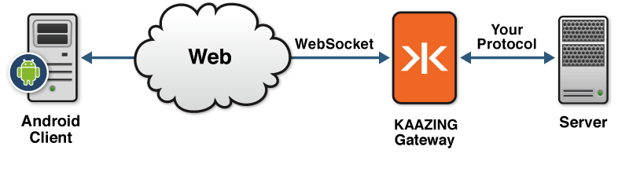

Note: To use the Gateway, a KAAZING client library, or a KAAZING demo, fork the repository from [kaazing.org](http://kaazing.org).
The following checklist provides the steps necessary to build clients to communicate with KAAZING Gateway or a RFC-6455 WebSocket endpoint:

| \# | Step                                                                                                                                               | Topic of Reference                                                                                                    |
|:---|:---------------------------------------------------------------------------------------------------------------------------------------------------|:----------------------------------------------------------------------------------------------------------------------|
| 1  | Use the WebSocket API provided by the KAAZING Gateway Android and Java client library to take advantage of the HTML5 WebSocket standard.           | [Use the Android or Java WebSocket Client API](#use-the-android-or-java-websocket-client-api)                         |
| 2  | Learn how to authenticate your Android or Java client with the Gateway.                                                                            | [Secure Your Android and Java Clients](#secure-your-android-and-java-clients)                                         |
| 3  | Use the EventSource API provided by the KAAZING Gateway Android or Java client library to take advantage of the HTML5 Server-Sent Events standard. | [Use the Android or Java EventSource API](#use-the-android-or-java-eventsource-api)                                   |
| 4  | Migrate your KAAZING Gateway 4.x Android and Java clients to KAAZING Gateway 5.0.x.                                                                | [Migrate Android and Java Clients to KAAZING Gateway 5.0.x](#migrate-android-and-java-clients-to-kaazing-gateway-50x) |
| 5  | Set up logging for your Android or Java client.                                                                                                    | [Display Logs for the Android or Java Client](#display-logs-for-the-android-or-java-client)                           |
| 6  | Troubleshoot the most common issues that occurs when using Java clients.                                                                           | [Troubleshoot Your Android or Java Client](#troubleshoot-your-android-or-java-client)                                 |

**Notes:**
-   For information about the KAAZING Gateway Android or Java Client API, see the [Java Client API](http://developer.kaazing.com/documentation/5.0/apidoc/client/java/gateway/index.html).
-   Java Developer Kit (JDK) or Java Runtime Environment (JRE) 1.6 and above are required.

WebSocket and Android
---------------------

Android is an operating system used by touchscreen smart phones and tablets. Android clients are developed in the Java programming language using the Android software development kit (SDK). The SDK includes development tools, software libraries, and an Android device emulator.

The officially supported integrated development environment (IDE) for Android development by Google is Eclipse using the Android Development Tools (ADT) plugin. To develop Android clients, download the [ADT Bundle](http://developer.android.com/sdk/index.html) that includes both Eclipse and the ADT plugin.

KAAZING Gateway provides an Android Client API to enable HTML5 WebSocket protocol communication in new or existing Android applications. For example, you can create an Android client to get streaming financial data from a back-end server using WebSocket. The following figure shows a high-level overview of the architecture:



**Figure: Enable Communication Between Your Android Client and a Back-end Server over WebSocket**

Using the Java client library, you can enable the HTML5 Communication protocols (for example, WebSocket and Server-Sent Events (SSE)) in new or existing Java applications.

Android, Java, and Server-Sent Events (SSE)
-------------------------------------------

KAAZING Gateway Android Client API also provides support for Server-Sent Events (SSE). For information, see the [Android SSE API](http://developer.kaazing.com/documentation/5.0/apidoc/client/java/gateway/org/kaazing/net/sse/package-summary.html) and Java Client API topic [Interact with KAAZING Gateway Using the EventSource API](p_dev_android_eventsource.md).

See Also
--------

[Android Client API](http://developer.kaazing.com/documentation/5.0/apidoc/client/java/gateway/index.html) or [Java Client API](http://developer.kaazing.com/documentation/5.0/apidoc/client/java/gateway/index.html)


Use the Android or Java WebSocket Client API
============================================

Note: To use the Gateway, a KAAZING client library, or a KAAZING demo, fork the repository from [kaazing.org](http://kaazing.org).

This procedure describes how you can use the Android Client API to create an Android client that connects to and sends and receives message from the Echo service running on the KAAZING Gateway. This API allows you to take advantage of the WebSocket standard as described in the [HTML5 specification](http://www.w3.org/TR/websockets/).

**Note:** The Android Client API is nearly identical to the Java API and therefore both are covered in this topic.
This topic covers the following information:

-   [Components and Tools](#components-and-tools)
-   [Build the Android Client API WebSocket Demo](#build-the-android-client-api-websocket-demo)
-   [To Use the WebSocket API in Android or Java](#to-use-the-websocket-api-in-android-or-java)
-   [WebSocket and WsURLConnection](#websocket-and-wsurlconnection)
-   [URLFactory](#urlfactory)
-   [Setting and Overriding Defaults on the WebSocketFactory](#setting-and-overriding-defaults-on-the-websocketfactory)
-   [Methods for Text and Binary Messages](#methods-for-text-and-binary-messages)

Refer to the [Android Client API](http://developer.kaazing.com/documentation/5.0/apidoc/client/java/gateway/index.html) documentation for a complete description of all of the available methods.

Components and Tools
--------------------

Before you get started, review the components and tools used to build the WebSocket Android client in this procedure.

| Component or Tool                                      | Description                                                                                                                                                                                                                                                                     | Location                                                                                                                                                                                                                                                                                                                                                                 |
|:-------------------------------------------------------|:--------------------------------------------------------------------------------------------------------------------------------------------------------------------------------------------------------------------------------------------------------------------------------|:-------------------------------------------------------------------------------------------------------------------------------------------------------------------------------------------------------------------------------------------------------------------------------------------------------------------------------------------------------------------------|
| KAAZING Gateway or any RFC-6455 WebSocket endpoint.    | You can use the KAAZING Gateway or any RFC-6455 WebSocket endpoint that hosts an Echo service, such as www.websocket.org.                                                                                                                                                       | The KAAZING Gateway is available at kaazing.org.                                                                                                                                                                                                                                                                                                                         |
| KAAZING Gateway WebSocket Android (iOS) Client library | The Android file org.kaazing.gateway.client.android.jar.                                                                                                                                                                                                                        | The library is available at kaazing.org.                                                                                                                                                                                                                                                                                                                                 |
| KAAZING Gateway WebSocket Android Demo                 | A WebSocket Android (iOS) demo that connects to the Gateway or an RFC-6455 WebSocket endpoint, sends an Echo request, and receives and displays an Echo response.                                                                                                               | The demo is available at kaazing.org.                                                                                                                                                                                                                                                                                                                                    |
| KAAZING Gateway WebSocket Java Client library          | The Java file org.kaazing.gateway.client.jar.                                                                                                                                                                                                                                   | The library is available at kaazing.org.                                                                                                                                                                                                                                                                                                                                 |
| KAAZING Gateway WebSocket Java Demo                    | A WebSocket Java demo that connects to the Gateway or an RFC-6455 WebSocket endpoint, sends an Echo request, and receives and displays an Echo response.                                                                                                                        | The demo is available at kaazing.org.                                                                                                                                                                                                                                                                                                                                    |
| Development Tool                                       | Android Studio and the Android SDK                                                                                                                                                                                                                                              | https://developer.android.com/sdk/installing/studio.html                                                                                                                                                                                                                                                                                                                 |
| Secure Networking of TLS/SSL                           | Android (iOS) is run on an iOS device that manages TLS/SSL connections, requesting TLS/SSL certificates from the Gateway or RFC-6455 WebSocket endpoint.                                                                                                                        | For more information on securing network connections between the Gateway and an0 Objective-C (iOS) client, see Secure Network Traffic with the Gateway. For information on API interfaces needed to configure TLS/SSL trust programmatically for testing, see Certificate, Key, and Trust Services Reference and Certificate, Key, and Trust Services Programming Guide. |
| Authentication with Challenge Handlers                 | Authenticating your Objective-C (iOS) client involves implementing a challenge handler to respond to authentication challenges from the Gateway. If your challenge handler is responsible for obtaining user credentials, then you will also need to implement a login handler. | For examples, see the LoginDialogFragment function in the code examples.                                                                                                                                                                                                                                                                                                 |


Build the Android Client API WebSocket Demo
-------------------------------------------

The following procedure walks through the steps of creating the Android WebSocket demo that is included with the the Gateway bundle or available on [kaazing.org](http://kaazing.org). The demo code displays how to use the Android Client API to create a client that creates a WebSocket connection with a RFC-6455 WebSocket endpoint and sends and receives text and binary messages.

1.  Download or fork the KAAZING Gateway WebSocket Android demo from [kaazing.org](http://kaazing.org).
2.  Download and install Android Studio and the Android SDK from [https://developer.android.com/sdk/installing/studio.html](https://developer.android.com/sdk/installing/studio.html).
3.  In a terminal, navigate to the Android SDK's **tools/** directory (for example, `~/Applications/Android Studio.app/sdk/tools`) and execute `android sdk`. The Android SDK Manager appears.
4.  In **Packages**, click the checkbox next to **Android 2.3.3 (API 10)** and then click **Install packages**. Accept any license requirements, install the SDK packages, and then quit the Android SDK Manager.
5.  Launch Android Studio.
6.  Click **New Project**.
7.  In the **New Project** dialog, in **Application name**, enter **EchoActivity**.
8.  In **Company Domain**, enter **example.com**.
9.  In **Package name**, enter **org.kaazing.gateway.client.demo**.
10. Select a project location and click **Next**.
11. In the **Select the form factors your app will run on** screen, select **Phone and Tablet**.
12. In **Minimum SDK**, select **API 10: Android 2.3.3 (Gingerbread)** and click **Next**.
13. In **Add an activity to Mobile**, click **Blank Activity** and click **Next**.
14. In **Choose options for your new file**, in **Activity Name**, enter **EchoActivity**.
15. In **Layout Name** enter **main** and click **Finish**. If there are dependencies that you need to install, the **Finish** button is not available. The new project displays.
16. In the project directory, right-click the app folder, click **New**, and then click **Image Asset**.
17. In **Asset Studio**, in **Image file**, click the folder button (…).
18. Navigate to the the Gateway demo icon located here: `res/drawable-hdpi/icon.png`
19. Click **Next** and then click **Finish**.
20. Import the the Gateway Android libraries.

    1.  Navigate to the location of the the Gateway Android library. See [Components and Tools](#components-and-tools).
    2.  Copy the library file **org.kaazing.gateway.client.android.jar** and paste it into the **lib** folder in the Android Studio project. (Android Studio has a bug that prevents you from simply dragging the library file into the lib folder) The **Move** dialog opens.
    3.  In the **Move** dialog, click **OK**. The library is added to the **lib** folder.

21. Create the Android client Touch User Interface (TUI). Next you will add the text strings and layout for the Android client TUI. When you are finished, the Android client will look like this: Figure: Android Client TUI.

    1.  Open the **strings.xml** file located at `EchoActivity/app/src/main/res/values/strings.xml` and replace its contents with the following:

        ``` xml
            <?xml version="1.0" encoding="utf-8"?>
                <resources>
                    <string name="app_name">WebSocket Demo</string>
                    <string name="username_hint">Username</string>
                    <string name="password_hint">Password</string>
                    <string name="ok_label">OK</string>
                    <string name="cancel_label">Cancel</string>
                    <string name="location_default">ws://echo.websocket.org/</string>
                    <string name="disconnect_label">Disconnect</string>
                    <string name="connect_label">Connect</string>
                    <string name="message_default">Hello World!</string>
                    <string name="send_label">Send</string>
                    <string name="clear_label">Clear</string>
                    <string name="location_label">Location</string>
                    <string name="message_label">Message</string>
                    <string name="sendBinary_label">Send Binary</string>
                </resources>
        ```

        You can see all of the buttons that will be displayed in the TUI. The **location\_default** field is empty but you enter the location into the Android client when you test it.

    2.  Open the **dimens.xml** file located at `EchoActivity/app/src/main/res/values/dimens.xml` and replace its contents with the following:

        ``` xml
            <?xml version="1.0" encoding="utf-8"?>
                <resources>
                    <dimen name="edit_text_size">12dp</dimen>
                </resources>
        ```

    3.  Open the **main.xml** file located at `EchoActivity/app/src/main/layout/main.xml` and replace its contents with the following:

        ``` xml
            <?xml version="1.0" encoding="utf-8"?>
                <RelativeLayout xmlns:android="http://schemas.android.com/apk/res/android"
                    android:layout_width="fill_parent"
                    android:layout_height="fill_parent"
                    android:background="#F27A31">

                    <TextView
                        android:id="@+id/locationText"
                        android:layout_width="fill_parent"
                        android:layout_height="wrap_content"
                        android:text="@string/location_label"
                        android:textColor="#ffffff"
                        android:textSize="@dimen/edit_text_size" />
                    <EditText
                        android:id="@+id/location"
                        android:layout_width="fill_parent"
                        android:layout_height="wrap_content"
                        android:layout_below="@id/locationText"
                        android:background="@android:drawable/editbox_background"
                        android:text="@string/location_default"
                        android:textSize="@dimen/edit_text_size" >

                        <requestFocus />
                    </EditText>

                    <Button
                        android:id="@+id/connect"
                        style="?android:attr/buttonStyleSmall"
                        android:layout_width="wrap_content"
                        android:layout_height="wrap_content"
                        android:layout_alignParentRight="true"
                        android:layout_below="@id/location"
                        android:layout_marginLeft="10dip"
                        android:text="@string/connect_label"
                        android:textSize="@dimen/edit_text_size" />

                    <Button
                        android:id="@+id/disconnect"
                        style="?android:attr/buttonStyleSmall"
                        android:layout_width="wrap_content"
                        android:layout_height="wrap_content"
                        android:layout_below="@id/location"
                        android:layout_marginLeft="10dip"
                        android:layout_toLeftOf="@+id/connect"
                        android:enabled="false"
                        android:text="@string/disconnect_label"
                        android:textSize="@dimen/edit_text_size" />

                    <TextView
                        android:id="@+id/label"
                        android:layout_width="fill_parent"
                        android:layout_height="wrap_content"
                        android:layout_below="@id/connect"
                        android:text="@string/message_label"
                        android:textColor="#ffffff" />

                    <EditText
                        android:id="@+id/message"
                        android:layout_width="fill_parent"
                        android:layout_height="wrap_content"
                        android:layout_below="@id/label"
                        android:background="@android:drawable/editbox_background"
                        android:text="@string/message_default"
                        android:textSize="@dimen/edit_text_size" />

                    <CheckBox
                        android:id="@+id/sendBinaryCheckBox"
                        android:layout_width="wrap_content"
                        android:layout_height="wrap_content"
                        android:layout_alignBottom="@+id/send"
                        android:layout_alignParentLeft="true"
                        android:layout_below="@id/message"
                        android:text="@string/sendBinary_label"
                        android:textSize="@dimen/edit_text_size" />

                    <Button
                        android:id="@+id/send"
                        style="?android:attr/buttonStyleSmall"
                        android:layout_width="wrap_content"
                        android:layout_height="wrap_content"
                        android:layout_alignParentRight="true"
                        android:layout_below="@id/message"
                        android:layout_marginLeft="10dip"
                        android:enabled="false"
                        android:text="@string/send_label"
                        android:textSize="@dimen/edit_text_size" />

                    <LinearLayout
                        android:id="@+id/logContainer"
                        android:layout_width="match_parent"
                        android:layout_height="fill_parent"
                        android:orientation="vertical"
                        android:layout_below="@+id/send">

                        <TextView
                            android:id="@+id/log"
                            android:layout_width="fill_parent"
                            android:layout_height="0dp"
                            android:layout_weight="1"
                            android:background="@android:drawable/editbox_background"
                            android:maxLines="20"
                            android:scrollbars="horizontal|vertical"
                            android:textColor="#000000"
                            android:textSize="@dimen/edit_text_size" />

                        <Button
                            android:id="@+id/clear"
                            style="?android:attr/buttonStyleSmall"
                            android:layout_width="wrap_content"
                            android:layout_height="wrap_content"
                            android:layout_gravity="right"
                            android:text="@string/clear_label"
                            android:textSize="@dimen/edit_text_size" />

                    </LinearLayout>
                </RelativeLayout>
        ```

22. Add a dispatch queue class to the Android client.

    A dispatch queue class is used to run tasks in a separate thread from the main thread (to run some tasks asynchronously). The dispatch queue class is used to add [Runnable](http://docs.oracle.com/javase/7/docs/api/java/lang/Runnable.html "Runnable (Java Platform SE 7 )") in a queue. Runnable will be run in a first-in first-out basis. This dispatch queue class is useful to run a series of tasks sequentially in a separate thread from the main thread of the Android client. All of the blocking calls of the Android client will be run in a background thread so that the TUI is not blocked and can remain responsive.

    1.  Right-click on the package **org.kaazing.gateway.client.demo** in `EchoActivity/app/src/main/java`, click **New**, and click **Java Class**.
    2.  In **Name** enter **DispatchQueue** and click **OK**. The new **DispatchQueue** class is added to the **src** folder.
    3.  Double-click **DispatchQueue**.
    4.  Replace the contents with the following code:

        ``` java
        package org.kaazing.gateway.client.demo;

        import android.os.Handler;
        import android.os.HandlerThread;

        public class DispatchQueue extends HandlerThread {

            private Handler handler;

            public DispatchQueue(String name) {
                super(name);
            }

            // The message blocks until the thread is started. This should be called
            // after call to start() to ensure the thread is ready.
            public void waitUntilReady() {
                handler = new Handler(getLooper());
            }

            // Adds the Runnable to the message queue which will be run on the thread.
            // The runnable will be run in a first-in first-out basis.  
            public void dispatchAsync(Runnable task) {
                handler.post(task);
            }

            public void removePendingJobs() {
                handler.removeCallbacksAndMessages(null);
            }

        }
        ```

23. Add the login and challenge handler for client authentication.

    1.  Right-click on the package **org.kaazing.gateway.client.demo** in `EchoActivity/app/src/main/java`, click **New**, and click **Java Class**.
    2.  In **Name** enter **LoginDialogFragment** and click **OK**. The new **LoginDialogFragment** class is added to the **src** folder.
    3.  Double-click **LoginDialogFragment**.
    4.  Replace the contents with the following code:

        ``` java
        package org.kaazing.gateway.client.demo;

        import android.app.AlertDialog;
        import android.app.Dialog;
        import android.content.DialogInterface;
        import android.os.Bundle;
        import android.view.LayoutInflater;
        import android.widget.EditText;

        public class LoginDialogFragment extends android.support.v4.app.DialogFragment {

            private String username;
            private String password;
            private LoginDialogListener listener;
            private boolean cancelled;

            public Dialog onCreateDialog(Bundle savedInstanceState) {

                AlertDialog.Builder builder = new AlertDialog.Builder(getActivity());
                LayoutInflater layoutInflaor = getActivity().getLayoutInflater();
                builder.setView(layoutInflaor.inflate(R.layout.login, null)).setPositiveButton(R.string.ok_label, new DialogInterface.OnClickListener() {

                    public void onClick(DialogInterface dialog, int which) {
                        EditText usernameText = (EditText)LoginDialogFragment.this.getDialog().findViewById(R.id.username);
                        EditText passwordText = (EditText)LoginDialogFragment.this.getDialog().findViewById(R.id.password);
                        username = usernameText.getText().toString();
                        password = passwordText.getText().toString();
                        LoginDialogFragment.this.getDialog().dismiss();
                        listener.onDismissed();

                    }
                })
                        .setNegativeButton(R.string.cancel_label, new DialogInterface.OnClickListener() {
                            public void onClick(DialogInterface dialog, int id) {
                                cancel();
                            }
                        });
                return builder.create();

            }

            public String getUsername() {
                return username;
            }

            public String getPassword() {
                return password;
            }

            public boolean isCancelled() {
                return cancelled;
            }

            public void setListener(LoginDialogListener listener) {
                this.listener = listener;
            }

            public void cancel() {
                cancelled = true;
                LoginDialogFragment.this.getDialog().cancel();
                listener.onDismissed();
            }

            public interface LoginDialogListener {
                public void onDismissed();
            }
        }
        ```

24. Modify the main class for the Android client. In the **src** folder for the project, under **main/java/org.kaazing.gateway.client.demo**, double-click **EchoActivity**. You will add the main Java code for the Android client in this file.
25. Replace all of the contents with the following:

    ``` java
    package org.kaazing.gateway.client.demo;

    import java.io.IOException;
    import java.net.PasswordAuthentication;
    import java.net.URI;
    import java.nio.ByteBuffer;
    import java.util.concurrent.Semaphore;

    import android.os.Bundle;
    import android.support.v4.app.FragmentActivity;
    import android.view.View;
    import android.view.View.OnClickListener;
    import android.widget.Button;
    import android.widget.CheckBox;
    import android.widget.TextView;

    import org.kaazing.gateway.client.demo.LoginDialogFragment.LoginDialogListener;
    import org.kaazing.net.auth.BasicChallengeHandler;
    import org.kaazing.net.auth.ChallengeHandler;
    import org.kaazing.net.auth.LoginHandler;
    import org.kaazing.net.ws.WebSocket;
    import org.kaazing.net.ws.WebSocketFactory;
    import org.kaazing.net.ws.WebSocketMessageReader;
    import org.kaazing.net.ws.WebSocketMessageType;
    import org.kaazing.net.ws.WebSocketMessageWriter;

    public class EchoActivity extends FragmentActivity {

        private TextView location;
        private TextView message;
        private TextView log;
        private Button sendBtn;
        private Button connectBtn;
        private Button disconnectBtn;
        private Button clearBtn;
        private CheckBox sendBinaryCheckBox;

        private WebSocket webSocket;
        private DispatchQueue dispatchQueue;
        private boolean wasConnectedBeforePaused = false;
        private boolean closedExplicitly = false;
        private LoginDialogFragment loginDialog;

        /** Called when the activity is first created. */
        @Override
        public void onCreate(Bundle savedInstanceState) {
            super.onCreate(savedInstanceState);
            setContentView(R.layout.main);
            location = (TextView)findViewById(R.id.location);
            message = (TextView)findViewById(R.id.message);
            log = (TextView)findViewById(R.id.log);
            sendBtn = (Button)findViewById(R.id.send);
            connectBtn = (Button)findViewById(R.id.connect);
            disconnectBtn = (Button)findViewById(R.id.disconnect);
            clearBtn = (Button)findViewById(R.id.clear);
            sendBinaryCheckBox = (CheckBox)findViewById(R.id.sendBinaryCheckBox);

            connectBtn.setOnClickListener(new OnClickListener() {
                public void onClick(View v) {
                    connectBtn.setEnabled(false);
                    connect();
                }
            });

            sendBtn.setOnClickListener(new OnClickListener() {
                public void onClick(View v) {
                    final boolean sendBinary = sendBinaryCheckBox.isChecked();
                    dispatchQueue.dispatchAsync(new Runnable() {
                        public void run() {
                            try {
                                WebSocketMessageWriter messageWriter = webSocket.getMessageWriter();
                                if (sendBinary) {
                                    String messageToSend = message.getText().toString();
                                    ByteBuffer payload = ByteBuffer.wrap(messageToSend.getBytes());
                                    logMessage("SEND BINARY:" + getHexDump(payload));
                                    messageWriter.writeBinary(payload);
                                }
                                else {
                                    logMessage("SEND: " + message.getText());
                                    messageWriter.writeText(message.getText());
                                }
                            } catch (Exception e) {
                                e.printStackTrace();
                                logMessage(e.getMessage());
                            }
                        }
                    });
                }
            });

            disconnectBtn.setOnClickListener(new OnClickListener() {
                public void onClick(View v) {
                    disconnect();
                }
            });

            clearBtn.setOnClickListener(new OnClickListener() {
                public void onClick(View v) {
                    log.setText("");
                }
            });

        }

        public void onPause() {
            if (webSocket != null) {
                wasConnectedBeforePaused = true;
                disconnect();
            }
            super.onPause();
        }

        public void onResume() {
            if (wasConnectedBeforePaused) {
                wasConnectedBeforePaused = false;
                connect();
            }
            super.onResume();
        }

        public void onDestroy() {
            if (webSocket != null) {
                disconnect();
            }
            super.onDestroy();
        }

        private void connect() {
            closedExplicitly = false;
            logMessage("CONNECTING");
            // initialize dispatch queue that will be used to run
            // blocking calls asynchronously on a separate thread
            dispatchQueue = new DispatchQueue("Async Dispatch Queue");
            dispatchQueue.start();
            dispatchQueue.waitUntilReady();

            // Since WebSocket.connect() is a blocking method which will not return until
            // the connection is established or connection fails, it is a good practice to
            // establish connection on a separate thread so that UI is not blocked.
            dispatchQueue.dispatchAsync(new Runnable() {
                public void run() {
                    try {
                        WebSocketFactory webSocketFactory = WebSocketFactory.createWebSocketFactory();
                        webSocket = webSocketFactory.createWebSocket(URI.create(location.getText().toString()));
                        webSocket.setChallengeHandler(createChallengehandler());
                        webSocket.connect();
                        logMessage("CONNECTED");
                        WebSocketMessageReader messageReader = webSocket.getMessageReader();
                        MessageReceiver messageReceiver = new MessageReceiver(messageReader);
                        new Thread(messageReceiver).start();
                        updateButtonsForConnected();
                    } catch (Exception e) {
                        updateButtonsForDisconnected();
                        logMessage(e.getMessage());
                        dispatchQueue.quit();
                    }
                }
            });
        }

        private void disconnect() {
            closedExplicitly = true;
            disconnectBtn.setEnabled(false);
            logMessage("DISCONNECTING");

            dispatchQueue.removePendingJobs();
            dispatchQueue.quit();

            new Thread(new Runnable() {
                public void run() {
                    try {
                        webSocket.close();
                        logMessage("DISCONNECTED");
                    } catch (IOException e) {
                        logMessage(e.getMessage());
                    }
                    finally {
                        webSocket = null;
                        updateButtonsForDisconnected();
                    }
                }
            }).start();
        }

        private void updateButtonsForConnected() {
            runOnUiThread(new Runnable() {
                public void run() {
                    connectBtn.setEnabled(false);
                    sendBtn.setEnabled(true);
                    disconnectBtn.setEnabled(true);
                }
            });
        }

        private void updateButtonsForDisconnected() {
            runOnUiThread(new Runnable() {
                public void run() {
                    connectBtn.setEnabled(true);
                    disconnectBtn.setEnabled(false);
                    sendBtn.setEnabled(false);
                }
            });
        }

        private void logMessage(final String logMessage) {
            runOnUiThread(new Runnable() {
                public void run() {
                    log.setText(logMessage + "\n" + log.getText());
                }
            });
        }

        private ChallengeHandler createChallengehandler() {
            final LoginHandler loginHandler = new LoginHandler() {
                private String username;
                private char[] password;
                @Override
                public PasswordAuthentication getCredentials() {
                    try {
                        final Semaphore semaphore = new Semaphore(1);

                        // Acquire semaphore so that subsequent acquire will block until released.
                        // This is used to wait until the login dialog is dismissed
                        semaphore.acquire();
                        loginDialog = new LoginDialogFragment();
                        loginDialog.setListener(new LoginDialogListener() {
                            public void onDismissed() {
                                if(!loginDialog.isCancelled()) {
                                    username = loginDialog.getUsername();
                                    password = loginDialog.getPassword().toCharArray();
                                }
                                loginDialog = null;
                                semaphore.release();
                            }
                        });
                        runOnUiThread(new Runnable() {
                            public void run() {
                                loginDialog.show(getSupportFragmentManager(), "Login Dialog Fragment");
                                loginDialog.getFragmentManager().executePendingTransactions();
                                loginDialog.getDialog().setCanceledOnTouchOutside(false);
                            }
                        });

                        // This will cause the thread to block until the OK or Cancel button is clicked
                        semaphore.acquire();
                        if (loginDialog.isCancelled()) {
                            return null;
                        }

                    } catch (Exception e) {
                        e.printStackTrace();
                    }
                    return new PasswordAuthentication(username, password);
                }
            };
            BasicChallengeHandler challengeHandler = BasicChallengeHandler.create();
            challengeHandler.setLoginHandler(loginHandler);
            return challengeHandler;
        }

        private String getHexDump(ByteBuffer buf) {
            if (buf.position() == buf.limit()) {
                return "empty";
            }

            StringBuilder hexDump = new StringBuilder();
            for (int i = buf.position(); i < buf.limit(); i++) {
                hexDump.append(Integer.toHexString(buf.get(i)&0xFF)).append(' ');
            }
            return hexDump.toString();
        }

        private class MessageReceiver implements Runnable {

            private WebSocketMessageReader messageReader;

            private MessageReceiver(WebSocketMessageReader reader) {
                this.messageReader = reader;
            }

            public void run() {
                WebSocketMessageType type = null;
                try {
                    while ((type = messageReader.next()) != WebSocketMessageType.EOS) {
                        switch (type) {
                            case BINARY:
                                ByteBuffer data = messageReader.getBinary();
                                logMessage("RECEIVED: " + getHexDump(data));
                                break;
                            case TEXT:
                                CharSequence text = messageReader.getText();
                                logMessage("RECEIVED: " + text.toString());
                                break;
                        }
                    }
                    if (!closedExplicitly) {

                        // Connection got closed due to either of the cases
                        // - Server closing the connection because of authentication time out
                        // - network failure
                        webSocket = null;
                        logMessage("Connection Closed!!");
                        updateButtonsForDisconnected();
                        if (loginDialog != null && !loginDialog.isHidden()) {
                            loginDialog.cancel();
                        }
                    }
                }
                catch (Exception ex) {
                    ex.printStackTrace();
                    logMessage(ex.getMessage());
                }
            }

        }
    }
    ```

26. Run the Android client in the Android Emulator. You will need to create an Android Virtual Device (AVD) first. For information on creating an AVD, see [Managing AVDs with AVD Manager](http://developer.android.com/tools/devices/managing-avds.html "Managing AVDs with AVD Manager | Android Developers").
27. Right-click the **EchoActivity** project, click **Run As**, and then click **Android Application**. The Android Emulator will launch with a locked display screen. Unlock the display screen to display the Android client.
28. Test the Android client in the Android Emulator.

    1.  In the Android client running in the Android Emulator, in Location, enter `ws://echo.websocket.org`.
    2.  Click **Connect**. The messages `CONNECTING` and then `CONNECTED` appear. The WebSocket connection was successful.
    3.  Click **Send**. The message `Hello World!` is sent to the Echo service over WebSocket and the message is echoed back as `Hello World!`.
    4.  Click the **Send Binary** checkbox and click **Send** again. The message `Hello World!` is sent to the Echo service over WebSocket as binary and is echoed back as:

        ```
        RECEIVED: 48 65 6c 6c 6f 2c 20 57 65 62 53 6f 63 6b 65 74 21
        SEND BINARY: 48 65 6c 6c 6f 2c 20 57 65 62 53 6f 63 6b 65 74 21
        ```

29. To test the Android client on an Android device, ensure USB debugging is enabled on your Android device (**Settings \> Applications \> Development**), and plug the device into your system.
30. In Eclipse, right-click the **EchoActivity** project, select **Run As**, and then click **Android Application**. The Android client is deployed to your Android device. Follow the location, connection and send steps to test the client on your device.

### Test Your Android Client Using Genymotion
Genymotion is a fast and easy-to-use Android emulator to run and test your Android apps.

1. Download and install [Genymotion](https://www.genymotion.com/#!/download) and then add the [Genymotion plugin for Android Studio](https://www.genymotion.com/#!/developers/user-guide#genymotion-plugin-for-android-studio).
2. In Eclipse, click the Genymotion icon, to open the Genymotion preferences.
3. Enter the location of the Genymotion app, and click **OK**.
4. Click the Genymotion icon to open the **Genymotion Virtual Devices Manager**.
5. In **Genymotion Virtual Devices Manager**, click **New**.
6. Sign into Genymotion with your Genymotion account.
7. For a virtual device, select a minimum of API 10.
8. In the **Genymotion Virtual Devices Manager**, click **Refresh**.
9. Select the virtual device you want to use and click **Start**.
10. Right-click on your application project and select **Run as Android application**. The application opens in Genymotion.
11. Test the application using the testing steps listed in the previous procedure.


To Use the WebSocket API in Android or Java
------------------------------------------------------------------------

1.  Add the necessary import statements:

    ``` java
    import org.kaazing.net.ws.WebSocket;
    import org.kaazing.net.ws.WebSocketFactory;
    import org.kaazing.net.ws.WebSocketMessageReader;
    import org.kaazing.net.ws.WebSocketMessageType;
    import org.kaazing.net.ws.WebSocketMessageWriter;
    ```

2.  Create a WebSocket object and connect to a server:

    ``` java
    wsFactory = WebSocketFactory.createWebSocketFactory();
    ws = wsFactory.createWebSocket(URI.create("ws://example.com:8001/path"));
    ws.connect(); // This will block or throw an exception if failed.
    ```

3.  To send messages, add a `WebSocketMessageWriter` object:

    ``` java
    WebSocketMessageWriter writer = ws.getMessageWriter();
    String text = "Hello WebSocket!";
    writer.writeText(text);   // Send text message
    ```

4.  To receive or consume messages, add `WebSocket` and `WebSocketMessageReader` objects:

    ``` java
    wsFactory = WebSocketFactory.createWebSocketFactory();
    ws = wsFactory.createWebSocket(URI.create("ws://example.com:8001/path"));
    ws.connect(); // This will block or throw an exception if failed.

    WebSocketMessageReader reader = ws.getMessageReader();
    WebSocketMessageType type = null; // Block till a message arrives
      // Loop till the connection goes away
      while ((type =  reader.next()) != WebSocketMessageType.EOS) {
        switch (type) { // Handle both text and binary messages
          case TEXT:
            CharSequence text = reader.getText();
            log("RECEIVED TEXT MESSAGE: " + text.toString());
            break;
          case BINARY:
            ByteBuffer buffer = reader.getBinary();
            log("RECEIVED BINARY MESSAGE: " + getHexDump(buffer));
            break;
        }
    }
    ```

    **Note:** The WebSocket connection is created for both the send and receive functions (`ws.connect()`). These examples are used because most clients will either send *or* receive messages. If your client both sends *and* receives messages, you would only need to create a single WebSocket connection.

    Here is an example using a for loop to alternate between text and binary messages, and the code is placed within try catch blocks:

    ``` java
    try {
        // Create a new WebSocket object
        wsFactory = WebSocketFactory.createWebSocketFactory();
        ws = wsFactory.createWebSocket(URI.create("ws://example.com:8001/path"));
        ws.connect(); // This will block or throw an exception if failed.

         /* Use the WebSocketMessageWriter class method getMessageWriter()
         to send text and binary messages */
         WebSocketMessageWriter writer = ws.getMessageWriter();

         // Send messages using a for loop to alternate between text and binary messages
         for (int i = 0; i < 100; i++) {
             String text = "Hello WebSocket - " + i;
             // For even numbered loops, send text
             if (( i %2) == 0) {
                 writer.writeText(text);   // Send text message
             }
             else {
                 // For odd numbered loops, send binary
                 ByteBuffer buffer = ByteBuffer.wrap(text.getBytes());
                 writer.writeBinary(buffer);   // Send binary message
             }
         }    
         ws.close();
     }
    catch (Exception ex) {
        ex.printStackTrace();
    }
    ```

    Here is how to receive messages on the consumer side using a while loop and switch statement:

    ``` java
    try {
        // Create a new WebSocket object
        wsFactory = WebSocketFactory.createWebSocketFactory();
        ws = wsFactory.createWebSocket(URI.create("ws://example.com:8001/path"));
        ws.connect(); // This will block or throw an exception if failed.

         // Use the getMessageReader() method    
         WebSocketMessageReader reader = ws.getMessageReader();

         WebSocketMessageType type = null; // Block until a message arrives
         while ((type =  reader.next()) != WebSocketMessageType.EOS) { // Loop until the connection is closed
             switch (type) {
                 // Run if type is TEXT
                 case TEXT:
                     CharSequence text = reader.getText();
                      log("RECEIVED TEXT MESSAGE: " + text.toString());
                      break;

                 // Run if type is BINARY
                 case BINARY:
                     ByteBuffer buffer = reader.getBinary();
                      log("RECEIVED BINARY MESSAGE: " + getHexDump(data)); // see getHexDump() below
                      break;
             }
         }
         ws.close();
     }
    catch (Exception ex){
       ex.printStackTrace();
    }

    private String getHexDump(ByteBuffer buf) {
        if (buf.position() == buf.limit()) {
            return "empty";
        }

        StringBuilder hexDump = new StringBuilder();
        for (int i = buf.position(); i < buf.limit(); i++) {
            hexDump.append(Integer.toHexString(buf.get(i)&0xFF)).append(' ');
        }
        return hexDump.toString();
    }
    ```

WebSocket and WsURLConnection
-------------------------------------------------------------

The KAAZING Gateway Java WebSocket API offers two options for creating and using WebSocket connections to enable developers to leverage their java.net Socket or URL experience:

-   **WebSocket** - this class and its methods are provided for developers familiar with the [Socket](http://docs.oracle.com/javase/7/docs/api/java/net/Socket.html) class in the java.net package. It implements a socket for stream-based interprocess communication over the Web.
-   **WsURLConnection** - this class is an extension of the [URLConnection](http://docs.oracle.com/javase/7/docs/api/java/net/URLConnection.html) class in the java.net package. It defines a network connection to an object specified by a URL. WsURLConnection adds WebSocket support to URLConnection, allowing you to create, connect and use WebSocket connections in addition to the default URLConnection subclasses HttpURLConnection and JarURLConnection. You can use all of the methods in URLConnection and the additional methods included in the WsURLConnection extension.

### WebSocket Class

The WebSocket class is demonstrated in the [Build the Java API Client Demo](#build-the-android-client-api-websocket-demo) example, but there are some additional elements to be aware of such as methods for text and/or binary WebSocket messages. These methods are described in [Methods for Text and Binary Messages](#methods-for-text-and-binary-messages).

### WsURLConnection

The WsURLConnection class is provided for developers accustomed to creating an URLConnection object and then using [java.io.InputStream](http://docs.oracle.com/javase/7/docs/api/java/io/InputStream.html) and [java.io.OutputStream](http://docs.oracle.com/javase/7/docs/api/java/io/OutputStream.html) classes from java.io to receive and send data. The WsURLConnection extends URLConnection to enable you to use WebSocket-specific features and provide bidirectional communication.

The following example demonstrates how WsURLConnection enables you to create a URLConnection object for a WebSocket URL:

``` java
URL location = URLFactory.createURL("ws://localhost:8000/echo");
URLConnection urlConn = location.openConnection();
InputStream inStream = urlConn.getInputStream();
```

There are two important things to note in this example:

-   This example uses the URLFactory class which enables you to instantiate URL objects that support custom protocols and schemes, such as the WebSocket protocol’s ws:// and wss://. [java.net.URL](http://docs.oracle.com/javase/7/docs/api/java/net/URL.html) has native support for http, https, ftp, file, and jar protocols only.
-   The URLConnection object created in the example is an instance of the WsURLConnection class. Since `getInputStream()` and `getOutputStream()` methods are available on URLConnection, there was no need to downcast URLConnection to WsURLConnection. However, if you need to access methods that are not available on URLConnection, but are only available on WsURLConnection, you can [downcast](http://en.wikipedia.org/wiki/Downcasting) the `urlConn` object in the example and then invoke `getMessageReader()`:

    ``` java
    URL location = URLFactory.createURL("ws://localhost:8000/echo");
    URLConnection urlConn = location.openConnection();
    WsURLConnection  wsConn = (WsURLConnection) urlConn;   // Downcasting to WsURLConnection
    WebSocketMessageReader msgReader = wsConn.geMessageReader();
    ```

With WsURLConnection and URLFactory, you can continue to create URLConnection objects as you have previously and simply use WebSocket to take advantage of additional methods provided by WsURLConnection.

URLFactory
----------

The URLFactory class is included to support custom protocols and schemes not supported by java.net.URL. Namely, the WebSocket protocol’s ws:// and wss:// schemes. java.net.URL supports http, https, ftp, file, and jar protocols only and the java.net.URLStreamHandlerFactory class registration is not extensible. After importing the URLFactory class, one of the `createURL()` methods is used to create a WebSocket URL object from either:

-   The String representation, by parsing the given specification within a specified context.
-   A specified protocol name, host name, and file name.
-   A specified protocol name, host name, port number, and file name.

For more information about the URLFactory class, see the KAAZING Gateway [Java WebSocket API](http://developer.kaazing.com/documentation/5.0/apidoc/client/java/gateway/index.html).

Setting and Overriding Defaults on the WebSocketFactory
-------------------------------------------------------

You can set a default redirect-policy on the WebSocketFactory. All the WebSockets created using that factory automatically inherit the default. You can then override the defaults on an individual WebSocket, if desired. Unlike the HttpURLConnection in the Java SDK that uses the boolean InstanceFollowRedirects method to specify whether the WebSocket follows redirects automatically, the KAAZING Gateway Java WebSocket API also provides the following options:

| Option       | Description                                                                                                                                                                                                                                                     |
|:-------------|:----------------------------------------------------------------------------------------------------------------------------------------------------------------------------------------------------------------------------------------------------------------|
| NEVER        | Do not follow HTTP redirects.                                                                                                                                                                                                                                   |
| ALWAYS       | Follow the HTTP redirect requests always, regardless of the origin, domain, etc.                                                                                                                                                                                |
| SAME\_ORIGIN | Follow the HTTP redirect only if the origin of the redirect request matches. This implies that both the scheme/protocol and the authority between the current and the redirect URIs should match. The port number should also be the same between the two URIs. |
| SAME\_DOMAIN | Follow HTTP redirect only if the domain of the redirect request matches the domain of the current request. For example, URIs with identical domains would be `ws://production.example.com:8001` and `ws://production.example.com:8002`.                         |
| PEER\_DOMAIN | Follow the HTTP redirect only if the redirected request is for a peer-domain. For example, the domain in the URI ws://sales.example.com:8001 is a peer of the domain in the URI ws://marketing.example.com:8002.                                                |
| SUB\_DOMAIN  | Follow the HTTP redirect only if the request is for sub-domain. For example, the domain in the URI ws://benefits.hr.example.com:8002 is a sub-domain of the domain in the URI ws://hr.example.com:8001.                                                         |

You can set the default redirect option on the WebSocket Factory using the `setDefaultRedirectPolicy()` method and then override it on a WebSocket connection using the `setRedirectPolicy()` method.

``` java
import org.kaazing.net.http.HttpRedirectPolicy;
...
WebSocket wsFactory = WebSocketFactory.createWebSocketFactory();
wsFactory.setDefaultRedirectPolicy(HttpRedirectPolicy.SUB_DOMAIN);
wsFactory.createWebSocket(location);
```

Here is an example of the SUB\_DOMAIN option overridden on a WebSocket connection:

``` java
WebSocket ws;
ws = wsFactory.createWebSocket(location);
ws.setRedirectPolicy(HttpRedirectPolicy.ALWAYS);
ws.connect();
```

Methods for Text and Binary Messages
------------------------------------

Both the WebSocket and WsURLConnection classes offer methods to suit the data types your client will handle.

### Text and Binary Clients

Clients using both text and binary messages can use the `getMessageReader()` and `getMessageWriter()` methods, available in both the WebSocket and WsURLConnection classes. These methods receive binary and text messages based on the WebSocketMessageType class. The WebSocketMessageType class represents the types of messages that are received by `WebSocketMessageReader`. There are three types: TEXT, BINARY, and EOS for end–of–stream. For receiving messages, you can use a switch block for the different message types:

``` java
Thread messageReceivingThread = new Thread() {
    public void run() {
      WebSocketMessageType type = null;
      try {
          WebSocketMessageReader reader = webSocket.getMessageReader();
          while ((type = reader.next()) != WebSocketMessageType.EOS) {
              switch (type) {
                  case BINARY:
                      ByteBuffer data = reader.getBinary();
                      log("RESPONSE:" + getHexDump(data));
                      break;
                  case TEXT:
                      CharSequence text = reader.getText();
                      log("RESPONSE:" + text.toString());
                      break;
              }                                        
          }                                    
      webSocket.close()
        }
      catch (Exception ex) {
          log("Exception: " + ex.getMessage());
      }
    }
};
```

**Note:** In UI-based Java clients, receiving messages should be done on a separate thread to avoid blocking the java.awt [EventDispatchThread](http://docs.oracle.com/javase/tutorial/uiswing/concurrency/dispatch.html). Review the example in the KAAZING Gateway WebSocket Java Client Demo at [kaazing.org](http://kaazing.org) to see a demonstration.
### Text-only Clients

Text-only clients can use the `getReader()` and `getWriter()` methods, available in both the WebSocket and WsURLConnection classes. If either method is used to receive binary messages, or the methods are invoked before a connection is made, then an IOException is thrown.

### Binary-only Clients and I/O Streams

Both WebSocket and WsURLConnection classes support APIs that enable use the use of byte-based data streams as they define `getInputStream()` and `getOutputStream()` methods. `getInputStream()` is used for receiving binary streams and `getOutputStream()` is used to send binary streams. If either method is used to receive text messages, or the methods are invoked before a connection is made, then an IOException is thrown. Once the connection is closed, a new InputStream or OutputStream must be obtained using the `getInputStream()` and `OutputStream()` methods after the connection has been established. Using the old InputStream or OutputStream will result in IOException.

Secure Your Android and Java Clients
====================================

**Note:** To use the Gateway, a KAAZING client library, or a KAAZING demo, fork the repository from [kaazing.org](http://kaazing.org).

This topic provides information on how to add user authentication functionality to Java and Android clients. The Java and Android Client APIs use the same authentication classes and methods.

A challenge handler is a constructor used in an application to respond to authentication challenges from the Gateway when the application attempts to access a protected resource. Each of the resources protected by the Gateway is configured with a different authentication scheme (for example, Basic, Application Basic, or Application Token), and your application requires a challenge handler for each of the schemes that it will encounter or a single challenge handler that will respond to all challenges. Also, you can add a dispatch challenge handler to route challenges to specific challenge handlers according to the URI of the requested resource.

For information about each authentication scheme type, see [Configure the HTTP Challenge Scheme](https://github.com/kaazing/gateway/blob/develop/doc/security/p_authentication_config_http_challenge_scheme.md).

Before you add security to your clients, follow the steps in [Secure Network Traffic with the Gateway](../security/o_tls.md) and [Configure Authentication and Authorization](https://github.com/kaazing/gateway/blob/develop/doc/security/o_auth_configure.md) to set up security on KAAZING Gateway for your client. The authentication and authorization methods configured on the Gateway influence your client security implementation. In this procedure, we provide an example of the most common implementation.


To Secure Your Java and Android Clients
---------------------------------------

This section includes the following topics:

-   [Overview of Challenge Handlers](#overview-of-challenge-handlers)
-   [Challenge Handler Class Imports](#challenge-handler-class-imports)
-   [Creating a Basic Challenge Handler](#creating-a-basic-challenge-handler)
-   [Creating a Login Handler](#creating-a-login-handler)
-   [Creating a Custom Challenge Handler](#creating-a-custom-challenge-handler)
-   [Overriding Default Challenge Handler Implementations](#overriding-default-challenge-handler-implementations)
-   [Managing Log In Attempts](#managing-log-in-attempts)
-   [Authentication and Connections](#authentication-and-connections)
-   [Registering Challenge Handlers at Locations](#registering-challenge-handlers-at-locations)
-   [Using Wildcards to Match Sub Domains and Paths](#using-wildcards-to-match-sub-domains-and-paths)
-   [Creating Kerberos Challenge Handlers](#creating-kerberos-challenge-handlers) 

Overview of Challenge Handlers
-----------------------------------------------------

A challenge handler is responsible for producing responses to authentication challenges from the Gateway. The challenge handler process is as follows:

1.  When an attempt to access a URI protected by the Gateway is made, the Gateway responds with an authentication request, indicating that credentials need to be provided before access to the resource is granted. The specific type of challenge is indicated in a HTTP header called "WWW-Authenticate".
2.  The authentication request and the header are converted into a ChallengeRequest (as defined in RFC 2617) and sent to a challenge handler registered in the client application for authentication challenge responses.
3.  The ChallengeResponse credentials generated by a registered challenge handler are included in a replay of the original request to the Gateway, which allows access to the resource (assuming the credentials are sufficient).

Authenticating your Java client involves implementing a [challenge handler](http://developer.kaazing.com/documentation/5.0/apidoc/client/java/gateway/com/kaazing/net/auth/ChallengeHandler.html) to respond to authentication challenges from the Gateway. If your challenge handler is responsible for obtaining user credentials, then implement a [login handler](http://developer.kaazing.com/documentation/5.0/apidoc/client/java/gateway/com/kaazing/net/auth/LoginHandler.html).

Challenge Handler Class Imports
-----------------------------------------------------

To use a challenge handler in your Java client you must add the following imports:

``` java
import org.kaazing.net.auth.BasicChallengeHandler;
import org.kaazing.net.ws.WebSocket;
import org.kaazing.net.ws.WebSocketFactory;
```

Here is an example of the main WebSocket imports, including challenge handlers:

``` java
import org.kaazing.net.auth.BasicChallengeHandler;
import org.kaazing.net.auth.LoginHandler;
import org.kaazing.net.http.HttpRedirectPolicy;
import org.kaazing.net.ws.WebSocket;
import org.kaazing.net.ws.WebSocketFactory;
import org.kaazing.net.ws.WebSocketMessageReader;
import org.kaazing.net.ws.WebSocketMessageType;
import org.kaazing.net.ws.WebSocketMessageWriter;
```

Creating a Basic Challenge Handler
----------------------------------

Clients with a single challenge handling strategy for authentication requests can set a specific challenge handler as the default using the setDefaultChallengeHandler() method in the WebSocketFactory class. For example:

``` java
private WebSocketFactory wsFactory;

wsFactory = WebSocketFactory.createWebSocketFactory();
...  
BasicChallengeHandler challengeHandler = BasicChallengeHandler.create();
challengeHandler.setLoginHandler(loginHandler);
wsFactory.setDefaultChallengeHandler(challengeHandler);
```

Each WebSocket created from the factory can have its own Challenge Handler associated with it:

``` java
wsFactory = WebSocketFactory.createWebSocketFactory();
WebSocket ws = wsFactory.createWebSocket(location);
BasicChallengeHandler challengeHandler = BasicChallengeHandler.create();
challengeHandler.setLoginHandler(loginHandler);
ws.setChallengeHandler(challengeHandler);
```

**Note:** The challenge handler API is very flexible and there are many different ways to implement challenge handlers to suit the needs of your client application. For more detailed information on challenge handlers, see the [Java Client API](../apidoc/client/java/gateway/index.md).

Creating a Login Handler
------------------------

A login handler is responsible for obtaining credentials from an arbitrary source, such as a dialog presented to the user. Login handlers can be associated with one or more challenge handlers (ChallengeHandler objects) to ensure that when a challenge handler requires credentials for a challenge response (ChallengeResponse), the work is delegated to a login handler.

Here is an example using a login dialog to respond to login challenges and obtain user credentials as part of the authentication challenge:

``` java
final LoginHandler loginHandler = new LoginHandler() {
    private String username;
    private char[] password;

    @Override
    public PasswordAuthentication getCredentials() {
        try {
        LoginDialog dialog = new LoginDialog(parentFrame);
        if (dialog.isCanceled()) {
            return null;
        }
        username = dialog.getUsername();
        password = dialog.getPassword();
        } catch (Exception e) {
            e.printStackTrace();
        }
        return new PasswordAuthentication(username, password);
    }
};

wsFactory = WebSocketFactory.createWebSocketFactory();
wsFactory.setDefaultChallengeHandler(
    BasicChallengeHandler.create().setLoginHandler(loginHandler);
```

**Note:** This example is taken from the out of the box Java Demo at `http://localhost:8001/demo/` (the open source demo is available at [kaazing.org](http://kaazing.org)) and uses an extension of JDialog (javax.swing.JDialog). The source code for the out of the box demo is available in your installation of the Gateway: `GATEWAY_HOME/demo/java/.`

Creating a Custom Challenge Handler
------------------------------------------------------------------

There are two methods used in ChallengeHandler:

-   `canHandle(ChallengeRequest challengeRequest)` determines if the challenge handler can handle the authentication scheme required by the Gateway (for example, Basic, Application Basic, Negotiate, or Application Token). The method takes a ChallengeRequest object containing a challenge and returns true if the challenge handler has the potential to respond meaningfully to the challenge. If this method determines that the challenge handler can handle the authentication scheme, it returns true and the `handle()` method is used. If this method returns false, the ChallengeHandler class (that contains all of the registered individual ChallengeHandler objects) continues looking for a ChallengeHandler to handle the request.
-   `handle(ChallengeRequest challengeRequest)` handles the authentication challenge by returning a challenge response. Typically, the challenge response invokes a login handler to collect user credentials and transforms that information into a ChallengeResponse object. The ChallengeResponse sends the credentials to the Gateway in an Authorization header and notifies the Gateway on what challenge handler to use for future requests. If `handle()` cannot create a challenge response, it returns `null`.

For information about each authentication scheme type, see [Configure the HTTP Challenge Scheme](https://github.com/kaazing/gateway/blob/develop/doc/security/p_authentication_config_http_challenge_scheme.md).

### Overriding Default Challenge Handler Implementations

After you have developed your own challenge handler, you can install it for future use. For example, to install your own implementation of `BasicChallengeHandler` for a Java client:

1.  Add a JAR file with your `BasicChallengeHandler` implementation to your classpath parameter before the KAAZING Gateway Java client libraries.
2.  Ensure the JAR file contains the following file inside:
     META-INF/services/org.kaazing.gateway.client.security.BasicChallengeHander. The contents of the file should consist of a single line listing the fully-qualified name of your new implementation class (for example, `fully.qualified.challenge.handler.impl.MyChallengeHandler`). For more information, see the [Service Loader](http://docs.oracle.com/javase/7/docs/api/java/util/ServiceLoader.html) documentation.

Managing Log In Attempts
------------------------

When it is not possible for the KAAZING Gateway client to create a challenge response, the client must return `null` to the Gateway to stop the Gateway from continuing to issue authentication challenges.

The following example demonstrates how to stop the Gateway from issuing further challenges.

``` java
/**
* Sets up the login handler for responding to "Application Basic" challenges.
*/
private static int maxRetries = 2; //max retries allowed for wrong credentials
private int retry = 0;    // retry counter

private void setupLoginHandler(final Frame parentFrame, String locStr) {
  wsFactory = WebSocketFactory.createWebSocketFactory();
  int index = locStr.indexOf("://");
  @Override
  public PasswordAuthentication getCredentials() {
    try {
      if (retry++ >= maxRetries) {
        return null;    // stop authentication process if max retry reached
      }
      LoginDialog dialog = new LoginDialog(parentFrame);
      if (dialog.isCanceled()) {
        retry = 0;    // user stopped authentication, reset retry counter
        return null;  // stop authentication process
      }
      username = dialog.getUsername();
      password = dialog.getPassword();

      updateButtonsForConnected();
      log("CONNECTED");
      retry = 0;    //reset retry counter;

      // Receive messages using WebSocketMessageReader.
      final WebSocketMessageReader messageReader = webSocket.getMessageReader();
    }
  }
  catch (Exception e1) {
    retry = 0;     //reset retry counter
    e1.printStackTrace();
    log("EXCEPTION: "+e1.getMessage());  }
...
```

Authentication and Connections
------------------------------

Both `WebSocketFactory` and `JMSConnectionFactory` are used when adding a challenge handler to a Java or Android client's JMS connection to the Gateway. In the following code example, the challenge handler is initiated during the connect event for the JMS connection (lines 27-29, 45-52):

``` java
...
import org.kaazing.net.auth.BasicChallengeHandler;
import org.kaazing.net.auth.ChallengeHandler;
import org.kaazing.net.auth.LoginHandler;
...
public class JmsPanel extends javax.swing.JPanel implements ActionListener, MessageListener, ExceptionListener {
  ...
  private ChallengeHandler createChallengeHandler(String location) {
    final LoginHandler loginHandler = new LoginHandler() {
      private String username;
      private char[] password;
      @Override
      public PasswordAuthentication getCredentials() {
        try {
          LoginDialog dialog = new LoginDialog(Frame.getFrames()[0]);
          if (dialog.isCanceled()) {
            return null;
          }
          username = dialog.getUsername();
          password = dialog.getPassword();
        } catch (Exception e) {
          e.printStackTrace();
        }
        return new PasswordAuthentication(username, password);
      }
    };
    BasicChallengeHandler challengeHandler = BasicChallengeHandler.create();
    challengeHandler.setLoginHandler(loginHandler);
    return challengeHandler;
  }
  ...
  public void actionPerformed(ActionEvent arg0) {
    try {
      if (arg0.getSource() == connect) {

        final ExceptionListener applet = this;
        Thread connectThread = new Thread() {

          @Override
          public void run() {
            try {
              String url = location.getText();
              logMessage("CONNECT: " + url);

              if (connectionFactory instanceof JmsConnectionFactory) {
                JmsConnectionFactory stompConnectionFactory = (JmsConnectionFactory)connectionFactory;
                // initialize the login handler for the target location
                ChallengeHandler challengeHandler = createChallengeHandler(url);
                stompConnectionFactory.setGatewayLocation(new URI(url));
                WebSocketFactory webSocketFactory = stompConnectionFactory.getWebSocketFactory();
                webSocketFactory.setDefaultChallengeHandler(challengeHandler);
                webSocketFactory.setDefaultRedirectPolicy(HttpRedirectPolicy.SAME_DOMAIN);
              }
              ...
```


Registering Challenge Handlers at Locations
-------------------------------------------

When authentication challenges arrive for specific URI locations, the `DispatchChallengeHandler` is used to route challenges to the appropriate challenge handlers. This allows clients to use specific challenge handlers to handle specific types of challenges at different URI locations.

Here is an example of registering a specific location for a challenge handler:

``` java
LoginHandler someServerLoginHandler = ...
NegotiateChallengeHandler  nch = NegotiateChallengeHandler.create();
NegotiableChallengeHandler nblch = NegotiableChallengeHandler.create();
DispatchChallengeHandler   dch = DispatchChallengeHandler.create();

WebSocketFactory        wsFactory = WebSocketFactory.createWebSocketFactory();
wsFactory.setDefaultChallengeHandler(dch.register("ws://host.example.com",
    nch.register(nblch).setLoginHandler(someServerLoginHandler)
);
 // register more alternatives to negotiate here.
)
```

Using Wildcards to Match Sub Domains and Paths
----------------------------------------------

You can use wildcards (“\*”) when registering locations using `locationDescription` in `DispatchChallengeHandler`. Some examples of `locationDescription` values with wildcards are:

-   `*/` matches all requests to any host on port 80 (default port), with no user information or path specified.
-   `*.hostname.com:8000` matches all requests to port 8000 on any sub domain of hostname.com, but not hostname.com itself.
-   `server.hostname.com:*/*` matches all requests to a particular server on any port on any path but not the empty path.

Creating Kerberos Challenge Handlers
----------------------------------------------------------------------------------------

The following examples demonstrate different implementations of Kerberos challenge handlers. When registered with the `DispatchChallengeHandler`, a `KerberosChallengeHandler` directly responds to Negotiate challenges where Kerberos-generated authentication credentials are required. In addition, you can use a `KerberosChallengeHandler` indirectly in conjunction with a `NegotiateChallengeHandler` to assist in the construction of a challenge response using object identifiers.

This abstract class captures common requirements for a number of implementation flavors for Kerberos, including [Microsoft's SPNEGO implementation](http://tools.ietf.org/html/rfc4559), and a [SPNEGO](http://tools.ietf.org/html/rfc4178) [Kerberos v5 GSS](http://tools.ietf.org/html/rfc4121) implementation.

To successfully use a `KerberosChallengeHandler`, one must know one or more Kerberos KDC service locations and optionally (if not defaulted to "HTTP/requestedURIHostname") provide the name of the specific service being requested.

For the KDC service location, one must establish either:

-   a default Kerberos KDC service location, using `setDefaultLocation(java.net.URI)`, or
-   a mapping from a Kerberos Realm to at least one Kerberos KDC service location using
    `setRealmLocation(String, java.net.URI)`.

For the non-defaulted service name being requested, one can configure the service name using `setServiceName(String)`.

For example, one may install negotiate and a kerberos challenge handler that work together to handle a challenge as:

``` java
import com.kaazing.net.auth.BasicChallengeHandler;
import com.kaazing.net.auth.DispatchChallengeHandler;
import com.kaazing.net.auth.KerberosChallengeHandler;
import com.kaazing.net.auth.LoginHandler;
import com.kaazing.net.auth.NegotiateChallengeHandler;
...
LoginHandler someServerLoginHandler = ...; // perhaps this pops a dialog

KerberosChallengeHandler kerberosChallengeHandler =
    KerberosChallengeHandler.create()
        .setDefaultLocation(URI.create("ws://kb.hostname.com/kerberos5"))
        .setRealmLocation("ATHENA.MIT.EDU", URI.create("ws://athena.hostname.com/kerberos5"))
        .setServiceName("HTTP/servergw.hostname.com")
            .setLoginHandler(someServerLoginHandler)

NegotiateChallengeHandler negotiateChallengeHandler = NegotiateChallengeHandler.create()
    .register(kerberosChallengeHandler);

WebSocketFactory wsFactory = WebSocketFactory.createWebSocketFactory();
wsFactory.setDefaultChallengeHandler(WebSocketDemoChallengeHandler.create()
    .register("ws://gateway.kaazing.wan:8001/echo", negotiateChallengeHandler)
    .register("ws://gateway.kaazing.wan:8001/echo/*", negotiateChallengeHandler));
```

At this point, any user attempting to access `servergw.hostname.com:8000/echo` will be challenged using a `KerberosChallengeHandler` instance. If the user enters credentials with the ATHENA.MIT.EDU realm the realm-specific `athena.hostname.com` KDC will be used to ask for Kerberos credentials for the challenge response. If the user enters credentials with any other realm the `kb.hostname.com` KDC will be used to ask for Kerberos credentials. All requests to either KDC will be for the service name `HTTP/servergw.hostname.com` (indicating access to that HTTP server is the service for which Kerberos credentials are being requested).

Use the Android or Java EventSource API
=======================================

Note: To use the Gateway, a KAAZING client library, or a KAAZING demo, fork the repository from [kaazing.org](http://kaazing.org).
This procedure describes how you can use the `EventSource` API provided by the Kaazing Android and Java client libraries. This API allows you to take advantage of the server-sent events (SSE) standard as described in the [HTML5 specification](http://www.w3.org/html/wg/html5/#server-sent-events). For example, you can create a Java applet or stand-alone Java application that uses the Java HTML5 Communications client library to receive streaming data from a news feed or streaming financial data. The support for server-sent events is provided by the `EventSource` class and its supporting classes.

The following steps show you how to use the `EventSource` API in a Java applet or stand-alone Java application. This example highlights some of the most commonly used `EventSource` methods and is not meant to be an end-to-end tutorial. Refer to the [EventSource API documentation](http://developer.kaazing.com/documentation/5.0/apidoc/client/java/gateway/index.html) for a complete description of all the available methods. View the Server Sent Events demo code at [kaazing.org](http://kaazing.org). The example code below is taken from this demo.

To Use the EventSource API in Java
----------------------------------

1.  Add the necessary import statements:

    ``` java
    // Import java.net classes
    import java.net.URI;
    import java.net.URL;

    // Import EventSource API classes
    import org.kaazing.net.sse.SseEventReader;
    import org.kaazing.net.sse.SseEventSource;
    import org.kaazing.net.sse.SseEventSourceFactory;
    import org.kaazing.net.sse.SseEventType;
    ```

2.  Create a new SseEventSource object and connection using the Server Sent Events factory class:

    ``` java
    SseEventSource eventSource = null; // Create a variable for the Event Source

    // Create Event Source factory
    SseEventSourceFactory factory = SseEventSourceFactory.createEventSourceFactory();

    // Create a target location using the java.net.URI create() method
    eventSource = factory.createEventSource(URI.create(url.getText()));

    // Connect to the event source.                
    eventSource.connect();
    ```

3.  Use the SseEventReader class to create a new reader object, and then use `getEventReader()` method to receive events:

    ``` java
    Thread sseEventReaderThread = new Thread() {
        public void run() {
          try {
              SseEventReader reader = eventSource.getEventReader(); // Receive event stream

              SseEventType type = null;
              while ((type = reader.next()) != SseEventType.EOS) { // Wait until type is DATA
                  switch (type) {
                      case DATA:
                          // Return the payload of the last received event
                          logArea.setText("<html>" + reader.getData() + "</html>");
                          break;
                      case EMPTY:
                          logArea.setText("<html>" + "</html>");
                          break;
                  }
              }

          }
          catch (Exception ex) {
              logArea.setText("Exception: " + ex.getMessage());
          }
        }
    };
    ```

    **Notes:**

    -   The SseEventReader class has a `next()` method that causes the thread to block until an event is received.
    -   The `getData()` method returns the payload of the last received event. This is not a blocking call. This method should be invoked after `next()` only if the returned type is `SseEventType.DATA`. Otherwise, an IOException is thrown.
    -   Receiving events is performed in a separate thread. In UI-based Java clients, receiving events should be done on a separate thread to avoid blocking the java.awt EventDispatchThread.
    -   A switch block is used to manage different types of events. The SseEventType class is used to identify the type. It has three values: `EOS` for end of stream, `EMPTY` for empty events, and `DATA` for events.

4.  Later, you can call the `close()` method in case you want to stop listening to messages from a particular event source.

    ``` java
    eventSource.close();
    ```


Migrate Android and Java Clients to KAAZING Gateway 5.0.x
=========================================================

Note: To use the Gateway, a KAAZING client library, or a KAAZING demo, fork the repository from [kaazing.org](http://kaazing.org).

This topic covers the issues involved in migrating KAAZING Gateway 4.x Android and Java clients  to KAAZING Gateway 5.0.x.

For more information about the KAAZING Gateway 5.0.x Java API (which also cover Android), see [Java Client API](../apidoc/client/java/gateway/index.md).

Before You Begin
----------------

This procedure is part of [Build Android and Java WebSocket Clients](o_dev_android.md):

1.  [Use the Android or Java WebSocket Client API](p_dev_android_client.md)
2.  [Secure Your Android and Java Clients](p_dev_android_secure.md)
3.  [Use the Android or Java EventSource API](p_dev_android_eventsource.md)
4.  **Migrate Android and Java Clients to KAAZING Gateway 5.0.x**
5.  [Display Logs for the Android or Java Client](p_dev_android_log.md)
6.  [Troubleshoot Your Android or Java Client](p_dev_android_tshoot.md)

Legacy Client Support
---------------------

KAAZING Gateway 5.0.x supports Android and Java clients written using the KAAZING Gateway 4.x Java APIs. You do not need to migrate your legacy Java client to use KAAZING Gateway 5.0.x. If you wish to take advantage of the new Java API for KAAZING Gateway 5.0.x or new features of KAAZING Gateway 5.0, you must migrate your Android and Java client.

The new Java API for KAAZING Gateway 5.0.x is easier to use than previous versions, but it does require that you change your KAAZING Gateway 4.x Android and Java client code to take advantage of it.

Update Package Names
---------------------

KAAZING Gateway 4.x used `com.kaazing` in its package naming. KAAZING Gateway 5.0.x uses `org.kaazing` for package names. To migrate your client, change your import statements. For example, change this:

```
import com.kaazing.gateway.client.demo.LoginDialogFragment.LoginDialogListener;
import com.kaazing.net.auth.BasicChallengeHandler;
import com.kaazing.net.auth.ChallengeHandler;
import com.kaazing.net.auth.LoginHandler;
import com.kaazing.net.ws.WebSocket;
import com.kaazing.net.ws.WebSocketFactory;
import com.kaazing.net.ws.WebSocketMessageReader;
import com.kaazing.net.ws.WebSocketMessageType;
import com.kaazing.net.ws.WebSocketMessageWriter;
```

To the new KAAZING Gateway 5.0.x package names:

```
import org.kaazing.gateway.client.demo.LoginDialogFragment.LoginDialogListener;
import org.kaazing.net.auth.BasicChallengeHandler;
import org.kaazing.net.auth.ChallengeHandler;
import org.kaazing.net.auth.LoginHandler;
import org.kaazing.net.ws.WebSocket;
import org.kaazing.net.ws.WebSocketFactory;
import org.kaazing.net.ws.WebSocketMessageReader;
import org.kaazing.net.ws.WebSocketMessageType;
import org.kaazing.net.ws.WebSocketMessageWriter;
```

**Note:** You only need to update the package names of the WebSocket packagaes used explicitly in your client. KAAZING Gateway JMS or AMQP package names do not need to be updated.


Display Logs for the Android or Java Client
===========================================

Note: To use the Gateway, a KAAZING client library, or a KAAZING demo, fork the repository from [kaazing.org](http://kaazing.org).
You can log the messages sent and received by your Android client, as well as connection information, using the [java.util.logging.Logger](http://docs.oracle.com/javase/7/docs/api/java/util/logging/Logger.html) and [java.util.logging.Level](http://docs.oracle.com/javase/7/docs/api/java/util/logging/Level.html) classes and the LogCat console included with the [Eclipse ADT plugin](http://developer.android.com/sdk/index.html).

To Enable Android Client Logging
--------------------------------

1.  Build your Android client as described in [Use the Android or Java WebSocket Client API](p_dev_android_client.md).
2.  In the Android Studio project for your Android client, import the **java.util.logging** classes

    ``` java
    import java.util.logging.Level;
    import java.util.logging.Logger;
    ```

3.  In the `onCreate()` method, add the following statements:

    ``` java
    Logger logger = Logger.getLogger("org.kaazing.net.ws.client");
    logger.setLevel(Level.FINE);
    ```

4.  Save your project.
5.  Run your Android client in the Android Emulator or on a device.
6.  Look at the **LogCat** console to see the messages in the log. For more information, see <https://developer.android.com/sdk/installing/studio-debug.html>.

To Enable the Java Client Logs
------------------------------

1.  Build your Java client.
2.  Add the following line to the `logging.properties` file to display the complete log output:

    `org.kaazing.gateway.client.level = ALL`

    **Note:** The Java Logging API has a default logging configuration file located inside the JRE directory at `JRE_DIRECTORY/lib/logging.properties`. For example, on a Mac: `/System/Library/Java/JavaVirtualMachines/jdk1.7.0_40.jdk/Contents/Home/jre/lib/logging.properties`.

3.  Configure the `ConsoleLogHandler` to display all messages by changing the line:

    `java.util.logging.ConsoleHandler.level = INFO`

    to

    `java.util.logging.ConsoleHandler.level = ALL`

4.  Save the `logging.properties` file.
5.  Enable logging in the Java Console or Java Preferences. To do so:
    -   In Windows, in the Java Control Panel, on the **Advanced** tab, choose **Java console**, then select **Show console**.
    -   On Mac OS X, for Java 7 (required), access the **Java** system preference in **System Preferences**, click **Advanced**, and under **Debugging**, click **Enable logging**. Then, under **Java console**, select **Show console**.

    </p>
6.  In a browser, run your Java client. The Java Console will open and display all logs from the Java Client.

Notes
-----

If you are using Microsoft Internet Explorer 8, you may need to restart the browser as an administrator to view the logs from the Java Client.

See Also
--------

[KAAZING Gateway Android Client and Java Client API](http://developer.kaazing.com/documentation/5.0/apidoc/client/java/gateway/index.html).

Troubleshoot Your Android or Java Client
========================================

Note: To use the Gateway, a KAAZING client library, or a KAAZING demo, fork the repository from [kaazing.org](http://kaazing.org).
This procedure provides troubleshooting information for the most common issue that occurs when using KAAZING Gateway Java clients.

What Problem Are You Having?
----------------------------

-   [Kerberos challenge handler not working](#kerberos-challenge-handler-not-working)  

Kerberos challenge handler not working
--------------------------------------------------------------------------------

**Cause:** [Kerberos challenge handlers](https://github.com/kaazing/android.client/blob/develop/migrated/gateway.client.android/doc/p_dev_android_secure.md#creating-kerberos-challenge-handlers) might not work for one or more of the following reasons:

-   The client cannot connect to the Kerberos Domain Controller (KDC).

    **Solution:** Ping the KDC from the computer running the client and the server hosting the Gateway. Also, ensure that you can Telnet to Kerberos port number 88 from both computers (`telnet> open KDC-server-name 88`).

-   The client cannot obtain a Kerberos ticket.

    **Solution:** Test ticket acquisition by executing the following commands to ensure that the KDC is accessible and able to issue service tickets:

    **For Linux:**

    `$ kinit -t /etc/keytab-name.keytab -S service-instance-name username@KDC-server-name`

    **For Windows:**

    `$ kinit username@KDC-server-name`

    The output will be:

    `Please enter the password for username@KDC-server-name:`

    Enter the password, and then enter:

    `$ klist`

    The ticket cache is displayed along with each ticket's expiration date.

-   Service name is in the incorrect format in the Kerberos challenge handler code.

    **Solution:** The service name should be in the format: `HTTP/servergw.hostname.com`. See [Creating Kerberos Challenge Handlers](https://github.com/kaazing/android.client/blob/develop/migrated/gateway.client.android/doc/p_dev_android_secure.md#creating-kerberos-challenge-handlers) for examples.

-   The pop-up dialog in the client used to obtain user credentials does not ensure that the username format is correct.

    **Solution:** Ensure that the result of the pop-up dialog used to obtain user credentials is formatted as
    `username@KDC-server-name`.

Next Step
---------

You have completed the Java client checklist. For more information on client API development, see the [Java Client API](../apidoc/client/java/gateway/index.md).
