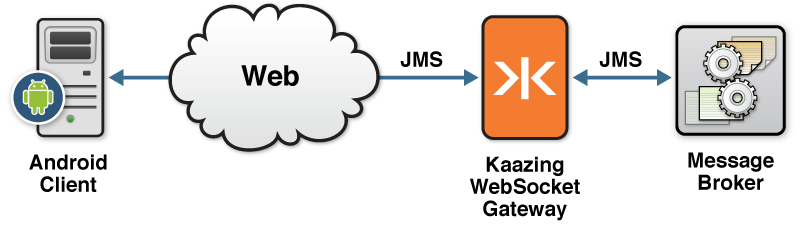
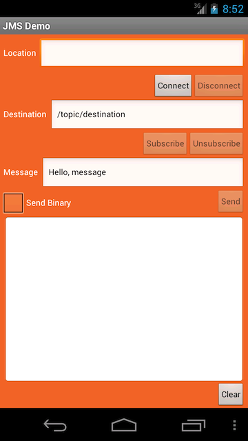

This checklist provides the steps necessary to enable your Android client to communicate with your JMS-compliant message broker using the [Android JMS Client API](http://developer.kaazing.com/documentation/jms/4.0/apidoc/client/android/jms/index.html) available in KAAZING Gateway - Enterprise Edition:

| \# | Step                                                                                                                                                                            | Topic or Reference                                                                                                    |
|:---|:--------------------------------------------------------------------------------------------------------------------------------------------------------------------------------|:----------------------------------------------------------------------------------------------------------------------|
| 1  | Learn to use the KAAZING Gateway Android JMS Client API and the supported methods. This topic also includes a walkthrough to show you how to build a simple Android JMS client. | [Use the KAAZING Gateway Android JMS Client API](#use-the-kaazing-gateway-android-jms-client-api)                     |
| 2  | Learn how to authenticate your client by implementing a challenge handler to respond to authentication challenges from the Gateway.                                             | [Secure Your Java and Android Clients](#secure-your-android-and-java-clients)                                         |
| 3  | Learn how to gather data on your KAAZING Gateway Android JMS client.                                                                                                            | [Display Logs for the Android JMS Client](#display-logs-for-the-android-jms-client)                                   |
| 4  | Migrate your KAAZING Gateway 4.x Android or Java JMS client to KAAZING Gateway 5.0.x.                                                                                           | [Migrate Android and Java Clients to KAAZING Gateway 5.0.x](#migrate-android-and-java-clients-to-kaazing-gateway-50x) |


**Notes:**

-   For information about the Android JMS Client API classes and methods, see the [Android JMS Client API](http://developer.kaazing.com/documentation/jms/4.0/apidoc/client/android/jms/index.html).
-   Java Developer Kit (JDK) or Java Runtime Environment (JRE) 1.6 and above are required.

This document contains the following sections:

-   [Introduction](#introduction)
-   [Overview of the KAAZING Gateway Android JMS Client API](#overview-of-the-kaazing-gateway-android-jms-client-api)
-   [About the KAAZING Gateway Android JMS Client API](#about-the-kaazing-gateway-android-jms-client-api)
-   [About Android](#about-android)
-   [Take a Look at the KAAZING Gateway Android Client Demo](#take-a-look-at-the-kaazing-gateway-android-client-demo)

Introduction
---------------------------------------

In this how-to, you will learn how to use the KAAZING Gateway Android JMS Client API available in KAAZING Gateway - Enterprise Edition to enable your web application to communicate with your JMS-compliant message broker, such as TIBCO Enterprise Message Service (EMS), Informatica UM, Apache ActiveMQ, and JBoss, using Android.

This document contains information for an Android developer who wants to enable communication with their JMS-compliant message broker through the Gateway.

Overview of the KAAZING Gateway Android JMS Client API
----------------------------------------------------------------------------------

KAAZING Gateway includes an Android JMS Client API that allows Android clients to subscribe from and publish messages to their JMS-compliant message broker. With the Android JMS Client API and the Gateway, you can leverage WebSocket in your Android client. Communication between your Android client and the JMS-compliant message broker is performed over WebSocket, as shown in the following figure:



**Figure: Enable Communication Between Your Client and the JMS-compliant message broker**

About the KAAZING Gateway Android JMS Client API
-------------------------------------------------------------------------

KAAZING Gateway includes an Android JMS Client API to enable you to create JMS-based clients specifically for your Android devices. As an Android developer, you can use this API to publish and subscribe to JMS-based messages between your client and your JMS-compliant message broker.

The Android JMS Client API exposes capabilities similar to the Java Message Service (JMS) API in Java, including the JMS concepts of connection, session, destination, message consumer, and message producer. Refer to the JMS API documentation, located at <http://www.oracle.com/technetwork/java/docs-136352.html>, for specific information about how to use each of the interfaces.

For a description of the methods currently supported by the KAAZING Gateway JMS Client APIs, see [KAAZING Gateway JMS Client API: Supported APIs](../about/kaazing-jms-api.md).

**Note:** Java Naming and Directory Interface (JNDI) is a Java API for a directory service. The KAAZING Gateway Android JMS Client API does not support JNDI. JNDI is supported in the Java JMS Client API. For more information, see [Checklist: How to Build Java Clients Using KAAZING Gateway](o_dev_java.md).

About Android
-----------------------------------

Android is an operating system used by touchscreen smart phones and tablets. Android clients are developed in the Java programming language using the Android software development kit (SDK). The SDK includes development tools, software libraries, and an Android device emulator.

The officially supported integrated development environment (IDE) for Android development by Google is Eclipse using the Android Development Tools (ADT) plugin. To develop Android clients, download the [ADT Bundle](http://developer.android.com/sdk/index.html) that includes both Eclipse and the ADT plugin.


Take a Look at the KAAZING Gateway Android Client Demo
------------------------------------------------------------------------------

There are two Android demos included in the Gateway bundle:

-   **JMS Messaging Demo** - This out of the box demo uses a JMS Client API to send and receive messages over WebSocket using JMS.
-   **JMS Stock Demo** - This out of the box demo shows stock ticker feeds served by the JMS-compliant message broker.

The files for both out of the box demos are located here: `GATEWAY_HOME/demo/android/`.

Before you start to build your Android client, look at a demonstration built using the Android JMS Client API: the Android demo is part of the full KAAZING Gateway bundle (**Gateway + Documentation + Demos**). To see this Android demo in action, perform the following steps:

1.  Download the Android ADT Bundle from [http://developer.android.com/sdk/index.html](http://developer.android.com/sdk/index.html). For information on using the Android SDK with an existing Eclipse IDE, see [http://developer.android.com/sdk/installing/index.html](http://developer.android.com/sdk/installing/index.html).
2.  To setup the ADT Bundle, see <http://developer.android.com/sdk/installing/bundle.html>.
3.  Launch Eclipse from the installed ADT Bundle.
4.  In Eclipse, click **Window**, and then click **Android SDK Manager**.
    1.  Select any package from **Android 2.3.3** or higher and then click **Install package**.

5.  In the Eclipse Package Explorer, right-click in an empty space and select **Import**.
6.  Expand the **Android** folder and click **Existing Android Code Into Workspace**, and then click **Next**.
7.  In **Import Projects**, for **Root Directory**, click **Browse**.
8.  Navigate to the Android Demo project files: `GATEWAY_HOME/demo/android/src/jms`
9.  Click **Open**.
10. In **Import Projects**, click **Select All** (to select the **JMSDemoActivity** project), select **Copy projects into workspace**, and then click **Finish**. The Android Demo is added to Eclipse.
11. Create a new Android Virtual Device in Eclipse. For information on creating an AVD, see [Managing AVDs with AVD Manager](http://developer.android.com/tools/devices/managing-avds.html).
12. Ensure Apache ActiveMQ is running.
13. Modify the `jms` service in the Gateway configuration file to accept connections containing your local IP address:
    1.  Open the Gateway configuration file located at `GATEWAY_HOME/conf/gateway-config.xml`.
    2.  Modify the `jms` service to accept connections containing your local IP address (replace `local-ip-address` with your IP address):

        ``` xml
        <service>
          <name>JMS</name>
          <description>JMS service to JMS server</description>

          <accept>ws://${gateway.hostname}:${gateway.extras.port}/jms</accept>
          <accept>ws://local-ip-address:${gateway.extras.port}/jms</accept>

          <type>jms</type>

          <properties>
            <connection.factory.name>ConnectionFactory</connection.factory.name>
            <context.lookup.topic.format>dynamicTopics/%s</context.lookup.topic.format>
            <context.lookup.queue.format>dynamicQueues/%s</context.lookup.queue.format>
            <env.java.naming.factory.initial>
              org.apache.activemq.jndi.ActiveMQInitialContextFactory
            </env.java.naming.factory.initial>
            <env.java.naming.provider.url>
              tcp://localhost:61616
            </env.java.naming.provider.url>
          </properties>

          <realm-name>demo</realm-name>

          <cross-site-constraint>
            <allow-origin>http://${gateway.hostname}:${gateway.extras.port}</allow-origin>
          </cross-site-constraint>
        </service>
        ```

14. Save the file, then restart the Gateway by following the steps in [Setting Up KAAZING Gateway](https://github.com/kaazing/gateway/blob/develop/doc/about/setup-guide.md).
15. In Eclipse, right-click the **JMSDemoActivity** project in **Package Explorer**, select **Run As**, and then click **Android Application**. The Android emulator launches.

    

    **Figure: Android JMS Client**

16. In the **Location** field, enter `ws://<Local IP Address>:8001/jms` using your local IP address. For example, `ws://192.168.0.103:8001/jms`.
17. Click **Connect**. The messages `CONNECTING` and then `CONNECTED` appear. The WebSocket connection to the Gateway and Apache ActiveMQ was successful.
18. Click **Subscribe**. The message `SUBSCRIBE - /topic/destination` appears. You have subscribed to the destination.
19. Click **Send**. The following messages appear:
     `RECEIVED TextMessage: Hello, message         SEND TextMessage: Hello, message`

    You sent the message `Hello, message` to the destination and received the same message because you are subscribed to that destination.

20. Click the **Send Binary** checkbox and click **Send** again. The following messages appear:
    ```
    SEND BytesMessage: Hello, message
    RECEIVED BytesMessage: 0,14,72,101,108,108,111,44,32,109,101,115,115,97,103,101
    ```
21. Click **Disconnect** to end the session.

See Also
--------

[Android JMS Client API](http://developer.kaazing.com/documentation/jms/4.0/apidoc/client/android/jms/index.html)


Use the KAAZING Gateway Android JMS Client API
===============================================

In this procedure, you will learn how to create an Android JMS client using the KAAZING Gateway [Android JMS Client
API](<http://developer.kaazing.com/documentation/jms/4.0/apidoc/client/android/jms/index.html>). You will learn how to create an Eclipse project and add the necessary Java
classes in order to use the Android JMS Client API. You will learn how to implement the Android JMS Client API methods to enable your client to send and receive messages to Apache ActiveMQ through the Gateway.

The [Android JMS Client API](<../apidoc/client/java/jms/index.md>) is nearly identical to the Java JMS Client API. You can review an overview of the Java JMS Client API connection, session, message producer, and message consumer code in [Use the KAAZING Gateway Java JMS Client Library](<p_dev_java_client_jms.md>). For information about using durable subscribers, see [Durable Subscribers](<https://github.com/kaazing/enterprise.java.client/blob/develop/jms/doc/p_dev_java_client_jms.md#durable-subscribers>).

**Note:** For this procedure, you can use any JMS-compliant message broker. By default, the Gateway is configured to `connect` to the server on
`tcp://localhost:61616`. You can configure the connect URL in the file `GATEWAY_HOME/conf/gateway-config.xml`. See [About Integrating KAAZING Gateway
and JMS-Compliant Message Brokers](<https://github.com/kaazing/enterprise.gateway/blob/develop/doc/integration-jms/o_jms_integrate.md>)
for more information.

Build the Android JMS Messaging Demo
------------------------------------

**Note:** The following procedure uses the Android Studio IDE. You can download Android Studio from
[https://developer.android.com/sdk/index.html](<https://developer.android.com/sdk/index.html>).

1.  Install the Gateway as described in [Setting Up KAAZING     Gateway](<https://github.com/kaazing/gateway/blob/develop/doc/about/setup-guide.md>).
    You need the Gateway installed to access the out of the box Android demo files.

2.  Download and install Android Studio from [https://developer.android.com/sdk/index.html](<https://developer.android.com/sdk/index.html>).
    For information on Android Studio, see [https://developer.android.com/tools/studio/index.html](<https://developer.android.com/tools/studio/index.html>).

3.  Launch Android Studio.

4.  Confirm that the Android SDK in installed.

    1.  In Android Studio, click **Tools**, click **Android**, and then click **Android SDK Manager**.

    2.  If **Android 2.3.3 (Gingerbread)** is not installed, select  **Android 2.3.3 (Gingerbread)** and then click **Apply**.

5.  Set up an Android project.

    1.  From the **File** menu, click **New** and then **New Project**.

    2.  In **Application Name**, name the project **JMSDemo**.

    3.  In **Company Domain**, enter **example.com**.

    4.  In **Package Name**, click **Edit**, and then enter  **com.kaazing.gateway.jms.client.demo** and then click **Next**.

    5.  On **Target Android Devices**, click **Phone and Tablet**, and in **Minimum SDK**, choose **API 10: Android 2.3.3 (Gingerbread)** and click **Next**.

    6.  On **Add an activity to Mobile** page, click **Blank Activity** and click **Next**.

    7.  On **Customize the Activity**, in **Activity Name**, enter `JMSDemoActivity`.

    8.  In **Layout Name** enter **main** and click **Finish**.

6.  Add the image asset for the app.

    1.  Click **File**, click **New**, then click **Image Asset**.

    2.  In **Asset Studio**, in the **Image file** field. click the browse button.

    3.  Navigate to the demo icon here: `GATEWAY_HOME/demo/android/src/jms/res/drawable-hdpi/icon.png`.

    4.  Click **Next** and then click **Finish**.

7.  Import the KAAZING Gateway Android and JMS API libraries.

    1.  Locate and copy the KAAZING Gateway Android and JMS libraries. The libraries are located in `GATEWAY_HOME/lib/client/android`. The libraries you need are **com.kaazing.gateway.client.android.jar** and **com.kaazing.gateway.jms.client.android.jar**.

    2.  In Android Studio, right-click the **libs** folder (under **app**), and click **Paste**.

    3.  Click **OK** in the the **Copy** dialog.

    4.  Locate and copy the JMS API library. The JMS API library is located in `GATEWAY_HOME/lib`. The library is named **geronimo-jms\_1.1\_spec-1.1.1.jar**. Paste the file into the **libs** folder.

    5.  Install the Android Support Library, **android-support-v4.jar**. The Android Support Library package is a set of code libraries that provide backward-compatible versions of Android framework APIs as well as features that are only available through the library APIs.

        1.  Navigate to the location of the file in the Android SDK and copy it: `/Users/johndoe/Library/Android/sdk/extras/android/support/v4/android-support-v4.jar`.

        2.  Paste the file into the **libs** folder.

8.  Create the Android client Touch User Interface (TUI). Next you will add the text strings and layout for the Android client TUI. When you are finished, the Android client will look like this:

    

    **Figure: Android JMS Client TUI**

9.  Open the **strings.xml** file located at `JMSDemo/app/src/main/res/values/strings.xml` and replace its contents with the following:

    ``` xml
    <?xml version="1.0" encoding="utf-8"?>
    <resources>
        <string name="app_name_short">JMS Demo</string>
        <string name="app_name">JMS Messaging Demo</string>
        <string name="location_label">Location</string>
        <string name="connectBtn_label">Connect</string>
        <string name="disconnectBtn_label">Disconnect</string>
        <string name="destination_label">Destination</string>
        <string name="destination_default">/topic/destination</string>
        <string name="location_default"></string>
        <string name="subscribe_label">Subscribe</string>
        <string name="unsubscribe_label">Unsubscribe</string>
        <string name="message_label">Message</string>
        <string name="message_default">Hello, message</string>
        <string name="send_label">Send</string>
        <string name="clear_label">Clear</string>
        <string name="username_hint">Username</string>
        <string name="password_hint">Password</string>
        <string name="ok_label">OK</string>
        <string name="cancel_label">Cancel</string>
        <string name="sendBinary_label">Send Binary</string>
    </resources>
    ```

    You can see all of the buttons and values that will be displayed in the TUI. While the `location_default` field is empty here, you will enter the location into the Android client when you test it.

10. Open the **main.xml** file located at `JMSDemo/app/src/res/layout/main.xml` (click the **Text** tab to see the code) and replace its contents with the following:

    ```
    <?xml version="1.0" encoding="utf-8"?>
    <RelativeLayout xmlns:android="http://schemas.android.com/apk/res/android"
        android:id="@+id/RelativeLayout1"
        android:layout_width="fill_parent"
        android:layout_height="fill_parent"
        android:background="#F27A31">

        <LinearLayout
            android:id="@+id/linearLayout1"
            android:layout_width="match_parent"
            android:layout_height="wrap_content"
            android:layout_alignParentTop="true"
            android:layout_centerHorizontal="true"
            android:layout_margin="5dp" >

            <TextView
                android:id="@+id/textView1"
                android:layout_width="wrap_content"
                android:layout_height="wrap_content"
                android:text="@string/location_label"
                android:textAppearance="?android:attr/textAppearanceMedium"
                android:textSize="@dimen/edit_text_size" />

            <EditText
                android:id="@+id/locationText"
                android:layout_width="0dp"
                android:layout_height="wrap_content"
                android:layout_marginLeft="5dp"
                android:layout_weight="1"
                android:ems="10"
                android:text="@string/location_default"
                android:textSize="@dimen/edit_text_size" >
                <requestFocus />
            </EditText>

        </LinearLayout>

        <Button
            android:id="@+id/disconnectBtn"
            style="?android:attr/buttonStyleSmall"
            android:layout_width="wrap_content"
            android:layout_height="wrap_content"
            android:layout_alignParentRight="true"
            android:layout_below="@+id/linearLayout1"
            android:layout_marginRight="5dp"
            android:enabled="false"
            android:text="@string/disconnectBtn_label"
            android:textSize="@dimen/edit_text_size" />

        <Button
            android:id="@+id/connectBtn"
            style="?android:attr/buttonStyleSmall"
            android:layout_width="wrap_content"
            android:layout_height="wrap_content"
            android:layout_alignBaseline="@+id/disconnectBtn"
            android:layout_alignBottom="@+id/disconnectBtn"
            android:layout_toLeftOf="@+id/disconnectBtn"
            android:text="@string/connectBtn_label"
            android:textSize="@dimen/edit_text_size" />

        <LinearLayout
            android:id="@+id/linearLayout2"
            android:layout_width="match_parent"
            android:layout_height="wrap_content"
            android:layout_alignParentLeft="true"
            android:layout_below="@+id/connectBtn"
            android:layout_marginLeft="5dp"
            android:layout_marginRight="5dp" >

            <TextView
                android:id="@+id/textView2"
                android:layout_width="wrap_content"
                android:layout_height="wrap_content"
                android:text="@string/destination_label"
                android:textAppearance="?android:attr/textAppearanceMedium"
                android:textSize="@dimen/edit_text_size" />

            <EditText
                android:id="@+id/destinationText"
                android:layout_width="0dp"
                android:layout_height="wrap_content"
                android:layout_marginLeft="5dp"
                android:layout_weight="1"
                android:ems="10"
                android:text="@string/destination_default"
                android:textSize="@dimen/edit_text_size" >
            </EditText>
        </LinearLayout>

        <Button
            android:id="@+id/subscribeBtn"
            style="?android:attr/buttonStyleSmall"
            android:layout_width="wrap_content"
            android:layout_height="wrap_content"
            android:layout_alignBaseline="@+id/unsubscribeBtn"
            android:layout_alignBottom="@+id/unsubscribeBtn"
            android:layout_below="@+id/linearLayout2"
            android:layout_toLeftOf="@+id/unsubscribeBtn"
            android:enabled="false"
            android:text="@string/subscribe_label"
            android:textSize="@dimen/edit_text_size" />
        <Button
            android:id="@+id/unsubscribeBtn"
            style="?android:attr/buttonStyleSmall"
            android:layout_width="wrap_content"
            android:layout_height="wrap_content"
            android:layout_alignParentRight="true"
            android:layout_below="@+id/linearLayout2"
            android:layout_marginRight="5dp"
            android:enabled="false"
            android:text="@string/unsubscribe_label"
            android:textSize="@dimen/edit_text_size" />

        <LinearLayout
            android:id="@+id/linearLayout3"
            android:layout_width="match_parent"
            android:layout_height="wrap_content"
            android:layout_alignParentLeft="true"
            android:layout_below="@+id/subscribeBtn"
            android:layout_marginLeft="5dp"
            android:layout_marginRight="5dp" >

            <TextView
                android:id="@+id/textView3"
                android:layout_width="wrap_content"
                android:layout_height="wrap_content"
                android:text="@string/message_label"
                android:textAppearance="?android:attr/textAppearanceMedium"
                android:textSize="@dimen/edit_text_size" />

            <EditText
                android:id="@+id/messageText"
                android:layout_width="0dp"
                android:layout_height="wrap_content"
                android:layout_marginLeft="5dp"
                android:layout_weight="1"
                android:ems="10"
                android:text="@string/message_default"
                android:textSize="@dimen/edit_text_size" >
            </EditText>
        </LinearLayout>

        <Button
            android:id="@+id/sendBtn"
            style="?android:attr/buttonStyleSmall"
            android:layout_width="wrap_content"
            android:layout_height="wrap_content"
            android:layout_alignParentRight="true"
            android:layout_below="@+id/linearLayout3"
            android:layout_marginRight="5dp"
            android:enabled="false"
            android:text="@string/send_label"
            android:textSize="@dimen/edit_text_size" />

        <CheckBox
            android:id="@+id/sendBinaryCheckBox"
            android:layout_width="wrap_content"
            android:layout_height="wrap_content"
            android:layout_alignBottom="@+id/sendBtn"
            android:layout_alignParentLeft="true"
            android:layout_below="@id/linearLayout3"
            android:text="@string/sendBinary_label"
            android:textSize="@dimen/edit_text_size" />

        <LinearLayout
            android:id="@+id/logContainer"
            android:layout_width="match_parent"
            android:layout_height="fill_parent"
            android:orientation="vertical"
            android:layout_below="@+id/sendBtn">

            <TextView
                android:id="@+id/logView"
                android:layout_width="fill_parent"
                android:layout_height="0dp"
                android:layout_marginLeft="5dp"
                android:layout_marginRight="5dp"
                android:layout_weight="1"
                android:background="@android:drawable/editbox_background"
                android:scrollbars="horizontal|vertical"
                android:textColor="#000000"
                android:maxLines="80"
                android:textSize="@dimen/edit_text_size" />

            <Button
                android:id="@+id/clearBtn"
                style="?android:attr/buttonStyleSmall"
                android:layout_width="wrap_content"
                android:layout_height="wrap_content"
                android:layout_gravity="right"
                android:layout_marginRight="5dp"
                android:text="@string/clear_label"
                android:textSize="@dimen/edit_text_size" />

        </LinearLayout>
    </RelativeLayout>
    ```

11. Add a dispatch queue class to the Android client. A dispatch queue class is used to run tasks in a separate thread from the main thread (to run some tasks asynchronously). The dispatch queue class is used to add [Runnable](<http://docs.oracle.com/javase/7/docs/api/java/lang/Runnable.html>) in a queue. Runnable will be run in a first-in first-out basis. All of the
    blocking calls of the Android client will be run in a background thread so that the TUI is not blocked and can remain responsive.

    1.  Right-click the folder **com.kaazing.gateway.client.demo** (under `JMSDemo/app/src/main/java`), click **New**, and click **Java Class**.

    2.  In **Name** enter **DispatchQueue** and click **OK**. The new **DispatchQueue.java** class is added to the **com.kaazing.gateway.client.demo** folder.

    3.  Double-click **DispatchQueue.java**.

    4.  Replace the contents with the following code:

        ```
        package com.kaazing.gateway.jms.client.demo;

        import android.os.Handler;
        import android.os.HandlerThread;

        // The class is used to add Runnable in a queue and the runnable added to the queue
        // will be run in a first in first out basis. This class is useful to run
        // a series of tasks sequentially in a separate thread from the main thread.
        public class DispatchQueue extends HandlerThread {

          private Handler handler;

          public DispatchQueue(String name) {
            super(name);
          }

          // The message blocks until the thread is started. This should be called
          // after call to start() to ensure the thread is ready.
          public void waitUntilReady() {
            handler = new Handler(getLooper());
          }

          // Adds the Runnable to the message queue which will be run on the thread.
          // The runnable will be run in a first in first out basis.
          public void dispatchAsync(Runnable task) {
            handler.post(task);
          }

          public void removePendingJobs() {
            handler.removeCallbacksAndMessages(null);
          }

        }
        ```

12. Modify the main class for the Android client. In the **src** folder for the project, under **com.kaazing.gateway.jms.client.demo**, double-click **JMSDemoActivity.java**. You will add the main Java code for the Android client in this file.

13. Delete all of the contents except the `com.kaazing.gateway.jms.client.demo` package declaration and the `JMSDemoActivity` class declaration:

    ```
    package com.kaazing.gateway.jms.client.demo;

      // Import statements will go here

      public class JMSDemoActivity extends FragmentActivity {

        // the remaining code will go here

    }
    ```

14. Add the import statements for the common Java and Android classes. Add the statements directly after the package `com.kaazing.gateway.jms.client.demo` package declaration:

    ```
    // General classes used for the program
    import java.net.PasswordAuthentication;
    import java.net.URI;
    import java.util.ArrayDeque;
    import java.util.Enumeration;
    import java.util.HashMap;
    import java.util.concurrent.Semaphore;
    import java.util.logging.Level;
    import java.util.logging.Logger;

    // These classes are used for JMS connections and messages
    import javax.jms.BytesMessage;
    import javax.jms.Connection;
    import javax.jms.Destination;
    import javax.jms.ExceptionListener;
    import javax.jms.JMSException;
    import javax.jms.MapMessage;
    import javax.jms.Message;
    import javax.jms.MessageConsumer;
    import javax.jms.MessageListener;
    import javax.jms.MessageProducer;
    import javax.jms.Session;
    import javax.jms.TextMessage;

    // These classes are used for the TUI
    import android.os.Bundle;
    import android.support.v4.app.FragmentActivity;
    import android.text.method.ScrollingMovementMethod;
    import android.util.Log;
    import android.view.View;
    import android.view.View.OnClickListener;
    import android.widget.Button;
    import android.widget.CheckBox;
    import android.widget.EditText;
    import android.widget.TextView;
    ```

15. Add the import statements for the KAAZING Gateway Android JMS Client API classes.

    ```
    // Include these statements with any client
    import com.kaazing.net.ws.WebSocketFactory; // WebSocket
    import com.kaazing.gateway.jms.client.JmsConnectionFactory; // JMS
    import com.kaazing.gateway.jms.client.ConnectionDisconnectedException; // Exceptions
    import com.kaazing.gateway.jms.client.util.Tracer; // Logging
    import com.kaazing.net.http.HttpRedirectPolicy; // Sets HTTP redirect policy

    // Include these statements when a client must authenticate with the Gateway
    import com.kaazing.net.auth.BasicChallengeHandler;
    import com.kaazing.net.auth.ChallengeHandler;
    import com.kaazing.net.auth.LoginHandler;
    ```

16. After you add the import statements, sync your project with its Gradle files to ensure that the libraries are in sync with your project.


1.  Add the variables for the program directly after the `JMSDemoActivity` class declaration.

    ```
    public class JMSDemoActivity extends FragmentActivity {

      // Log API for send output to the log
      private static String TAG = "com.kaazing.gateway.jms.client.android.demo";

      // Button variables
      private Button connectBtn;
      private Button disconnectBtn;
      private Button subscribeBtn;
      private Button unsubscribeBtn;
      private Button sendBtn;
      private Button clearBtn;
      private CheckBox sendBinaryCheckBox;

      // Text variables
      private EditText locationText;
      private EditText destinationText;
      private EditText messageText;
      private TextView logTextView;

      // Connection variables
      private JmsConnectionFactory connectionFactory;
      private Connection connection;
      private Session session;

      // Dispatch queue
      private DispatchQueue dispatchQueue;

      // Hash map holds active consumer instances created with destination string as a key
      private HashMap<String, ArrayDeque<MessageConsumer>> consumers = new HashMap<String,
        ArrayDeque<MessageConsumer>>();
    ```

    The hash map uses an [array deque](<http://docs.oracle.com/javase/7/docs/api/java/util/ArrayDeque.html>) for the MessageConsumer object. Array deques hold multiple elements prior to processing (deques) and have no capacity restrictions; they grow as necessary to support usage.

2.  Add the `onCreate()` method with event listeners.

    The `onCreate()` method is called when the activity is first created. This is a long method that includes event listeners for user actions in the TUI. The method also contains the `JmsConnectionFactory()` API call. The `JmsConnectionFactory()` is the JMS client implementation of ConnectionFactory. `JmsConnectionFactory()` is used to create a connection with a JMS provider via a WebSocket connection. `JmsConnectionFactory()` provides the ability to set the Gateway location dynamically.

    ```
    @Override
    public void onCreate(Bundle savedInstanceState) {

      super.onCreate(savedInstanceState);
      Log.i(TAG, "onCreate");
      setContentView(R.layout.main);

      // Create variables for the TUI elements
      connectBtn      = (Button)findViewById(R.id.connectBtn);
      disconnectBtn   = (Button)findViewById(R.id.disconnectBtn);
      subscribeBtn    = (Button)findViewById(R.id.subscribeBtn);
      unsubscribeBtn  = (Button)findViewById(R.id.unsubscribeBtn);
      sendBtn         = (Button)findViewById(R.id.sendBtn);
      clearBtn        = (Button)findViewById(R.id.clearBtn);
      sendBinaryCheckBox = (CheckBox)findViewById(R.id.sendBinaryCheckBox);

      locationText    = (EditText)findViewById(R.id.locationText);
      destinationText = (EditText)findViewById(R.id.destinationText);
      messageText = (EditText)findViewById(R.id.messageText);

      logTextView     = (TextView)findViewById(R.id.logView);
      logTextView.setMovementMethod(new ScrollingMovementMethod());

      // Create the JMS connection factory and the underlying WebSocket factory
      // to create and establish WebSocket connection to send and receive
      // JMS data over a WebSocket connection.
      if (connectionFactory == null) {
        try {
          connectionFactory = JmsConnectionFactory.createConnectionFactory();
          WebSocketFactory webSocketFactory = connectionFactory.getWebSocketFactory();

          // setDefaultFollowRedirect() sets the default HttpRedirectPolicy that is
          // inherited by all the WebSockets created using this factory instance.
          webSocketFactory.setDefaultFollowRedirect(HttpRedirectPolicy.SAME_DOMAIN);
        } catch (JMSException e) {
          e.printStackTrace();
          logMessage("EXCEPTION: " + e.getMessage());
        }
      }

      // Run when Connect button is clicked
      connectBtn.setOnClickListener(new OnClickListener() {           
        public void onClick(View v) {
          connectBtn.setEnabled(false);
          dispatchQueue = new DispatchQueue("DispatchQueue");
          dispatchQueue.start();
          dispatchQueue.waitUntilReady();

          // Call the connect() method defined later in this code
          connect();
        }            
      });

      // Run when Disconnect button is clicked
      disconnectBtn.setOnClickListener(new OnClickListener() {            
        public void onClick(View v) {
          // Call the disconnect() method defined later in this code
          disconnect();
        }
      });

      // Run when Subscribe button is clicked
      subscribeBtn.setOnClickListener(new OnClickListener() {
        public void onClick(View v) {
          // Get the destination name entered by the user
          final String destinationName = destinationText.getText().toString();
          logMessage("SUBSCRIBE - " + destinationName);
          dispatchQueue.dispatchAsync(new Runnable() {
            public void run() {
              try {
                Destination destination = getDestination(destinationName);
                if (destination == null) {
                  return;
                }

                // Create a consumer using the destination
                MessageConsumer consumer = session.createConsumer(destination);

                // Create an array deque mapping consumers to the destination
                ArrayDeque<MessageConsumer> consumersToDestination =
                  consumers.get(destinationName);
                  // If there is no consumers to destination map, add this new map
                  if (consumersToDestination == null) {
                    consumersToDestination = new ArrayDeque<MessageConsumer>();
                      consumers.put(destinationName, consumersToDestination);
                    }
                    // If there is a map, update it with the new consumer
                    consumersToDestination.add(consumer);
                    // Set a message listener in the DestinationMessageListener() method
                    consumer.setMessageListener(new DestinationMessageListener());
              } catch (JMSException e) {
                e.printStackTrace();
                logMessage("EXCEPTION: " + e.getMessage());
              }
            }
          });
        }
      });

      // Run when Unsubscribe button is clicked
      unsubscribeBtn.setOnClickListener(new OnClickListener() {        
        public void onClick(View v) {
          // Clear the queue created in subscribeBtn.setOnClickListener()
          String destinationName = destinationText.getText().toString();
          logMessage("UNSUBSCRIBE - " + destinationName);
          ArrayDeque<MessageConsumer> consumersToDestination = consumers.get(destinationName);
          if (consumersToDestination == null) {
            return;
          }
          // Make MessageConsumer equal to the first element in the array deque
          final MessageConsumer consumer = consumersToDestination.poll();
          if (consumer == null) {
            return;
          }
          dispatchQueue.dispatchAsync(new Runnable() {
            public void run() {
              try {
                // Close the consumer
                consumer.close();
              } catch (JMSException e) {
                e.printStackTrace();
                logMessage(e.getMessage());
              }
            }
          });
        }
      });

      // Run when Send button is clicked
      sendBtn.setOnClickListener(new OnClickListener() {
        public void onClick(View v) {
          // Get the message text
          final boolean sendBinary = sendBinaryCheckBox.isChecked();
          final String message = messageText.getText().toString();
          logMessage("SEND: " + message);
          dispatchQueue.dispatchAsync(new Runnable() {            
            public void run() {
              try {
                // Get the destination for the message
                String destinationName = destinationText.getText().toString();
                // Create a MessageProducer to send messages to the destination
                MessageProducer producer =
                  session.createProducer(getDestination(destinationName));
                // Add the message
                Message message;
                // Determine if the message is binary or text
                if (sendBinary) {
                  BytesMessage bytesMessage = session.createBytesMessage();
                  bytesMessage.writeUTF(text);
                  message = bytesMessage;
                }
                else {
                  message = session.createTextMessage(text);
                }

                // Send the message
                producer.send(message);
                // Close the producer
                producer.close();
              } catch (JMSException e) {
                e.printStackTrace();
                logMessage(e.getMessage());
              }
            }
          });
        }
      });

      // Run when Clear button is clicked
      clearBtn.setOnClickListener(new OnClickListener() {        
        public void onClick(View v) {
          // Clear the log
          logTextView.setText("");
        }
      });
    }
    ```

3.  Add the `connect()` and `disconnect()` methods for connecting to the Gateway and updating the TUI.

    ```
    private void connect() {
      logMessage("CONNECTING");

      // Since createConnection() is a blocking method that does not return until
      // the connection is established or fails, it is a good practice to
      // establish the connection on a separate thread and prevent the TUI from being blocked.
      dispatchQueue.dispatchAsync(new Runnable() {
        public void run() {
          try {
            // Get the location entered by the user
            String location = locationText.getText().toString();
            // Set the target Gateway location
            connectionFactory.setGatewayLocation(URI.create(location));
            // Create the connection to the Gateway
            connection = connectionFactory.createConnection();
            // Connect to the Gateway
            connection.start();

            // Create a Session object and set the client to
            // acknowledge any messages it receives automatically
            session = connection.createSession(false, Session.AUTO_ACKNOWLEDGE);
            logMessage("CONNECTED");
            // Set an exception listener for the client
            connection.setExceptionListener(new ConnectionExceptionListener());    
            // Update the TUI
            updateButtonsForConnected();
          } catch (Exception e) {
            updateButtonsForDisconnected();
            e.printStackTrace();
            logMessage("EXCEPTION: " + e.getMessage());
          }
        }
      });    
    }

    private void disconnect() {
      logMessage("DISCONNECTING");

      // Clear the queue of any pending messages
      dispatchQueue.removePendingJobs();
      dispatchQueue.quit();
      new Thread(new Runnable() {
        public void run() {
          try {
            // Close the connection
            connection.close();
            logMessage("DISCONNECTED");
          } catch (JMSException e) {
            e.printStackTrace();
            logMessage("EXCEPTION: " + e.getMessage());
          }
          finally {
            connection = null;
            // Update the TUI with the connection status
            updateButtonsForDisconnected();
          }
        }
      }).start();
    }
    ```

    For more information on sessions and exception listeners, see the Java [Connection interface](<http://docs.oracle.com/javaee/7/api/javax/jms/Connection.html>).

4.  Add the `getDestination()` method for creating topics and queues.

    ```
    private Destination getDestination(String destinationName) throws JMSException {
      Destination destination;
      // Create the topic using the destination name entered by the user
      if (destinationName.startsWith("/topic/")) {
        destination = session.createTopic(destinationName);
      }
      // Create the queue using the destination name entered by the user
      else if (destinationName.startsWith("/queue/")) {
        destination = session.createQueue(destinationName);
      }
      else {
        logMessage("Invalid destination name: " + destinationName);
        return null;
      }
      return destination;
    }
    ```

    **Notes:**

    -   When setting up your message consumers and producers, you must use the format `"/topic/"` for regular topics.

    -   The KAAZING Gateway Java JMS Client API supports the [Java Naming and Directory Interface (JNDI)](<http://docs.oracle.com/cd/E19182-01/820-7853/6nj374las/index.html>),
        but the KAAZING Gateway Android JMS Client API does not.

5.  Add the `ConnectionExceptionListener` class to handle when a JMS provider detects a serious problem with a connection object.

    ```
    private class ConnectionExceptionListener implements ExceptionListener {

      public void onException(final JMSException exception) {
        logMessage(exception.getMessage());
        if (exception instanceof ConnectionDisconnectedException) {
          updateButtonsForDisconnected();
        }
      }
    }
    ```

    For more information, see the Java [ExceptionListener](<http://docs.oracle.com/javaee/7/api/javax/jms/ExceptionListener.html>) interface.

6.  Add the `DestinationMessageListener` class and `onMessage()` method to manage messages. For more information, see the Java [MessageListener](<http://docs.oracle.com/javaee/7/api/javax/jms/MessageListener.html>) interface.

    ```
    private class DestinationMessageListener implements MessageListener {

      // Run when a message is received
      public void onMessage(Message message) {
        // This try block is used to handle both text and binary messages
        try {
          if (message instanceof TextMessage) {
            logMessage("RECEIVED TextMessage: " + ((TextMessage)message).getText());
          }
          else if (message instanceof BytesMessage) {
            BytesMessage bytesMessage = (BytesMessage)message;
            long len = bytesMessage.getBodyLength();
            byte b[] = new byte[(int)len];
            // Read a portion of the bytes message stream equal to its length
            bytesMessage.readBytes(b);
            // Send the bytes to the hexDump() method and display the string returned
            logMessage("RECEIVED BytesMessage: " + hexDump(b));
          }

          // This condition provides support for the Java MapMessage interface.
          // This client receives MapMessage messages, but it does not send them.
          // Review the Android JMS API for information on reading MapMessage messages.
          else if (message instanceof MapMessage) {
            MapMessage mapMessage = (MapMessage)message;
            Enumeration mapNames = mapMessage.getMapNames();
            while (mapNames.hasMoreElements()) {
              String key = (String)mapNames.nextElement();
              Object value = mapMessage.getObject(key);

              if (value == null) {
                logMessage(key + ": null");
              } else if (value instanceof byte[]) {
                byte[] arr = (byte[])value;
                StringBuilder s = new StringBuilder();
                s.append("[");
                for (int i = 0; i < arr.length; i++) {
                  if (i > 0) {
                    s.append(",");
                  }
                  s.append(arr[i]);
                }
                s.append("]");
                logMessage(key + ": "+ s.toString() + " (Byte[])");
              } else {
                logMessage(key + ": " + value.toString() +
                  " (" + value.getClass().getSimpleName() + ")");
              }
            }
            logMessage("RECEIVED MapMessage: ");
          }
          else {
            logMessage("UNKNOWN MESSAGE TYPE: "+message.getClass().getSimpleName());
          }
        }
        catch (Exception ex) {
          ex.printStackTrace();
          logMessage("EXCEPTION: " + ex.getMessage());
        }
      }

      // Return a string representation of the bytes received
      private String hexDump(byte[] b) {
        if (b.length == 0) {
          return "empty";
        }
        StringBuilder out = new StringBuilder();
        for (int i=0; i < b.length; i++) {
          out.append(Integer.toHexString(b[i])).append(' ');
        }
        return out.toString();
      }
    }
    ```

    For more information on byte streams, see the Java [BytesMessage](<http://docs.oracle.com/javaee/7/api/javax/jms/BytesMessage.html>) interface. For more information on MapMessage, see the Java [MapMessage](<http://docs.oracle.com/javaee/7/api/javax/jms/MapMessage.html>) interface.

7.  Add the methods for when the client is paused, resumes, and when the client is closed.

    ```
    // Run when the client is paused
    public void onPause() {
      if (connection != null) {
        // Stop the connection in a separate thread
        dispatchQueue.dispatchAsync(new Runnable() {    
          @Override
          public void run() {
            try {
              connection.stop();
            } catch (JMSException e) {
              e.printStackTrace();
            }
          }
        });
      }
      super.onPause();
    }

    // Restart the connection when the client resumes activity
    public void onResume() {
      if (connection != null) {
        dispatchQueue.dispatchAsync(new Runnable() {    
          @Override
          public void run() {
            try {
              connection.start();
            } catch (JMSException e) {
              e.printStackTrace();
            }
          }
        });
      }
      super.onResume();
      }

    // Disconnect with the client is shutdown
    public void onDestroy() {
      if (connection != null) {
        disconnect();
      }
      super.onDestroy();
    }
    ```

8.  Add the methods for updating the **Connect** and **Disconnect** buttons according to the state of the WebSocket connection.

    ```
    // Run when the client is connected
    private void updateButtonsForConnected() {
      runOnUiThread(new Runnable() {
        public void run() {
          connectBtn.setEnabled(false);
          disconnectBtn.setEnabled(true);
          subscribeBtn.setEnabled(true);
          unsubscribeBtn.setEnabled(true);
          sendBtn.setEnabled(true);
        }
      });
    }

    // Run when the client is disconnected    
    private void updateButtonsForDisconnected() {
      runOnUiThread(new Runnable() {
        public void run() {
          connectBtn.setEnabled(true);
          disconnectBtn.setEnabled(false);
          subscribeBtn.setEnabled(false);
          sendBtn.setEnabled(false);
          unsubscribeBtn.setEnabled(false);
        }
      });
    }
    ```

9.  Add the `logMessage()` method for the **Log** area displayed in the client. This method keeps the log to a 100 line maximum.

    ```
    private void logMessage(final String message) {
      runOnUiThread(new Runnable() {
        public void run() {
          // Clear log after 100 messages
          if (logTextView.getLineCount() > 100) {
            logTextView.setText(message);
          }
          else {
            logTextView.setText(message + "\n" + logTextView.getText());
          }
        }
      });
    }
    ```

10. Update the `jms` service on the Gateway configuration file to accept on your local IP address.

    1.  Open the Gateway configuration file located at `GATEWAY_HOME/conf/gateway-config.xml`.

    2.  Modify the `jms` service to accept connections containing your local IP address (replace `local-ip-address` with your IP address):

        ``` xml
        <service>
          <name>JMS</name>
          <description>JMS service to JMS server</description>

          <accept>ws://${gateway.hostname}:${gateway.extras.port}/jms</accept>
          <accept>ws://local-ip-address:${gateway.extras.port}/jms</accept>
          <type>jms</type>

          <properties>
            <connection.factory.name>ConnectionFactory</connection.factory.name>
            <context.lookup.topic.format>dynamicTopics/%s</context.lookup.topic.format>
            <context.lookup.queue.format>dynamicQueues/%s</context.lookup.queue.format>
            <env.java.naming.factory.initial>
              org.apache.activemq.jndi.ActiveMQInitialContextFactory
            </env.java.naming.factory.initial>
            <env.java.naming.provider.url>
              tcp://localhost:61616
            </env.java.naming.provider.url>
          </properties>

          <realm-name>demo</realm-name>

          <cross-site-constraint>
            <allow-origin>http://${gateway.hostname}:${gateway.extras.port}</allow-origin>
          </cross-site-constraint>
        </service>
        ```

    3.  Save the file, then restart the Gateway by following the steps in [Setting Up KAAZING Gateway](<https://github.com/kaazing/gateway/blob/develop/doc/about/setup-guide.md>).

11. Run the Android client in the Android Emulator. In **Eclipse**, right-click the **JMSDemo** project in Package Explorer, select **Run As**, and then click **Android Application**. The Android emulator launches.

    

    **Figure: Android JMS Client in the Android Emulator**

12. Test the Android client in the Android Emulator.

    1.  In the **Location** field, enter `ws://local-ip-address:8001/jms` using your local IP address. For example, `ws://192.168.0.103:8001/jms`.

    2.  Click **Connect**. The messages `CONNECTING` and then `CONNECTED` appear. The WebSocket connection to the Gateway and Apache ActiveMQ was successful.

    3.  Click **Subscribe**. The message `SUBSCRIBE - /topic/destination` appears. You have subscribed to the destination.

    4.  Click **Send**. The following messages appear: `RECEIVED TextMessage: Hello, message SEND: Hello, message`

        You sent a message `Hello, message` to the destination and received the same message because you are subscribed to that destination.

    5.  Click the **Send Binary** checkbox and click **Send** again. The following messages appear:

    `SEND BytesMessage: Hello, message  

    RECEIVED BytesMessage: 0,14,72,101,108,108,111,44,32,109,101,115,115,97,103,101`

    6.  Click **Disconnect** to end the session.

### Test Your Android Client Using Genymotion

Genymotion is a fast and easy-to-use Android emulator to run and test your
Android apps.

1.  Download and install [Genymotion](<https://www.genymotion.com/#!/download>) and then add the [Genymotion plugin for Eclipse](<https://www.genymotion.com/#!/developers/user-guide#genymotion-plugin-for-eclipse>).

2.  In Eclipse, click the Genymotion icon, to open the Genymotion preferences.

3.  Enter the location of the Genymotion app, and click **OK**.

4.  Click the Genymotion icon to open the **Genymotion Virtual Devices Manager**.

5.  In **Genymotion Virtual Devices Manager**, click **New**.

6.  Sign into Genymotion with your Genymotion account.

7.  For a virtual device, select a minimum of API 10.

8.  In the **Genymotion Virtual Devices Manager**, click **Refresh**.

9.  Select the virtual device you want to use and click **Start**.

10. Right-click on your application project and select **Run as Android application**. The application opens in Genymotion.

11. Test the application using the testing steps listed in the previous procedure.

Secure Your Android and Java Clients
====================================

**Note:** To use the Gateway, a KAAZING client library, or a KAAZING demo, fork the repository from [kaazing.org](http://kaazing.org).

This topic provides information on how to add user authentication functionality to Java and Android clients. The Java and Android Client APIs use the same authentication classes and methods.

A challenge handler is a constructor used in an application to respond to authentication challenges from the Gateway when the application attempts to access a protected resource. Each of the resources protected by the Gateway is configured with a different authentication scheme (for example, Basic, Application Basic, or Application Token), and your application requires a challenge handler for each of the schemes that it will encounter or a single challenge handler that will respond to all challenges. Also, you can add a dispatch challenge handler to route challenges to specific challenge handlers according to the URI of the requested resource.

For information about each authentication scheme type, see [Configure the HTTP Challenge Scheme](https://github.com/kaazing/gateway/blob/develop/doc/security/p_authentication_config_http_challenge_scheme.md).

Before you add security to your clients, follow the steps in [Secure Network Traffic with the Gateway](../security/o_tls.md) and [Configure Authentication and Authorization](https://github.com/kaazing/gateway/blob/develop/doc/security/o_auth_configure.md) to set up security on KAAZING Gateway for your client. The authentication and authorization methods configured on the Gateway influence your client security implementation. In this procedure, we provide an example of the most common implementation.


To Secure Your Java and Android Clients
---------------------------------------

This section includes the following topics:

-   [Overview of Challenge Handlers](#overview-of-challenge-handlers)
-   [Challenge Handler Class Imports](#challenge-handler-class-imports)
-   [Creating a Basic Challenge Handler](#creating-a-basic-challenge-handler)
-   [Creating a Login Handler](#creating-a-login-handler)
-   [Creating a Custom Challenge Handler](#creating-a-custom-challenge-handler)
-   [Overriding Default Challenge Handler Implementations](#overriding-default-challenge-handler-implementations)
-   [Managing Log In Attempts](#managing-log-in-attempts)
-   [Authentication and Connections](#authentication-and-connections)
-   [Registering Challenge Handlers at Locations](#registering-challenge-handlers-at-locations)
-   [Using Wildcards to Match Sub Domains and Paths](#using-wildcards-to-match-sub-domains-and-paths)
-   [Creating Kerberos Challenge Handlers](#creating-kerberos-challenge-handlers)

Overview of Challenge Handlers
-----------------------------------------------------

A challenge handler is responsible for producing responses to authentication challenges from the Gateway. The challenge handler process is as follows:

1.  When an attempt to access a URI protected by the Gateway is made, the Gateway responds with an authentication request, indicating that credentials need to be provided before access to the resource is granted. The specific type of challenge is indicated in a HTTP header called "WWW-Authenticate".
2.  The authentication request and the header are converted into a ChallengeRequest (as defined in RFC 2617) and sent to a challenge handler registered in the client application for authentication challenge responses.
3.  The ChallengeResponse credentials generated by a registered challenge handler are included in a replay of the original request to the Gateway, which allows access to the resource (assuming the credentials are sufficient).

Authenticating your Java client involves implementing a [challenge handler](http://developer.kaazing.com/documentation/5.0/apidoc/client/java/gateway/com/kaazing/net/auth/ChallengeHandler.html) to respond to authentication challenges from the Gateway. If your challenge handler is responsible for obtaining user credentials, then implement a [login handler](http://developer.kaazing.com/documentation/5.0/apidoc/client/java/gateway/com/kaazing/net/auth/LoginHandler.html).

Challenge Handler Class Imports
-----------------------------------------------------

To use a challenge handler in your Java client you must add the following imports:

``` java
import org.kaazing.net.auth.BasicChallengeHandler;
import org.kaazing.net.ws.WebSocket;
import org.kaazing.net.ws.WebSocketFactory;
```

Here is an example of the main WebSocket imports, including challenge handlers:

``` java
import org.kaazing.net.auth.BasicChallengeHandler;
import org.kaazing.net.auth.LoginHandler;
import org.kaazing.net.http.HttpRedirectPolicy;
import org.kaazing.net.ws.WebSocket;
import org.kaazing.net.ws.WebSocketFactory;
import org.kaazing.net.ws.WebSocketMessageReader;
import org.kaazing.net.ws.WebSocketMessageType;
import org.kaazing.net.ws.WebSocketMessageWriter;
```

Creating a Basic Challenge Handler
----------------------------------

Clients with a single challenge handling strategy for authentication requests can set a specific challenge handler as the default using the setDefaultChallengeHandler() method in the WebSocketFactory class. For example:

``` java
private WebSocketFactory wsFactory;

wsFactory = WebSocketFactory.createWebSocketFactory();
...  
BasicChallengeHandler challengeHandler = BasicChallengeHandler.create();
challengeHandler.setLoginHandler(loginHandler);
wsFactory.setDefaultChallengeHandler(challengeHandler);
```

Each WebSocket created from the factory can have its own Challenge Handler associated with it:

``` java
wsFactory = WebSocketFactory.createWebSocketFactory();
WebSocket ws = wsFactory.createWebSocket(location);
BasicChallengeHandler challengeHandler = BasicChallengeHandler.create();
challengeHandler.setLoginHandler(loginHandler);
ws.setChallengeHandler(challengeHandler);
```

**Note:** The challenge handler API is very flexible and there are many different ways to implement challenge handlers to suit the needs of your client application. For more detailed information on challenge handlers, see the [Java Client API](../apidoc/client/java/gateway/index.md).

Creating a Login Handler
------------------------

A login handler is responsible for obtaining credentials from an arbitrary source, such as a dialog presented to the user. Login handlers can be associated with one or more challenge handlers (ChallengeHandler objects) to ensure that when a challenge handler requires credentials for a challenge response (ChallengeResponse), the work is delegated to a login handler.

Here is an example using a login dialog to respond to login challenges and obtain user credentials as part of the authentication challenge:

``` java
final LoginHandler loginHandler = new LoginHandler() {
    private String username;
    private char[] password;

    @Override
    public PasswordAuthentication getCredentials() {
        try {
        LoginDialog dialog = new LoginDialog(parentFrame);
        if (dialog.isCanceled()) {
            return null;
        }
        username = dialog.getUsername();
        password = dialog.getPassword();
        } catch (Exception e) {
            e.printStackTrace();
        }
        return new PasswordAuthentication(username, password);
    }
};

wsFactory = WebSocketFactory.createWebSocketFactory();
wsFactory.setDefaultChallengeHandler(
    BasicChallengeHandler.create().setLoginHandler(loginHandler);
```

**Note:** This example is taken from the out of the box Java Demo at `http://localhost:8001/demo/` (the open source demo is available at [kaazing.org](http://kaazing.org)) and uses an extension of JDialog (javax.swing.JDialog). The source code for the out of the box demo is available in your installation of the Gateway: `GATEWAY_HOME/demo/java/.`

Creating a Custom Challenge Handler
------------------------------------------------------------------

There are two methods used in ChallengeHandler:

-   `canHandle(ChallengeRequest challengeRequest)` determines if the challenge handler can handle the authentication scheme required by the Gateway (for example, Basic, Application Basic, Negotiate, or Application Token). The method takes a ChallengeRequest object containing a challenge and returns true if the challenge handler has the potential to respond meaningfully to the challenge. If this method determines that the challenge handler can handle the authentication scheme, it returns true and the `handle()` method is used. If this method returns false, the ChallengeHandler class (that contains all of the registered individual ChallengeHandler objects) continues looking for a ChallengeHandler to handle the request.
-   `handle(ChallengeRequest challengeRequest)` handles the authentication challenge by returning a challenge response. Typically, the challenge response invokes a login handler to collect user credentials and transforms that information into a ChallengeResponse object. The ChallengeResponse sends the credentials to the Gateway in an Authorization header and notifies the Gateway on what challenge handler to use for future requests. If `handle()` cannot create a challenge response, it returns `null`.

For information about each authentication scheme type, see [Configure the HTTP Challenge Scheme](https://github.com/kaazing/gateway/blob/develop/doc/security/p_authentication_config_http_challenge_scheme.md).

### Overriding Default Challenge Handler Implementations

After you have developed your own challenge handler, you can install it for future use. For example, to install your own implementation of `BasicChallengeHandler` for a Java client:

1.  Add a JAR file with your `BasicChallengeHandler` implementation to your classpath parameter before the KAAZING Gateway Java client libraries.
2.  Ensure the JAR file contains the following file inside:
     META-INF/services/org.kaazing.gateway.client.security.BasicChallengeHander. The contents of the file should consist of a single line listing the fully-qualified name of your new implementation class (for example, `fully.qualified.challenge.handler.impl.MyChallengeHandler`). For more information, see the [Service Loader](http://docs.oracle.com/javase/7/docs/api/java/util/ServiceLoader.html) documentation.

Managing Log In Attempts
------------------------

When it is not possible for the KAAZING Gateway client to create a challenge response, the client must return `null` to the Gateway to stop the Gateway from continuing to issue authentication challenges.

The following example demonstrates how to stop the Gateway from issuing further challenges.

``` java
/**
* Sets up the login handler for responding to "Application Basic" challenges.
*/
private static int maxRetries = 2; //max retries allowed for wrong credentials
private int retry = 0;    // retry counter

private void setupLoginHandler(final Frame parentFrame, String locStr) {
  wsFactory = WebSocketFactory.createWebSocketFactory();
  int index = locStr.indexOf("://");
  @Override
  public PasswordAuthentication getCredentials() {
    try {
      if (retry++ >= maxRetries) {
        return null;    // stop authentication process if max retry reached
      }
      LoginDialog dialog = new LoginDialog(parentFrame);
      if (dialog.isCanceled()) {
        retry = 0;    // user stopped authentication, reset retry counter
        return null;  // stop authentication process
      }
      username = dialog.getUsername();
      password = dialog.getPassword();

      updateButtonsForConnected();
      log("CONNECTED");
      retry = 0;    //reset retry counter;

      // Receive messages using WebSocketMessageReader.
      final WebSocketMessageReader messageReader = webSocket.getMessageReader();
    }
  }
  catch (Exception e1) {
    retry = 0;     //reset retry counter
    e1.printStackTrace();
    log("EXCEPTION: "+e1.getMessage());  }
...
```

Authentication and Connections
------------------------------

Both `WebSocketFactory` and `JMSConnectionFactory` are used when adding a challenge handler to a Java or Android client's JMS connection to the Gateway. In the following code example, the challenge handler is initiated during the connect event for the JMS connection (lines 27-29, 45-52):

``` java
...
import org.kaazing.net.auth.BasicChallengeHandler;
import org.kaazing.net.auth.ChallengeHandler;
import org.kaazing.net.auth.LoginHandler;
...
public class JmsPanel extends javax.swing.JPanel implements ActionListener, MessageListener, ExceptionListener {
  ...
  private ChallengeHandler createChallengeHandler(String location) {
    final LoginHandler loginHandler = new LoginHandler() {
      private String username;
      private char[] password;
      @Override
      public PasswordAuthentication getCredentials() {
        try {
          LoginDialog dialog = new LoginDialog(Frame.getFrames()[0]);
          if (dialog.isCanceled()) {
            return null;
          }
          username = dialog.getUsername();
          password = dialog.getPassword();
        } catch (Exception e) {
          e.printStackTrace();
        }
        return new PasswordAuthentication(username, password);
      }
    };
    BasicChallengeHandler challengeHandler = BasicChallengeHandler.create();
    challengeHandler.setLoginHandler(loginHandler);
    return challengeHandler;
  }
  ...
  public void actionPerformed(ActionEvent arg0) {
    try {
      if (arg0.getSource() == connect) {

        final ExceptionListener applet = this;
        Thread connectThread = new Thread() {

          @Override
          public void run() {
            try {
              String url = location.getText();
              logMessage("CONNECT: " + url);

              if (connectionFactory instanceof JmsConnectionFactory) {
                JmsConnectionFactory stompConnectionFactory = (JmsConnectionFactory)connectionFactory;
                // initialize the login handler for the target location
                ChallengeHandler challengeHandler = createChallengeHandler(url);
                stompConnectionFactory.setGatewayLocation(new URI(url));
                WebSocketFactory webSocketFactory = stompConnectionFactory.getWebSocketFactory();
                webSocketFactory.setDefaultChallengeHandler(challengeHandler);
                webSocketFactory.setDefaultRedirectPolicy(HttpRedirectPolicy.SAME_DOMAIN);
              }
              ...
```


Registering Challenge Handlers at Locations
-------------------------------------------

When authentication challenges arrive for specific URI locations, the `DispatchChallengeHandler` is used to route challenges to the appropriate challenge handlers. This allows clients to use specific challenge handlers to handle specific types of challenges at different URI locations.

Here is an example of registering a specific location for a challenge handler:

``` java
LoginHandler someServerLoginHandler = ...
NegotiateChallengeHandler  nch = NegotiateChallengeHandler.create();
NegotiableChallengeHandler nblch = NegotiableChallengeHandler.create();
DispatchChallengeHandler   dch = DispatchChallengeHandler.create();

WebSocketFactory        wsFactory = WebSocketFactory.createWebSocketFactory();
wsFactory.setDefaultChallengeHandler(dch.register("ws://host.example.com",
    nch.register(nblch).setLoginHandler(someServerLoginHandler)
);
 // register more alternatives to negotiate here.
)
```

Using Wildcards to Match Sub Domains and Paths
----------------------------------------------

You can use wildcards (“\*”) when registering locations using `locationDescription` in `DispatchChallengeHandler`. Some examples of `locationDescription` values with wildcards are:

-   `*/` matches all requests to any host on port 80 (default port), with no user information or path specified.
-   `*.hostname.com:8000` matches all requests to port 8000 on any sub domain of hostname.com, but not hostname.com itself.
-   `server.hostname.com:*/*` matches all requests to a particular server on any port on any path but not the empty path.

Creating Kerberos Challenge Handlers
------------------------------------

The following examples demonstrate different implementations of Kerberos challenge handlers. When registered with the `DispatchChallengeHandler`, a `KerberosChallengeHandler` directly responds to Negotiate challenges where Kerberos-generated authentication credentials are required. In addition, you can use a `KerberosChallengeHandler` indirectly in conjunction with a `NegotiateChallengeHandler` to assist in the construction of a challenge response using object identifiers.

This abstract class captures common requirements for a number of implementation flavors for Kerberos, including [Microsoft's SPNEGO implementation](http://tools.ietf.org/html/rfc4559), and a [SPNEGO](http://tools.ietf.org/html/rfc4178) [Kerberos v5 GSS](http://tools.ietf.org/html/rfc4121) implementation.

To successfully use a `KerberosChallengeHandler`, one must know one or more Kerberos KDC service locations and optionally (if not defaulted to "HTTP/requestedURIHostname") provide the name of the specific service being requested.

For the KDC service location, one must establish either:

-   a default Kerberos KDC service location, using `setDefaultLocation(java.net.URI)`, or
-   a mapping from a Kerberos Realm to at least one Kerberos KDC service location using
    `setRealmLocation(String, java.net.URI)`.

For the non-defaulted service name being requested, one can configure the service name using `setServiceName(String)`.

For example, one may install negotiate and a kerberos challenge handler that work together to handle a challenge as:

``` java
import com.kaazing.net.auth.BasicChallengeHandler;
import com.kaazing.net.auth.DispatchChallengeHandler;
import com.kaazing.net.auth.KerberosChallengeHandler;
import com.kaazing.net.auth.LoginHandler;
import com.kaazing.net.auth.NegotiateChallengeHandler;
...
LoginHandler someServerLoginHandler = ...; // perhaps this pops a dialog

KerberosChallengeHandler kerberosChallengeHandler =
    KerberosChallengeHandler.create()
        .setDefaultLocation(URI.create("ws://kb.hostname.com/kerberos5"))
        .setRealmLocation("ATHENA.MIT.EDU", URI.create("ws://athena.hostname.com/kerberos5"))
        .setServiceName("HTTP/servergw.hostname.com")
            .setLoginHandler(someServerLoginHandler)

NegotiateChallengeHandler negotiateChallengeHandler = NegotiateChallengeHandler.create()
    .register(kerberosChallengeHandler);

WebSocketFactory wsFactory = WebSocketFactory.createWebSocketFactory();
wsFactory.setDefaultChallengeHandler(WebSocketDemoChallengeHandler.create()
    .register("ws://gateway.kaazing.wan:8001/echo", negotiateChallengeHandler)
    .register("ws://gateway.kaazing.wan:8001/echo/*", negotiateChallengeHandler));
```

At this point, any user attempting to access `servergw.hostname.com:8000/echo` will be challenged using a `KerberosChallengeHandler` instance. If the user enters credentials with the ATHENA.MIT.EDU realm the realm-specific `athena.hostname.com` KDC will be used to ask for Kerberos credentials for the challenge response. If the user enters credentials with any other realm the `kb.hostname.com` KDC will be used to ask for Kerberos credentials. All requests to either KDC will be for the service name `HTTP/servergw.hostname.com` (indicating access to that HTTP server is the service for which Kerberos credentials are being requested).

Display Logs for the Android JMS Client
=======================================

You can log the messages sent and received by your client, as well as connection information, using the `java.util.logging.Logger` and `java.util.logging.Level` classes and the LogCat console included with the [Eclipse ADT plugin](http://developer.android.com/sdk/index.html).

To Enable Android JMS Client Logging
------------------------------------

1.  Build your Android JMS client as described in [Use the KAAZING Gateway Android JMS Client API](p_dev_android_client_jms.md).
2.  In the Eclipse project for your Android JMS client, import the `java.util.logging` classes:

    ``` java
    import java.util.logging.Level;
    import java.util.logging.Logger;
    ```

3.  Import the Android JMS Client API Tracer utility:

    ``` java
    import com.kaazing.gateway.jms.client.util.Tracer;
    ```

4.  In the `onCreate()` method of your Android JMS client, add the following statements.

    ``` java
    Tracer.DEBUG = true;
    Logger logger = Logger.getLogger("com.kaazing.gateway.jms.client");
    logger.setLevel(Level.FINE)
    ```

5.  Save your Eclipse project.
6.  In Eclipse, click **Window**, click **Show View**, and then click **Other**.
7.  In **Show View**, click **LogCat** and then click **OK**.
8.  Run your Android client in the Android Emulator or on a device.
9.  Look at the **LogCat** console to see the messages in the log.

See Also
--------

You have completed the Android JMS Client [checklist](o_dev_android_jms.md). For more information about the KAAZING Gateway Android JMS Client API, see KAAZING Gateway [Android JMS Client API](http://developer.kaazing.com/documentation/jms/4.0/apidoc/client/android/jms/index.html).

Migrate Android and Java Clients to KAAZING Gateway 5.0.x
=========================================================

Note: To use the Gateway, a KAAZING client library, or a KAAZING demo, fork the repository from [kaazing.org](http://kaazing.org).

This topic covers the issues involved in migrating KAAZING Gateway 4.x Android and Java clients  to KAAZING Gateway 5.0.x.

For more information about the KAAZING Gateway 5.0.x Java API (which also cover Android), see [Java Client API](../apidoc/client/java/gateway/index.md).

Legacy Client Support
---------------------

KAAZING Gateway 5.0.x supports Android and Java clients written using the KAAZING Gateway 4.x Java APIs. You do not need to migrate your legacy Java client to use KAAZING Gateway 5.0.x. If you wish to take advantage of the new Java API for KAAZING Gateway 5.0.x or new features of KAAZING Gateway 5.0, you must migrate your Android and Java client.

The new Java API for KAAZING Gateway 5.0.x is easier to use than previous versions, but it does require that you change your KAAZING Gateway 4.x Android and Java client code to take advantage of it.

Update Package Names
---------------------

KAAZING Gateway 4.x used `com.kaazing` in its package naming. KAAZING Gateway 5.0.x uses `org.kaazing` for package names. To migrate your client, change your import statements. For example, change this:

```
import com.kaazing.gateway.client.demo.LoginDialogFragment.LoginDialogListener;
import com.kaazing.net.auth.BasicChallengeHandler;
import com.kaazing.net.auth.ChallengeHandler;
import com.kaazing.net.auth.LoginHandler;
import com.kaazing.net.ws.WebSocket;
import com.kaazing.net.ws.WebSocketFactory;
import com.kaazing.net.ws.WebSocketMessageReader;
import com.kaazing.net.ws.WebSocketMessageType;
import com.kaazing.net.ws.WebSocketMessageWriter;
```

To the new KAAZING Gateway 5.0.x package names:

```
import org.kaazing.gateway.client.demo.LoginDialogFragment.LoginDialogListener;
import org.kaazing.net.auth.BasicChallengeHandler;
import org.kaazing.net.auth.ChallengeHandler;
import org.kaazing.net.auth.LoginHandler;
import org.kaazing.net.ws.WebSocket;
import org.kaazing.net.ws.WebSocketFactory;
import org.kaazing.net.ws.WebSocketMessageReader;
import org.kaazing.net.ws.WebSocketMessageType;
import org.kaazing.net.ws.WebSocketMessageWriter;
```

**Note:** You only need to update the package names of the WebSocket packagaes used explicitly in your client. KAAZING Gateway JMS or AMQP package names do not need to be updated.
