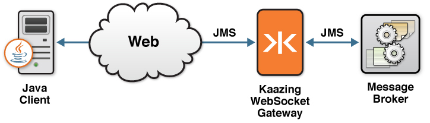

This checklist provides the steps necessary to enable your Java application to communicate with any JMS-compliant message broker, such as Apache ActiveMQ, using the Java client libraries available in KAAZING Gateway - Enterprise Edition:

| \# | Step                                                                                                                                           | Topic or Reference                                                                                                    |
|:---|:-----------------------------------------------------------------------------------------------------------------------------------------------|:----------------------------------------------------------------------------------------------------------------------|
| 1  | Learn to use the KAAZING Gateway Java JMS client library and the supported methods. This topic also includes a simple Java JMS Client example. | [Use the KAAZING Gateway Java JMS Client Library](#use-the-kaazing-gateway-java-jms-client-library)                   |
| 2  | Learn how to authenticate your client by implementing a challenge handler to respond to authentication challenges from the Gateway.            | [Secure Your Java and Android Clients](#secure-your-android-and-java-clients)                                         |
| 3  | Troubleshoot the most common issues that occur when using Java clients.                                                                        | [Troubleshoot Java JMS Clients](#troubleshoot-java-jms-clients)                                                       |
| 4  | Learn how to gather data on KAAZING Gateway Java JMS client.                                                                                   | [Display Logs for the Java JMS Client](#display-logs-for-the-java-jms-client)                                         |
| 5  | Migrate your KAAZING Gateway 4.x Android and Java clients to KAAZING Gateway 5.0.x.                                                            | [Migrate Android and Java Clients to KAAZING Gateway 5.0.x](#migrate-android-and-java-clients-to-kaazing-gateway-50x) |

**Note:** Java Developer Kit (JDK) or Java Runtime Environment (JRE) 1.6 and above are required.
This document contains the following sections:

-   [Overview of the KAAZING Gateway JMS Client Libraries](#overview-of-the-kaazing-gateway-jms-client-libraries)
-   [About the KAAZING Gateway Java JMS Client Library](#about-the-kaazing-gateway-java-jms-client-library)
-   [About Java, Java Applets, and Java Naming and Directory Interface](#about-java-java-applets-and-java-naming-and-directory-interface)

### Overview of the KAAZING Gateway JMS Client Libraries

KAAZING Gateway includes JMS client libraries, which allow clients to subscribe from and publish messages to a JMS-compliant message broker, such as Apache ActiveMQ. With the KAAZING Gateway JMS client libraries, you can leverage WebSocket in your application by building a client. This WebSocket client then enables communication between your application and the JMS-compliant message broker, as shown in the following figure:



**Figure: Enables communication between your application and the JMS-compliant message broker**

Refer to [About KAAZING Gateway - Enterprise Edition](../about/about.md) for more information about KAAZING Gateway - Enterprise Edition.

### About the KAAZING Gateway Java JMS Client Library

KAAZING Gateway includes a Java JMS Client Library that enables you to use Java to create JMS-based clients specifically for your Java applications. As a Java developer, you can use this API to publish and subscribe to JMS-based messages between your application and your message broker.

The Java JMS Client Library exposes capabilities similar to the Java Message Service (JMS) API in Java, including the JMS concepts of connection, session, destination, message consumer, and message producer. Refer to the JMS API documentation, located at `http://www.oracle.com/technetwork/java/docs-136352.html`, for specific information about how to use each of the interfaces.

For a description of the methods currently supported by the KAAZING Gateway Java JMS Client Library, see [KAAZING Gateway JMS Client Libraries](../about/kaazing-jms-api.md).

### About Java, Java Applets, and Java Naming and Directory Interface

Java applications are platform independent, because they are compiled to bytecode, which can then run on a Java virtual machine (JVM) on any certified operating system. A Java applet is a Java program that can be included in an HTML page. Java applets run in the browser's JVM. For more information about Java and Java applets, visit <http://java.com>.

Java Naming and Directory Interface (JNDI) is a Java API for a directory service. This API allows your Java applets to discover and look up data and objects using a reference. With KAAZING Gateway, you use JNDI in two ways:

-   To set up the initial context and call the Gateway's Java JMS client library from your Java JMS client (a Java applet).
-   To connect from the Gateway to your JMS-compliant message broker.

The two contexts are distinct in the Gateway. As a Java JMS client developer, you will work primarily with the JNDI in your Java JMS Client (or Java applet). For information about configuring the Gateway server to a JMS-compliant message broker, refer to [jms](../admin-reference/r_conf_jms.md).

For more general information about getting started with JNDI, refer to The JNDI Tutorial, located at `http://java.sun.com/products/jndi/tutorial/getStarted/index.html`.

Use the KAAZING Gateway Java JMS Client Library
===============================================

In this procedure, you will learn how to use the KAAZING Gateway Java JMS client library and the supported methods. This topic also includes a simple Java JMS Client example.

**Note**: For this how-to, you can use any JMS-compliant message broker. By default, the Gateway is configured to connect to the server on tcp://localhost:61613. You can configure the connect URL in the file `GATEWAY_HOME/conf/gateway-config.xml`. See [About Integrating KAAZING Gateway and JMS-Compliant Message Brokers](../integration-jms/o_jms_integrate.md) for more information.

**Note:** Learn about supported browsers, operating systems, and platform versions in the [Release Notes](../release-notes.html).

To Use the KAAZING Gateway Java JMS Client Library
--------------------------------------------------

1.	Set up your development environment using the following:

	1.	Ensure you have a Java IDE, such as Eclipse, which can be downloaded from http://www.eclipse.org/downloads/.
	2.	If you haven't done so already, download and install KAAZING Gateway, as described in [Setting Up KAAZING Gateway](../about/setup-guide.md).

2.	Review the Java JMS Client Demo.

	Before you start, take a look at an out of the box demo that was built with the Java JMS Client Library: the Java applet that is part of the Gateway bundle. To see this Java applet in action, perform the following steps:

	1.	Start Apache ActiveMQ as described in [Setting Up KAAZING Gateway](../about/setup-guide.md).
	2.	Start the Gateway as described in [Setting Up KAAZING Gateway](../about/setup-guide.md).
	3.	In a browser, navigate to the out of the box demos at `http://localhost:8001/demo/`.
	4.	Click **Java**.

	The demo Java applets show HTML5 standards being used in a Java environment.

3.	Using the Java JMS Client Library.

	**Note:** This section describes how to use the KAAZING Gateway Java JMS Client Library and the supported methods. To find out more specific information about the supported methods or to learn which methods are not supported, refer to [KAAZING Gateway JMS Client Libraries](../about/kaazing-jms-api.md).

	1.	Add the KAAZING Gateway Java WebSocket client library and the KAAZING Gateway Java JMS client library.

		To use these KAAZING Gateway client libraries in your Java application, you must include the following JAR files, which are located in the Gateway bundle:

		-	The JMS API, located in the JAR file `geronimo-jms-1.1-spec.jar`, `slf4j-api-1.5.2.jar`, `slf4j-log4j12-1.5.2.jar`, `log4j-1.2.14.jar` in `GATEWAY_HOME/lib`.
		-	The WebSocket library, located in the JAR file `com.kaazing.gateway.client.jar`, in `GATEWAY_HOME/lib/client/java`.
		-	The Java JMS Client library, located in the JAR file `com.kaazing.gateway.jms.client.jar`, in `GATEWAY_HOME/lib/client/java`.

		Refer to the Java applet documentation for more information on how to package external code in your Java applet. You can deploy this Java applet to the Gateway. For example, you can place it in the web directory: `GATEWAY_HOME/web/base`.

	2.	Add the InitialContext.

		Ensure you add the initial context as described in the JNDI documentation, located at `http://java.sun.com/products/jndi/tutorial/beyond/env/source.html`. The KAAZING Gateway JmsInitialContextFactory returns the initial context.

		```java
		Properties props = new Properties();
		props.put(InitialContext.INITIAL_CONTEXT_FACTORY, "com.kaazing.gateway.jms.client.JmsInitialContextFactory");
		```

		Add the URL for the Gateway, in this case, `ws://localhost:8001/jms`.

		```java
		props.put(Context.PROVIDER_URL, "ws://localhost:8001/jms");
		InitialContext ctx = new InitialContext(props);
		```

	3.	Set up the Connection.

		Add a JMS Client implementation of `ConnectionFactory` that is used to create a connection with a JMS provider via a WebSocket connection.

		```java
		ConnectionFactory connectionFactory =
		    (ConnectionFactory)ctx.lookup("ConnectionFactory");
		```

		Create a connection using the credentials (in this example, `userid` and `password` are `null`\):

		` Connection connection = connectionFactory.createConnection(null, null);`

		Add the `ExceptionListener` whose `onException()` method is invoked to report or deliver exceptions:

		```java
		connection.setExceptionListener(new ExceptionListener() {
		    @Override
		    public void onException(JMSException arg0) { arg0.printStackTrace(); }
		});
		```

	4.	Create a Session.

		After you create a connection, you must create a session. The following is an example of how to create `Session`:

		`Session session = connection.createSession(false, Session.AUTO_ACKNOWLEDGE);`

	5.	Add the MessageConsumer and MessageListener

		After you set up the connections and create the session, add a Message Consumer for a destination. Use `InitialContext.lookup()` to get a reference to a destination topic or queue. Then, you can add a MessageListener that receives messages to the client. Alternatively, you can use `receive()` to fetch messages.

		```java
		Topic topic  = (Topic)ctx.lookup("/topic/destination");
		MessageConsumer consumer = session.createConsumer(topic);
		consumer.setMessageListener(new MessageListener() {
		  @Override
		  public void onMessage(Message message) {
		    try {
		      System.out.println("MESSAGE: "+((TextMessage)message).getText());
		    } catch (JMSException e) {
		      e.printStackTrace();
		    }
		  }
		});
		```

		**Note**: When setting up your message consumers and producers, you must use the format `"/topic/"` for regular topics. For regular queues, use `"/queue/"`. For temporary topics and temporary queues, use `"/temp-topic/"` or `"/temp-queue/"`.

	6.	Start the Connection.

		Once the MessageConsumer is created, start the message flow by starting the connection:

		`connection.start();`

	7.	Use CreateTextMessage and CreateProducer.

		After you set up your connection and message handlers, you can create a message and a message producer to send to your back-end server by way of the Gateway:

		```java
		// Create a simple JMS text message
		Message message = session.createTextMessage("Hello World");
		// Create a message producer that uses a specific destination for its messages:
		MessageProducer producer = session.createProducer(destination);
		// Use the message producer to send the message
		producer.send(message);
		```

	8.	Close the Connection.

		At the end, cease the message flow by closing the connection:

		`connection.close();`

		For more information on the KAAZING Gateway JMS client libraries, see [KAAZING Gateway JMS Client Libraries: Supported APIs](../about/kaazing-jms-api.md) and the [KAAZING Gateway JMS API](http://developer.kaazing.com/documentation/jms/4.0/apidoc/client/java/jms/index.html) documentation.


Durable Subscribers
-------------------

**Note:** Currently, the Gateway does not support durable subscribers with Apache ActiveMQ. You may use durable subscribers with [TIBCO EMS](../integration-jms/p_jms_integrate_tibco.md) or [Informatica UM](../integration-jms/p_jms_integrate_informatica.md). For more information, see [Durable Subscribers](../admin-reference/r_conf_jms.md).

If your JMS client needs to receive all of the messages published on a topic, including the ones published while the subscriber is inactive because it is not being used or has lost connections (which is common when using mobile devices), create a durable [TopicSubscriber](http://docs.oracle.com/javaee/6/api/javax/jms/TopicSubscriber.html) using the [Session.createDurableSubscriber](http://docs.oracle.com/javaee/6/api/javax/jms/Session.html#createDurableSubscriber(javax.jms.Topic,%20java.lang.String)) method.

To unsubscribe from a durable topic, use the [Session.unsubscribe](http://docs.oracle.com/javaee/6/api/javax/jms/Session.html#unsubscribe(java.lang.String)) method.

The JMS provider retains a separate record of each durable subscription and ensures that all messages from the topic's publishers are retained until they are acknowledged by each durable subscriber or they have expired. Whether messages have been acknowledged is tracked separately for each durable subscriber, and each durable subscriber is identified by the combination of its name and the clientID (if any) set on the Connection. Ensure your application confirms that the clientID (if used) is unique to the user or device, or, if it does not use clientID's, ensure that the durable name is unique to the user or device.

**Note:** When clientID is specified in creating a connection, the `client.durable.name.format` property should be defined for the service in `GATEWAY_HOME/conf/gateway-config.xml`. For more information, see [`client.durable.name.format`](../admin-reference/r_conf_jms.md#durable-subscribers).

### Example

In the following example code, an application enables users to subscribe to a destination by specifying the destination, message selector expression, and durable subscriber name when subscribing.

```java
// Obtain the destination name value entered by the user
String destinationName = destination.getText();
// Obtain the message selector conditional expression entered by the user
String selectorText = messageSelector.getText();
// Obtain the unique name of the durable subscription entered by the user
String durableSubscriberName = durableName.getText();
/* Check to see if the durable subscriber name and
   message selector expression fields contain values */
boolean hasDurableSubscriberName =
    (durableSubscriberName != null && !durableSubscriberName.isEmpty());
boolean hasSelector = (selectorText != null && !selectorText.isEmpty());
// Output the values entered by the user
logMessage("SUBSCRIBE: " + destinationName + " " + durableSubscriberName + " " + selectorText);

/* Create the durable subscriber to the specific topic destination
   Perform a JNDI lookup of the destination name entered by the user */
Destination destination = (Destination)jndiInitialContext.lookup(destinationName);
/* If a topic destination entered by the user is found
   create a durable subscriber */
if (hasDurableSubscriberName && destination instanceof Topic) {
    // Downcast topic from destination
    Topic topic = (Topic)destination;
    // Create the TopicSubscriber
    TopicSubscriber subscriber;
    /* If a message selector expression is entered by the user,
       use that when creating the durable subscriber */
    if (hasSelector) {
        subscriber =
            session.createDurableSubscriber(topic, durableSubscriberName, selectorText, false);
    }
    // Or, create the durable subscriber without the message selector
    else {
        subscriber = session.createDurableSubscriber(topic, durableSubscriberName);
    }
    // Set the message listener to receive messages from the destination
    subscriber.setMessageListener(this);
}
```

**Notes:**

-	Sessions with durable subscribers may be created using a unique client ID or with no client ID specified. For more information, see the [jms](../admin-reference/r_conf_jms.md) service.
-	A client can change an existing durable subscription by creating a durable TopicSubscriber with the same name and a new topic and/or message selector. Changing a durable subscriber is equivalent to unsubscribing (deleting) the old one and creating a new one.

Simple Java JMS Client Example
------------------------------

The following code sample provides a simple example of a Java JMS Client. To understand the API calls in the code, review the [KAAZING Gateway JMS Client Libraries: Supported APIs](../about/kaazing-jms-api.md) and the [KAAZING Gateway JMS API](http://developer.kaazing.com/documentation/jms/4.0/apidoc/client/java/jms/index.html) documentation.

```java
package com.kaazing.gateway.jms.client.demo;

import java.net.URI;
import java.net.URISyntaxException;
import java.util.Properties;

import javax.jms.BytesMessage;
import javax.jms.Connection;
import javax.jms.ConnectionFactory;
import javax.jms.ExceptionListener;
import javax.jms.JMSException;
import javax.jms.Message;
import javax.jms.MessageConsumer;
import javax.jms.MessageListener;
import javax.jms.MessageProducer;
import javax.jms.Session;
import javax.jms.TextMessage;
import javax.jms.Topic;
import javax.naming.InitialContext;
import javax.naming.NamingException;

import com.kaazing.net.ws.WebSocketFactory;
import com.kaazing.gateway.jms.client.JmsConnectionFactory;

public class JmsDemo {
    public static void main(String[] args)
    throws NamingException, URISyntaxException, JMSException {

        // Add the initial context using the InitialContext constructor.
        Properties props = new Properties();
        props.put(InitialContext.INITIAL_CONTEXT_FACTORY,
        "com.kaazing.gateway.jms.client.JmsInitialContextFactory");
        InitialContext ctx = new InitialContext(props);

        // Configure the JMS Client implementation of ConnectionFactory.
        ConnectionFactory connectionFactory = (ConnectionFactory) ctx.lookup("ConnectionFactory");

        /*
        Use JmsConnectionFactory to create a connection
        with a JMS provider via a WebSocket connection.
        */
        if ( connectionFactory instanceof JmsConnectionFactory ) {
            ((JmsConnectionFactory) connectionFactory)
            .setGatewayLocation(new URI("ws://localhost:8000/jms"));
        }

        /*
        Use the createConnection method to create a JMS Connection via WebSocket.
        The username and password specified are used as credentials to authenticate
        with the Gateway.
        In this example we use a password but the password does not have
        to be a text password. JmsConnectionFactory() can use a token of any kind.
        */
        final Connection connection = connectionFactory.createConnection(null, null);
        connection.setExceptionListener(new ExceptionListener() {
            @Override
            public void onException(JMSException arg0) { arg0.printStackTrace(); }
        });

        /*
        Use the createSession method to create a session object.
        The first parameter ("false") indicates that the session is not transacted.
        Session.AUTO_ACKNOWLEDGE determines that the session automatically acknowledges
        a client's receipt of a message.
        */
        Session session = connection.createSession(false, Session.AUTO_ACKNOWLEDGE);

        // Use the lookup method of InitialContext to return the name of the topic object.
        Topic topic = (Topic) ctx.lookup("/topic/destination");

        // Create a MessageConsumer for the specified destination.
        MessageConsumer consumer = session.createConsumer(topic);
        // Set the session's distinguished message listener.
        consumer.setMessageListener(new MessageListener() {
            @Override
            /*
            Use the onMessage method of the MessageListener interface
            to receive asynchronously delivered messages.
            */
            public void onMessage(Message message) {
                try {
                    String msg = null;
                    // Check to see if the message contains a stream of uninterpreted bytes.
                    if ( message instanceof BytesMessage ) {
                        BytesMessage bytesMessage = (BytesMessage) message;
                        /*
                        Construct a string builder to handle the conversion
                        from bytes to strings.
                        */
                        StringBuilder builder = new StringBuilder();
                        // Loop through the message and convert datum to a string.
                        for (int i = 0; i < (int) bytesMessage.getBodyLength(); i++) {
                            builder.append((char) bytesMessage.readByte());
                        }
                        msg = builder.toString().trim();
                    }
                    else {
                        // Get the text of the message.
                        msg = ((TextMessage) message).getText();
                    }
                    // Print out the message content.
                    System.out.println("The received message: " + msg);
                }
                catch (Exception e) { e.printStackTrace();
                }
            }
        });
        // Start (or restart) a connection's delivery of incoming messages.
        connection.start();

        // Wait 2 seconds before sending a message.....
        try { Thread.sleep(2 * 1000); }
        catch (InterruptedException e) { e.printStackTrace(); }

        /*
        Use a MessageProducer object to send messages to a destination.
        Use the createProducer method to set the destination for messages.
        */
        MessageProducer producer = session.createProducer(topic);

        /*
        Create a TextMessage object to send a message containing a String object,
        and send the message using the send method using the MessageProducer's
        default delivery mode, priority, and time to live.
        */
        TextMessage txtMsg = session.createTextMessage("Hello, message");
        producer.send(txtMsg);
    }
}
```


Notes
-----

-	Clients built using KAAZING Gateway 3.x libraries will work against KAAZING Gateway 5.x. If you wish to upgrade your 3.x client to the 5.x libraries, please note that the 3.x clients used a single JMS library and 5.x clients include and use separate WebSocket and JMS libraries. Update your client library file and code references to include both the WebSocket and JMS libraries, as described in the 5.x documentation.
-	`TemporaryTopic` and `TemporaryQueue` objects are destroyed when the client loses its connection to the Gateway, or when the JMS-compliant message broker loses its connection to the Gateway. To address this, monitor the client's exception listener to handle recovery for your application. Once the connection is re-established, recreate `TemporaryTopic` and `TemporaryQueue`. `ConnectionDroppedException` and `ConnectionInterruptedException` are delivered to the connection's exception listener via the `onException()` method when a connection is either dropped (between the JMS client and the Gateway) or interrupted (between the Gateway and the broker or server). Also, `ConnectionRestoredException` is delivered via the `onException()` method to indicate that the connection through to the JMS-compliant message broker has been re-established. When `ConnectionRestoredException` is delivered, the `TemporaryTopic` and `TemporaryQueue` objects should be recreated by the application to resume operations.


Secure Your Android and Java Clients
====================================

**Note:** To use the Gateway, a KAAZING client library, or a KAAZING demo, fork the repository from [kaazing.org](http://kaazing.org).

This topic provides information on how to add user authentication functionality to Java and Android clients. The Java and Android Client APIs use the same authentication classes and methods.

A challenge handler is a constructor used in an application to respond to authentication challenges from the Gateway when the application attempts to access a protected resource. Each of the resources protected by the Gateway is configured with a different authentication scheme (for example, Basic, Application Basic, or Application Token), and your application requires a challenge handler for each of the schemes that it will encounter or a single challenge handler that will respond to all challenges. Also, you can add a dispatch challenge handler to route challenges to specific challenge handlers according to the URI of the requested resource.

For information about each authentication scheme type, see [Configure the HTTP Challenge Scheme](https://github.com/kaazing/gateway/blob/develop/doc/security/p_authentication_config_http_challenge_scheme.md).

Before you add security to your clients, follow the steps in [Secure Network Traffic with the Gateway](../security/o_tls.md) and [Configure Authentication and Authorization](https://github.com/kaazing/gateway/blob/develop/doc/security/o_auth_configure.md) to set up security on KAAZING Gateway for your client. The authentication and authorization methods configured on the Gateway influence your client security implementation. In this procedure, we provide an example of the most common implementation.


To Secure Your Java and Android Clients
---------------------------------------

This section includes the following topics:

-   [Overview of Challenge Handlers](#overview-of-challenge-handlers)
-   [Challenge Handler Class Imports](#challenge-handler-class-imports)
-   [Creating a Basic Challenge Handler](#creating-a-basic-challenge-handler)
-   [Creating a Login Handler](#creating-a-login-handler)
-   [Creating a Custom Challenge Handler](#creating-a-custom-challenge-handler)
-   [Overriding Default Challenge Handler Implementations](#overriding-default-challenge-handler-implementations)
-   [Managing Log In Attempts](#managing-log-in-attempts)
-   [Authentication and Connections](#authentication-and-connections)
-   [Registering Challenge Handlers at Locations](#registering-challenge-handlers-at-locations)
-   [Using Wildcards to Match Sub Domains and Paths](#using-wildcards-to-match-sub-domains-and-paths)
-   [Creating Kerberos Challenge Handlers](#creating-kerberos-challenge-handlers)

Overview of Challenge Handlers
-----------------------------------------------------

A challenge handler is responsible for producing responses to authentication challenges from the Gateway. The challenge handler process is as follows:

1.  When an attempt to access a URI protected by the Gateway is made, the Gateway responds with an authentication request, indicating that credentials need to be provided before access to the resource is granted. The specific type of challenge is indicated in a HTTP header called "WWW-Authenticate".
2.  The authentication request and the header are converted into a ChallengeRequest (as defined in RFC 2617) and sent to a challenge handler registered in the client application for authentication challenge responses.
3.  The ChallengeResponse credentials generated by a registered challenge handler are included in a replay of the original request to the Gateway, which allows access to the resource (assuming the credentials are sufficient).

Authenticating your Java client involves implementing a [challenge handler](http://developer.kaazing.com/documentation/5.0/apidoc/client/java/gateway/com/kaazing/net/auth/ChallengeHandler.html) to respond to authentication challenges from the Gateway. If your challenge handler is responsible for obtaining user credentials, then implement a [login handler](http://developer.kaazing.com/documentation/5.0/apidoc/client/java/gateway/com/kaazing/net/auth/LoginHandler.html).

Challenge Handler Class Imports
-----------------------------------------------------

To use a challenge handler in your Java client you must add the following imports:

``` java
import org.kaazing.net.auth.BasicChallengeHandler;
import org.kaazing.net.ws.WebSocket;
import org.kaazing.net.ws.WebSocketFactory;
```

Here is an example of the main WebSocket imports, including challenge handlers:

``` java
import org.kaazing.net.auth.BasicChallengeHandler;
import org.kaazing.net.auth.LoginHandler;
import org.kaazing.net.http.HttpRedirectPolicy;
import org.kaazing.net.ws.WebSocket;
import org.kaazing.net.ws.WebSocketFactory;
import org.kaazing.net.ws.WebSocketMessageReader;
import org.kaazing.net.ws.WebSocketMessageType;
import org.kaazing.net.ws.WebSocketMessageWriter;
```

Creating a Basic Challenge Handler
----------------------------------

Clients with a single challenge handling strategy for authentication requests can set a specific challenge handler as the default using the setDefaultChallengeHandler() method in the WebSocketFactory class. For example:

``` java
private WebSocketFactory wsFactory;

wsFactory = WebSocketFactory.createWebSocketFactory();
...  
BasicChallengeHandler challengeHandler = BasicChallengeHandler.create();
challengeHandler.setLoginHandler(loginHandler);
wsFactory.setDefaultChallengeHandler(challengeHandler);
```

Each WebSocket created from the factory can have its own Challenge Handler associated with it:

``` java
wsFactory = WebSocketFactory.createWebSocketFactory();
WebSocket ws = wsFactory.createWebSocket(location);
BasicChallengeHandler challengeHandler = BasicChallengeHandler.create();
challengeHandler.setLoginHandler(loginHandler);
ws.setChallengeHandler(challengeHandler);
```

**Note:** The challenge handler API is very flexible and there are many different ways to implement challenge handlers to suit the needs of your client application. For more detailed information on challenge handlers, see the [Java Client API](../apidoc/client/java/gateway/index.md).

Creating a Login Handler
------------------------

A login handler is responsible for obtaining credentials from an arbitrary source, such as a dialog presented to the user. Login handlers can be associated with one or more challenge handlers (ChallengeHandler objects) to ensure that when a challenge handler requires credentials for a challenge response (ChallengeResponse), the work is delegated to a login handler.

Here is an example using a login dialog to respond to login challenges and obtain user credentials as part of the authentication challenge:

``` java
final LoginHandler loginHandler = new LoginHandler() {
    private String username;
    private char[] password;

    @Override
    public PasswordAuthentication getCredentials() {
        try {
        LoginDialog dialog = new LoginDialog(parentFrame);
        if (dialog.isCanceled()) {
            return null;
        }
        username = dialog.getUsername();
        password = dialog.getPassword();
        } catch (Exception e) {
            e.printStackTrace();
        }
        return new PasswordAuthentication(username, password);
    }
};

wsFactory = WebSocketFactory.createWebSocketFactory();
wsFactory.setDefaultChallengeHandler(
    BasicChallengeHandler.create().setLoginHandler(loginHandler);
```

**Note:** This example is taken from the out of the box Java Demo at `http://localhost:8001/demo/` (the open source demo is available at [kaazing.org](http://kaazing.org)) and uses an extension of JDialog (javax.swing.JDialog). The source code for the out of the box demo is available in your installation of the Gateway: `GATEWAY_HOME/demo/java/.`

Creating a Custom Challenge Handler
-----------------------------------

There are two methods used in ChallengeHandler:

-   `canHandle(ChallengeRequest challengeRequest)` determines if the challenge handler can handle the authentication scheme required by the Gateway (for example, Basic, Application Basic, Negotiate, or Application Token). The method takes a ChallengeRequest object containing a challenge and returns true if the challenge handler has the potential to respond meaningfully to the challenge. If this method determines that the challenge handler can handle the authentication scheme, it returns true and the `handle()` method is used. If this method returns false, the ChallengeHandler class (that contains all of the registered individual ChallengeHandler objects) continues looking for a ChallengeHandler to handle the request.
-   `handle(ChallengeRequest challengeRequest)` handles the authentication challenge by returning a challenge response. Typically, the challenge response invokes a login handler to collect user credentials and transforms that information into a ChallengeResponse object. The ChallengeResponse sends the credentials to the Gateway in an Authorization header and notifies the Gateway on what challenge handler to use for future requests. If `handle()` cannot create a challenge response, it returns `null`.

For information about each authentication scheme type, see [Configure the HTTP Challenge Scheme](https://github.com/kaazing/gateway/blob/develop/doc/security/p_authentication_config_http_challenge_scheme.md).

### Overriding Default Challenge Handler Implementations

After you have developed your own challenge handler, you can install it for future use. For example, to install your own implementation of `BasicChallengeHandler` for a Java client:

1.  Add a JAR file with your `BasicChallengeHandler` implementation to your classpath parameter before the KAAZING Gateway Java client libraries.
2.  Ensure the JAR file contains the following file inside:
     META-INF/services/org.kaazing.gateway.client.security.BasicChallengeHander. The contents of the file should consist of a single line listing the fully-qualified name of your new implementation class (for example, `fully.qualified.challenge.handler.impl.MyChallengeHandler`). For more information, see the [Service Loader](http://docs.oracle.com/javase/7/docs/api/java/util/ServiceLoader.html) documentation.

Managing Log In Attempts
------------------------

When it is not possible for the KAAZING Gateway client to create a challenge response, the client must return `null` to the Gateway to stop the Gateway from continuing to issue authentication challenges.

The following example demonstrates how to stop the Gateway from issuing further challenges.

``` java
/**
* Sets up the login handler for responding to "Application Basic" challenges.
*/
private static int maxRetries = 2; //max retries allowed for wrong credentials
private int retry = 0;    // retry counter

private void setupLoginHandler(final Frame parentFrame, String locStr) {
  wsFactory = WebSocketFactory.createWebSocketFactory();
  int index = locStr.indexOf("://");
  @Override
  public PasswordAuthentication getCredentials() {
    try {
      if (retry++ >= maxRetries) {
        return null;    // stop authentication process if max retry reached
      }
      LoginDialog dialog = new LoginDialog(parentFrame);
      if (dialog.isCanceled()) {
        retry = 0;    // user stopped authentication, reset retry counter
        return null;  // stop authentication process
      }
      username = dialog.getUsername();
      password = dialog.getPassword();

      updateButtonsForConnected();
      log("CONNECTED");
      retry = 0;    //reset retry counter;

      // Receive messages using WebSocketMessageReader.
      final WebSocketMessageReader messageReader = webSocket.getMessageReader();
    }
  }
  catch (Exception e1) {
    retry = 0;     //reset retry counter
    e1.printStackTrace();
    log("EXCEPTION: "+e1.getMessage());  }
...
```

Authentication and Connections
------------------------------

Both `WebSocketFactory` and `JMSConnectionFactory` are used when adding a challenge handler to a Java or Android client's JMS connection to the Gateway. In the following code example, the challenge handler is initiated during the connect event for the JMS connection (lines 27-29, 45-52):

``` java
...
import org.kaazing.net.auth.BasicChallengeHandler;
import org.kaazing.net.auth.ChallengeHandler;
import org.kaazing.net.auth.LoginHandler;
...
public class JmsPanel extends javax.swing.JPanel implements ActionListener, MessageListener, ExceptionListener {
  ...
  private ChallengeHandler createChallengeHandler(String location) {
    final LoginHandler loginHandler = new LoginHandler() {
      private String username;
      private char[] password;
      @Override
      public PasswordAuthentication getCredentials() {
        try {
          LoginDialog dialog = new LoginDialog(Frame.getFrames()[0]);
          if (dialog.isCanceled()) {
            return null;
          }
          username = dialog.getUsername();
          password = dialog.getPassword();
        } catch (Exception e) {
          e.printStackTrace();
        }
        return new PasswordAuthentication(username, password);
      }
    };
    BasicChallengeHandler challengeHandler = BasicChallengeHandler.create();
    challengeHandler.setLoginHandler(loginHandler);
    return challengeHandler;
  }
  ...
  public void actionPerformed(ActionEvent arg0) {
    try {
      if (arg0.getSource() == connect) {

        final ExceptionListener applet = this;
        Thread connectThread = new Thread() {

          @Override
          public void run() {
            try {
              String url = location.getText();
              logMessage("CONNECT: " + url);

              if (connectionFactory instanceof JmsConnectionFactory) {
                JmsConnectionFactory stompConnectionFactory = (JmsConnectionFactory)connectionFactory;
                // initialize the login handler for the target location
                ChallengeHandler challengeHandler = createChallengeHandler(url);
                stompConnectionFactory.setGatewayLocation(new URI(url));
                WebSocketFactory webSocketFactory = stompConnectionFactory.getWebSocketFactory();
                webSocketFactory.setDefaultChallengeHandler(challengeHandler);
                webSocketFactory.setDefaultRedirectPolicy(HttpRedirectPolicy.SAME_DOMAIN);
              }
              ...
```


Registering Challenge Handlers at Locations
-------------------------------------------

When authentication challenges arrive for specific URI locations, the `DispatchChallengeHandler` is used to route challenges to the appropriate challenge handlers. This allows clients to use specific challenge handlers to handle specific types of challenges at different URI locations.

Here is an example of registering a specific location for a challenge handler:

``` java
LoginHandler someServerLoginHandler = ...
NegotiateChallengeHandler  nch = NegotiateChallengeHandler.create();
NegotiableChallengeHandler nblch = NegotiableChallengeHandler.create();
DispatchChallengeHandler   dch = DispatchChallengeHandler.create();

WebSocketFactory        wsFactory = WebSocketFactory.createWebSocketFactory();
wsFactory.setDefaultChallengeHandler(dch.register("ws://host.example.com",
    nch.register(nblch).setLoginHandler(someServerLoginHandler)
);
 // register more alternatives to negotiate here.
)
```

Using Wildcards to Match Sub Domains and Paths
----------------------------------------------

You can use wildcards (“\*”) when registering locations using `locationDescription` in `DispatchChallengeHandler`. Some examples of `locationDescription` values with wildcards are:

-   `*/` matches all requests to any host on port 80 (default port), with no user information or path specified.
-   `*.hostname.com:8000` matches all requests to port 8000 on any sub domain of hostname.com, but not hostname.com itself.
-   `server.hostname.com:*/*` matches all requests to a particular server on any port on any path but not the empty path.

Creating Kerberos Challenge Handlers
------------------------------------

The following examples demonstrate different implementations of Kerberos challenge handlers. When registered with the `DispatchChallengeHandler`, a `KerberosChallengeHandler` directly responds to Negotiate challenges where Kerberos-generated authentication credentials are required. In addition, you can use a `KerberosChallengeHandler` indirectly in conjunction with a `NegotiateChallengeHandler` to assist in the construction of a challenge response using object identifiers.

This abstract class captures common requirements for a number of implementation flavors for Kerberos, including [Microsoft's SPNEGO implementation](http://tools.ietf.org/html/rfc4559), and a [SPNEGO](http://tools.ietf.org/html/rfc4178) [Kerberos v5 GSS](http://tools.ietf.org/html/rfc4121) implementation.

To successfully use a `KerberosChallengeHandler`, one must know one or more Kerberos KDC service locations and optionally (if not defaulted to "HTTP/requestedURIHostname") provide the name of the specific service being requested.

For the KDC service location, one must establish either:

-   a default Kerberos KDC service location, using `setDefaultLocation(java.net.URI)`, or
-   a mapping from a Kerberos Realm to at least one Kerberos KDC service location using
    `setRealmLocation(String, java.net.URI)`.

For the non-defaulted service name being requested, one can configure the service name using `setServiceName(String)`.

For example, one may install negotiate and a kerberos challenge handler that work together to handle a challenge as:

``` java
import com.kaazing.net.auth.BasicChallengeHandler;
import com.kaazing.net.auth.DispatchChallengeHandler;
import com.kaazing.net.auth.KerberosChallengeHandler;
import com.kaazing.net.auth.LoginHandler;
import com.kaazing.net.auth.NegotiateChallengeHandler;
...
LoginHandler someServerLoginHandler = ...; // perhaps this pops a dialog

KerberosChallengeHandler kerberosChallengeHandler =
    KerberosChallengeHandler.create()
        .setDefaultLocation(URI.create("ws://kb.hostname.com/kerberos5"))
        .setRealmLocation("ATHENA.MIT.EDU", URI.create("ws://athena.hostname.com/kerberos5"))
        .setServiceName("HTTP/servergw.hostname.com")
            .setLoginHandler(someServerLoginHandler)

NegotiateChallengeHandler negotiateChallengeHandler = NegotiateChallengeHandler.create()
    .register(kerberosChallengeHandler);

WebSocketFactory wsFactory = WebSocketFactory.createWebSocketFactory();
wsFactory.setDefaultChallengeHandler(WebSocketDemoChallengeHandler.create()
    .register("ws://gateway.kaazing.wan:8001/echo", negotiateChallengeHandler)
    .register("ws://gateway.kaazing.wan:8001/echo/*", negotiateChallengeHandler));
```

At this point, any user attempting to access `servergw.hostname.com:8000/echo` will be challenged using a `KerberosChallengeHandler` instance. If the user enters credentials with the ATHENA.MIT.EDU realm the realm-specific `athena.hostname.com` KDC will be used to ask for Kerberos credentials for the challenge response. If the user enters credentials with any other realm the `kb.hostname.com` KDC will be used to ask for Kerberos credentials. All requests to either KDC will be for the service name `HTTP/servergw.hostname.com` (indicating access to that HTTP server is the service for which Kerberos credentials are being requested).

Troubleshoot Java JMS Clients
=============================

This topic contains descriptions of common errors that can occur when using the Java client and provides steps on how to prevent these errors.

**Note:** Learn about supported browsers, operating systems, and platform versions in the [Release Notes](../release-notes.html).

What Problem Are You Having?
----------------------------

-   [Kerberos challenge handler not working](#kerberos-challenge-handler-not-working)
-   [Expected messages are not being received for a queue or durable subscriber](#expected-messages-are-not-being-received-for-a-queue-or-durable-subscriber)

Kerberos challenge handler not working
--------------------------------------

**Cause:** [Kerberos challenge handlers](p_dev_java_secure.md) might not work for one or more of the following reasons:

-   The client cannot connect to the Kerberos Domain Controller (KDC).

    **Solution:** Ping the KDC from the computer running the client and the server hosting the Gateway. Also, ensure that you can Telnet to Kerberos port number 88 from both computers (`telnet> open KDC-server-name 88`).

-   The client cannot obtain a Kerberos ticket.

    **Solution:** Test ticket acquisition by executing the following commands to ensure that the KDC is accessible and able to issue service tickets:

    **For Linux:**

    `$ kinit -t /etc/keytab-name.keytab -S service-instance-name username@KDC-server-name`

    **For Windows:**

    `$ kinit username@KDC-server-name`

    The output will be:

    `Please enter the password for username@KDC-server-name:`

    Enter the password, and then enter:

    `$ klist`

    The ticket cache is displayed along with the expiration date of each ticket.

-   Service name is in the incorrect format in the Kerberos challenge handler code.

    **Solution:** The service name should be in the format: `HTTP/servergw.hostname.com`. See [Creating Kerberos Challenge Handlers](p_dev_java_secure.md) for examples.

-   The pop-up dialog in the client used to obtain user credentials does not ensure that the username format is correct.

    **Solution:** Ensure that the result of the pop-up dialog used to obtain user credentials is formatted as
    `username@KDC-server-name`.

Expected messages are not being received for a queue or durable subscriber
--------------------------------------------------------------------------

**Cause:** If expected messages are not being received for a queue or durable subscriber, then it could be because the application has received messages without acknowledging them. The Gateway will send a maximum of [maximum.pending.acknowledgments](../admin-reference/r_conf_jms.md) messages until the client acknowledges. The [maximum.pending.acknowledgments](../admin-reference/r_conf_jms.md) property is set to 1 for JMS providers that do not support individual message acknowledgement.

**Solution:** If you are using a JMS provider other than Apache ActiveMQ or TIBCO Enterprise Message Service (TIBCO EMS), you must ensure your client applications acknowledge each message received from a queue or durable subscriber.

Display Logs for the Java JMS Client
====================================

In this procedure, you will learn how to gather data on KAAZING Gateway Java JMS client.

You can control the log levels for the Java client in the `logging.properties` file on your operating system. For example, for Java 7 (required) on Mac OS X, this file is located in `$JAVA_HOME/jre/lib/logging.properties`.

For more information, see [Java Logging Overview](http://docs.oracle.com/javase/7/docs/technotes/guides/logging/overview.html). Ensure that you have write permissions to this file.

**Note:** Learn about supported browsers, operating systems, and platform versions in the [Release Notes](../release-notes.html).

To Display Logs for the Java JMS Client
---------------------------------------

1.  Build your Java JMS client, as described in [Using the KAAZING Gateway Java JMS Client Library](p_dev_java_client_jms.md).
2.  Add the following line to the `logging.properties` file to display the complete log output:

    `com.kaazing.gateway.jms.client.level = ALL`

3.  Configure the ConsoleLogHandler to display all messages by changing the line:

    `java.util.logging.ConsoleHandler.level = INFO`

    to

    `java.util.logging.ConsoleHandler.level = ALL`

4.  Enable logging in the Java Console or Java Preferences. To do so:
    -   In Windows, in the Java Control Panel, on the Advanced tab, choose **Java console**, then select **Show console**.
    -   On Mac OS X, for Java 7 (required), access the **Java** system preference in **System Preferences**, click **Advanced**, and under **Debugging**, click **Enable logging**. Then, under **Java console**, select **Show console**.

5.  Restart the browser and visit the Java Applet. The Java Console should open and display all logs from the KAAZING Gateway Java JMS Client.

    **Note**: If you are using Microsoft Internet Explorer 8, you may need to restart the browser as an administrator to view the logs from the Java JMS Client.

You can view additional debug information about your Java JMS client by enabling tracing. To do so, in your Java JMS client code, import the com.kaazing.gateway.jms.client.util.Tracer package and enable the Tracer.DEBUG method:

``` java
...
import com.kaazing.gateway.jms.client.util.Tracer;
Tracer.DEBUG = true;
...
```

See Also
--------

You have completed the Java client checklist. For more information about the KAAZING Gateway Java JMS client library, see [KAAZING Gateway JMS Client Libraries](http://localhost:8001/documentation/about/kaazing-jms-api.html).


Migrate Android and Java Clients to KAAZING Gateway 5.0.x
=========================================================

Note: To use the Gateway, a KAAZING client library, or a KAAZING demo, fork the repository from [kaazing.org](http://kaazing.org).

This topic covers the issues involved in migrating KAAZING Gateway 4.x Android and Java clients  to KAAZING Gateway 5.0.x.

For more information about the KAAZING Gateway 5.0.x Java API (which also cover Android), see [Java Client API](../apidoc/client/java/gateway/index.md).

Legacy Client Support
---------------------

KAAZING Gateway 5.0.x supports Android and Java clients written using the KAAZING Gateway 4.x Java APIs. You do not need to migrate your legacy Java client to use KAAZING Gateway 5.0.x. If you wish to take advantage of the new Java API for KAAZING Gateway 5.0.x or new features of KAAZING Gateway 5.0, you must migrate your Android and Java client.

The new Java API for KAAZING Gateway 5.0.x is easier to use than previous versions, but it does require that you change your KAAZING Gateway 4.x Android and Java client code to take advantage of it.

Update Package Names
---------------------

KAAZING Gateway 4.x used `com.kaazing` in its package naming. KAAZING Gateway 5.0.x uses `org.kaazing` for package names. To migrate your client, change your import statements. For example, change this:

```
import com.kaazing.gateway.client.demo.LoginDialogFragment.LoginDialogListener;
import com.kaazing.net.auth.BasicChallengeHandler;
import com.kaazing.net.auth.ChallengeHandler;
import com.kaazing.net.auth.LoginHandler;
import com.kaazing.net.ws.WebSocket;
import com.kaazing.net.ws.WebSocketFactory;
import com.kaazing.net.ws.WebSocketMessageReader;
import com.kaazing.net.ws.WebSocketMessageType;
import com.kaazing.net.ws.WebSocketMessageWriter;
```

To the new KAAZING Gateway 5.0.x package names:

```
import org.kaazing.gateway.client.demo.LoginDialogFragment.LoginDialogListener;
import org.kaazing.net.auth.BasicChallengeHandler;
import org.kaazing.net.auth.ChallengeHandler;
import org.kaazing.net.auth.LoginHandler;
import org.kaazing.net.ws.WebSocket;
import org.kaazing.net.ws.WebSocketFactory;
import org.kaazing.net.ws.WebSocketMessageReader;
import org.kaazing.net.ws.WebSocketMessageType;
import org.kaazing.net.ws.WebSocketMessageWriter;
```

**Note:** You only need to update the package names of the WebSocket packagaes used explicitly in your client. KAAZING Gateway JMS or AMQP package names do not need to be updated.
