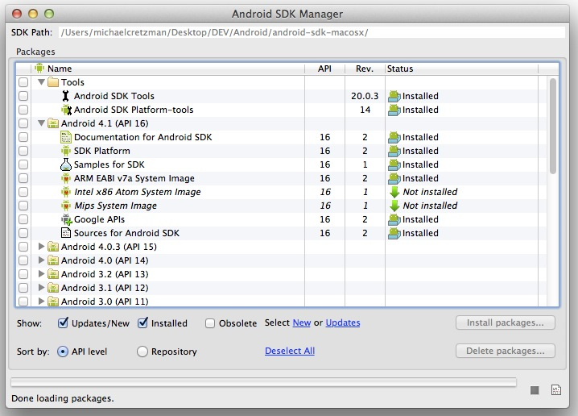
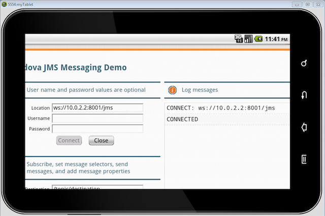

In this walkthrough, you will learn how to deploy an existing JavaScript JMS web app built with the KAAZING Gateway JavaScript JMS libraries as a hybrid app for Android. This topic walks you through the following subjects:

1.  [What You Will Accomplish](#what-you-will-accomplish)
2.  [Before You Begin](#before-you-begin)
3.  [Install KAAZING Gateway, Android SDK, ADT Plugin and APIs for Eclipse, and PhoneGap 2.0](#install-kaazing-gateway-android-sdk-adt-plugin-and-apis-for-eclipse-and-phonegap-20)
4.  [Create a New Android Virtual Device in Eclipse](#create-a-new-android-virtual-device-in-eclipse)
5.  [Create a New Project in Eclipse for Android](#create-a-new-project-in-eclipse-for-android)
6.  [Create and Populate the Project Directory for the Hybrid Android App](#create-and-populate-the-project-directory-for-the-hybrid-android-app)
7.  [Configure and Run KAAZING Gateway and Apache ActiveMQ](#configure-and-run-kaazing-gateway-and-apache-activemq)
8.  [Build and Test the Hybrid Android App](#build-and-test-the-hybrid-android-app)
9.  [Summary](#summary)

**Notes:**
-   A hybrid Android app is a hybrid of a browser-based application and a native Android app. A native Android app is built using the Android SDK. A hybrid Android app is built using HTML, CSS, and JavaScript like a typical browser-based application, and then packaged in a framework that allows it to be converted into an app that runs on Android devices much like a native app. Hybrid Android apps enable web developers to leverage their web experience to create apps for Android. For information on native Android development, see [Android Develop](http://developer.android.com/develop/index.html).
-   A hybrid Android app is also different from a browser-based application that is intended for viewing in a browser on Android, but not downloaded through the Android app store. If you have an existing KAAZING Gateway JavaScript JMS browser-based application, you can use it to create a hybrid Android app or you can modify its web content to make it compatible with browsers on Android.

What You Will Accomplish
------------------------

At the end of this walkthrough, a JavaScript JMS demo created using the KAAZING Gateway JavaScript JMS libraries runs as a hybrid Android app on Android, connects to the Apache ActiveMQ broker via KAAZING Gateway, and sends and receives JMS messages using a native or emulated WebSocket connection. Users can run the hybrid Android app on any Android device and connect via KAAZING Gateway to the Apache ActiveMQ broker.

This walkthrough uses the out of the box JavaScript JMS demo that ships with KAAZING Gateway as the example app, but the steps outlined in this walkthrough are the same for other JavaScript JMS client applications built with KAAZING Gateway.

**Note**: For this walkthrough, you can use any JMS-compliant message broker. By default, KAAZING Gateway is configured to connect to the server on `tcp://localhost:61613`. You can configure the connect URL in the file `GATEWAY_HOME/conf/gateway-config.xml`. See [About Integrating KAAZING Gateway and and JMS-Compliant Message Brokers](https://github.com/kaazing/enterprise.gateway/blob/develop/doc/integration-jms/o_jms_integrate.md) for more information.

Before You Begin
----------------

Before starting this walkthrough you need the following:

-   KAAZING Gateway - Enterprise Edition. See [Setting Up KAAZING Gateway](../about/setup-guide.md).
-   [Eclipse Classic](http://www.eclipse.org/downloads/)
-   [Android SDK](http://developer.android.com/sdk/index.html)
-   [ADT Plugin for Eclipse](http://developer.android.com/sdk/installing/installing-adt.html)
-   [PhoneGap 2.0](http://phonegap.com/download) (PhoneGap is a distribution of Apache Cordova)

Learn about supported browsers, operating systems, and platform versions in Release Notes (not yet available).

**Note:** Steps for installing and configuring Android SDK, ADT Plugin for Eclipse, and PhoneGap 2.0 are included in this walkthrough.

Install KAAZING Gateway, Android SDK, ADT Plugin and APIs for Eclipse, and PhoneGap 2.0
---------------------------------------------------------------------------------------

The following steps take you through the installation of the software required for deploying a hybrid Android app. If you have already have this software installed, you can simply note the locations of the installed software for later use with the shell script.

1.  Install KAAZING Gateway as described in [Setting Up KAAZING Gateway](../about/setup-guide.md).
2.  Install [Eclipse Classic](http://www.eclipse.org/downloads/). See the Eclipse installation instructions for details.
3.  Download and install the [Android SDK](http://developer.android.com/sdk/index.html).

    **Tip:** For steps on installing the Android SDK on your platform, see [Installing the SDK from Android Develop](http://developer.android.com/sdk/installing/index.html).

4.  In a browser, navigate to [http://developer.android.com/sdk/installing/installing-adt.html](http://developer.android.com/sdk/installing/installing-adt.html) and follow the instructions to download and configure the ADT Plugin for Eclipse.
5.  Once the ADT Plugin is installed, restart Eclipse.
6.  In Eclipse, install the Android API 2.2 and 4.1.

    1.  Click **Window**, and then click **Android SDK Manager**.
    2.  Select the **Android 2.2** and the **Android 4.1** packages and then click **Install packages**.

        **Note:** You might be prompted to install these packages automatically after you restarted Eclipse. Once the packages are installed, your Android SDK Manager should look like this:

        

7.  Download PhoneGap 2.0 from <http://phonegap.com/download> and extract its contents. (PhoneGap 2.0 is also called Apache Cordova.)

Create a New Android Virtual Device in Eclipse
----------------------------------------------

The following steps take you through the creation of a virtual device using the Android ADT plugin. This virtual device is the Android emulator that you will use to test your hybrid Android app.

1.  In Eclipse, to create a new virtual device, click **Window**, and then click **AVD Manager**.
2.  In AVD Manager, click **New**.
3.  Enter a name for your new virtual device in **Name** (for example, myTablet).
4.  In **Target**, select **GALAXY Tab Addon**.
5.  In **Built-in**, select **GALAXY Tab**.
6.  In **Hardware**, click **New**.
7.  In **Property**, select **Keyboard support** and click **OK**.
8.  In **Hardware**, set the value for the **Keyboard support** property to **yes**.
9.  Click **Create AVD**.
10. In AVD Manager, select the new virtual device and click **Start**.
11. In **Launch Options**, click **Launch**.

    The Android emulator launches. You can close the AVD Manager dialogs in Eclipse.

12. Close the Android emulator. It will launch automatically once you have built your hybrid Android app and run it from Eclipse.

Create a New Project in Eclipse for Android
-------------------------------------------

The following steps take you through the process of creating the Eclipse project you will use to build your hybrid Android app.

**Note:** This procedure is also documented in the Apache Cordova Documentation, [Getting Started with Android](http://docs.phonegap.com/en/2.0.0/guide_getting-started_android_index.html#Getting%20Started%20with%20Android).

1.  In Eclipse, select **New** and click **Project**.
2.  Expand the **Android** folder, click **Android Application Project**, and click **Next**.
3.  In **Application Name**, give your new project a name. This is the name that will appear when the app is listed in the Play Store and on the Android device.

    **Important:** Note the location where the project is being created. You will need this location later when you run the shell script to set up PhoneGap.

4.  Click **Next**.
5.  Use the default settings for Launcher icon and click **Next**.
6.  In **Create Activity**, select **BlankActivity** and click **Next**.
7.  In **New Blank Activity**, in **Activity Name**, enter **JMSdemoActivity** and click **Finish**. If there are dependencies that you need to install, the **Finish** button is not available. Click **Next**, click **Install/Upgrade**, follow the installation wizard, and then click **Finish**.

Create and Populate the Project Directory for the Hybrid Android App
--------------------------------------------------------------------

The following steps will create the project directory for the hybrid Android app, and populate the directory with the web app files and JavaScript JMS library files required to communicate with KAAZING Gateway. The Gateway includes a shell script to help you perform these steps.

**Note:** This procedure is also documented in the Apache Cordova Documentation, [Getting Started with Android](http://docs.phonegap.com/en/2.0.0/guide_getting-started_android_index.html#Getting%20Started%20with%20Android).

1.  Collect the following file locations for the shell script and define your project name.

    -   `CORDOVA_HOME/lib/android` - A subfolder in the extracted PhoneGap directory. For example, `C:\Users\Administrator\Desktop\phonegap-phonegap-2dbbdab\lib\android`
    -   *`GATEWAY_HOME`* - The folder where KAAZING Gateway and its components are located.
    -   *`PROJECT_DIRECTORY`* - The directory where the Eclipse project you created is located.

2.  Locate the shell script named `android.sh` (Mac and Linux) or `android.bat` (Windows) in the following location:

    `GATEWAY_HOME/demo/cordova/android.sh`, or `GATEWAY_HOME\demo\cordova\android.bat`

3.  Open a shell or command prompt on the location of the `android.sh` or `android.bat` file and enter the following command (this is a Mac example):

    `./android.sh -c CORDOVA_HOME/lib/android -k GATEWAY_HOME -o PROJECT_DIRECTORY`

    For example, on a Mac:

    `./android.sh -c /Users/johndoe/Desktop/phonegap-phonegap-2dbbdab/lib/android      -k /Users/johndoe/Desktop/KAAZING Gateway      -o /Users/johndoe/Desktop/workspace/JMSdemo`

    On Windows:

    `android.bat -c C:\Users\Administrator\Desktop\phonegap-phonegap-2dbbdab\lib\android          -k C:\Users\Administrator\Desktop\JMS\version\KAAZING Gateway          -o C:\Users\Administrator\workspace\JMSdemo`

    The script copies the PhoneGap (Cordova) Android library, the KAAZING Gateway JavaScript JMS libraries, and the JavaScript JMS demo web files to the Eclipse project’s workspace and adds them to the necessary project subfolders.

4.  Right-click your project in Eclipse and click **Refresh**.
5.  Expand the **assets** subfolder in your Eclipse project and you will see a folder named **www**. This folder contains all of web files for the app (HTML, JavaScript, CSS), including the JavaScript JMS library files, and the PhoneGap (Cordova) Android library.
6.  Verify that the **cordova-2.0.0.jar** file is located in the **libs** subfolder of your Eclipse project.
7.  Right click on the **libs** subfolder, select **Build Path**, and then click **Configure Build Path**.
8.  In the **Java Build Path**, click the **Libraries** tab, and click **Add JARs**.
9.  In **JAR Selection**, expand the **libs** folder under **JMSDemo**, click **cordova-2.0.0.jar** in the **libs** subfolder of the project and click **OK**. Then click **OK** to close **Java Build Path**.
10. Expand the **src** subfolder of your Eclipse project and locate the main Java file for your project: **JMSdemoActivity.java**. Double-click the file to open it.
11. Replace contents of the file with the following:

    ``` java
    package com.example.jmsdemo;

    import android.os.Bundle;
    import android.app.Activity;
    import android.view.Menu;
    import org.apache.cordova.*;

    public class JMSdemoActivity extends DroidGap {

        @Override
        public void onCreate(Bundle savedInstanceState) {
            super.onCreate(savedInstanceState);
            // setContentView(R.layout.activity_jmsdemo);
            super.loadUrl("file:///android_asset/www/index.html");
        }

        @Override
        public boolean onCreateOptionsMenu(Menu menu) {
            getMenuInflater().inflate(R.menu.activity_jmsdemo, menu);
            return true;
        }
    }
    ```

12. Double-click **AndroidManifest.xml** in the Eclipse project explorer to view the XML contents (in Windows you might have to also click the **AndroidManifest.xml** tab to view the XML contents).

    


    You are now going to paste XML into the file to add permissions and support device orientation changes.

    **Note:** You are adding a list of permissions to your application. You should remove permissions you are not using before submitting your application to Google Play.

13. Paste the following highlighted contents of **AndroidManifest.xml** into your **AndroidManifest.xml**:

    ``` xml
    <manifest xmlns:android="http://schemas.android.com/apk/res/android"
        package="com.example.jmsdemo"
        android:versionCode="1"
        android:versionName="1.0" >

        <uses-sdk
            android:minSdkVersion="8"
            android:targetSdkVersion="15" />
        <supports-screens
        android:largeScreens="true"
        android:normalScreens="true"
        android:smallScreens="true"
        android:resizeable="true"
        android:anyDensity="true" />
        <uses-permission android:name="android.permission.VIBRATE" />
        <uses-permission android:name="android.permission.ACCESS_COARSE_LOCATION" />
        <uses-permission android:name="android.permission.ACCESS_FINE_LOCATION" />
        <uses-permission android:name="android.permission.ACCESS_LOCATION_EXTRA_COMMANDS" />
        <uses-permission android:name="android.permission.READ_PHONE_STATE" />
        <uses-permission android:name="android.permission.INTERNET" />
        <uses-permission android:name="android.permission.RECEIVE_SMS" />
        <uses-permission android:name="android.permission.RECORD_AUDIO" />
        <uses-permission android:name="android.permission.MODIFY_AUDIO_SETTINGS" />
        <uses-permission android:name="android.permission.READ_CONTACTS" />
        <uses-permission android:name="android.permission.WRITE_CONTACTS" />
        <uses-permission android:name="android.permission.WRITE_EXTERNAL_STORAGE" />
        <uses-permission android:name="android.permission.ACCESS_NETWORK_STATE" />
        <uses-permission android:name="android.permission.GET_ACCOUNTS" />
        <uses-permission android:name="android.permission.BROADCAST_STICKY" />    
        <application
            android:icon="@drawable/ic_launcher"
            android:label="@string/app_name"
            android:theme="@style/AppTheme" >
            <activity
                android:name=".JMSdemoActivity"
                android:configChanges="orientation|keyboardHidden|keyboard|screenSize|locale"
                android:label="@string/title_activity_jmsdemo" >
                <intent-filter>
                    <action android:name="android.intent.action.MAIN" />
                    <category android:name="android.intent.category.LAUNCHER" />
                </intent-filter>
            </activity>
        </application>

    </manifest>
    ```

    **Note:** This manifest uses our example name `jmsdemo`. You will want to change the instances of `jmsdemo` to your project name when you create your own projects.

    Permissions are set with `<uses-permission />` tags, and orientation is set inside the `<activity>` tag.

14. Save your project.

**Note:** This walkthrough uses the out of the box JavaScript JMS demo as an example web app, but when you create your own JavaScript JMS app, you can create it in your favorite IDE and then copy it to this **www** directory. You must name the HTML file for your app **index.md** and you must ensure that links in **index.md** point to the JavaScript WebSocket (by default, `GATEWAY_HOME/lib/client/javascript`) and JMS library (by default, `GATEWAY_HOME/lib/client/javascript/jms`) files and Cordova library are updated to reflect the new location:

``` html
<script src="cordova-2.0.0.js" type="text/javascript" language="javascript"></script>
<script src="WebSocket.js" type="text/javascript" language="javascript"></script>
<script src="JmsClient.js" type="text/javascript" language="javascript"></script>
```

Configure and Run KAAZING Gateway and Apache ActiveMQ
-----------------------------------------------------

Now that you've set up the project for your Android app, you can start Apache ActiveMQ and KAAZING Gateway. The following steps start the Apache ActiveMQ service that is included with KAAZING Gateway, configure KAAZING Gateway to work with the hybrid Android app, and then run KAAZING Gateway.

1.  Start Apache ActiveMQ. For steps on starting Apache ActiveMQ, see the setup information for Apache ActiveMQ.
2.  Open the `GATEWAY_HOME/conf/gateway-config.xml` file in a text editor. You need to modify this file to use the Android Emulator loopback IP address (10.0.2.2) and you need to change the cross site constraint to allow any origin in order to run the app locally. 10.0.2.2 is the special alias to your host loopback interface (127.0.0.1 on your development machine). For more information about Android Emulator networking, see [Emulator Networking](http://developer.android.com/tools/devices/emulator.html#emulatornetworking).
3.  Modify the jms service to use the Android loopback IP address and the cross site constraint to allow any origin:

    ``` xml
    <service>
        <accept>ws://10.0.2.2:${gateway.extras.port}/jms</accept>

        <type>jms</type>

        <properties>
          <connection.factory.name>ConnectionFactory</connection.factory.name>
          <context.lookup.topic.format>dynamicTopics/%s</context.lookup.topic.format>
          <context.lookup.queue.format>dynamicQueues/%s</context.lookup.queue.format>
          <env.java.naming.factory.initial>
            org.apache.activemq.jndi.ActiveMQInitialContextFactory
          </env.java.naming.factory.initial>
          <env.java.naming.provider.url>
            tcp://localhost:61613
          </env.java.naming.provider.url>
        </properties>

        <accept-options>
            <ws.bind>${gateway.hostname}:${gateway.extras.port}</ws.bind>
        </accept-options>

        <realm-name>demo</realm-name>

        <!--
        <authorization-constraint>
          <require-role>AUTHORIZED</require-role>
        </authorization-constraint>
        -->

        <cross-site-constraint>
          <!--allow-origin>http://${gateway.hostname}:${gateway.extras.port}</allow-origin-->
          <allow-origin>*</allow-origin>
        </cross-site-constraint>
    </service>
    ```

4.  Save the `gateway-config.xml` file.
5.  Invoke the `gateway.start` command by navigating to the `GATEWAY_HOME/bin` directory where you installed KAAZING Gateway and then enter the following to run the `gateway.start` script:

    `./gateway.start` (Mac and Linux)

    `gateway.start.bat` (Windows)

    The output from the command will display that KAAZING Gateway is listening on:

    `ws://10.0.2.2:8001/jms @ localhost:8001`

Build and Test the Hybrid Android App
-------------------------------------

The following steps build the hybrid Android app that you created in Eclipse.

**Notes:**
-   Both KAAZING Gateway and Apache ActiveMQ must be running before testing the hybrid Android app.
-   In order to connect the hybrid Android app on the Android device to KAAZING Gateway and Apache ActiveMQ, the Android device must be able to resolve the host name of computer running KAAZING Gateway on the network. This is the host name that you will use in the Location field of the hybrid Android app. For example, `ws://host_name:8001/jms`. You can also configure KAAZING Gateway to use the IP Address of the computer running KAAZING Gateway (for example, `ws://192.168.4.86:8001/jms`). Using the IP Address is often the easiest method during testing.

1.  In Eclipse, right-click the project, select **Run As**, and then click **Android Application**.  The Android emulator launches.

2.  Unlock Android. The hybrid Android app is displayed.

3.  Click in the **Location** field, and enter the jms service URI (`ws://10.0.2.2:8001/jms`), and click **Connect**. The **Log messages** field reports a successful connection.

    

4.  To test the hybrid Android app on an Android device, ensure USB debugging is enabled on your Android device (**Settings** \> **Applications** \> **Development**), and plug the device into your system.
5.  In Eclipse, right-click the project, select **Run As**, and then click **Android Application**.

    The hybrid Android app will deploy to your Android device.

    For more information on testing your hybrid Android app on an Android device, see [Setting up a Device for Development](http://developer.android.com/tools/device.html#setting-up) and [OEM USB Drivers](http://developer.android.com/tools/extras/oem-usb.html) in the Android developer documentation ([http://developer.android.com](http://developer.android.com/)).

Summary
-------

In this walkthrough, you learned how to turn one of the out of the box KAAZING Gateway JavaScript JMS demos into a hybrid Android app. To learn how to build your own KAAZING Gateway JMS apps, refer to the [documentation](../index.md).
