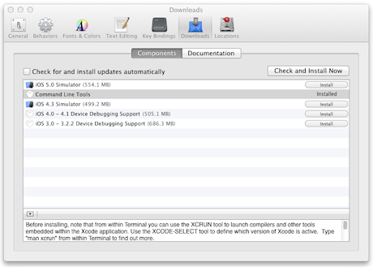
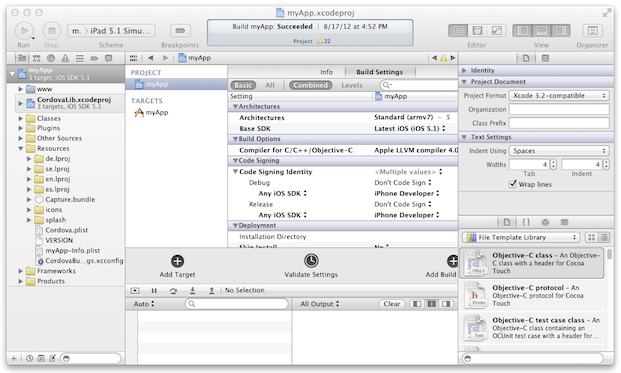
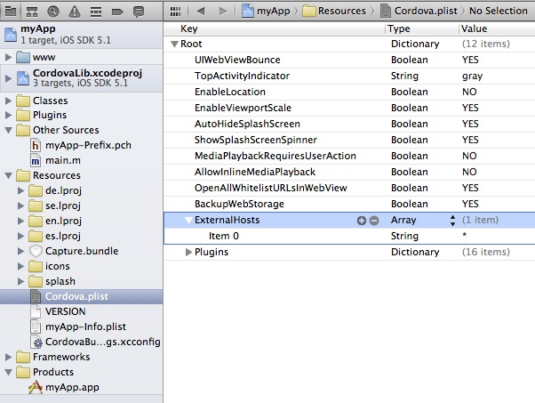
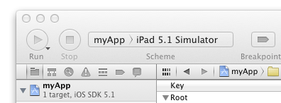
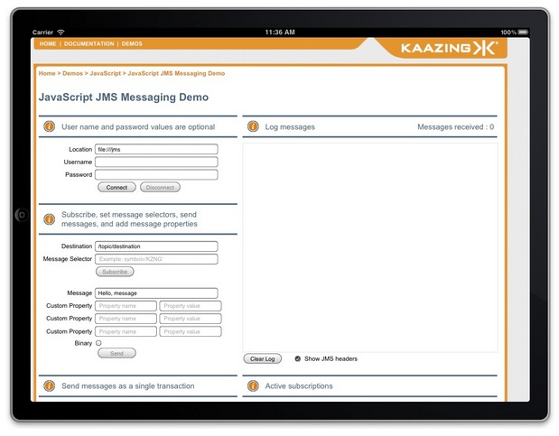
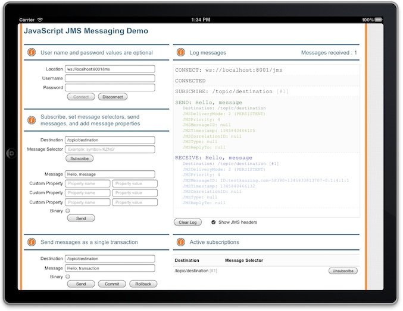

Walkthrough: Deploy a JavaScript JMS App as a Hybrid iOS App  
============================================================

In this walkthrough, you will learn how to deploy an existing JavaScript JMS web app as a hybrid iOS app for iOS. This topic walks you through the following subjects:

1.  [What You Will Accomplish](#what-you-will-accomplish)
2.  [Before You Begin](#before-you-begin)
3.  [Install the Gateway, Xcode 4, and PhoneGap 2.0](#install-the-gateway-xcode-4-and-phonegap-20)
4.  [Create and Populate the Project Directory for the Hybrid iOS App](#create-and-populate-the-project-directory-for-the-hybrid-ios-app)
5.  [Configure Xcode settings](#configure-xcode-settings)
6.  [Run the Gateway and Apache ActiveMQ](#run-the-gateway-and-apache-activemq)
7.  [Build the Hybrid Mobile App Using Xcode](#build-the-hybrid-mobile-app-using-xcode)
8.  [Run and Test the Hybrid Mobile App in iOS Simulator](#run-and-test-the-hybrid-mobile-app-in-ios-simulator)
9.  [Test the Hybrid iOS app on an iOS device](#test-the-hybrid-ios-app-on-an-ios-device)
10. [Troubleshooting](#troubleshooting)
11. [Summary](#summary)


 **Notes:**

-   A hybrid iOS app is a hybrid of a web-based app and a native iOS app. A native iOS app is built using Objective C and the iOS SDK. A hybrid iOS app is built using HTML, CSS, and JavaScript like a typical browser-based web app, and then packaged in a framework that allows it to be converted into an app that runs on iOS devices. Hybrid iOS apps enable web developers to leverage their experience to create apps for iOS and other mobile platforms. For information on native iOS development, see the [iOS Developer Library](http://developer.apple.com/library/ios/navigation/).
-   A hybrid iOS app is also different from a browser-based web app that is intended for viewing in the Safari browser on iOS. If you have an existing KAAZING Gateway JavaScript JMS browser-based web app, you can choose to create a hybrid iOS app or to modify the web content to make it compatible with Safari on iOS. For more information, see the [Safari Web Content Guide](http://developer.apple.com/library/safari/#documentation/AppleApplications/Reference/SafariWebContent/Introduction/Introduction.html).
-   This walkthrough only covers development on the Mac OS X operating system.

What You Will Accomplish
------------------------

At the end of this walkthrough, a JavaScript JMS demo created using the KAAZING Gateway JavaScript JMS libraries runs as a hybrid iOS app on iOS, connects to the Apache ActiveMQ broker via the Gateway, and sends and receives JMS messages using a native or emulated WebSocket connection. Users can run the hybrid iOS app on any iOS device and connect via the Gateway to the Apache ActiveMQ broker.

This walkthrough uses the out of the box JavaScript JMS demo that is included with the Gateway as the example app, but the steps outlined in this walkthrough are the same for other JavaScript JMS client applications built with the Gateway.


**Note**: For this walkthrough, you can use any JMS-compliant message broker. By default, the Gateway is configured to connect to the server on tcp://localhost:61613. You can configure the connect URL in the file `GATEWAY_HOME/conf/gateway-config.xml`. See [About Integrating KAAZING Gateway and JMS-Compliant Message Brokers](https://github.com/kaazing/enterprise.gateway/blob/develop/doc/integration-jms/o_jms_integrate.md) for more information.


Before You Begin
----------------

Before starting this walkthrough you need the following:

-   KAAZING Gateway - Enterprise Edition. See [Setting Up KAAZING Gateway](https://github.com/kaazing/gateway/blob/develop/doc/about/setup-guide.md).
-   [Apple Xcode 4](https://developer.apple.com/xcode/) (requires Mac OS X 10.7.4 or later)
-   [PhoneGap 2.0](http://phonegap.com/download) (PhoneGap is a distribution of Apache Cordova)

**Note:** Learn about supported browsers, operating systems, and platform versions in the [Release Notes](../release-notes.html).

**Note:** Steps for installing and configuring Xcode 4 and PhoneGap 2.0 are included in this walkthrough.

Install the Gateway, Xcode 4, and PhoneGap 2.0
----------------------------------------------

The following steps take you through the installation of the software required for deploying a hybrid iOS app. If you already have this software installed, you can simply note the locations of the installed software for later use with the shell script.

1.  Install the Gateway as described in [Setting Up KAAZING Gateway](https://github.com/kaazing/gateway/blob/develop/doc/about/setup-guide.md).
2.  Install Xcode 4 from <https://developer.apple.com/xcode/>. Once Xcode is installed, install the iOS 5.0 Simulator and Xcode Command Line Tools.

    1.  In **Xcode**, click **Xcode**, and then click **Preferences**.
    2.  Click **Downloads**, and then click **Components**.
    3.  Select the **iOS 5.0 Simulator** and **Command Line Tools**, and then click **Install**.

    

    **Figure: Install both the iOS 5.0 Simulator and Command Line Tools**

3.  Quit Xcode. Xcode should not be running when you are installing PhoneGap.
4.  Download PhoneGap 2.0 from <http://phonegap.com/download>. PhoneGap 2.0 is also called Apache Cordova.

    1.  Extract the PhoneGap 2.0 zip file.
    2.  To mount the PhoneGap disk image, double-click the **Cordova-2.0.0.dmg** file located in the following subfolder of the extracted PhoneGap folder:

        `PHONEGAP_HOME/lib/ios/Cordova-2.0.0.dmg`

        *`PHONEGAP_HOME`* is the folder containing the extracted PhoneGap files.

5.  Double-click the **Cordova-2.0.0.pkg** file and follow the installation wizard to install PhoneGap.

Create and Populate the Project Directory for the Hybrid iOS App
----------------------------------------------------------------

The following steps will create the project directory for the hybrid iOS app, and populate the directory with the web app files and JavaScript JMS library files required to communicate with the Gateway. This is performed using a shell script included with the Gateway.

1.  Collect the following file locations for the shell script and select your project name.

    -   *`CORDOVA_HOME/lib/ios`* - The same directory in which you double-clicked the **Cordova-2.0.0.dmg** file.
    -   *`GATEWAY_HOME`* - The folder where the Gateway and its components are located.
    -   *`PROJECT_DIRECTORY`* - The directory where you want to store your development project. If the folder does not exist, the shell script will create the folder.
    -   *`PROJECT_NAME`* - The name of the project.
    -   *`PACKAGE_NAME`* - The name of the project package. For example, `com.example.cordova.myapp`.

2.  Locate the shell script named `ios.sh` in the following location:

    `GATEWAY_HOME/demo/cordova/ios.sh`

3.  Open a Terminal on the location of the `ios.sh` file and enter the following command:

    `./ios.sh -c CORDOVA_HOME/lib/ios -k GATEWAY_HOME -o PROJECT_DIRECTORY -n PROJECT_NAME -p PACKAGE_NAME`

    For example:

    `./ios.sh -c /Users/johndoe/Desktop/phonegap-phonegap-2dbbdab/lib/ios -k /Users/johndoe/Desktop/KAAZING Gateway -o /Users/johndoe/Desktop/myApp -n myApp -p com.example.cordova.myapp`

    A project folder with the name you entered for the `-o` command is created and populated with the necessary files, including an Xcode project with the project name you specified (such as `myApp.xcodeproj`). You should see the following files and folders in your project folder:

    -   **cordova** - This folder contains the iOS emulator files.
    -   **myApp** - This folder contains the PhoneGap resources for the project.
    -   **myApp.xcodeproj** - This is the Xcode project file in our example.
    -   **www** - This folder contains all of the web files for the app (HTML, JavaScript, CSS), including the JavaScript JMS library files.

**Note:** This walkthrough uses the out of the box JavaScript JMS demo as an example web app, but when you create your own JavaScript JMS app, you can create it in your favorite IDE and then copy it to this **www** directory. You must name the HTML file for your app **index.md** and you must ensure that links in **index.md** point to the JavaScript WebSocket (by default, `GATEWAY_HOME/lib/client/javascript`) and JMS library (by default, `GATEWAY_HOME/lib/client/javascript/jms`) files and Cordova library are updated to reflect the new location:

``` html
<script src="cordova-2.0.0.js" type="text/javascript" language="javascript"></script>
<script src="WebSocket.js" type="text/javascript" language="javascript"></script>
<script src="JmsClient.js" type="text/javascript" language="javascript"></script>
```

Configure Xcode Settings
------------------------

The following steps configure Xcode for building the hybrid iOS app.

1.  Start Xcode.
2.  In Xcode, click **File**, and then click **Open**.
3.  Locate the Xcode project file that was created in the previous section and open it (for example, **myApp.xcodeproj**).

    

    **Figure: The Xcode project created by the shell script**

4.  Expand the project folder in Xcode, expand the **Resources** subdirectory, and click **Cordova.plist**.
5.  Under **Root**, configure the following settings:

    **OpenAllWhitelistURLsInWebView:** `YES`
     **EnableViewportScale:** `YES`

6.  Expand **ExternalHosts**, and click the add button (**+**). A new item is created.
7.  Give the item you created the value `*` (asterisk).

    

    **Figure: Cordova.plist Settings**

8.  Save the project.

Run the Gateway and Apache ActiveMQ
-----------------------------------

The following steps start the Apache ActiveMQ service that is included with the Gateway, configure the cross-site constraint for the jms service on the Gateway, and then run the Gateway.

1.  Start Apache ActiveMQ. For steps on starting Apache ActiveMQ, see the setup information for Apache ActiveMQ.
2.  Open the `GATEWAY_HOME/conf/gateway-config.xml` file in a text editor. Modify the **jms** service cross-site constraint setting to allow all cross-origin site access to the service. For example:

    ``` xml
    <service>
        <accept>ws://${gateway.hostname}:${gateway.extras.port}/jms</accept>
        <type>jms</type>
        <properties>
            <connection.factory.name>ConnectionFactory</connection.factory.name>
            <context.lookup.topic.format>dynamicTopics/%s</context.lookup.topic.format>
            <context.lookup.queue.format>dynamicQueues/%s</context.lookup.queue.format>
            <env.java.naming.factory.initial>
            org.apache.activemq.jndi.ActiveMQInitialContextFactory
            </env.java.naming.factory.initial>
            <env.java.naming.provider.url>
            tcp://localhost:61613
            </env.java.naming.provider.url>
        </properties>

        <realm-name>demo</realm-name>
        <!--
        <authorization-constraint>
         <require-role>AUTHORIZED</require-role>
        </authorization-constraint>
        -->
        <cross-site-constraint>
             <allow-origin>*</allow-origin>
        </cross-site-constraint>
    </service>
    ```

    **Note:** This step is necessary because the hybrid iOS app in the iOS Simulator connects to the Gateway from the local file system.

3.  Save `gateway-config.xml`, and then invoke the `gateway.start` command by navigating to the `GATEWAY_HOME/bin` directory where you installed the Gateway, and then enter the following to run the `gateway.start` script:

    `./gateway.start`

Build the Hybrid Mobile App Using Xcode
---------------------------------------

The following steps build the hybrid iOS app using the Xcode project you created.

1.  Click the Xcode toolbar (next to the stop button), select your project name (such as myApp), and then select **iPad 5.1 Simulator**.

    

    **Figure: The Xcode toolbar lets you pick the simulator or device on which to run your app**

2.  From the **Product** menu, click **Clean**. This will clean (delete the files) from the Build folder used by compiled apps. It is a good practice to clean this folder prior to building an app.
3.  From the **Product** menu, click **Build**.

Run and Test the Hybrid Mobile App in iOS Simulator
---------------------------------------------------

The following steps run the hybrid iOS app and test the connection to the Gateway and Apache ActiveMQ.

1.  In Xcode, click the name of your project and click **Run**. If you are prompted to confirm developer mode, click **OK**.

    The iOS Simulator opens and displays the hybrid iOS app.

    

    **Figure: iOS Simulator with the new hybrid iOS app**

    Next you need to turn off the iOS Simulator keyboard’s **Auto-Capitalization** setting.

2.  In the iOS Simulator, click the **Home** button, navigate to **Settings**, and click it.
3.  Click **General**, and then click **Keyboard**.
4.  Change the **Auto-Capitalization** setting to **OFF**.
5.  Click the **Home** button, navigate back to the hybrid iOS app, and click it.
6.  Click in the **Location** field, and enter the jms service URI (`ws://localhost:8001/jms`), and click **Connect**.

    The **Log messages** field reports a successful connection.

    

    **Figure: The hybrid iOS app is connected to the broker via the Gateway**


**Notes:**

-   If you make changes to the hybrid iOS app in Xcode, quit the iOS Simulator, clean the Xcode project, and then build the project again. This ensures that the iOS Simulator is using the most recent version of your project and hybrid iOS app.
-   If you are unable to connect to Apache ActiveMQ via the Gateway, confirm that the cross-site constraint setting on the jms service is configured to allow all cross-origin site access to the service.
-   By default, the `authorization-constraint` setting on the jms service is commented out in `gateway-config.xml`. If you uncomment this setting in order to test authentication on the hybrid iOS app, ensure that the `http-challenge-scheme` for the `demo` realm is set to `Application Basic`. The `Basic` authentication scheme is intended for web browsers and the hybrid iOS app does not use the Safari browser on iOS. If the `Basic` authentication scheme is used, the hybrid iOS app will not connect to Apache ActiveMQ via the Gateway.

Test the Hybrid iOS app on an iOS device
----------------------------------------

The following steps build a hybrid iOS app that you can copy and test on an iOS device (iPhone, iPad, iPod Touch).

**Note:** To build a hybrid iOS app for use on an iOS device you must be a member of the [Apple iOS Developer Program](https://developer.apple.com/programs/ios/), you must [code sign your app](http://developer.apple.com/library/mac/#documentation/ToolsLanguages/Conceptual/OSXWorkflowGuide/CodeSigning/CodeSigning.html) using a Mac Submission Certificate, and you must have a [Provisioned Device](http://developer.apple.com/library/ios/#DOCUMENTATION/NetworkingInternet/Conceptual/RemoteNotificationsPG/ProvisioningDevelopment/ProvisioningDevelopment.html) to install your app onto. The following steps assume that you have met these requirements.

1.  In Xcode, click the stop button to stop running your hybrid iOS app in the iOS Simulator.
2.  Quit the iOS Simulator.
3.  In Xcode, click **Project**, and then click **Edit Scheme**.
4.  In the **Run** scheme, and in the **Build Configuration** menu, select **Release**, and click **OK**.
5.  Click **Project**, click **Build For**, and then click **Archiving**.
6.  When the build is completed, expand your project folder in the left pane in order to see the **Products** folder. The completed product is listed in this folder.

    **Note:** To see the app file, right-click your product and click **Show in Finder**.

7.  Connect your iOS device to your development computer.
8.  In the toolbar, change **iPad 5.1 Simulator** to **iOS Device**.

    **Note:** In order to connect the hybrid iOS app on the iOS device to the Gateway and Apache ActiveMQ, the iOS device must be able to resolve the host name of computer running the Gateway on the network. This is the host name that you will use in the **Location** field of the hybrid iOS app. For example, `ws://host_name:8001/jms`. You can also configure the Gateway to use the IP Address of the computer running the Gateway (for example, `ws://192.168.4.86:8001/jms`). Using the IP Address is often the easiest method during testing.

9.  Click **Run** to run the hybrid iOS app on your iOS device, enter the jms service URI in the **Location** field, and click **Connect**.

    The **Log messages** field reports a successful connection.

Troubleshooting
---------------

For errors that occur when trying to use your hybrid iOS app on an iOS device, see [iOS Development: Troubleshooting](http://developer.apple.com/library/ios/#documentation/Xcode/Conceptual/ios_development_workflow/40-iOS_Development_Troubleshooting_Guide/ios_development_troubleshooting.html) in the iOS Developer Library and the [PhoneGap Forum](https://groups.google.com/forum/?fromgroups#!forum/phonegap).

Summary
-------

As you have seen in this walkthrough, building a hybrid iOS app using the JavaScript JMS demo is easy to accomplish. Building your own custom JavaScript JMS hybrid iOS app simply requires that you substitute your web app in the **www** folder in the Xcode project and then link the JavaScript JMS and Cordova JavaScript libraries in the **index.md** correctly. For information about building a hybrid Android app, see the [documentation](https://github.com/kaazing/gateway/blob/develop/doc/index.md).

Notes
-----

Clients built using KAAZING Gateway 3.x libraries will work against KAAZING Gateway 4.x. If you wish to upgrade your 3.x client to the 4.x libraries, please note that the 3.x clients used a single JMS library and 4.x clients include and use separate WebSocket and JMS libraries. Update your client library file and code references to include both the WebSocket and JMS libraries, as described in the 4.x documentation. For more migration information, see [Migrate JavaScript Applications to KAAZING Gateway 5.x.](p_dev_js_client_jms.md)
