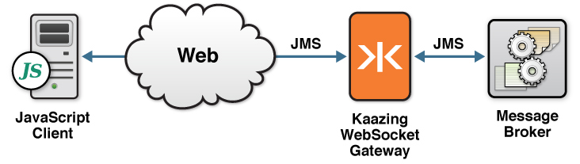
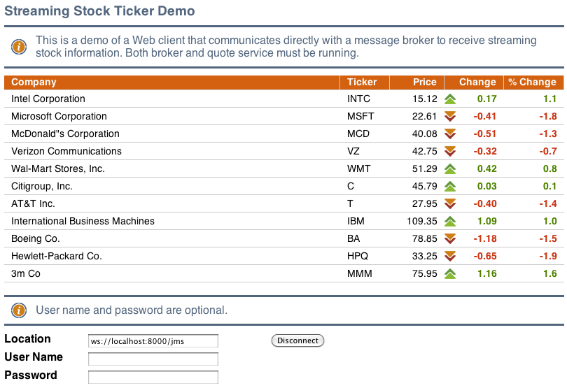

Checklist: Build JavaScript JMS Clients Using KAAZING Gateway  
=====================================================================================

This checklist provides the steps necessary to use the KAAZING Gateway JavaScript JMS client libraries available in KAAZING Gateway - Enterprise Edition to enable your web application to communicate with any JMS-compliant message broker, such as Apache ActiveMQ, using JavaScript:

| \# | Step                                                                                                                                | Topic or Reference                                                                                               |
|:---|:------------------------------------------------------------------------------------------------------------------------------------|:-----------------------------------------------------------------------------------------------------------------|
| 1  | Learn how to use the Gateway JavaScript JMS Client API and the supported APIs.                                                      | [Use the KAAZING Gateway JavaScript JMS Client API](#use-the-kaazing-gateway-javascript-jms-client-api)          |
| 2  | Learn how to authenticate your client by implementing a challenge handler to respond to authentication challenges from the Gateway. | [Secure Your JavaScript Client](#secure-your-javascript-client)                                                  |
| 3  | Troubleshoot the most common issues that occur when using JavaScript clients.                                                       | [Troubleshoot Your JavaScript JMS Client](#troubleshoot-your-javascript-jms-client)                              |
| 4  | Learn how to gather data on KAAZING Gateway JavaScript JMS client.                                                                  | [Display Logs for the JavaScript JMS Client](#display-logs-for-the-javascript-jms-client)                        |
| 5  | Migrate KAAZING Gateway 4.x JavaScript JMS clients to KAAZING Gateway 5.0 JavaScript JMS API.                                       | [Migrate JavaScript Applications to KAAZING Gateway 5.x](#migrate-javascript-applications-to-kaazing-gateway-5x) |


Introduction
------------

In this how-to, you will learn how to use the KAAZING Gateway JavaScript JMS client libraries available in KAAZING Gateway - Enterprise Edition to enable your web application to communicate with any JMS-compliant message broker, such as Apache ActiveMQ, using JavaScript.

This document contains information for a JavaScript developer who wants to add JavaScript to your web application to enable communication with a JMS-compliant message broker through the Gateway.

### Overview of the KAAZING Gateway JMS Client Libraries

KAAZING Gateway includes JMS client libraries, which allow clients to subscribe from and publish messages to a JMS-compliant message broker. With the KAAZING Gateway JMS client libraries, you can leverage WebSocket in your application by building a client. This WebSocket client then enables communication between your application and the JMS-compliant message broker, as shown in the following figure:



**Figure: Enable communication between your application and the JMS-compliant message broker**

Refer to [About KAAZING Gateway - Enterprise Edition](../about/about.md) for more information about KAAZING Gateway - Enterprise Edition.

### About the KAAZING Gateway JavaScript JMS Client API

KAAZING Gateway includes a JavaScript JMS Client API that enables you to use JavaScript to create JMS-based clients specifically for your web applications. As a JavaScript developer, you can use this API to publish and subscribe to JMS-based messages between your application and your message broker.

The JavaScript JMS Client API exposes capabilities similar to the Java Message Service (JMS) API in Java, including the JMS concepts of connection, session, destination, message consumer, and message producer. Refer to the JMS API documentation, located at `http://www.oracle.com/technetwork/java/docs-136352.html`, for specific information about how to use each of the interfaces.

For a description of the methods currently supported by the KAAZING Gateway Java JMS Client API, see [KAAZING Gateway JMS Client Libraries: Supported APIs](../about/kaazing-jms-api.md).


Use the KAAZING Gateway JavaScript JMS Client API
=================================================

In this procedure, you will learn how to use the KAAZING Gateway JavaScript JMS Client API and the supported APIs. The steps in this section show you how to add the code to an existing JavaScript application and have it interact with a pre-seeded stock ticker. In this section, you'll use the out of the box ActiveMQ server and demo stock script. You can alternatively use your own JMS-compliant message broker.

**Notes:**

-   To find out more specific information about the supported APIs or to learn which APIs are not supported, refer to [KAAZING Gateway JMS Client Libraries: Supported APIs](../about/kaazing-jms-api.md).
-   Learn about supported browsers, operating systems, and platform versions in the [Release Notes](../release-notes.html).

**Note**: For this how-to, you can use any JMS-compliant message broker. By default, the Gateway is configured to connect to the server on tcp://localhost:61616. You can configure the connect URL in the file `GATEWAY_HOME/conf/gateway-config.xml`. See [About Integrating KAAZING Gateway and JMS-Compliant Message Brokers](https://github.com/kaazing/enterprise.gateway/blob/develop/doc/integration-jms/o_jms_integrate.md) for more information.

Set Up Your Development Environment
-----------------------------------

Download and install KAAZING Gateway, as described in [Setting Up KAAZING Gateway](https://github.com/kaazing/gateway/blob/develop/doc/about/setup-guide.md).

Take a Look at the JavaScript JMS Client Demo
---------------------------------------------

Before you start, take a look at the out of the box demos that were built with the JavaScript client library. To see these JavaScript demos in action, perform the following steps:

1.  Start ActiveMQ, as described in [Setting Up KAAZING Gateway](https://github.com/kaazing/gateway/blob/develop/doc/about/setup-guide.md).
2.  Start the demo stock feed as described in [Setting Up KAAZING Gateway](https://github.com/kaazing/gateway/blob/develop/doc/about/setup-guide.md).
3.  Start the Gateway as described in [Setting Up KAAZING Gateway](https://github.com/kaazing/gateway/blob/develop/doc/about/setup-guide.md).
4.  In a browser, navigate to the out of the box demos at `http://localhost:8001/demo/`.
5.  Click **JavaScript** and follow the instructions.

The out of the box JavaScript JMS demos show HTML5 standards being used in two sample JMS scenarios.

### About the Stock Emitter Program

In this procedure, you will connect to Apache ActiveMQ, which is receiving a stream of fictitious financial stock data. This stock data is generated by a Java program, which is included in the Gateway bundle. This stock emitter program creates a connection with Apache ActiveMQ, running on the default host and port (`tcp://localhost:61616`) and sends it stock ticker symbols with an associated fictitious base price. After that, it randomly changes the prices programmatically and sends the updates and the percentage of the change.

To use the KAAZING Gateway JavaScript JMS client libraries to create a real-time stock ticker:
----------------------------------------------------------------------------------------------------------------------

1.  Copy the `GATEWAY_HOME/web/extras/samples` folder to `GATEWAY_HOME/web/base/` so you can modify the files. The files in the `GATEWAY_HOME/web/extras/` folder are read-only.

2.  Open the file `stock.md` in the `GATEWAY_HOME/web/base/samples/jms-js-stock` directory in your favorite text editor.

    This file is a simple HTML file that contains a few `TODO` sections. This is where you add the code necessary to turn this template file into a JavaScript client that can interact with a JMS-compliant message broker through the Gateway.

3.  Add a reference to the KAAZING Gateway JavaScript client libraries, which allows you to open a WebSocket and fully leverage bidirectional binary communication for all browsers.

    **Replace:**

    `<!-- TODO 0 -->`

    **With:**

    ``` html
    <!-- Required for Internet Explorer 6/7 cross-origin support -->
    <meta name="kaazing:postMessageBridgeURL" content="PostMessageBridge.md">
    <!-- WebSocket library -->
    <script src="WebSocket.js"></script>
    <!-- JMS library -->
    <script src="JmsClient.js"></script>
    ```

    **Notes:**

    -   Always add the `WebSocket.js` library before the `JmsClient.js` library.
    -   Your client can use the `JmsClient.js` library without the `WebSocket.js` library, but your client will not be able to use features such as WebSocket emulation, authentication, load balancing, and other advanced features of the Gateway. To run a JavaScript client that uses the `JmsClient.js` library without `WebSocket.js`, the web browser hosting the client must support the native W3C standard [WebSocket API](http://dev.w3.org/html5/websockets/). If a client using `JmsClient.js` is running in an unsupported configuration, the JMS API reports the condition by throwing an exception from `createConnection()` and logs a message to [window.console](http://stackoverflow.com/questions/4743730/what-is-console-log-and-how-do-i-use-it), if present. For a list of web browsers that support WebSocket, see [caniuse.com](http://caniuse.com/#search=websocket).
    -   When you use the `JmsClient.js` client library, you must ensure all the relevant `*cache.js` files are accessible within the same directory that contains JmsClient.js. You can see the structure in `GATEWAY_HOME/web/samples/jms-js-stock`.
    -   The file `PostMessageBridge.md` is used to make your application work in Internet Explorer releases 6 and 7. To configure this compatibility, copy the file from `GATEWAY_HOME/lib/client/javascript/PostMessageBridge.md` to `GATEWAY_HOME/web/base/samples/jms-js-stock`.

4.  Create a `JmsConnectionFactory` when users click the Connect button.

    **Replace:**

    `// TODO1`

    **With:**

    ``` js
        connect.onclick = function() {
            jmsConnectionFactory =
               new Kaazing.JMS.JmsConnectionFactory(url.value);
    ```

5.  Create a connection with a "future" handler for the returned result.

    **Replace:**

    `// TODO2`

    **With:**

    ``` js
    if (connection == null) {
         var connectionFuture = jmsConnectionFactory.createConnection
           (username.value, password.value, function () {
              try {
                   connection = connectionFuture.getValue();
    ```

    **Note:** In this example we use `password.value` but the password does not have to be a text password. `JmsConnectionFactory()` can use a token of any kind. If you use text-based passwords, ensure that you have configured secure networking as described in [Checklist: Secure Network Traffic with the Gateway](https://github.com/kaazing/gateway/blob/develop/doc/security/o_tls.md).

6.  Create a session, and pass in session parameters. Sessions are either transacted or not. In this example, set this to false (non-transacted). Sessions declare how incoming messages will be acknowledged. In this case, use `AUTO_ACKNOWLEDGE`. Here, you can also change the **Connection** button label to `Disconnect`.

    **Replace:**

    `// TODO3`

    **With:**

    ``` js
        connect.innerHTML = "Disconnect";
        var session = connection.createSession(false, Session.AUTO_ACKNOWLEDGE);
    ```

7.  Once you have created the session, you can subscribe to topics or queues. Specify the topic name **stock**.

    **Replace:**

    `// TODO4`

    **With:**

    ``` js
        var topic = session.createTopic("/topic/stock");
        var consumer = session.createConsumer(topic);
    ```

8.  Create an `onMessage` function to handle incoming messages and save the file.

    **Replace:**

    `// TODO5`

    **With:**

    ``` js
        consumer.setMessageListener(onMessage);
        connection.start(function () { /* Started */ });
    ```

9.  Now, you'll need to perform a configuration step to enable the Gateway to accept incoming connections on port 8001. To do so, in a text editor, open the file `GATEWAY_HOME/conf/gateway-config.xml`.
10. Under the `jms` service entry, add a second `<accept>` statement:

    `<accept>ws://${gateway.hostname}:8000/jms/</accept>`

    The section should then look like this:

    ``` xml
    <service>
      <accept>ws://${gateway.hostname}:${gateway.extras.port}/jms</accept>
      <accept>ws://${gateway.hostname}:8000/jms</accept>

      <type>jms</type>
    ...
    </service>
    ```

11. Save the file, then stop and start the Gateway by following the steps in [Setting Up KAAZING Gateway](https://github.com/kaazing/gateway/blob/develop/doc/about/setup-guide.md).
12. Ensure the Gateway, the stock ticker, and Apache ActiveMQ are running. For information about starting the Apache ActiveMQ, see [Setting Up KAAZING Gateway](https://github.com/kaazing/gateway/blob/develop/doc/about/setup-guide.md).
13. In a browser, open `http://localhost:8000/samples/jms-js-stock/stock.html`. Your application should look like the following figure.

    Alternatively, if you are not certain if you have performed the steps correctly, you can also open `http://localhost:8000/samples/jms-js-stock/stock-completed.html`, which is the completed example.

    

**Note**: All JMS exceptions are inherited from Error.

Durable Subscribers
-----------------------------------------

 **Note:** Currently, the Gateway does not support durable subscribers with Apache ActiveMQ. You may use durable subscribers with [TIBCO EMS](https://github.com/kaazing/enterprise.gateway/blob/develop/doc/integration-jms/p_jms_integrate_tibco.md) or [Informatica UM](https://github.com/kaazing/enterprise.gateway/blob/develop/doc/integration-jms/p_jms_integrate_informatica.md). For more information, see [Durable Subscribers](https://github.com/kaazing/enterprise.gateway/blob/develop/doc/admin-reference/r_conf_jms.md#durable-subscribers).

If your JMS client needs to receive all of the messages published on a topic, including the ones published while the subscriber is inactive because it is not being used or has lost connections (which is common when using mobile devices), create a durable [TopicSubscriber](http://developer.kaazing.com/documentation/jms/4.0/apidoc/client/javascript/jms/TopicSubscriber.md) using the [Session.createDurableSubscriber()](http://developer.kaazing.com/documentation/jms/4.0/apidoc/client/javascript/jms/Session.md#createDurableSubscriber) method.

To unsubscribe from a durable subscription that has been created by a client and delete the state being maintained on behalf of the subscriber by the broker, use the `unsubscribe()` method available in the `Session` object.

The JMS provider retains a separate record of each durable subscription and ensures that all messages from the topic's publishers are retained until they are acknowledged by each durable subscriber or they have expired. Whether messages have been acknowledged is tracked separately for each durable subscriber, and each durable subscriber is identified by the combination of its name and the clientID (if any) set on the Connection. Ensure your application confirms that the clientID (if used) is unique to the user or device, or, if it does not use clientID's, ensure that the durable name is unique to the user or device.

#### Example

In the following example, a web application enables users to connect to a JMS broker via the Gateway and specify both a username and durable name to create a durable subscriber. First, we'll look at the HTML content of the web application, and then look at the JavaScript functions that use the [JavaScript JMS API](http://developer.kaazing.com/documentation/jms/4.0/apidoc/client/javascript/jms/index.md).

In the connection section of the web application, a username field is included.

``` js
<div id="login_div" class="panel">
<label for="url">Location</label>
<input id="url" /><br/>
<label for="username">Username</label>
<input id="username"><br/>
<label for="password">Password</label>
<input type="password" id="password"><br/>
<button id="connect" >Connect</button>
<button id="disconnect" >Close</button>
```

The following section of the web app shows a web form that enables users to subscribe, send messages, and unsubscribe to a particular destination and durable name.

``` js
<div id="subscribe_div" class="panel">
    <span class="info">Subscribe, set message selectors, send messages,
        and add message properties</span>
    <label for="destination">Destination</label>
    <input id="destination" value="/topic/destination"><br/>
    <label for="messageSelector">Message Selector</label>
    <input id="messageSelector" placeholder="Example: symbol='KZNG'"><br />
    <label for="durableName">Durable Name</label>
    <input id="durableName" value=""><br />
    <button id="subscribe" >Subscribe</button>
</div>
```

Next, variable names are assigned to each form element (note the variable that is a concatenation of the username and the durable name to ensure that the durable subscription is unique):

``` js
// Declare variables
var url, username, password, connect, close, disconnect, message, messageSelector, subscribe;
var destination;
var durName;
var durableName;
var UniqueDurName;

// Assign UI elements to variables
url = document.getElementById("url");
username = document.getElementById("username");
password = document.getElementById("password");
connect = document.getElementById("connect");
close = document.getElementById("close");
disconnect = document.getElementById("disconnect");
message = document.getElementById("message");
messageSelector = document.getElementById("messageSelector");
subscribe = document.getElementById("subscribe");
send = document.getElementById("send");

destination = document.getElementById("destination");
durableName = document.getElementById("durableName");
// Create a unique durable name using a concatenation of user name and durable name
UniqueDurName = username + "@" + durableName;
```

To create a connection, the user enters the location of the jms service (`ws://example.com:8001/jms`), a username, and then clicks **Connect** (password is optional). The following code creates the connection using the location and username:

``` js
function handleConnect() {
    // log the location and username values to the log text area in the UI
    log("CONNECT: " + url.value + " " + username.value);
    // Create a new connection to the JMS provider at the location entered by the user
    var jmsConnectionFactory = new Kaazing.JMS.JmsConnectionFactory(url.value);
    try {
        /*Create the actual JMS Connection via WebSocket.
        Username and password are options used to authenticate with the Gateway.*/
        var connectionFuture =
            jmsConnectionFactory.createConnection(
                username.value, password.value, function () {
            if (!connectionFuture.exception) {
                try {
                    connection = connectionFuture.getValue();
                    connection.setExceptionListener(handleException);

                    log("CONNECTED");

                    session = connection.createSession(false, Session.AUTO_ACKNOWLEDGE);
                    transactedSession = connection.createSession(true, Session.AUTO_ACKNOWLEDGE);

                        connection.start(function () {
                            updateConnectionButtons(true);
                        });
                }
                catch (e) {
                    handleException(e);
                }
            }
            else {
                handleException(connectionFuture.exception);
            }
        });
    }
    catch (e) {
        handleException(e);
    }
}
```

To create a durable subscriber for a topic when a user clicks the **Subscribe** button, the web application calls the [createDurableSubscriber()](http://developer.kaazing.com/documentation/jms/4.0/apidoc/client/javascript/jms/Session.md#createDurableSubscriber) method of a Session object. Note the use of `UniqueDurName`, the variable created using a concatenation of username and durable name in order to create a unique durable subscription.

There are two instances of `createDurableSubscriber()`: the first instance is used if a message selector is entered by the user (lines 14-15), and the second is used if no message selector is entered (line 19).

``` js
function handleSubscribe() {
    // Assign the destination entered by the user to a variable
    var name = destination.value;
    // Create the destination and assign it to a variable
    var dest = createDestination(name, session);
    // Create a variable to hold the durable topic
    var consumer;
    // If a durable name is entered by the user, do the following
    if (durableName.value.length > 0) {
      // If a message selector was entered, use it when creating the durable topic
      if (messageSelector.value.length > 0) {
            /*Create the durable topic using the destination, name,
            and message selector entered by the user*/
          consumer = session.createDurableSubscriber(
                    dest, UniqueDurName, messageSelector.value, false);
      }
      else {
        // Or create the durable topic without the message selector
        consumer = session.createDurableSubscriber(dest, UniqueDurName);
      }
    }
    else if (messageSelector.value.length > 0) {
    consumer = session.createConsumer(dest, messageSelector.value);
    }
    else {
    consumer = session.createConsumer(dest);
    }

    consumer.setMessageListener(function(message) {
    handleMessage(name, destinationId, message);
    });
}
```

**Notes:**

-   Clients built using KAAZING Gateway 4.x libraries will work against KAAZING Gateway 5.0.x.
-   To see a working example of this code, see the JavaScript JMS Messaging Demo (http://localhost:8001/demo/index.html), and view the source code here: `GATEWAY_HOME/web/extras/demo/jms/javascript/jms-javascript.md` (Mac and Linux), or `GATEWAY_HOME\web\extras\demo\jms\javascript\jms-javascript.md` (Windows).
-   Sessions with durable subscribers may be created using a unique client ID or with no client ID specified. For more information, see the [jms](https://github.com/kaazing/enterprise.gateway/blob/develop/doc/admin-reference/r_conf_jms.md#jms) service.
-   A client can change an existing durable subscription by creating a durable TopicSubscriber with the same name and a new topic and/or message selector. Changing a durable subscriber is equivalent to unsubscribing (deleting) the old one and creating a new one.
-   `TemporaryTopic` and `TemporaryQueue` objects are destroyed when the client loses its connection to the Gateway, or when the JMS-compliant message broker loses its connection to the Gateway. To address this, monitor the client's exception listener to handle recovery for your application. Once the connection is re-established, recreate `TemporaryTopic` and `TemporaryQueue`. `ConnectionDroppedException` and `ConnectionInterruptedException` are delivered to the connection's exception listener via `onException`, indicating that messages in flight might be lost, depending on message delivery options. `ConnectionRestoredException` is delivered to indicate that the connection through to the JMS-compliant message broker has been re-established. `TemporaryTopic` and `TemporaryQueue` should be recreated at that time to resume operations.

Secure Your JavaScript Client
=============================

Note: To use the Gateway, a KAAZING client library, or a KAAZING demo, fork the repository from [kaazing.org](http://kaazing.org).
Before you add security to your clients, follow the steps in [Secure Network Traffic with the Gateway](../security/o_tls.md) and [Configure Authentication and Authorization](https://github.com/kaazing/gateway/blob/develop/doc/security/o_auth_configure.md) to set up security on KAAZING Gateway for your client. The authentication and authorization methods configured on the Gateway influence your client security implementation. In this procedure, we provide an example of the most common implementation.


To Secure Your JavaScript Client
--------------------------------

This procedure contains the following topics:

-   [Creating a Basic Challenge Handler](#creating-a-basic-challenge-handler)
-   [Creating a Custom Challenge Handler](#creating-a-custom-challenge-handler)
-   [Managing Log In Attempts](#managing-log-in-attempts)
-   [Registering Challenge Handlers at Locations](#registering-challenge-handlers-at-locations)
-   [Using Wildcards to Match Sub-domains and Paths](#using-wildcards-to-match-sub-domains-and-paths)
-   [Negotiating a Challenge](#negotiating-a-challenge)

Authenticating your client involves implementing a challenge handler to respond to authentication challenges from the Gateway. If your challenge handler is responsible for obtaining user credentials, then you will also need to implement a login handler.

### Creating a Basic Challenge Handler

A challenge handler is a constructor used in an application to respond to authentication challenges from the Gateway when the application attempts to access a protected resource. Each of the resources protected by the Gateway is configured with a different authentication scheme (for example, Basic, Application Basic, or Application Token), and your application requires a challenge handler for each of the schemes that it will encounter or a single challenge handler that will respond to all challenges. Also, you can add a dispatch challenge handler to route challenges to specific challenge handlers according to the URI of the requested resource.

For information about each authentication scheme type, see [Configure the HTTP Challenge Scheme](https://github.com/kaazing/gateway/blob/develop/doc/security/p_authentication_config_http_challenge_scheme.md).

Clients with a single challenge handling strategy for all 401 challenges can simply set a specific challenge handler as the default using `webSocketFactory.setChallengeHandler()`. The following is an example of how to implement a single challenge handler for all challenges:

``` js
function setupSSO(factory) {
  /* Respond to authentication challenges with popup login dialog */
  var basicHandler = new Kaazing.Gateway.BasicChallengeHandler();

    basicHandler.loginHandler = function(callback) {
        // Create static credentials for test
        var credentials = new Kaazing.Gateway.PasswordAuthentication("joe", "welcome");
        callback(credentials);
    }

    factory.setChallengeHandler(basicHandler);
}
```

The preceding example uses static credentials, but you will want to create a login handler to obtain individual user credentials. Here is an example using a popup login dialog to respond to login challenges and obtain user credentials:

``` js
function setupSSO(factory) {
  /* Respond to authentication challenges with popup login dialog */
  var basicHandler = new Kaazing.Gateway.BasicChallengeHandler();
  basicHandler.loginHandler = function(callback) {
    popupLoginDialog(callback);
  }
  factory.setChallengeHandler(basicHandler);
}

function popupLoginDialog(callback) {

  //popup dialog to get credentials
  var popup = document.getElementById("logindiv");
  $("#logindiv").slideToggle(300);
  var login = document.getElementById("login");
  var cancel = document.getElementById("cancel");

  $('#username').focus();

  // As a convenience, connect when the user presses Enter
  // in the location field.
  $('#password').keypress(function(e) {
    if (e.keyCode == 13) {
      e.stopImmediatePropagation(); // Prevent firing twice.
      login.click();
    }
  });

  //"OK" button was clicked, invoke callback function with credential to login
  login.onclick = function() {
    var username = document.getElementById("username");
    var password = document.getElementById("password");
    var credentials = new Kaazing.Gateway.PasswordAuthentication(username.value, password.value);
    //clear user input
    username.value = "";
    password.value = "";
    //hide popup
    $("#logindiv").slideToggle(100);
    callback(credentials);
  }

  //"Cancel" button has been clicked, invoke callback function with null argument to cancel login
  cancel.onclick = function() {
    var username = document.getElementById("username");
    var password = document.getElementById("password");
    //clear user input
    username.value = "";
    password.value = "";
    //hide popup
    $("#logindiv").slideToggle(100);
    callback(null);
  }
}
```

This example is taken from the out of the box JavaScript WebSocket Demo at kaazing.org. For more information on challenge handlers and how to configure location-specific challenge handling strategies, see the [JavaScript Client API](http://developer.kaazing.com/documentation/5.0/apidoc/client/javascript/gateway/index.html).

To have the out of the box JavaScript WebSocket demo prompt you for authentication, open the Gateway configuration file (`GATEWAY_HOME/conf/gateway-config.xml`), remove the HTML comments surrounding the `<authorization-constraint>` child of the `<echo>` service, restart the Gateway, and then try the demo. You will be prompted for user credentials.

This `BasicChallengeHandler` can be instantiated using a new `BasicChallengeHandler()`. After instantiating `BasicChallengeHandler`, the `loginHandler` function can be implemented to handle the authentication challenge. By default, `loginHandler` will send an empty `PasswordAuthentication`.

``` js
        var basicHandler = new Kaazing.Gateway.BasicChallengeHandler();
        basicHandler.loginHandler = function(callback) {
            callback(new Kaazing.Gateway.PasswordAuthentication("global", "credentials"));
        };
        webSocketFactory.setChallengeHandler(basicHandler);

```

### Creating a Custom Challenge Handler

The `ChallengeHandler` object contains two methods, `canHandle()` and `handle()`. You create a custom challenge handler by using these methods to determine whether a challenge handler can handle the authentication scheme in the 401 response, and then passing the request to the `challengeRequest` object.

``` js
var myChallengeHander = function() {

  this.canHandle = function(challengeRequest) {
    // Return true if challengeRequest.authenticationScheme matches your scheme.
    return challengeRequest != null && "token" == challengeRequest.authenticationScheme.trim().toLowerCase();
  }
  this.handle = function(challengeRequest, callback) {
    var challengeResponse = null;
    if (challengeRequest.location != null) {
      var token = getToken();
      if (token != null) {
        // Set the token to challengeResponse
        challengeResponse = new Kaazing.Gateway.ChallengeResponse("Token "+token, null);
      }
    }
    // Invoke callback function with challenge response
    callback(challengeResponse);
  }
}
```

The first time the user visits the web page containing your challenge handler, the user will not have the token. Your application can obtain the token using whatever method best suits your users and authentication process. For example, you could prompt the user for credentials or use a third-party token provider. Once the token is obtained, the token can be used for all subsequent visits to the page.

Once this function has determined that it can handle the challenge, it calls `ChallengeRequest` and a callback to handle the challenge. The `ChallengeRequest` is an immutable object representing the challenge presented by the server that contains a constructor from the protected URI location triggering the challenge, and an entire server-provided 'WWW-Authenticate:' string.

Once you have created a custom challenge handler, you can set it as the default challenge handler to be used for all HTTP requests.

``` js
webSocketFactory.setChallengeHandler = function(challengeHandler) {
  if (challengeHandler == null) {
    throw new Error("challengeHandler not defined");
  }
  webSocketFactory.setChallengeHandler(new myChallengeHander());
}
```

### Managing Log In Attempts

When it is not possible for the KAAZING Gateway client to create a challenge response, the client must return `null` to the Gateway to stop the Gateway from continuing to issue authentication challenges.

The following example is modified code taken from the JavaScript demo (`GATEWAY_HOME/demo/javascript/`) and demonstrates how to stop the Gateway from issuing further challenges.

``` js
var maxRetries = 2;
var retry = 0;
function setupSSO(factory) {
  /* Respond to authentication challenges with popup login dialog */
  var basicHandler = new Kaazing.Gateway.BasicChallengeHandler();
  basicHandler.loginHandler = function(callback) {
    if (retry++ >= maxRetries) {
      callback(null);       // abort authentication process if reaches max retries
    }
    else {
      popupLoginDialog(callback);
    }
  }
  factory.setChallengeHandler(basicHandler);
}
...
```

### Registering Challenge Handlers at Locations

Client applications with location-specific challenge handling strategies can register a `DispatchChallengeHandler` object, on which location-specific `ChallengeHandler` objects are then registered. The result is that whenever a request matching one of the specific locations encounters a 401 challenge from the server, the corresponding `ChallengeHandler` object is invoked to handle the challenge. For example:

``` js
var basicHandler1 = new Kaazing.Gateway.BasicChallengeHandler();
basicHandler1.loginHandler = function(callback) {
    popupLoginDialog(callback);
};

var basicHandler2 = new Kaazing.Gateway.BasicChallengeHandler();
basicHandler2.loginHandler = function(callback) {
    callback(new Kaazing.Gateway.PasswordAuthentication("username", "password"))
};

var dispatchHandler = new Kaazing.Gateway.DispatchChallengeHandler();
dispatchHandler.register("ws://myserver.example.com", basicHandler1);
dispatchHandler.register("ws://anotherserver.example.com", basicHandler2);

webSocketFactory.setChallengeHandler(dispatchHandler);

// Enable the ChallengeHandler by using this webSocketFactory to create a new WebSocket object
var websocket = webSocketFactory.createWebSocket("ws://myserver.example.com");
```

### Using Wildcards to Match Sub-domains and Paths

You can use wildcards (“\*”) when registering locations using `DispatchChallengeHandler`. Some examples of `locationDescription` values with wildcards are:

-   `*/` matches all requests to any host on port 80 (default port), with no user information or path specified.
-   `*.hostname.com:8000` matches all requests to port 8000 on any sub-domain of hostname.com, but not hostname.com itself.
-   `server.hostname.com:*/*` matches all requests to a particular server on any port on any path but not the empty path.

### Negotiating a Challenge

A Negotiate challenge handler handles initial empty "Negotiate" challenges from the Gateway. It uses other candidate challenge handlers to assemble an initial context token to send to the Gateway, and is responsible for creating a challenge response that can delegate to the appropriate candidate.

In addition, you can register more specific `NegotiableChallengeHandler` objects with this initial `NegotiateChallengeHandler` to handle initial Negotiate challenges and subsequent challenges associated with specific Negotiation [mechanism types](http://tools.ietf.org/html/rfc4178#section-4.1) and object identifiers.

Use `DispatchChallengeHandler` to register a `NegotiateChallengeHandler` at a specific location. The `NegotiateChallengeHandler` has a `NegotiableChallengeHandler` instance registered as one of the potential negotiable alternative challenge handlers.

``` js
var negotiableHandler = new Kaazing.Gateway.NegotiableChallengeHandler();
var negotiableHandler.loginHandler  = function(callback) {...};
var negotiateHandler = new Kaazing.Gateway.NegotiateChallengeHandler();
negotiateHandler.register(negotiableHandler);

webSocketFactory.setChallengeHandler(negotiateHandler);
```

Troubleshoot Your JavaScript JMS Client
=======================================

This topic contains descriptions of common errors that can occur when using the JavaScript client and provides steps on how to prevent these errors.

**Note:** Learn about supported browsers, operating systems, and platform versions in the [Release Notes](../release-notes.html).

What Problem Are You Having?
----------------------------

-   [IllegalStateException](#illegal-state-exception)
-   [Error When Using `textMessage()`](#error-when-using-new-textmessage)
-   [Expected Messages Are Not Being Received for a Queue or Durable Subscriber](#expected-messages-are-not-being-received-for-a-queue-or-durable-subscriber)

Illegal State Exception
-----------------------

**Cause:** This message usually means that you are using `Connection.start()`, `Connection.close()`, `Connection.create()`, `Transaction.commit()`, `Transaction.rollback()`, or `Producer.send()` and the interface is not fully completing its function before initializing the "future" handler. For example, when using `Connection.start()`, all message processing must start properly before calling `connectionFuture`.

**Solution:** To prevent this error, when creating a JavaScript JMS client, you must allow each of the listed interfaces to complete its function. A *callback* passed as an argument to these functions will be called when the operation is completed. See the [JavaScript JMS Client API](http://developer.kaazing.com/documentation/jms/4.0/apidoc/client/javascript/jms/index.md) documentation for more information.

Error When Using new TextMessage()
----------------------------------

**Cause:** When running a JavaScript JMS client that uses `new TextMessage()` in your JavaScript JMS client, you get an error.

**Solution:** To prevent this error, use `session.createTextMessage` instead. See the [JavaScript JMS Client API](http://developer.kaazing.com/documentation/jms/4.0/apidoc/client/javascript/jms/index.md) documentation for more information.

Expected Messages Are Not Being Received for a Queue or Durable Subscriber
--------------------------------------------------------------------------

**Cause:** If expected messages are not being received for a queue or durable subscriber, then it could be because the application has received messages without acknowledging them. The Gateway will send a maximum of [maximum.pending.acknowledgments](../admin-reference/r_conf_jms.md) messages until the client acknowledges. The [maximum.pending.acknowledgments](../admin-reference/r_conf_jms.md) property is set to 1 for JMS providers that do not support individual message acknowledgement.

**Solution:** If you are using a JMS provider other than Apache ActiveMQ or TIBCO Enterprise Message Service (TIBCO EMS), you must ensure your client applications acknowledge each message received from a queue or durable subscriber.

Display Logs for the JavaScript JMS Client
==========================================

In this procedure, you will learn how to gather data on your KAAZING Gateway JavaScript JMS client.

**Note:** Learn about supported browsers, operating systems, and platform versions in the [Release Notes](../release-notes.html).

To Display Logs for the JavaScript JMS Client
---------------------------------------------

1.  Build your JavaScript JMS client, as described in [Checklist: Build JavaScript JMS Clients Using KAAZING Gateway](o_dev_js_jms.md).
2.  Edit the client HTML page containing the JavaScript for your the JMS application an add the following line in a JavaScript function:

    ``` js
    Tracer.setTrace(true)
    ```

    **Note:** Your program must call `Tracer.setTrace(true)` *after* the `WebSocket.js` and `JmsClient.js` included files are loaded in the browser. You can add `Tracer.setTrace(true)` to a window `onload` event, or simply add it to a function and call that function using a event.

3.  Navigate to your browser's console (such as Firebug for Firefox, or Developer Tools for Google Chrome, Safari, or Microsoft Internet Explorer 8).

    | **Browser**                   | **Steps to Access the Browser's Console**                                                                                                                                                      |
    |-------------------------------|------------------------------------------------------------------------------------------------------------------------------------------------------------------------------------------------|
    | Mozilla Firefox               | 1. Download and install [Firebug](http://getfirebug.com/downloads). 2. Restart Firefox. 3. In the lower right corner of the browser window, click the **Firebug** icon to display the console. |
    | Google Chrome                 | Press **Option-Command-J**, then click **Console**, or choose **View \> Developer \> Developer Tools**, then click ****Console**.**                                                            |
    | Safari 5                      | Choose **Developer \> Show Error Console**.                                                                                                                                                    |
    | Microsoft Internet Explorer 8 | Press **F12** or choose **Tools \> Developer Tools**.                                                                                                                                          |

4.  Visit the page running the client code. You should now see log messages in the console.

See Also
--------

To learn how to build clients using the other client libraries, see the client developer documentation in the **For Developer's** section of the [documentation](https://github.com/kaazing/gateway/blob/develop/doc/index.md) page.

Migrate JavaScript Applications to KAAZING Gateway 5.x
======================================================

The only major changes from the KAAZING Gateway 4.x JMS API are changes to how namespace objects are accessed. In the KAAZING Gateway 4.x JMS API, all of the publicly-accessible JavaScript objects were available under `window` object. In the KAAZING Gateway 5.0.x JMS API, the namespace object Kaazing.JMS is introduced and the JavaScript objects are now available under the Kaazing.JMS namespace object.

In the KAAZING Gateway 4.x JMS API, the namespace object was accessed like this:

``` js
connect.onclick = function() {
    jmsConnectionFactory =
        new JmsConnectionFactory(url.value);
```

In KAAZING Gateway 5.0.x, the namespace object is accessed using the full name:

``` js
connect.onclick = function() {
    jmsConnectionFactory =
        new Kaazing.JMS.JmsConnectionFactory(url.value);
```

To migrate your client, update your namespace object references to include the full name.
