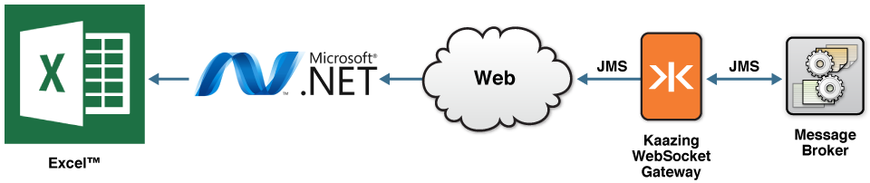
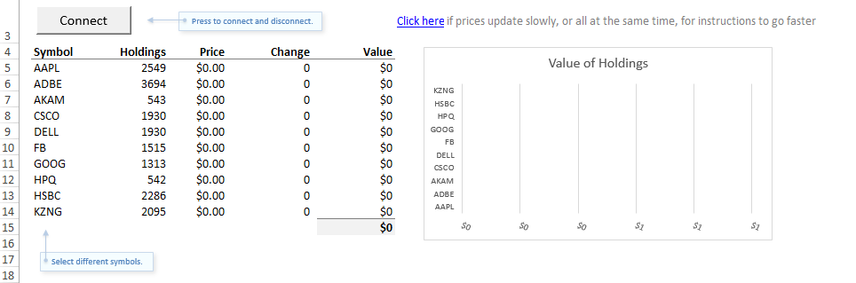
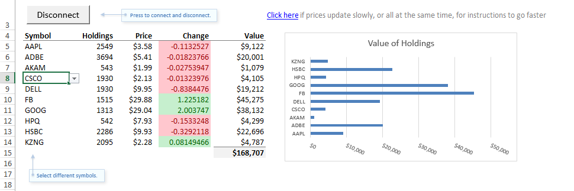

In this walkthrough, you will learn how to build a Microsoft Excel™ spreadsheet and Windows real-time data (RTD) server to communicate with a JMS-compliant message broker (Apache ActiveMQ) via the KAAZING Gateway. This topic has the following sections:

-   [What You Will Accomplish](#what-you-will-accomplish)
-   [Before You Begin](#before-you-begin)
-   [Architecture Overview](#architecture-overview)
-   [Co-located Excel and RTD Server](#co-located-excel-and-rtd-server)
-   [Running the Excel Demo](#running-the-excel-demo)
-   [Configure the RTD Throttle Interval In Excel](#configure-the-rtd-throttle-interval-in-excel)
-   [Excel RTD Worksheet Function Syntax and JMS Messages](#excel-rtd-worksheet-function-syntax-and-jms-messages)
-   [VBA Wrapper Functions](#vba-wrapper-functions)
-   [Reviewing the Visual Studio Project for the Demo](#reviewing-the-visual-studio-project-for-the-demo)
-   [Building a Custom RTD server for KAAZING Gateway](#building-a-custom-rtd-server-for-kaazing-gateway)
-   [Troubleshooting](#troubleshooting)
-   [Summary](#summary)
-   [Resources](#resources)

**Note:** Learn about supported browsers, operating systems, and platform versions in the <a href="../release-notes.html">Release Notes</a>.

What You Will Accomplish
------------------------

In this walkthrough, a .NET demo created using KAAZING Gateway JMS .NET client libraries will enable an end user to view topics and messages from a JMS-compliant message broker in an Excel spreadsheet. This walkthrough uses the out of the box Excel RTD server demo that is included with the Gateway as the example, but you can follow the same steps to build your own RTD server that will allow an Excel spreadsheet to display real-time data from a JMS-compliant message broker.

Before You Begin
----------------

Before starting this walkthrough, your system needs the following:

-   KAAZING Gateway - Enterprise Edition. See [Setting Up KAAZING Gateway](https://github.com/kaazing/gateway/blob/develop/doc/about/setup-guide.md).
-   JMS-compliant message broker (Apache ActiveMQ).
-   Microsoft Excel™ 2003 or higher (minimum requirement).
-   Microsoft .NET Framework 4.5 (minimum requirement).
-   Microsoft Visual Studio 2010 (minimum requirement).
-   Windows Vista, Windows 7, or Windows 8 (minimum requirement).

Architecture Overview
---------------------

The following image describes the KAAZING Gateway Excel RTD Server JMS solution architecture.



**Figure 1: KAAZING Gateway Excel RTD Server JMS Solution Architecture**

When Excel is integrated with the Gateway, the following components and data flow are at work:

-   Client computer

    -   The Excel spreadsheet is open and receiving data from the RTD server. The cells in the spreadsheet are updated by the RTD server data.
    -   The RTD server is running locally, on the same computer as the Excel spreadsheet. The Excel spreadsheet loaded the RTD server DLL using the `ProgId` when it was opened by the user.
-   Servers

    -   The Gateway is running and receiving the client connection from the RTD server using KAAZING Gateway .NET JMS client libraries. (In the out of the box demo described in this topic, a demo stock ticker service is running on the same server as the Gateway.)
    -   A JMS-compliant message broker (Apache ActiveMQ) is running on a server and connected to the Gateway.

Co-located Excel and RTD Server
-------------------------------

In the out of the box demo included with the Gateway, the Excel spreadsheet and the RTD server are running co-located on the same client computer. It is possible to run an RTD server and Excel on separate computers and communicate with each other using DCOM.

The RTD server is simply a COM object that implements the `IRtdServer` interface. Excel includes an `IRTDUpdateEvent` interface. The RTD server and Excel communicate with each other by calling into these interfaces. This is done through COM when the RTD server is running on the local computer, and it is done through DCOM when the RTD server is on a separate computer. For more information, see [Real-Time Data: Frequently Asked Questions](http://msdn.microsoft.com/en-us/library/aa140060%28v=office.10%29.aspx "Real-Time Data: Frequently Asked Questions") from Microsoft.

Running the Excel Demo
----------------------

The Gateway includes an out of the box demo of Excel and RTD server integration with the Gateway. The following steps describe how to view and examine the demo.

**Note:** The demo uses Excel and RTD server for a generic example using JMS messages and message properties. If you want to deploy a solution using other elements or features of JMS messages such as MapMessage, etc, you must build your own RTD server and Excel spreadsheet.

1.  Download and install the full assembly of the Gateway as described in [Setting Up KAAZING Gateway](https://github.com/kaazing/gateway/blob/develop/doc/about/setup-guide.md).
2.  Extract the zip file **Kaazing.JMS.RealTimeStockTickerExcelDemo.zip** in `GATEWAY_HOME\demo\excel`.
3.  In the extracted folder, run setup.exe. For the setup wizard to install the Excel spreadsheet, the RTD server, and the Visual Studio project files.
    By default on a 64-bit system, the Excel spreadsheet and the Visual Studio project files are installed here: `C:\Program Files (x86)\KAAZING\Real-Time Excel JMS Demo`.
    **Note:** When setup.exe is executed on a 64-bit machine that has both 32-bit and 64-bit Microsoft .NET installed, setup.exe registers the RTD Server DLL (`Kaazing.JMS.RealTimeStockTickerExcelDemo.dll`) as a COM assembly for both 32-bit and 64-bit environments. This dual registration enables both 32-bit and 64-bit versions of Excel to use the RTD server.

4.  Start Apache ActiveMQ as described in [Setting Up KAAZING Gateway](https://github.com/kaazing/gateway/blob/develop/doc/about/setup-guide.md).
5.  Start the demo services by navigating to the `GATEWAY_HOME\bin` directory and running the **demo-services.start.bat** script.
6.  Start the Gateway. In Windows Explorer, navigate to the `GATEWAY_HOME\bin` directory and double-click the **gateway.start.bat** script. If you installed the Gateway using the installer, the Gateway is currently running.
7.  Open the Excel spreadsheet installed by **setup.exe**. By default for 64-bit systems, the Excel spreadsheet and the Visual Studio project files are installed here: `C:\\Program Files (x86)\\KAAZING\\Real-Time Excel JMS Demo`.

    

    **Figure 2: Excel Spreadsheet for RTD Server Connection**

8.  When the spreadsheet is open, click the **Configuration** spreadsheet (second spreadsheet in the workbook). This sheet contains the Excel-to-RTD server connection configuration values that you can modify. Modify the URL value to point to the hostname of the server running the Gateway, if the Gateway is not running locally (**localhost** is the default).
9.  On the **Portfolio** spreadsheet, click the **Connect** button. The cells of the spreadsheet are updated with new values from the JMS messages received by the RTD server.

    

    **Figure 3: Excel Spreadsheet Connected**

    If you do not see any data, go to the **Configuration** sheet and check that the **URL** is correct. As a test, open a browser on the URL `http://localhost:8001/demo/index.html`, and click the **JavaScript Stock Demo**. Paste the URL from the spreadsheet into the stock demo **Location** field and click **Connect**. If you do not see data, then there is something wrong with connectivity to the Gateway. If you do see data, then there is something wrong with the spreadsheet connection to the RTD server.

10. Customize the interval of the updates to the spreadsheet by following the steps in [Configure the RTD Throttle Interval In Excel](#configure-the-rtd-throttle-interval-in-excel), and then learn how the spreadsheet formulas work in [Excel RTD Worksheet Function Syntax and JMS Messages](#excel-rtd-worksheet-function-syntax-and-jms-messages).

Configure the RTD Throttle Interval In Excel
--------------------------------------------

If the stock prices (JMS messages) in a spreadsheet do not update rapidly, or they all appear to refresh simultaneously, the most likely cause is that the Excel **Application.RTD.ThrottleInterval** setting is too low. The throttle interval is how frequently Excel refreshes data from the RTD server. The default setting is 2000 milliseconds (2 seconds).

To change the settings, follow these instructions:

1.  Press **Alt+F11** to open the Visual Basic Editor. You can also press the Visual Basic button on the **Developer** tab of the ribbon.
2.  Open the **Immediate Window**, if it is not already open. You can press **Ctrl+G** or select **View \> Immediate Window** from the menu.
3.  In the **Immediate Window**, type `? Application.RTD.ThrottleInterval` and press **Enter**. This will query the current value of the setting.
4.  Still in the **Immediate Window**, type `Application.RTD.ThrottleInterval=100` and press **Enter**. This command sets the throttle interval to 100 milliseconds. You can set it to any value you like. If you set it to 0, then Excel will check for changes from the RTD as fast as possible. The setting is permanently saved in Excel. All spreadsheets will use the new setting.
5.  To check that your setting worked, repeat Step \#3. For example:

        ? Application.RTD.ThrottleInterval
          2000
        Application.RTD.ThrottleInterval=100
        ? Application.RTD.ThrottleInterval
          100

6.  Go back to the **Portfolio** spreadsheet and the stock prices should update rapidly.

For more information, see the **Application.RTD.ThrottleInterval** setting in the Excel RTD documentation: [http://msdn.microsoft.com/en-us/library/aa140060%28v=office.10%29.aspx#odc_xlrtdfaq_howconfigrtdthrottle](http://msdn.microsoft.com/en-us/library/aa140060%28v=office.10%29.aspx#odc_xlrtdfaq_howconfigrtdthrottle).

Excel RTD Worksheet Function Syntax and JMS Messages
----------------------------------------------------

The Excel spreadsheet uses the RTD function to retrieve real-time data from a program that supports COM automation (the RTD server). For details of the architecture, see [What Mechanism Does the New RTD Architecture Use?](http://msdn.microsoft.com/en-us/library/aa140060%28v=office.10%29.aspx#odc_xlrtdfaq_whatmechanuse "Real-Time Data: Frequently Asked Questions") from Microsoft.

Before looking at the function, look at a JMS message sent from the JMS-compliant message broker:

``` txt
Destination: /topic/ticker
Property: price=5.7656646
Property: symbol=AAPL
Property: change=-0.08004072
Property: company=Apple
```

The message is very simple, and uses a number of properties to pass values:

| Message Element | Description                                                                                                                                                                                                                       | Example Value   |
|:----------------|:----------------------------------------------------------------------------------------------------------------------------------------------------------------------------------------------------------------------------------|:----------------|
| Destination     | The prefix of the topics or queues to subscribe to. This will be appended by the symbol.                                                                                                                                          | `/topic/ticker` |
| price           | The property name on the messages that hold the price.                                                                                                                                                                            | `5.7656646`     |
| symbol          | The property name used to discriminate messages. For example, in this case, messages have a property called `"symbol"` with a value that is a stock symbol. This is how the messages are matched to the cells in the spreadsheet. | `AAPL`          |
| change          | The property name on the message that holds the change in stock price value.                                                                                                                                                      | `-0.08004072`   |
| company         | The property name on the message that holds the company name.                                                                                                                                                                     | `Apple`         |

Now let's look at the Excel RTD formula syntax to see what arguments are available to the JMS message:

``` txt
RTD(ProgID, server, topic1, [topic2], ...)
```

The following table describes the formula arguments.

| RTD Formula Argument | Argument Description                                                                                                                                                                                                                                                                          |
|:---------------------|:----------------------------------------------------------------------------------------------------------------------------------------------------------------------------------------------------------------------------------------------------------------------------------------------|
| ProgID               | Required. The name of the ProgID of a registered COM automation add-in that has been installed on the local computer. The name must be enclosed in quotation marks. For the out of the box demo, the name used in the spreadsheet was specified when the DLL was registered by the installer. |
| server               | Required, but may be blank. The name of the server where the add-in should be run. If there is no server, and the program is run locally, as with the Excel RTD Server JMS Demo, the argument is left blank. Otherwise, enter quotation marks ("") around the server name.                    |
| topic1               | topic1 is required.                                                                                                                                                                                                                                                                           |
| topic2               | Subsequent topics are optional.                                                                                                                                                                                                                                                               |
| ...                  | Subsequent topics are optional.                                                                                                                                                                                                                                                               |

For a full description of the formula, see [RTD function](http://office.microsoft.com/en-us/excel-help/rtd-function-HP010342864.aspx "RTD function - Excel - Office.com") from Microsoft.

Here is how the JMS message properties (see above) are used in the KAAZING Gateway version of the RTD formula syntax:

``` txt
RTD(ProgID,,location, destination, discriminator, property_name)
```

**Notes:**
-   All parameters are mandatory for the RTD server that is included with the Gateway.
-   The `destination` must be a URI (for example, `ws://localhost:80/jms`).
-   The format of the `discriminator` is `Property Name=Value` (for example, `symbol=AAPL`).

This formula can be applied to any spreadsheet cell. When the values from a spreadsheet are included, the formula could be filled in as follows:

``` txt
RTD("KaazingStockTickerExcelDemo.RtdServer",,”ws://localhost:8001/jms”, “/topic/ticker.AAPL”, “symbol=AAPL”, “price”)
```

The following table describes the values in this example:

| Example Value                           | Description                                                                                                                                                                                 |
|:----------------------------------------|:--------------------------------------------------------------------------------------------------------------------------------------------------------------------------------------------|
| “KaazingStockTickerExcelDemo.RtdServer” | This ProgID name is configured in the Visual Studio project when creating the RTD server.                                                                                                   |
| blank                                   | In our example, the RTD server is co-located with the Excel spreadsheet, and therefore no value is supplied to this argument.                                                               |
| “ws://localhost:8001/jms”               | The WebSocket URI of the JMS service running on the Gateway, `ws://localhost:8001/jms`. The required topic1 argument is an ideal location for this value because the URI is also mandatory. |
| “/topic/ticker.AAPL”                    | The destination prefix of the JMS message subscription.                                                                                                                                     |
| “symbol=AAPL”                           | The discriminator. This value is used to match JMS messages to the cells in the spreadsheet.                                                                                                |
| “price”                                 | The property name on the messages that hold the price of the stock. If you review the JMS message above, other options are `change` and `company`.                                          |

VBA Wrapper Functions
---------------------

Rather than use the entire RTD formula for every cell in the spreadsheet, you can create a Visual Basic for Applications (VBA) function that handles the connection to the RTD server. For example, if you wanted to display a stock price for a stock symbol, you could use the following formula:

``` txt
=VALUE(TICK($B5, pricePropertyName))
```

Where `$B5` references a cell containing the stock symbol `AAPL`, and `pricePropertyName` is a the name of the cell that displays the price. The formula passes the stock symbol from `$B5` and the price cell name (`pricePropertyName`) to the `TICK` function. The `TICK` VBA function is as follows:

``` vbnet
' Global variable so we know if we're connected or not.
Dim isConnected As Boolean

' Function called by cells that want to receive stock prices
Function TICK(Security, Property)

    ' Only show data if we're connected.
    If isConnected Then

        ' The URL of the gateway that the RTD server will connect to.
        ' Example: ws://localhost:80/jms
        Dim url As String
        url = Range("url")

        ' The topic or queue that the RTD server will subscribe to.
        ' Example: /topic/ticker.KZNG
        Dim destination As String
        destination = Range("destinationBase") & UCase(Security)

        ' The query to bind the destination to this cell.
        ' Example: symbol=KZNG
        Dim predicate As String
        predicate = Range("discriminatorPropertyName") & "=" & UCase(Security)

        Dim tickUpdate As String
        tickUpdate = Excel.Application.WorksheetFunction.RTD("KaazingStockTickerExcelDemo.RtdServer", "", url, destination, predicate, Property)

        If tickUpdate = "#N/A Requesting ..." Then
            ' The RTD server returns this when there is no data yet.
            ' Show 0 until we have data.
            tickUpdate = "0"
        End If

        TICK = tickUpdate
    Else
        TICK = "0"
    End If

End Function

' Called when the connect/disconnect button is clicked.
Sub doConnectButton()
    Dim connectBut As Button
    Set connectBut = ActiveSheet.Buttons("connectBut")

    isConnected = Not isConnected

    If isConnected Then
        connectBut.Caption = "Disconnect"
        ' Trigger the spreadsheet formulae to start updating again.
        Application.CalculateFull
    Else
        connectBut.Caption = "Connect"
    End If
End Sub
```

Reviewing the Visual Studio Project for the Demo
------------------------------------------------

When you install the Excel RTD Server JMS Demo, the Visual Studio project used to create the demo is also installed. You can review this project to learn how a simple implementation of the `IRtdServer` using the KAAZING Gateway JMS .NET Client Library can be created.

1.  Open the Visual Studio project. The default location for the Visual Studio project is: `C:\Program Files (x86)\KAAZING\Real-Time Excel JMS Demo\Kaazing.JMS.RealTimeStockTickerExcelDemo.csproj`
2.  In **Solution Explorer**, expand the **References** folder to see the references required for an Excel RTD server solution built using the KAAZING Gateway .NET JMS client libraries. Note the following required references:
    -   Kaazing.Gateway
    -   Kaazing.JMS
    -   Microsoft.Office.Interop.Excel

3.  Click the **Properties** icon to view the properties of the project.
4.  Click the **Application** tab, and then click **Assembly Information**. Note that the **Make assembly COM-Visible** option is selected. This option specifies whether types in the assembly will be available to COM.
5.  Click the **Build** tab. Note that **Platform target** setting is **Any CPU**. This ensures that the RTD server can run on both x86 and x64 systems.
6.  In **Solution Explorer**, expand the **src\\main\\csharp** folders. The C\# files for the RTD server are located here. Double-click **RtdServer.cs**.
7.  In **RtdServer.cs**, note the ProgId of the class:

    ``` vbnet
    ProgId("KaazingStockTickerExcelDemo.RtdServer")
    ```

    The string in the ProgId, `KaazingStockTickerExcelDemo.RtdServer`, is the same name used when connecting to the RTD server from Excel:

    ``` vbnet
    RTD("KaazingStockTickerExcelDemo.RtdServer",,”ws://localhost:8001/jms”, “/topic/ticker.AAPL”, “symbol=AAPL”, “price”)
    ```

    The ProgId value must always be used when connecting to the RTD server created from the Visual Studio project.

Building a Custom RTD server for KAAZING Gateway
------------------------------------------------

The following procedure provides a high-level overview of the major steps involved in creating a custom RTD server for KAAZING Gateway using Visual Studio. The following project is a C\# Class Library, but you can create the Class Library using another supported language.

1.  Ensure that you have the following requirements:

    -   A .NET Integrated Development Environment (IDE), such as Visual Studio.
    -   Microsoft .NET Framework 4 with Microsoft .NET Framework 4 Patch KB2468871 (download the patch from [http://www.microsoft.com/download/en/details.aspx?displaylang=en&id=3556](http://www.microsoft.com/download/en/details.aspx?displaylang=en&id=3556). This patch is required for building or running .NET clients using the KAAZING Gateway .NET JMS Client Library.

2.  Download and install the Gateway as described in [Setting Up KAAZING Gateway](https://github.com/kaazing/gateway/blob/develop/doc/about/setup-guide.md).
3.  Open Visual Studio as the system administrator (**Run as administrator**).
4.  Create and name a new C# class library project.

    1.  Click **File**, and then click **New Project**.
    2.  In **Installed Templates**, expand **Visual C\#**, click **Windows**, and click **Class Library**.
    3.  In **Name**, enter a name for the project and click **OK**.

5.  Configure the project properties.

    1.  Click the **Properties** icon to view the properties of the project.
    2.  Click the **Application** tab, and then click **Assembly Information**. Select the **Make assembly COM-Visible** option. This option specifies whether types in the assembly will be available to COM.
    3.  Click the **Build** tab. In **Platform target**, select **Any CPU**. This ensures that the RTD server can run on both x86 and x64 systems.

6.  Add references to the required libraries.

    1.  In **Solution Explorer**, right-click **References** and then click **Add Reference**.
    2.  In the **Add Reference** dialog, click the **Browse** tab.
    3.  Locate the KAAZING Gateway .NET JMS client libraries: `GATEWAY_HOME\lib\client\dotnet\Release`.
    4.  Select **Kaazing.Gateway.dll** and **Kaazing.JMS.dll** and click **OK**.
    5.  In **Solution Explorer**, right-click **References** and then click **Add Reference**.
    6.  In the **Add Reference** dialog, click the **.NET** tab.
    7.  Locate and click **Microsoft.Office.Interop.Excel**, and then click **OK**.

7.  Add the RTD server class.

    1.  Review the RTD server class in the Visual Studio project included with the Gateway. Follow the steps in [Reviewing the Visual Studio Project for the Demo](#reviewing-the-visual-studio-project-for-the-demo) to install the Visual Studio project, open the project, and then review the code and comments in the **RtdServer.cs** file (**src/main/csharp/RtdServer.cs**).
    2.  Ensure that you include the required classes:

        ``` vbnet
        using Kaazing.JMS;
        using Kaazing.JMS.Stomp;
        using Kaazing.JMS.Util;
        using Microsoft.Office.Interop.Excel;
        ```

    3.  Do not hardcode the Gateway JMS service URI (for example, `ws://gateway.example.com:80/jms`) in the class. This precaution will prevent the need to recompile the project when the URI changes from development to test and production environments. Instead, have the location passed from Excel to the RTD server via the RTD function.
    4.  Note the name of the ProgId in your main RTD server class, for example:

        ``` vbnet
        ProgId("KaazingStockTickerExcelDemo.RtdServer")
        ```

        The string in the ProgId must be used when connecting to the RTD server from Excel, for example:

        ``` vbnet
        RTD("KaazingStockTickerExcelDemo.RtdServer",,”ws://localhost:8001/jms”, “/topic/ticker.AAPL”, “symbol=AAPL”, “price”)
        ```

8.  Add the Message Listener and Exception Listener classes.

    1.  As with the RTD server class, review the Message Listener and Exception Listener classes in the Visual Studio project included with the Gateway.
    2.  Ensure that you include the KAAZING Gateway JMS class:

        ``` vbnet
        using Kaazing.JMS;
        ```

9.  Build the DLL for the RTD server. In **Solution Explorer**, right-click your project and click **Build**.

10. Register the DLL using the **Regasm** assembly registration tool. The DLL you built must be registered as a COM assembly with the operating system before it can be used by Excel. If your RTD server will be running on a 64-bit machine that has both 32-bit and 64-bit Microsoft .NET installed, register the RTD server DLL as a COM assembly for both 32-bit and 64-bit environments. This will allow both 32-bit and 64-bit versions of Excel to use the RTD server.

    1.  Use the following steps to open Visual Studio Command Prompt: [http://msdn.microsoft.com/en-us/library/ms229859(v=vs.110).aspx](http://msdn.microsoft.com/en-us/library/ms229859(v=vs.110).aspx)
    2.  Register using **regasm**. For example:

        `c:\Windows\Microsoft.NET\Framework\v4.0.30319\RegAsm.exe /codebase C:\development\RtdServer.dll`

        Note: There are different **regasm** programs for the different operating systems:

        -   32-bit — `c:\Windows\Microsoft.NET\Framework\v4.0.30319\RegAsm.exe`
        -   64-bit — `c:\Windows\Microsoft.NET\Framework64\v4.0.30319\RegAsm.exe`

Troubleshooting
---------------

If the spreadsheet is updated slowly, consider changing the Throttle Interval setting in Excel. For more information, see [Configure the RTD Throttle Interval In Excel](#configure-the-rtd-throttle-interval-in-excel).

Excel Trust Center settings can influence how a spreadsheet reacts to application Add-ins and External Content. If you experience trust errors in Excel, try disabling Trust Center settings for Add-ins and External Content.

Summary
-------

In this walkthrough, you learned how to install and run the out of the box KAAZING Gateway Excel RTD JMS demo, how the RTD formula works with the RTD server and the Gateway to receive JMS messages, and you were given a high-level overview of how to build your own RTD server using KAAZING Gateway .NET JMS client libraries.

Resources
---------

-   Real-Time Data FAQ from Microsoft, which includes information on the Excel throttling property ([http://msdn.microsoft.com/en-us/library/aa140060%28v=office.10%29.aspx#odc_xlrtdfaq_howconfigrtdthrottle](http://msdn.microsoft.com/en-us/library/aa140060%28v=office.10%29.aspx#odc_xlrtdfaq_howconfigrtdthrottle)).
-   How to set up and use the RTD function in Excel ([http://support.microsoft.com/kb/289150](http://support.microsoft.com/kb/289150)).
-   How to create a RTD server for Excel ({http://support.microsoft.com/kb/285339}(http://support.microsoft.com/kb/285339)).
-   RTD function ([http://office.microsoft.com/en-us/excel-help/rtd-function-HP010342864.aspx](http://office.microsoft.com/en-us/excel-help/rtd-function-HP010342864.aspx)).
