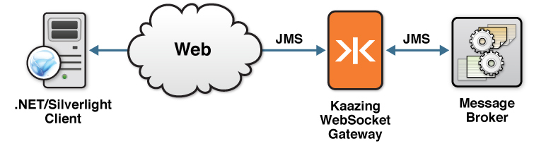

Checklist: How to Build Microsoft .NET and Silverlight JMS Clients Using KAAZING Gateway  
===============================================================================================================

This checklist provides the steps necessary to use the signed KAAZING Gateway JMS client libraries for Microsoft .NET and Silverlight to enable your .NET Framework or Silverlight application to communicate with any JMS-compliant message broker, such as Apache ActiveMQ.

| \# | Step                                                                                                                   | Topic or Reference                                                                                                                                       |
|:---|:-----------------------------------------------------------------------------------------------------------------------|:---------------------------------------------------------------------------------------------------------------------------------------------------------|
| 1  | Learn about supported browsers, operating systems, and platform versions.                                              | [Release Notes](../release-notes.html)                                                                                                                   |
| 2  | Learn how to use the KAAZING Gateway JMS client libraries for .NET and Silverlight and the supported methods.          | [Use the KAAZING Gateway JMS Client Libraries for .NET and Silverlight](#use-the-kaazing-gateway-jms-client-libraries-for-net-and-silverlight)           |
| 3  | Learn how to program your client to respond to authentication challenges from the Gateway.                             | [Secure Your Microsoft .NET and Silverlight Client](#secure-your-microsoft-net-and-silverlight-client)                                                   |
| 4  | Learn how to gather data on KAAZING Gateway .NET and Silverlight JMS clients.                                          | [Display Logs for .NET and Silverlight JMS Clients](#display-logs-for-net-and-silverlight-jms-clients)                                                   |
| 5  | Troubleshoot the most common issues that occur when using Microsoft .NET and Silverlight JMS clients with the Gateway. | [Troubleshoot Your Microsoft .NET and Silverlight JMS Clients](#troubleshoot-your-microsoft-net-and-silverlight-jms-clients)                             |
| 6  | Migrate your KAAZING Gateway 4.x clients to KAAZING Gateway 5.0.x.                                                     | [Migrate Microsoft .NET and Silverlight Applications to KAAZING Gateway 5.0](#migrate-microsoft-net-and-silverlight-applications-to-kaazing-gateway-50x) |

Introduction
----------------------------------------

This checklist contains information for a .NET or Silverlight developer who wants to build a .NET or Silverlight client and enable communication with a JMS-compliant message broker through the Gateway.

Overview of the KAAZING Gateway Client Libraries
----------------------------------------------------------------------------

KAAZING Gateway includes JMS client libraries, which allow clients to subscribe from and publish messages to a JMS-compliant message broker, such as Apache ActiveMQ. With the KAAZING Gateway JMS client libraries, you can leverage WebSocket in your application by building a client. This WebSocket client then enables communication between your application and the JMS-compliant message broker, as shown in the following figure:



**Figure: Enable communication between your application and the JMS-compliant message broker**

Refer to [About KAAZING Gateway - Enterprise Edition](../about/about.md) for more information about KAAZING Gateway - Enterprise Edition.

About the KAAZING Gateway JMS client libraries for Microsoft .NET and Silverlight
-----------------------------------------------------------------------------------------------------------------

KAAZING Gateway includes JMS client libraries that enable you to create JMS-based clients specifically for your .NET and Silverlight applications. As a .NET or Silverlight developer, you can use these APIs to publish and subscribe to JMS-based messages between your application and your message broker.

The KAAZING Gateway JMS client libraries for .NET and Silverlight expose capabilities similar to the Java Message Service (JMS) API, including the JMS concepts of connection, session, destination, message consumer, and message producer. Refer to the JMS API documentation, located at `http://www.oracle.com/technetwork/java/docs-136352.html`, for specific information about how to use each of the interfaces.

For a description of the methods currently supported by the KAAZING Gateway JMS client libraries for .NET and Silverlight, see [KAAZING Gateway JMS Client Libraries: Supported APIs](../about/kaazing-jms-api.md) and the .NET and Silverlight Client API ([Kaazing.JMS](http://developer.kaazing.com/documentation/jms/4.0/apidoc/client/dotnet/jms/html/N_Kaazing_JMS.htm), [Kaazing.JMS.Stomp](http://developer.kaazing.com/documentation/jms/4.0/apidoc/client/dotnet/jms/html/N_Kaazing_JMS_Stomp.htm), and [Kaazing.JMS.Util](http://developer.kaazing.com/documentation/jms/4.0/apidoc/client/dotnet/jms/html/N_Kaazing_JMS_Util.htm) documentation.

Overview of Microsoft Silverlight
-------------------------------------------------------------------

Microsoft Silverlight (Silverlight) is a browser plugin that enables rich Internet applications. It runs in browsers on the Microsoft Windows and Mac operating systems. Silverlight version 4.x provides support for .NET languages and development tools.

For more information about Silverlight, visit `http://www.microsoft.com/silverlight/`.

Overview of Microsoft .NET Framework
--------------------------------------------------------------------------

Microsoft .NET Framework (.NET) provides a common language runtime, base libraries, and development technologies to build applications for Microsoft Windows desktop, mobile and server platforms.

For more information about the .NET Framework, visit `http://www.microsoft.com/NET/`.

Use the KAAZING Gateway JMS Client Libraries for .NET and Silverlight
=====================================================================

In this procedure, you will learn how to use the signed KAAZING Gateway JMS client libraries for .NET and Silverlight and the supported methods.


**Note**: For this how-to, you can use any JMS-compliant message broker. By default, the Gateway is configured to connect to the server on tcp://localhost:61616. You can configure the connect URL in the file `GATEWAY_HOME/conf/gateway-config.xml`. See [About Integrating KAAZING Gateway and JMS-Compliant Message Brokers](https://github.com/kaazing/enterprise.gateway/blob/develop/doc/integration-jms/o_jms_integrate.md) for more information.


**Note:** Learn about supported browsers, operating systems, and platform versions in the [Release Notes](../release-notes.html).

To Use the JMS Client Libraries for .NET and Silverlight
--------------------------------------------------------

1.  Set up your development environment.

    To develop applications for Silverlight or the .NET Framework, you must install the a .NET Integrated Development Environment (IDE) such as Visual Studio or the free Visual Studio Express.

    **Note**: You can develop .NET and Silverlight Framework applications in any of the .NET programming languages. Microsoft Visual C\# is used in this how-to.

2.  Set up your .NET Framework environment.

    In addition to the Visual Studio IDE, .NET Framework application development also requires:

    -   A .NET Integrated Development Environment (IDE), such as Visual Studio or the free Visual Web Developer Express
    -   Microsoft .NET Framework 4 with Microsoft .NET Framework 4 Patch KB2468871 (download the patch from <http://www.microsoft.com/download/en/details.aspx?displaylang=en&id=3556>). This is required for building or running .NET clients using the KAAZING Gateway .NET Client Library.

    To use the KAAZING Gateway JMS client libraries for .NET and Silverlight, you must add a reference to the signed libraries located in the `.DLL` files **Kaazing.Gateway.dll** and **Kaazing.JMS.dll** to your .NET application. These files are in the directory `GATEWAY_HOME/lib/client/dotnet/Release`. Additional `.DLL`s may be required to program with other protocols.

    Applications based on the .NET Framework can use standard .NET Forms Controls or Windows Presentation Foundation (WPF). Note that there are slight differences in APIs for Controls, Threading and Dispatching behavior. The examples below illustrate event dispatching for WPF applications. WPF Applications, like Silverlight applications, consist of Extensible Application Markup Language (XAML) files and their corresponding code-behind classes `.XAML.CS` (in C\#).

    .NET Framework applications are typically deployed as an executable `.EXE` file. This executable references client library `.DLL` files that can be deployed in the same directory alongside the executable, or registered through an installation process.

3.  Set up your Silverlight environment.

    In addition to the Visual Studio IDE, Silverlight application development also requires:

    -   A .NET Integrated Development Environment (IDE), such as Visual Studio or the free Visual Web Developer Express
    -   Microsoft Silverlight 4 SDK
    -   The Silverlight 4 browser plugin

    To use the KAAZING Gateway JMS client libraries for .NET and Silverlight, you must add a reference to the signed libraries located in the `.DLL` files **Kaazing.Gateway.dll** and **Kaazing.JMS.dll** to your Silverlight project. These files are in the directory `GATEWAY_HOME/lib/client/dotnet/Release`.

    **Note**: You can develop Silverlight 4 applications in any of the .NET programming languages. Microsoft Visual C\# is used in this how-to.

    Silverlight applications primarily consist of Extensible Application Markup Language (XAML) files and their corresponding code-behind classes `.XAML.CS` (in C\#). The `.XAML` files typically contain the User Interface (UI) elements and the `.XAML.CS` files contain the page's code-behind classes.

    A typical Silverlight application is deployed as a compressed `.XAP` file. Adding the reference to the Silverlight client library `.DLL` file in your Silverlight application packages the `.DLL` file in your finished application. To deploy your Silverlight application `.XAP` file, you can host it on KAAZING Gateway. For example, you can place it in the web directory: `GATEWAY_HOME/web/base`.

4.  Review the out of the box demos that use the KAAZING Gateway Client Libraries for .NET and Silverlight.

    Before you start development, review a demonstration that was built with the KAAZING Gateway client libraries for .NET and Silverlight. To see this application in action, perform the following steps:

    1.  Start Apache ActiveMQ as described in [Setting Up KAAZING Gateway](https://github.com/kaazing/gateway/blob/develop/doc/about/setup-guide.md).
    2.  Start the Gateway as described in [Setting Up KAAZING Gateway](https://github.com/kaazing/gateway/blob/develop/doc/about/setup-guide.md).
    3.  In a browser, navigate to the out of the box demos at `http://localhost:8001/demo/`.
    4.  Click **Silverlight** or **.NET Framework** and follow the instructions on the demo page.

    The demo shows JMS standards being used in Microsoft .NET and Silverlight environments.

5.  Use the KAAZING Gateway .NET and Silverlight JMS client libraries to build your application.

    1.  Add the KAAZING Gateway JMS client libraries for .NET and Silverlight.

        To use the KAAZING Gateway JMS client libraries for .NET and Silverlight in your .NET or Silverlight application, you must include the libraries located in the DLL files **Kaazing.Gateway.dll** and **Kaazing.JMS.dll**. These files are in the KAAZING Gateway bundle in the directory `GATEWAY_HOME/lib/client/dotnet/Release`.

    2.  Set up the connection.

        Add an `IConnectionFactory`, which is an API provided by KAAZING Gateway JMS client libraries for .NET and Silverlight that captures the URL for the connection.

        ```
        IConnectionFactory connectionFactory =
           new StompConnectionFactory(new Uri("ws://localhost:8001/jms");
        ```

        Create a connection to the location you want to use:

        `IConnection connection = connectionFactory.CreateConnection(null, null);`

        Add the `ExceptionListener` that receives exceptions. In the following example, the `ExceptionListener` is a property of connection, and `ExceptionHandler` is a class that implements the `IExceptionListener` interface.

        ```
        connection.ExceptionListener = new ExceptionHandler;
        ```

        Then, create an implementation of the `IExceptionListener` interface:

        ```
        class ExceptionHandler : IExceptionListener
            {
               public void OnException(JMSException exc) {
               // Exception Handler code goes here
               }
            }
        ```

    3.  Create a session.

        After you create a connection, you must create a session, for example:

        `ISession = connection.CreateSession(false, SessionConstants.AUTO_ACKNOWLEDGE);`

    4.  Add an IMessageConsumer and an IMessageListener.

        After you set up the connections and create the session, add an `IMessageConsumer` for a destination. Then, add an `IMessageListener` that receives messages to the client. The `MessageListener` is a property on consumer, and implements the `ITextMessageHandler` interface.

        ```
        IMessageConsumer consumer = session.CreateConsumer(destination);
        consumer.MessageListener = new TextMessageHandler();
        ```

        **Note**: When setting up your message consumers and producers, you must use the format `"/topic/"` for regular topics.

    5.  Start the connection.

        Once the `IMessageConsumer` is created, start the message flow by starting the connection:

        `connection.start(); `

    6.  Create a Message and Message Producer.

        After you set up your connection and message handlers, you can create a message and a message producer to send to your back-end server by way of the Gateway:

        ```
        IMessage message = session.CreateTextMessage("Hello World");
        IMessageProducer producer = session.CreateProducer(null);
        producer.Send(destination, message);
        ```

    7.  Use MessageConstants.

        `MessageConstants` is an API class provided by the KAAZING Gateway JMS client libraries for .NET and Silverlight, and is the equivalent of constants in the `Message` interface in JMS. The following is an example of `MessageConstants`:

        `MessageConstants.DEFAULT_PRIORITY`

    8.  Add the IMessageListener that implements ITextMessageHandler.

        ```
        class TextMessageHandler : IMessageListener
        {
            public void OnMessage(IMessage message)
            {
                ITextMessage textMessage = (ITextMessage)message;
                Console.Out.WriteLine("We received this message: "+textMessage.Text);
            }
        }
        ```

    9.  Close the connection.

        At the end, cease the message flow by closing the connection:

        `connection.Close(); `

        You can also view a complex example of using the KAAZING Gateway JMS client libraries for .NET and Silverlight by opening the out of the box demo source files located in `GATEWAY_HOME/demo/dotnet/src/jms`. This is the source code for the demos.

Durable Subscribers
-------------------

 **Note:** Currently, the Gateway does not support durable subscribers with Apache ActiveMQ. You may use durable subscribers with [TIBCO EMS](https://github.com/kaazing/enterprise.gateway/blob/develop/doc/integration-jms/p_jms_integrate_tibco.md) or [Informatica UM](https://github.com/kaazing/enterprise.gateway/blob/develop/doc/integration-jms/p_jms_integrate_informatica.md). For more information, see [Durable Subscribers](https://github.com/kaazing/enterprise.gateway/blob/develop/doc/admin-reference/r_conf_jms.md#durable-subscribers).

If your JMS client needs to receive all of the messages published on a topic, including the ones published while the subscriber is inactive because it is not being used or has lost connections (which is common when using mobile devices), create a durable ITopicSubscriber using the [iSession.createDurableSubscriber()](http://developer.kaazing.com/documentation/jms/4.0/apidoc/client/dotnet/jms/html/N_Kaazing_JMS.htm) method.

To unsubscribe from a durable topic, use the [ISession.Unsubscribe()](http://developer.kaazing.com/documentation/jms/4.0/apidoc/client/dotnet/jms/html/N_Kaazing_JMS.htm) method.

The JMS provider retains a separate record of each durable subscription and ensures that all messages from the topic's publishers are retained until they are acknowledged by each durable subscriber or they have expired. Whether messages have been acknowledged is tracked separately for each durable subscriber, and each durable subscriber is identified by the combination of its name and the clientID (if any) set on the Connection. Ensure your application confirms that the clientID (if used) is unique to the user or device, or, if it does not use clientID's, ensure that the durable name is unique to the user or device.

One method you can use to ensure that the durable name is unique to the user or device without using a client ID is to create a variable that is a concatenation of the user name and durable name and use that variable when creating the durable subscription.

### Example

The following example creates a durable subscriber with message selector, sends one matching and one mismatching message to the subscription message selector, and verifies that only the matching is received.

```
String DURABLE_NAME = "durable_messageSelectorTest" + KZSystem.CurrentTimeMillis();
String CLIENT_ID = null;

/// Create the clientID variable
if (useClientID)
{
    CLIENT_ID = "client1";
}

StompConnectionFactory connectionFactory =
    new StompConnectionFactory(new Uri(GetStompProviderURL()));
IConnection connection =     
    useClientID ? connectionFactory.CreateConnection(null, null, CLIENT_ID) :
        connectionFactory.CreateConnection(null, null);
ISession session = connection.CreateSession(false, SessionConstants.CLIENT_ACKNOWLEDGE);
connection.Start();

/// Create the durable subscriber with message selector
String TOPIC_NAME = "/topic/topic_offlineDeliveryTest" + KZSystem.CurrentTimeMillis();
const String MESSAGE_SELECTOR1 = "prop='val1'";
ITopic topic = session.CreateTopic(TOPIC_NAME);
ITopicSubscriber consumer =
    session.CreateDurableSubscriber(topic, DURABLE_NAME, MESSAGE_SELECTOR1, false);

IConnection sendConnection = connectionFactory.CreateConnection(null, null);
ISession sendSession = sendConnection.CreateSession(false, SessionConstants.AUTO_ACKNOWLEDGE);
IMessageProducer producer = sendSession.CreateProducer(topic);

/// Sleep at the point to ensure the SUBSCRIBE went through for the createDurableSubscriber call
/// Otherwise, if the send message goes through before SUBSCRIBE, the message is not received.
Thread.Sleep(2000);

/// Send one matching and one mismatching message to the subscription message selector
producer.Send(sendSession.CreateTextMessage("1-MISMATCHING-MSG"));
ITextMessage message = sendSession.CreateTextMessage("2-MATCHING-MSG");
message.SetStringProperty("prop", "val1");
producer.Send(message);

/// Verify that only the matching message2 is received
ITextMessage received = (ITextMessage)consumer.Receive(5000);
Assert.IsNotNull(received, "Message sent while subscriber still open should have been received");
Assert.AreEqual("2-MATCHING-MSG", received.Text);
received.Acknowledge();

/// Close consumer (UNSUBSCRIBE)
consumer.Close();
connection.Close();
```

Notes
-----

-   The Microsoft .NET 4.0 Framework has a maximum connection limit of two per domain, similar to the browser limitation. For any Microsoft .NET application that uses more than one WebSocket connection at a time, you must either ensure that any WebSocket connection is closed by using `WebSocket.Close()` before opening another WebSocket connection, or increase the connection limit on the application by updating the `maxconnection` attribute in the `app.config` file. For more information, see **(KG-1851) Two Connection Limit in KAAZING Gateway JMS Clients for Microsoft .NET** in <a href="http://developer.kaazing.com/documentation/gateway/5.0/release-notes.html">Release Notes</a>.
-   Clients built using KAAZING Gateway 3.x libraries will work against KAAZING Gateway 4.x. If you wish to upgrade your 3.x client to the 4.x libraries, please note that the 3.x clients used a single Stomp JMS library and 4.x clients include and use separate WebSocket and Stomp JMS libraries. Update your client library file and code references to include both the WebSocket and Stomp JMS libraries, as described in the 4.x documentation.
-   For more information on the KAAZING Gateway JMS client libraries for .NET and Silverlight, see [KAAZING Gateway JMS Client Libraries: Supported APIs](../about/kaazing-jms-api.md) and the .NET and Silverlight Client API ([Kaazing.JMS](http://developer.kaazing.com/documentation/jms/4.0/apidoc/client/dotnet/jms/html/N_Kaazing_JMS.htm), [Kaazing.JMS.Stomp](http://developer.kaazing.com/documentation/jms/4.0/apidoc/client/dotnet/jms/html/N_Kaazing_JMS_Stomp.htm), and [Kaazing.JMS.Util](http://developer.kaazing.com/documentation/jms/4.0/apidoc/client/dotnet/jms/html/N_Kaazing_JMS_Util.htm) documentation.
-   `TemporaryTopic` and `TemporaryQueue` objects are destroyed when the client loses its connection to the Gateway, or when the JMS-compliant message broker loses its connection to the Gateway. To address this, monitor the client's exception listener to handle recovery for your application. Once the connection is re-established, recreate `TemporaryTopic` and `TemporaryQueue`. `ConnectionDroppedException` and `ConnectionInterruptedException` are delivered to the connection's exception listener via `onException`, indicating that messages in flight might be lost, depending on message delivery options. `ConnectionRestoredException` is delivered to indicate that the connection through to the JMS-compliant message broker has been re-established. `TemporaryTopic` and `TemporaryQueue` should be recreated at that time to resume operations.
-   You can verify that KAAZING Gateway has signed the relevant .NET DLL by selecting the DLL in the File Browser, then right-clicking and opening the **Properties** dialog. On the Digital Signatures tab, you can view the Name of Signer value and a timestamp of when the DLL was signed. The email address is "Not available." For more information, see [an example C program](http://msdn.microsoft.com/en-us/library/aa382384%28VS.85%29.aspx) that shows how to use the Microsoft mechanism to verify a signature (a DLL is one example of a Portable Executable, or PE, file). You can also learn more about [preventing DLL pre-loading attacks](http://support.microsoft.com/kb/2389418).


Secure Your Microsoft .NET and Silverlight Client
=================================================

Before you add security to your clients, follow the steps in [Checklist: Configure Authentication and Authorization](https://github.com/kaazing/gateway/blob/develop/doc/security/o_auth_configure.md) to set up security on KAAZING Gateway for your client. The authentication and authorization methods configured on the Gateway influence your client's security implementation. For information on secure network connections between clients and the Gateway, see [Checklist: Secure Network Traffic with the Gateway](https://github.com/kaazing/gateway/blob/develop/doc/security/o_tls.md).

To Secure Your Microsoft .NET and Silverlight Client
----------------------------------------------------

This section contains the following topics:

-   [Creating a Basic Challenge Handler](#creating-a-basic-challenge-handler)
-   [Managing Log In Attempts](#managing-log-in-attempts)
-   [Negotiate and Register a Location-Specific Challenge Handler](#negotiate-and-register-a-location-specific-challenge-handler)
-   [Using Wildcards to Match Sub-domains and Paths](#using-wildcards-to-match-sub-domains-and-paths)

Authenticating your client involves implementing a challenge handler to respond to authentication challenges from the KAAZING Gateway. If your challenge handler is responsible for obtaining user credentials, then you will also need to implement a login handler. For more information, see the [.NET and Silverlight Client API](http://developer.kaazing.com/documentation/5.0/apidoc/client/dotnet/gateway/html/N_Kaazing_HTML5.htm).

### Creating a Basic Challenge Handler

A challenge handler is a constructor used in an application to respond to authentication challenges from the KAAZING Gateway when the application attempts to access a protected resource. Each of the resources protected by the KAAZING Gateway is configured with a different authentication scheme (for example, `Basic`, `Application Basic`, or `Application Token`), and your application requires a challenge handler for each of the schemes that it will encounter or a single challenge handler that will respond to all challenges. Also, you can add a dispatch challenge handler to route challenges to specific challenge handlers according to the URI of the requested resource.

For information about each authentication scheme type, see [Configure the HTTP Challenge Scheme](https://github.com/kaazing/gateway/blob/develop/doc/security/p_authentication_config_http_challenge_scheme.md).

Clients with a single challenge handling strategy for all 401 challenges can simply set a specific challenge handler as the default using `ChallengeHandlers.Default`. The following is an example of how to implement a single challenge handler for all challenges:

```

public partial class HTML5DemoForm : Form
{
  private WebSocket webSocket = null;
  private WebSocketFactory factory = new WebSocketFactory();
  ...
  BasicChallengeHandler basicHandler = BasicChallengeHandler.Create();
  basicHandler.LoginHandler = new LoginHandlerDemo(this);
  ...
  factory.ChallengeHandler = basicHandler;
  webSocket = factory.CreateWebSocket();
...
```

### Managing Log In Attempts

When it is not possible for the KAAZING Gateway client to create a challenge response, the client must return `null` to the Gateway to stop the Gateway from continuing to issue authentication challenges.

The following .NET example demonstrates how to stop the Gateway from issuing further challenges.

```
public delegate void InvokeDelegate();

private const int maxRetries = 2;    // max retry number on wrong credentials
private int retry = 0;               // number of retry

/// <summary>
/// .Net HTML5 Demo Form
/// </summary>

public PasswordAuthentication AuthenticationHandler()
{
  PasswordAuthentication credentials = null;
  if (retry++ >= maxRetries)
  {
    return null;          // stop authentication when max retries reached
  }
  AutoResetEvent userInputCompleted = new AutoResetEvent(false);
  this.BeginInvoke((InvokeDelegate)(() =>
  {
    LoginDemoForm loginForm = new LoginDemoForm();
    if (loginForm.ShowDialog() == System.Windows.Forms.DialogResult.OK)
    {
      credentials = new PasswordAuthentication(loginForm.Username, loginForm.Password.ToCharArray());
    }
    else
    {
      //user click cancel button to stop the authentication
      retry = 0;     // reset retry counter
      credentials = null;  // return null to stop authentication process
    }
    userInputCompleted.Set();
  }));
  // wait user click 'OK' or 'Cancel' on login window
  this.BeginInvoke((InvokeDelegate)(() =>
  {
    Log("CONNECTED");

    retry = 0;     // reset retry counter
    DisconnectButton.Enabled = true;
    SendButton.Enabled = true;
  }));
  {
    Log("DISCONNECTED");

    retry = 0;     // reset retry counter
    ConnectButton.Enabled = true;
    DisconnectButton.Enabled = false;
    SendButton.Enabled = false;
    userInputCompleted.WaitOne();
    return credentials;
```

### Negotiate and Register a Location-Specific Challenge Handler

Client applications with location-specific challenge handling strategies can register a `DispatchChallengeHandler` object, on which location-specific `ChallengeHandler` objects are then registered. The result is that whenever a request matching one of the specific locations encounters a 401 challenge from the server, the corresponding `ChallengeHandler` object is invoked to handle the challenge.

The following example creates a challenge handler to handle authentications and uses `DispatchChallengeHandler` to assign different challenge handler to each location:

```
DispatchChallengeHandler dispatchHandler = DispatchChallengeHandler.Create();
LoginHandler loginHandler = new LoginHandlerDemo(this);
```

Next, set a `loginHandler` for this location:

```
BasicChallengeHandler basicHandler = BasicChallengeHandler.Create();
basicHandler.LoginHandler = loginHandler;
dispatchHandler.Register("ws://myserver.com/*", basicHandler);
```

Add another challenge handler for a second location:

```
BasicChallengeHandler basicHandler2 = BasicChallengeHandler.Create();
basicHandler2.LoginHandler = loginHandler2;
dispatchHandler.Register("ws://otherserver.com/*", basicHandler2);
factory.ChallengeHandler = dispatchHandler;
```

### Using Wildcards to Match Sub-domains and Paths

You can use wildcards (“\*”) when registering locations using `DispatchChallengeHandler`. Some examples of `locationDescription` values with wildcards are:

-   `*/` matches all requests to any host on port 80 (default port), with no user information or path specified.
-   `*.hostname.com:8000` matches all requests to port 8000 on any sub-domain of hostname.com, but not hostname.com itself.
-   `server.hostname.com:*/*` matches all requests to a particular server on any port on any path but not the empty path.

See Also
--------

[.NET and Silverlight Client API](http://developer.kaazing.com/documentation/5.0/apidoc/client/dotnet/gateway/html/N_Kaazing_HTML5.htm)

Display Logs for .NET and Silverlight JMS Clients
=================================================

In this procedure, you will learn how to gather data on KAAZING Gateway .NET and Silverlight JMS clients.

**Note:** Learn about supported browsers, operating systems, and platform versions in the [Release Notes](../release-notes.html).

To Display Logs for .NET and Silverlight JMS Clients
----------------------------------------------------

1.  Build your KAAZING Gateway .NET or Silverlight client, as described in [Use the KAAZING Gateway JMS Client Libraries for .NET and Silverlight](p_dev_dotnet_client_jms.md).
2.  To produce WebSocket-level debug output, add the Debug version of the client libraries (**Kaazing.Gateway.dll** and **Kaazing.JMS.dll**), located in `GATEWAY_HOME/lib/client/dotnet/Debug`.
3.  You can obtain additional debugging information by using a `Logger.LoggerCallback` statement and send the output to a log, as described in the following example:

    ```
    Logger.LoggerCallback = HandleLog;
    private void HandleLog(String message)
        {
            this.BeginInvoke((InvokeDelegate)(() =>
            {
                Log("LOG: " + message);
            }));
        }
    ```

You can view additional debugging information by using the `Kaazing.JMS.Util` namespace, then including the following statement in your code:

`set Tracer._DEBUG = true;`

See Also
--------

For more information about the KAAZING Gateway JMS client libraries for .NET and Silverlight, see [KAAZING Gateway JMS Client Libraries: Supported APIs](../about/kaazing-jms-api.md).

Troubleshoot Your Microsoft .NET and Silverlight JMS Clients
============================================================

This procedure provides troubleshooting information for the most common issues that occur when using KAAZING Gateway Microsoft .NET and Silverlight clients.

To Troubleshoot Your Microsoft .NET and Silverlight JMS Clients
---------------------------------------------------------------

The following are some things that can go wrong when using the .NET and Silverlight clients:

-   [Debug Log Produces an Error](#debug-log-produces-an-error)
-   [Delay to Initial Connection Request from the .NET Client](#delay-to-initial-connection-request-from-the-net-client)
-   [.NET client has reached connection limit](#net-client-has-reached-connection-limit)
-   [Expected messages are not being received for a queue or durable subscriber](#expected-messages-are-not-being-received-for-a-queue-or-durable-subscriber)
-   [Error when a deploying .NET Android client from Xamarin on a virtual device running Intel Atom CPU/ABI and Android API Level 19](#error-when-deploying-a-net-android-client-from-xamarin-on-a-virtual-device-running-intel-atom-cpuabi-and-android-api-level-19)

**Note:** Learn about supported browsers, operating systems, and platform versions in the [Release Notes](../release-notes.html).

### Debug Log Produces an Error

When debugging a Silverlight application from Visual Studio, the debug log gives you a disconnecting message or an error.

**Cause**

This message usually means that you are trying to debug a Silverlight application from Visual Studio and using the incorrect cross-site-constraint to connect to KAAZING Gateway services.

**Action**

A cross-site-constraint of \* is required to connect to KAAZING Gateway services when debugging Silverlight applications from Visual Studio using a `file:// `based URL.

### Delay to Initial Connection Request from the .NET Client

The initial WebSocket connection from the .NET client built using KAAZING Gateway client libraries for .NET and Silverlight is delayed by several seconds.

**Cause**

The delay may be caused by automatic proxy detection in Windows.

**Action**

To address this, if using Internet Explorer, choose **Options \> Connections tab \> LAN Settings**. Clear the Automatically Detect Settings checkbox and, if necessary, specify the proxy settings. In .NET applications, you can bypass the proxy settings by including the line `System.Net.WebRequest.DefaultWebProxy = null;` *before* the client initiates the WebSocket connection. If your application requires a proxy, change the null value in this line to the default proxy or follow [these instructions](http://msdn.microsoft.com/en-us/library/dkwyc043.aspx).

To get more troubleshooting information for your .NET and Silverlight clients, see [Display Logs for .NET and Silverlight Clients](../windows/p_clientlogging_dotnet_jms.md).

### .NET client has reached connection limit

The .NET client has reached a maximum connection limit per domain of two connections.

**Cause**

The Microsoft .NET 4.0 Framework has a maximum connection limit of two per domain, similar to the browser limitation.

**Action**

For any Microsoft .NET application that uses more than one WebSocket connection at a time, you must either ensure that any WebSocket connection is closed by using `WebSocket.Close()` before opening another WebSocket connection, or increase the connection limit on the application by updating the `maxconnection` attribute in the `app.config` file. For more information about the error and tuning .NET client connections, see **(KG-1851) Two Connection Limit in Kaazing JMS Clients for Microsoft .NET** in the <a href="http://developer.kaazing.com/documentation/gateway/5.0/release-notes.html">Release Notes</a>.

### Expected messages are not being received for a queue or durable subscriber

**Cause:**

If expected messages are not being received for a queue or durable subscriber, then it could be because the application has received messages without acknowledging them. The Gateway will send a maximum of [maximum.pending.acknowledgments](../admin-reference/r_conf_jms.md#maximumpendingacknowledgments) messages until the client acknowledges. The `maximum.pending.acknowledgments` property is set to 1 for JMS providers that do not support individual message acknowledgement.

**Action:**

If you are using a JMS provider other than Apache ActiveMQ or TIBCO Enterprise Message Service (TIBCO EMS), you must ensure your client applications acknowledge each message received from a queue or durable subscriber.

### Error when deploying a .NET Android client from Xamarin on a virtual device running Intel Atom CPU/ABI and Android API Level 19

**Cause:**

Deploying a .NET or Silverlight JMS client to Android from Xamarin on a virtual device created with Intel Atom CPU/ABI and Android API Level 19 may cause connection errors. See a similar issue [Application fails to deploy to Android Intel emulator on API 19 (Platform 4.4.2)](https://stackoverflow.com/questions/22672355/application-fails-to-deploy-to-android-intel-emulator-on-api-19-platform-4-4-2) on Stack Overflow.

**Solution:**

For more stable performance, use a virtual device created with the ARM CPU/ABI instead of the Intel Atom CPU/ABI.

Next Step
---------

You have completed the Microsoft .NET and Silverlight client procedures. For more information on client API development, see the [.NET and Silverlight Client API](http://developer.kaazing.com/documentation/5.0/apidoc/client/dotnet/gateway/html/N_Kaazing_HTML5.htm).

Migrate Microsoft .NET and Silverlight Applications to KAAZING Gateway 5.0.x
============================================================================

This topic explains how to migrate KAAZING Gateway 4.x Microsoft .NET and Silverlight clients to KAAZING Gateway 5.0.x.

**Notes:**

  -   The KAAZING Gateway Microsoft .NET and Silverlight library supports all platforms where Microsoft .NET Framework 4.5 is supported. To use the full RFC-6455 support in the KAAZING Gateway Microsoft .NET and Silverlight library requires Windows 8 or above.

To Migrate ByteSocket Applications to KAAZING Gateway 5.0.x
--------------------------------------------------------------

There are two issues when migrating to the KAAZING Gateway 5.0.x Microsoft .NET and Silverlight library:

1. To use the KAAZING Gateway 5.0.x Microsoft .NET and Silverlight library, use the NuGet package that contains all of the DLLs needed for all of the supported deployment environments. Starting with Visual Studio 2012, NuGet is included in every edition (except Team Foundation Server) by default.
    1. Install the [NuGet Command-Line Utility](https://docs.nuget.org/consume/installing-nuget).
    2. From the command-line, navigate to the library folder containing **Kaazing.WebSocket.nuspec**.
    2. Run the command, `nuget pack Kaazing.WebSocket.nuspec`. This will create the file **Kaazing.WebSocket.nupack**. Note the location of this file.
    3. Open the Visual Studio project for your client application.
    4. Click **Tools**, and then click **NuGet Package Manager**, and then **Package Manager Settings**.
    5. Click **Package Sources**.
    6. Click the plus sign (+) to add a new source.
    7. For the **Name**, enter **KAAZING**, and for **Source**, click **...** and navigate to the folder containing the file **Kaazing.WebSocket.nupack** and click **OK**.
    8. Click **Update** and then click **OK**.
    9. Click **Tools**, and then click **NuGet Package Manager**, and then **Manage NuGet Packages for Solution**.
    10. Click **All**, then click **KAAZING**. The **Kaazing.WebSocket** library appears.
    11. Click **Install**.
    12. In **Select Project**, select your project and click **OK**. The KAAZING Gateway Microsoft .NET and Silverlight client library is added to the project.
    13. To see the library package, in **Solution Explorer**, expand the **References** section. **Kaazing.WebSocket** is listed. You can double-click the package to see it in the **Object Explorer**.

2. Change the scope of the client authentication Challenge Handler code from global to connection-level. In KAAZING Gateway 4.x, the Challenge Handler scope was set globally. For example:

    ```
    //Set up ChallengeHandler to handle Basic/Application Basic authentications
    BasicChallengeHandler basicHandler = ChallengeHandlers.Load<BasicChallengeHandler>(typeof(BasicChallengeHandler));
    basicHandler.LoginHandler = new LoginHandlerDemo(this);
    ChallengeHandlers.Default = basicHandler;
    ```

    In KAAZING Gateway 5.0.x, the Challenge Handler scope is set at the connection level, using `WebSocketFactory()`. For example:

    ```
    factory = new WebSocketFactory();
    BasicChallengeHandler handler = BasicChallengeHandler.Create();
    handler.LoginHandler = new LoginHandlerDemo(this);
    factory.ChallengeHandler = handler;
    ```

See Also
--------

[.NET and Silverlight Client API](http://developer.kaazing.com/documentation/5.0/apidoc/client/dotnet/gateway/html/N_Kaazing_HTML5.htm)
