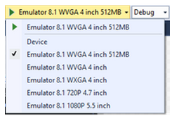

This topic provides the information needed to create a Microsoft Windows Phone 8.1 app using the KAAZING Gateway .NET and Silverlight WebSocket API.

For information on using the KAAZING Gateway .NET and Silverlight WebSocket API to create applications for Windows 8 Desktop and Surface Pro, Surface RT and Silverlight, and other Microsoft .NET Framework 4.5 or 4.0 environments, see [Build Microsoft .NET and Silverlight WebSocket Clients](https://github.com/kaazing/enterprise.dotnet.client/blob/develop/ws/ws/doc/o_dev_dotnet.md).

**Note:** The KAAZING Gateway .NET and Silverlight WebSocket API supports Windows Phone 8.1 and higher, Windows Mobile 10, and Windows Surface RT. It does not support Windows CE.


| # | Step                                                                                                      | Section or Reference                                                                                            |
|:--|:----------------------------------------------------------------------------------------------------------|:----------------------------------------------------------------------------------------------------------------|
| 1 | Learn how to use the WebSocket API provided by the KAAZING .NET and Silverlight WebSocket client library. | [Use the Microsoft Windows Phone WebSocket Client API](#use-the-microsoft-windows-phone-websocket-client-api)   |
| 2 | Learn how to authenticate your client with the Gateway.                                                   | [Secure Your Microsoft Windows Phone Client](#secure-your-microsoft-windows-phone-client)                       |
| 3 | Set up logging for your client.                                                                           | [Display Logs for the Microsoft Windows Phone JMS Client](#display-logs-for-the-microsoft-windows-phone-client) |


### Introduction

In this how-to, you will learn how to use the KAAZING Gateway Windows Phone client library to enable your Windows Phone client to communicate with KAAZING Gateway over WebSocket.

This document is for a Windows Phone developer who wants their Windows Phone client to communicate over WebSocket with KAAZING Gateway, which then connects to a back-end service.

This topic covers the following information:

- [Use the Microsoft Windows Phone WebSocket Client API](#use-the-microsoft-windows-phone-websocket-client-api)
    - [Components and Tools](#components-and-tools)
    - [Taking a Look at the Microsoft Windows Phone Client Demo](#taking-a-look-at-the-microsoft-windows-phone-client-demo)
    - [Primary Microsoft Windows Phone WebSocket API Features](#primary-microsoft-windows-phone-websocket-api-features)
    - [Supported Data Types](#supported-data-types)
    - [Build the Microsoft Windows Phone WebSocket Demo](#build-the-microsoft-windows-phone-websocket-demo)
    - [Demo Files](#demo-files)
- [Secure Your Microsoft Windows Phone Client](#secure-your-microsoft-windows-phone-client)
    - [Creating a Basic Challenge Handler](#creating-a-basic-challenge-handler)
- [Display Logs for the Microsoft Windows Phone Client](#display-logs-for-the-microsoft-windows-phone-client)

## Use the Microsoft Windows Phone WebSocket Client API

In this procedure, you will learn how to create a Windows Phone app using the KAAZING Gateway .NET and Silverlight WebSocket API. You will learn how to create a Visual Studio 2013 project and add the necessary references in order to use the .NET and Silverlight WebSocket API, and implement the .NET and Silverlight WebSocket API methods to enable your Windows Phone app to send and receive Echo messages with the Echo service running on a publicly available KAAZING Gateway at [http://www.websocket.org](http://www.websocket.org/).

### Components and Tools

Before you get started, review the components and tools used to build the Microsoft Windows Phone WebSocket client in this procedure.

| Component or Tool                         | Description                                                                                                                                                                                 | Location                                                                                                                                                                                                                                                              |
|:------------------------------------------|:--------------------------------------------------------------------------------------------------------------------------------------------------------------------------------------------|:----------------------------------------------------------------------------------------------------------------------------------------------------------------------------------------------------------------------------------------------------------------------|
| KAAZING Gateway.                          | KAAZING Gateway provides a highly scalable, near zero-latency, full-duplex solution for Custom Protocol applications.                                                                       | The KAAZING Gateway is available at [kaazing.com](http://kaazing.com/products/editions/kaazing-websocket-gateway-custom-protocol/). A public KAAZING Gateway is hosted at [websocket.org](http://www.websocket.org).                                                  |
| Target Framework or Environment           | Microsoft Windows Phone devices                                                                                                                                                             | Windows Phone website                                                                                                                                                                                                                                                 |
| Library for target deployment environment | The DLL needed to build a Microsoft Windows Phone WebSocket app. In the Microsoft Windows Phone WebSocket client library, there is a Visual Studio project that builds the DLL.             | The Visual Studio project file is **Kaazing.WebSocket.WindowsPhoneSilverlight.csproj**. The Microsoft Windows Phone WebSocket client library is available in the KAAZING Gateway distribution (TODO).                                                                 |
| Development Tool                          | Visual Studio                                                                                                                                                                               | [www.visualstudio.com](http://www.visualstudio.com)                                                                                                                                                                                                                   |
| Package Installer (optional)              | You can use the NuGet Package Manager to install the Microsoft Windows Phone WebSocket client library as a Nuget Package.                                                                   | Starting with Visual Studio 2012, NuGet is included in every edition (except Team Foundation Server) by default. Updates to NuGet can be found through the Extension Manager. For Visual Studio 2010, NuGet is available through the Visual Studio Extension Manager. |
| NuGet Command-Line (optional)             | NuGet Command-Line Utility                                                                                                                                                                  | [https://docs.nuget.org/consume/installing-nuget](https://docs.nuget.org/consume/installing-nuget)                                                                                                                                                                    |
| Secure Networking of TLS/SSL              | A Microsoft Windows Phone WebSocket client runs on Microsoft Windows Phone devices. Windows Phone devices manage TLS/SSL connections, requesting TLS/SSL certificates from KAAZING Gateway. | See the article, [Installing digital certificates](https://msdn.microsoft.com/en-us/library/dn643705.aspx), from Microsoft.                                                                                                                                           |

### Taking a Look at the Microsoft Windows Phone Client Demo

Take a look at the Microsoft Windows Phone Client Demo that was built with the Microsoft .NET and Silverlight client library. To see this demo in action, perform the following steps:

1. Go to [kaazing.org](http://www.kaazing.org) to fork or download the KAAZING Gateway Microsoft Windows Phone WebSocket demo. The Windows Phone Silverlight demo repo is located at [WindowsPhoneSilverlight](https://github.com/kaazing/enterprise.dotnet.client/tree/develop/ws/demo/WindowsPhoneSilverlight).

2. Build the demo by following the steps in the repo.

### Primary Microsoft Windows Phone WebSocket API Features

The Microsoft Windows Phone client library uses the KAAZING Microsoft .NET and Silverlight WebSocket API. The primary features of the Microsoft .NET and Silverlight WebSocket API involve common event handlers for opening and closing WebSocket connections, and for sending and receiving messages. The API features are discussed in the topic, [Use the Microsoft .NET and Silverlight WebSocket API](https://github.com/kaazing/enterprise.dotnet.client/blob/develop/ws/ws/doc/p_dev_dotnet_websocket.md#use-the-microsoft-net-and-silverlight-websocket-api), under [Primary WebSocket Microsoft .NET and Silverlight API Features](https://github.com/kaazing/enterprise.dotnet.client/blob/develop/ws/ws/doc/p_dev_dotnet_websocket.md#primary-websocket-microsoft-net-and-silverlight-api-features).

### Supported Data Types

You can send a WebSocket message using one of the following data types:

- String — A text WebSocket message (UTF-8).
- Binary (via the ByteBuffer class) — A compact byte array representation for sending, receiving and processing binary data using WebSocket.

### Build the Microsoft Windows Phone WebSocket Demo

The following procedure summarizes the Visual Studio steps and primary code elements used in the Microsoft Windows Phone Silverlight Demo available in the KAAZING Gateway distribution (TODO). At the end of this procedure, you will have a working Windows Phone WebSocket client that can send and receive Echo messages with the publicly available KAAZING Gateway hosted at [ws://echo.websocket.org](ws://echo.websocket.org).

The completed demo looks file the following:


1. Locate the KAAZING Gateway Microsoft Windows Phone library in the KAAZING Gateway distribution:

    1. In a browser, navigate to the folder containing the KAAZING Gateway Microsoft Windows Phone API. For information on the location, see [Components and Tools](#components-and-tools).

2. Open and build the Visual Studio project for the Windows Phone deployment environment, for example, the Windows Phone Silverlight project: **Kaazing.WebSocket.WindowsPhoneSilverlight.csproj**.

    2. Open **Kaazing.WebSocket.WindowsPhoneSilverlight.csproj** in Visual Studio. It is located in the KAAZING Gateway distribution (TODO).

    3. In Solution Explorer, right-click **Kaazing.WebSocket.WindowsPhoneSilverlight**, and click **Build**. The Console will display the build success. Once built, the DLL for the environment is located in the `Bin/Debug/wp81` folder of the distribution.

3. Add the DLL to your Visual Studio Windows Phone project or solution.

    4. To create a new Visual Studio Windows Phone project or solution, click **File**, click **New**, and then click **Project**.

    5. Name the project **EchoDemo**. This name is used in order that you can follow the code examples later in this procedure.

    6. In **Templates**, expand **Visual C#**, then expand **Windows Phone Apps**, and double-click **Blank App (Windows Phone Silverlight)**.

    7. For **Target Windows Phone OS Version**, select **Windows Phone 8.1** and click **OK**.

    8. In Solution Explorer, right-click **References**, and then click **Add Reference**. For more information, see [How to: Add or Remove References By Using the Add Reference Dialog Box](https://msdn.microsoft.com/en-us/library/wkze6zky.aspx).

    9. In **Reference Manager**, click **Browse**.

    10. Locate the **Kaazing.WebSocket.dll** file in `Bin/Debug/wp81` (TODO), click **Add**, and then click **OK** to close the reference dialog.

    11. To see the library package, in **Solution Explorer**, expand the **References** section. **Kaazing.WebSocket** is listed. You can double-click the package to see it in the **Object Browser**.

4. Create the main files for the program. The following steps demonstrate the primary programming steps involved in creating the demo or any client using the KAAZING Gateway Windows Phone client library.

    12. In your Visual Studio Windows Phone project, click **MainPage.xaml**.

    13. Replace the contents of **MainPage.xaml** with the code in [MainPage.xaml](https://github.com/kaazing/enterprise.dotnet.client/blob/develop/ws/demo/WindowsPhoneSilverlight/EchoDemo/MainPage.xaml) in the [Windows Phone Silverlight Demo repo](https://github.com/kaazing/enterprise.dotnet.client/tree/develop/ws/demo/WindowsPhoneSilverlight).

    14. Expand **MainPage.xaml** to reveal **MainPage.xaml.cs**.

    15. Replace the contents of **MainPage.xaml.cs** with the code in [MainPage.xaml.cs](https://github.com/kaazing/enterprise.dotnet.client/blob/develop/ws/demo/WindowsPhoneSilverlight/EchoDemo/MainPage.xaml.cs) in [Windows Phone Silverlight Demo repo](https://github.com/kaazing/enterprise.dotnet.client/tree/develop/ws/demo/WindowsPhoneSilverlight).

    16. Right-click **MainPage.xaml.cs** and then click **View Designer**. The designer displays the Windows Phone WebSocket Demo GUI.

    17. Right-click **MainPage.xaml.cs** and then click **View Code**. In the code you will notice an error on for LoginHandlerDemo(). LoginHandlerDemo() is used for managing client authentication.

    18. To add the authentication GUI to your app, right-click the project title, **EchoDemo**, click **Add**, and then click **New Item**.

    19.  In **Add New Item**, expand **Visual C#**, click **Windows Phone**, and then click **Windows Phone User Control**.     

    20. In **Name**, enter **LoginControl.xaml** and click **Add**.

    21. In Solution Explorer, right-click **LoginControl.xaml** and then click **View Designer**.

    22. Replace the contents of the user control code with the code in [LoginControl.xaml](https://github.com/kaazing/enterprise.dotnet.client/blob/develop/ws/demo/WindowsPhoneSilverlight/EchoDemo/LoginControl.xaml) in [Windows Phone Silverlight Demo repo](https://github.com/kaazing/enterprise.dotnet.client/tree/develop/ws/demo/WindowsPhoneSilverlight). This will give your app the GUI controls for authentication.

    23. In Solution Explorer, expand **LoginControl.xaml** and then click **LoginControl.xaml.cs**.

    24. Replace the contents of **LoginControl.xaml.cs** with the code in [LoginControl.xaml.cs](https://github.com/kaazing/enterprise.dotnet.client/blob/develop/ws/demo/WindowsPhoneSilverlight/EchoDemo/LoginControl.xaml.cs) in [Windows Phone Silverlight Demo repo](https://github.com/kaazing/enterprise.dotnet.client/tree/develop/ws/demo/WindowsPhoneSilverlight).

    25. To add the authentication code to your app, right-click the project title, **EchoDemo**, click **Add**, and then click **New Item**.

    26.  In **Add New Item**, expand **Visual C#**, click **Code**, and then click **Class**.

    27. In **Name**, enter **LoginHandlerDemo.cs** and click **Add**.     

    28. In Solution Explorer, expand **LoginHandlerDemo.cs** and click **LoginHandlerDemo**.

    29. Replace the contents of **LoginHandlerDemo** with the code in [LoginHandlerDemo.cs](https://github.com/kaazing/enterprise.dotnet.client/blob/develop/ws/demo/WindowsPhoneSilverlight/EchoDemo/LoginHandlerDemo.cs) in [Windows Phone Silverlight Demo repo](https://github.com/kaazing/enterprise.dotnet.client/tree/develop/ws/demo/WindowsPhoneSilverlight). If you return to **MainPage.xaml.cs**, you will see that the error for LoginHandlerDemo() is gone. You have added authentication to your app.

5. Run the Windows Phone WebSocket Demo on the [Windows Phone Emulator](https://msdn.microsoft.com/en-us/library/windows/apps/ff402563%28v=vs.105%29.aspx).

6. On the **Standard** toolbar, select **Emulator 8.1 WVGA 4 inch 512MB**.
      

7. To deploy and run your app without debugging, click the **DEBUG** menu, click **Start without Debugging**, or press **Ctrl+F5**.

8. In the emulator, in location, enter **ws://echo.websocket.org** and click **Connect**. The Log displays `CONNECTED`.

9. Click **Send**. The message is sent and the Echo message is returned:
    ``` bash
    SEND: Hello WebSocket!
    TEXT MESSAGE: Hello WebSocket!
    ```
10. Click the **Binary** checkbox and click **Send** again. The message is sent and the binary Echo message is returned:

    ``` bash
    SEND: Hello WebSocket!
    BINARY MESSAGE: 48-65-6C-6F-20-57-65-62-53-6F-63-6B-65-74-21
    ```

**Note:**

To install the KAAZING Gateway Microsoft Windows Phone library as a NuGet package (see [Components and Tools](#components-and-tools) for more information):

1. Install the [NuGet Command-Line Utility](https://docs.nuget.org/consume/installing-nuget).

2. From the command-line, navigate to the library folder containing **Kaazing.WebSocket.nuspec**.

3. Run the command, nuget pack Kaazing.WebSocket.nuspec. This will create the file **Kaazing.WebSocket.nupack**.

4. Create a new Visual Studio project or solution.

5. Click **Tools**, and then click **NuGet Package Manager**, and then **Package Manager Settings**.

6. Click **Package Sources**.

7. Click the plus sign (+) to add a new source.

8. For the **Name**, enter **KAAZING**, and for **Source**, click **...** and navigate to the file the file **Kaazing.WebSocket.nupack** and click **OK**.

9. Click **Update** and then click **OK**.

10. Click **Tools**, and then click **NuGet Package Manager**, and then **Manage NuGet Packages for Solution**.

11. Click **All**, then click **KAAZING**. The **Kaazing.WebSocket** library appears.

12. Click **Install**.

13. In **Select Project**, select your project and click **OK**. The KAAZING Gateway Microsoft .NET and Silverlight client library is added to the project.

14. To see the library package, in **Solution Explorer**, expand the **References** section. **Kaazing.WebSocket** is listed. You can double-click the package to see it in the **Object Browser**.

### Demo Files
The following demo files are used for the KAAZING Gaterway Microsoft Windows Phone WebSocket demo ([Windows Phone Silverlight app demo](https://github.com/kaazing/enterprise.dotnet.client/tree/develop/ws/demo/WindowsPhoneSilverlight)).

- [MainPage.xaml](https://github.com/kaazing/enterprise.dotnet.client/blob/develop/ws/demo/WindowsPhoneSilverlight/EchoDemo/MainPage.xaml)
- [MainPage.xaml.cs](https://github.com/kaazing/enterprise.dotnet.client/blob/develop/ws/demo/WindowsPhoneSilverlight/EchoDemo/MainPage.xaml.cs)
- [LoginControl.xaml](https://github.com/kaazing/enterprise.dotnet.client/blob/develop/ws/demo/WindowsPhoneSilverlight/EchoDemo/LoginControl.xaml)
- [LoginControl.xaml.cs](https://github.com/kaazing/enterprise.dotnet.client/blob/develop/ws/demo/WindowsPhoneSilverlight/EchoDemo/LoginControl.xaml.cs)
- [LoginHandlerDemo.cs](https://github.com/kaazing/enterprise.dotnet.client/blob/develop/ws/demo/WindowsPhoneSilverlight/EchoDemo/LoginHandlerDemo.cs)

## Secure Your Microsoft Windows Phone Client

This topic provides information on how to add user authentication functionality to KAAZING Gateway Windows Phone clients. The KAAZING Gateway Windows Phone Clients use the KAAZING Gateway Microsoft .NET and Silverlight API authentication classes and methods. For information on these authentication classes and methods, see [Secure Your Microsoft .NET and Silverlight Client](https://github.com/kaazing/enterprise.dotnet.client/blob/develop/ws/ws/doc/p_dev_dotnet_secure.md).

### Creating a Basic Challenge Handler

Authenticating your client involves implementing a challenge handler to respond to authentication challenges from the KAAZING Gateway. If your challenge handler is responsible for obtaining user credentials, then you will also need to implement a login handler.

Here is an example of a challenge handler and login handler for a Windows Phone app. The challenge handler manages the authentication challenge from the KAAZING Gateway, and the login handler is used to obtain the user credentials and return them to the challenge handler as part of a callback.

``` cs
using EchoDemo.Resources;
using Kaazing.HTML5;
using System.Text;
using Kaazing.Security;
using Windows.UI.Popups;

namespace EchoDemo

{

    public partial class MainPage : PhoneApplicationPage

    {

        public PasswordAuthentication Credentials;

        public System.Threading.AutoResetEvent userInputCompleted = new System.Threading.AutoResetEvent(false);

        private WebSocket ws;

        private WebSocketFactory factory;

        // Constructor

        public MainPage()

        {

            InitializeComponent();

            // setup ChallengeHandler

            factory = new WebSocketFactory();

            BasicChallengeHandler handler = BasicChallengeHandler.Create();

            handler.LoginHandler = new LoginHandlerDemo(this);

            factory.ChallengeHandler = handler;

        }

        …

        // ChallengeHandler code

        public void AuthenticationHandler()

        {

            // popup login page

            Dispatcher.BeginInvoke(() =>

            {

                loginPopup.Child = new LoginControl(this);

                loginPopup.IsOpen = true;

            });

        }
```

This code calls a popup defined in the file [LoginControl.xaml](https://github.com/kaazing/enterprise.dotnet.client/blob/develop/ws/demo/WindowsPhoneSilverlight/EchoDemo/LoginControl.xaml). The code for the popup collects the user credentials in [LoginControl.xaml.cs](https://github.com/kaazing/enterprise.dotnet.client/blob/develop/ws/demo/WindowsPhoneSilverlight/EchoDemo/LoginControl.xaml.cs). Lastly, the code in [LoginHandlerDemo](https://github.com/kaazing/enterprise.dotnet.client/blob/develop/ws/demo/WindowsPhoneSilverlight/EchoDemo/LoginHandlerDemo.cs) passes the credentials back to the code of the app in [MainPage.xaml.cs](https://github.com/kaazing/enterprise.dotnet.client/blob/develop/ws/demo/WindowsPhoneSilverlight/EchoDemo/MainPage.xaml.cs).

Learn more about the authentication options available to your Windows Phone client in [Secure Your Microsoft .NET and Silverlight Client](https://github.com/kaazing/enterprise.dotnet.client/blob/develop/ws/ws/doc/p_dev_dotnet_secure.md).

## Display Logs for the Microsoft Windows Phone Client

The KAAZING Gateway Windows Phone Clients use the KAAZING Gateway Microsoft .NET and Silverlight API logging and debugging features. For information on these authentication classes and methods, see [Display Logs for Microsoft .NET and Silverlight Clients](https://github.com/kaazing/enterprise.dotnet.client/blob/develop/ws/ws/doc/p_clientlogging_dotnet.md).

Visual Studio includes debugging features for Windows Phone 8. For more information, see [Phone Debugging in Visual Studio 2013 Update 2](http://blogs.msdn.com/b/visualstudioalm/archive/2014/04/04/phone-debugging-in-visual-studio-2013-update-2.aspx) from Microsoft.
